# Computer Networks (21CS302) — Unit 1 Long Questions & Comprehensive Answers
### Master Study Guide for 16-Mark University Examinations

---

## Table of Contents
1. [Question 1: The OSI (Open Systems Interconnection) 7-Layer Reference Model](#question-1-the-osi-open-systems-interconnection-7-layer-reference-model)
   - 1.1 Introduction, History, and Design Principles
   - 1.2 Protocol Layering, Peer-to-Peer Processes & Encapsulation
   - 1.3 Detailed Examination of the 7 Layers (Physical to Application)
   - 1.4 Master Summary Table (Layers, PDUs, Addresses, Devices, Protocols)
   - 1.5 OSI Model vs. TCP/IP Architecture: Critical Comparative Analysis
2. [Question 2: Transmission Control Protocol (TCP) and User Datagram Protocol (UDP)](#question-2-transmission-control-protocol-tcp-and-user-datagram-protocol-udp)
   - 2.1 Introduction to Transport Layer Architecture & Port Addressing
   - 2.2 Deep Dive: Transmission Control Protocol (TCP) Architecture & Operation
   - 2.3 Deep Dive: User Datagram Protocol (UDP) Architecture & Operation
   - 2.4 Exhaustive Comparative Analysis: TCP vs. UDP
   - 2.5 Real-World Case Studies & Protocol Selection Criteria
3. [Question 3: Switching Techniques in Computer Networks](#question-3-switching-techniques-in-computer-networks)
   - 3.1 Introduction and Fundamental Need for Switching
   - 3.2 Circuit Switching: Architecture, Phases, and Space/Time Division
   - 3.3 Message Switching: The Store-and-Forward Predecessor
   - 3.4 Packet Switching: Datagram Approach vs. Virtual Circuit Approach
   - 3.5 Mathematical Delay Analysis & Pipeline Transmission Comparison
   - 3.6 Master Comparison Matrix: Circuit vs. Datagram vs. Virtual Circuit
4. [Question 4: Network Topologies](#question-4-network-topologies)
   - 4.1 Concept and Classification of Network Topologies (Physical vs. Logical)
   - 4.2 Mesh Topology: Architecture, Mathematical Formulations, and Analysis
   - 4.3 Star Topology: Centralized Control, Switching Dynamics, and Evaluation
   - 4.4 Bus Topology: Shared Media Backbone, CSMA/CD, and Limitations
   - 4.5 Ring Topology: Token Passing Operation and Dual-Ring Redundancy
   - 4.6 Tree and Hybrid Topologies: Hierarchical Enterprise Architectures
   - 4.7 Master Comparison Matrix of All Network Topologies
5. [Question 5: Transmission Media](#question-5-transmission-media)
   - 5.1 Introduction, Physical Layer Role, and Theoretical Channel Capacity
   - 5.2 Guided (Wired / Bounded) Transmission Media In-Depth
   - 5.3 Unguided (Wireless / Unbounded) Transmission Media In-Depth
   - 5.4 Radio Waves, Microwaves, and Infrared Characteristics
   - 5.5 Master Comparison Matrix of Transmission Media

---

# Question 1: The OSI (Open Systems Interconnection) 7-Layer Reference Model

## 1.1 Introduction, History, and Design Principles

The **Open Systems Interconnection (OSI)** model is an architectural framework developed by the **International Organization for Standardization (ISO)** in 1984. Prior to the OSI model, computer networking was dominated by proprietary architectures developed by individual vendors—most notably IBM's Systems Network Architecture (SNA) and Digital Equipment Corporation's DECnet. Under these proprietary regimes, equipment manufactured by one vendor could not communicate with hardware from another without expensive and cumbersome custom translation hardware.

To foster multivendor interoperability, ISO established a committee to formulate an open, vendor-neutral networking framework. The result was ISO Standard 7498, universally recognized as the **OSI 7-Layer Reference Model**. An **open system** is defined as a set of protocols that allows any two different systems to communicate, regardless of their underlying hardware architectures, operating systems, or internal physical configurations.

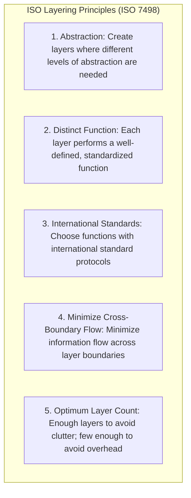

### The Seven Fundamental Layering Principles
ISO established seven strict design guidelines to determine the number and boundaries of the layers:
1. **Appropriate Abstraction**: A layer should only be created where a different level of architectural abstraction is distinctly required.
2. **Dedicated Function**: Each layer must perform a clearly defined function that contributes to the overall communication process.
3. **Standard Alignment**: The boundary and scope of each layer must align with internationally standardized protocol suites.
4. **Boundary Minimization**: Layer boundaries must be selected to minimize the volume and complexity of information flow across interfaces.
5. **Manageable Quantity**: The number of layers must be large enough that disparate functions are not co-located in the same layer unnecessarily, but small enough that the architecture does not become bloated with excessive protocol processing overhead.

---

## 1.2 Protocol Layering, Peer-to-Peer Processes & Encapsulation

### Peer-to-Peer Communication and Interfaces
In the OSI architecture, communication does not occur in a single monolithic step. Instead, each layer $N$ on the sending host communicates logically with its peer layer $N$ on the receiving host. This logical interaction is termed a **peer-to-peer process** and is governed by layer-specific rules called **protocols**.

However, physical data does not pass directly between peer layers (except at Layer 1). Instead, data generated at the Application Layer passes downward through each intermediate layer on the transmitting machine, travels across the physical transmission medium as electrical, optical, or radio signals, and then ascends through the layers of the receiving machine.

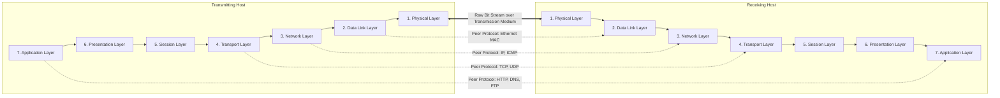

### Layer Interfaces, SAPs, and Service Primitives
- **Service Access Point (SAP)**: The conceptual interface through which layer $N-1$ provides services to layer $N$. Each SAP has a unique address (e.g., port numbers at Layer 4, IP addresses at Layer 3, MAC addresses at Layer 2).
- **Service Data Unit (SDU)**: The payload received from the higher layer before the current layer prepends its control header.
- **Protocol Control Information (PCI)**: The header (and optional trailer) added by the layer containing control instructions for its peer layer.
- **Protocol Data Unit (PDU)**: The combined entity: $\text{PDU} = \text{PCI} + \text{SDU}$.

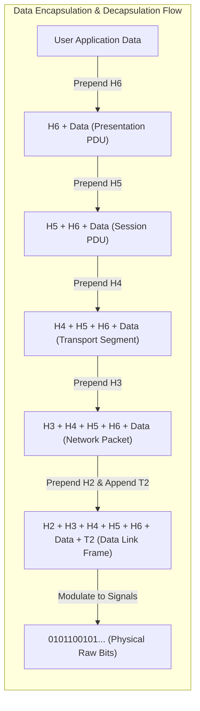

---

## 1.3 Detailed Examination of the 7 Layers (Physical to Application)

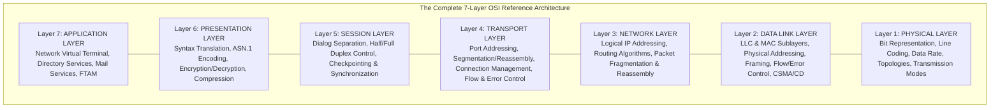

### Layer 1: Physical Layer
The Physical Layer coordinates the functions required to transmit an unstructured, raw bitstream over a physical medium. It interfaces directly with transmission media hardware.

#### Core Responsibilities:
1. **Physical Characteristics of Interfaces and Media**: Defines the electrical, mechanical, and functional specifications of transmission cables, connectors (RJ-45, DB-25), and pin configurations.
2. **Representation of Bits**: Defines line coding schemes (e.g., NRZ, Manchester, Differential Manchester, PAM-4) to translate logical `0`s and `1`s into physical voltage levels, optical pulses, or electromagnetic phase shifts.
3. **Data Rate (Signaling Speed)**: Dictates transmission rate—the number of bits transmitted per second (bps, Mbps, Gbps) and the precise duration of each bit interval ($T_b = 1/R$).
4. **Bit Synchronization**: The transmitter and receiver clocks must be strictly synchronized. The physical layer provides clock synchronization mechanisms (preambles, transitions) to avoid bit slippage.
5. **Line Configuration**: Governs whether the physical medium connects stations in a dedicated **Point-to-Point** configuration or a shared **Multipoint** bus.
6. **Physical Topology**: Governs spatial layout (Mesh, Star, Bus, Ring).
7. **Transmission Mode**: Governs directional flow: **Simplex** (unidirectional), **Half-Duplex** (alternating bidirectional), or **Full-Duplex** (simultaneous bidirectional).

---

### Layer 2: Data Link Layer (DLL)
The Data Link Layer transforms a raw, error-prone transmission facility into an error-free, reliable hop-to-hop link for the upper layers.

#### Sublayers:
- **Logical Link Control (LLC - IEEE 802.2)**: Provides link-layer multiplexing, flow control, and error notifications.
- **Media Access Control (MAC - IEEE 802.3, 802.11)**: Manages channel access arbitration over shared transmission media.

#### Core Responsibilities:
1. **Framing**: Packages bitstreams from the network layer into manageable data units called **Frames**. Implements byte-stuffing (character-oriented) or bit-stuffing (bit-oriented, HDLC `01111110` flag sequences) to demarcate frame boundaries.
2. **Physical (MAC) Addressing**: Appends a 48-bit burned-in hardware address (e.g., `00:1A:2B:3C:4D:5E`) to the frame header to identify physical source and destination network interface cards (NICs) on the local link.
3. **Flow Control**: Prevents a high-speed transmitter from overwhelming a slow receiver by using Stop-and-Wait or Sliding Window flow control mechanisms.
4. **Error Control & ARQ**: Detects bit corruption using **Cyclic Redundancy Checks (CRC-32)** and parity codes appended in the frame trailer ($T_2$). Damaged or dropped frames are retransmitted via Automatic Repeat reQuest (Stop-and-Wait ARQ, Go-Back-N, Selective Repeat).
5. **Access Control**: When two or more devices share the same broadcast channel, MAC protocols (CSMA/CD in legacy Ethernet, CSMA/CA in Wi-Fi, Token Passing in Token Ring) determine which device has the right to transmit.

---

### Layer 3: Network Layer
The Network Layer handles **source-to-destination (end-to-end)** packet delivery across multiple interconnected networks (subnets).

#### Core Responsibilities:
1. **Logical Addressing**: Implements globally unique hierarchical network addresses (IPv4: 32-bit; IPv6: 128-bit) that distinguish between host identity and network location, enabling cross-network routing.
2. **Routing**: Determines optimal multi-hop paths from sender to receiver across intermediate routers using routing algorithms:
   - *Distance Vector Algorithms* (e.g., Bellman-Ford, RIP)
   - *Link State Algorithms* (e.g., Dijkstra's shortest path, OSPF)
   - *Path Vector Protocols* (e.g., BGP-4)
3. **Packetizing**: Encapsulates transport layer segments into network packets by prepending the IP header.
4. **Fragmentation and Reassembly**: When a packet exceeds the **Maximum Transmission Unit (MTU)** of an intermediate data link (e.g., Ethernet's 1500 bytes vs. FDDI's 4352 bytes), the network layer splits the packet into smaller fragments using Fragment Offset, Identification, and More Fragments (MF) flags, reassembling them at the destination host.

---

### Layer 4: Transport Layer
The Transport Layer provides **process-to-process** delivery of the entire message. While the network layer oversees host-to-host delivery, the transport layer ensures that the specific software process on the source host communicates with the corresponding application process on the destination host.

#### Core Responsibilities:
1. **Port Addressing (Service-Point Addressing)**: Employs 16-bit port numbers (ranging from 0 to 65535) to direct data to specific client/server processes (e.g., HTTP on Port 80, HTTPS on Port 443, DNS on Port 53).
2. **Segmentation and Reassembly**: Deconstructs large application messages into smaller segments, numbering each segment sequentially so they can be reassembled in exact order at the receiving host.
3. **Connection Management**:
   - *Connection-Oriented Transmission* (TCP): Establishes a logical connection via a 3-way handshake prior to data transfer and executes a 4-way termination phase.
   - *Connectionless Transmission* (UDP): Sends independent datagrams with zero setup overhead.
4. **End-to-End Flow Control**: Uses sliding window protocols across end hosts (rather than link-by-link) to manage receiver socket buffer consumption.
5. **End-to-End Error Control**: Ensures complete messages arrive undamaged and uncorrupted using end-to-end checksums, sequence tracking, acknowledgments, and retransmission timers.

---

### Layer 5: Session Layer
The Session Layer is the network dialog controller. It establishes, maintains, synchronizes, and terminates interactive sessions between cooperating applications.

#### Core Responsibilities:
1. **Dialog Control**: Regulates whether communication is half-duplex (alternating turns via software tokens) or full-duplex (concurrent two-way dialogue).
2. **Synchronization and Checkpointing**: Inserts checkpoints into long data streams. For example, if a 1000-page document or a multi-gigabyte backup transfer is interrupted at page 723, synchronization points allow the transfer to resume from page 700 rather than restarting from the beginning.
3. **Graceful Session Termination**: Ensures that all pending data transactions have concluded before cleanly dismantling the logical session.

---

### Layer 6: Presentation Layer
The Presentation Layer addresses the **syntax and semantics** of the information exchanged between two communication systems. It ensures that data transmitted by the sender is intelligible to the receiver.

#### Core Responsibilities:
1. **Translation**: Heterogeneous computers use different character encoding formats (e.g., IBM mainframes use EBCDIC; modern PCs use ASCII or UTF-8). The presentation layer transforms sender-dependent formats into a common intermediate network abstract syntax (e.g., ASN.1) and converts it to the receiver's format upon receipt.
2. **Encryption and Cryptography**: Secures data confidentiality and integrity by transforming plaintext into ciphertext before transmission and decrypting it at the destination (e.g., TLS/SSL record layer protocols).
3. **Data Compression**: Reduces the number of bits required to represent information, optimizing bandwidth consumption for multimedia payloads (e.g., Run-Length Encoding, Huffman coding, JPEG, MPEG, MP3).

---

### Layer 7: Application Layer
The Application Layer sits at the top of the OSI reference model and provides direct interfaces for users and software applications to access distributed network services.

#### Core Responsibilities:
1. **Network Virtual Terminal (NVT)**: Software abstraction that enables a terminal to log into remote hosts transparently by mapping local keystrokes into standardized network terminal commands (e.g., Telnet, SSH).
2. **File Transfer, Access, and Management (FTAM / FTP)**: Enables clients to browse, retrieve, upload, and modify files across heterogeneous remote file systems.
3. **Mail Services**: Provides email forwarding, storage, and retrieval architectures (e.g., SMTP, POP3, IMAP4).
4. **Directory Services**: Offers distributed database lookups for locating network resources, domain names, and global network objects (e.g., DNS, LDAP, X.500).
5. **Hypermedia Web Navigation**: Enables retrieval of linked documents across the World Wide Web via HTTP/HTTPS.

---

## 1.4 Master Summary Table

| Layer # | Layer Name | Protocol Data Unit (PDU) | Primary Addressing Scheme | Key Hardware / Devices | Core Protocols |
| :---: | :--- | :--- | :--- | :--- | :--- |
| **7** | **Application** | Message / Data | Domain Names, URI/URL | Gateways, Firewalls | HTTP, HTTPS, FTP, SMTP, DNS, SSH, Telnet |
| **6** | **Presentation** | Formatted Data | MIME Types, Object IDs | Encryption Gateways | TLS/SSL, ASN.1, JPEG, MPEG, ASCII/EBCDIC |
| **5** | **Session** | Dialog Data | Session Connection IDs | Application Gateways | RPC, NetBIOS, PPTP, SCP, SOCKS |
| **4** | **Transport** | Segment (TCP) / Datagram (UDP) | Port Numbers (16-bit) | Layer 4 Switches, Firewalls | TCP, UDP, SCTP, DCCP |
| **3** | **Network** | Packet / Datagram | Logical IP Address (IPv4/IPv6) | Routers, Layer 3 Switches | IPv4, IPv6, ICMP, IGMP, OSPF, BGP, RIP |
| **2** | **Data Link** | Frame | Physical MAC Address (48-bit) | Bridges, Layer 2 Switches, NICs | Ethernet (802.3), Wi-Fi (802.11), PPP, HDLC |
| **1** | **Physical** | Bit (0/1 Stream) | Physical Pinouts / Channels | Hubs, Repeaters, Modems, Cables | RS-232, RJ-45, 100BASE-TX, 1000BASE-T |

---

## 1.5 OSI Model vs. TCP/IP Architecture: Critical Comparative Analysis

While the OSI model is revered as the theoretical foundation for computer networking pedagogy, the **TCP/IP Protocol Suite** emerged as the de facto operational standard for the Internet.

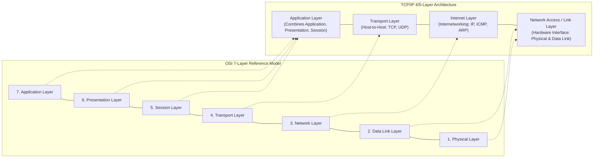

### Critical Comparison Parameters

1. **Protocol Independence vs. Protocol Coupling**:
   - The OSI model strictly differentiates between **Services** (what a layer does), **Interfaces** (how higher layers invoke it), and **Protocols** (how the layer implements its duties). It was designed prior to the creation of its protocols, making it truly protocol-independent.
   - The TCP/IP model was designed after its foundational protocols (TCP, IP) had already been implemented and field-tested in ARPANET. Consequently, TCP/IP layers are tightly coupled with their protocol suites.

2. **Session and Presentation Layer Consolidation**:
   - In TCP/IP, there are no distinct Session or Presentation layers. Designers argued that these functions are rarely needed by all applications simultaneously. When required (such as encryption in HTTPS or compression in HTTP), they are integrated directly into the Application Layer software library.

3. **Connection Models at Network & Transport Layers**:
   - The OSI Network Layer supports **both** Connectionless (CLNP) and Connection-Oriented (CONS / X.25) network services.
   - The TCP/IP Internet Layer provides **only connectionless service** (IP datagrams), pushing all connection state and reliability responsibilities to the Transport Layer (TCP).

---

# Question 2: Transmission Control Protocol (TCP) and User Datagram Protocol (UDP)

## 2.1 Introduction to Transport Layer Architecture & Port Addressing

The Transport Layer is responsible for providing end-to-end, process-to-process communication across a network. It acts as an operational liaison between the application-layer software processes and the underlying network substrate.

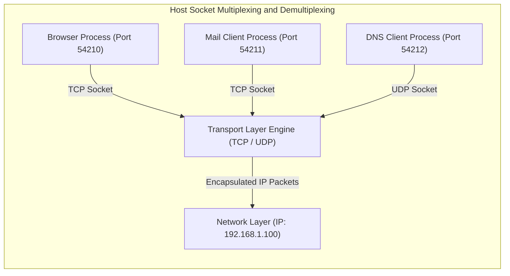

### Port Numbers and Sockets
To distinguish between multiple concurrent processes executing on the same host, the transport layer utilizes **16-bit Port Numbers** (ranging from 0 to 65,535), categorized into three IANA ranges:
- **Well-Known Ports (0 – 1023)**: Reserved for privileged system daemons (HTTP: 80, HTTPS: 443, FTP: 20/21, SSH: 22, DNS: 53, SMTP: 25).
- **Registered Ports (1024 – 49151)**: Allocated by IANA to commercial software vendors (MySQL: 3306, PostgreSQL: 5432, RDP: 3389).
- **Dynamic / Private / Ephemeral Ports (49152 – 65535)**: Dynamically assigned by client operating systems for temporary outbound sessions.

A **Socket Address** is the combination of an IP Address and a Port Number:
$$\text{Socket} = (\text{IP Address} : \text{Port Number})$$
Every end-to-end transport connection is uniquely identified by a 5-tuple:
$$\text{Connection ID} = \{\text{Source IP}, \text{Source Port}, \text{Destination IP}, \text{Destination Port}, \text{Protocol (TCP/UDP)}\}$$

---

## 2.2 Deep Dive: Transmission Control Protocol (TCP) Architecture & Operation

TCP is an IETF-standardized (RFC 793, RFC 1323, RFC 5681), connection-oriented, highly reliable, full-duplex, byte-stream transport protocol.

### Detailed TCP Segment Header Format

```
 0                   1                   2                   3
 0 1 2 3 4 5 6 7 8 9 0 1 2 3 4 5 6 7 8 9 0 1 2 3 4 5 6 7 8 9 0 1
+-+-+-+-+-+-+-+-+-+-+-+-+-+-+-+-+-+-+-+-+-+-+-+-+-+-+-+-+-+-+-+-+
|          Source Port          |       Destination Port        |
+-+-+-+-+-+-+-+-+-+-+-+-+-+-+-+-+-+-+-+-+-+-+-+-+-+-+-+-+-+-+-+-+
|                        Sequence Number                        |
+-+-+-+-+-+-+-+-+-+-+-+-+-+-+-+-+-+-+-+-+-+-+-+-+-+-+-+-+-+-+-+-+
|                    Acknowledgment Number                      |
+-+-+-+-+-+-+-+-+-+-+-+-+-+-+-+-+-+-+-+-+-+-+-+-+-+-+-+-+-+-+-+-+
|  Data |           |U|A|P|R|S|F|                               |
| Offset| Reserved  |R|C|S|S|Y|I|            Window Size        |
| (4 b) |  (3 bits) |G|K|H|T|N|N|                               |
+-+-+-+-+-+-+-+-+-+-+-+-+-+-+-+-+-+-+-+-+-+-+-+-+-+-+-+-+-+-+-+-+
|           Checksum            |        Urgent Pointer         |
+-+-+-+-+-+-+-+-+-+-+-+-+-+-+-+-+-+-+-+-+-+-+-+-+-+-+-+-+-+-+-+-+
|                    Options and Padding (if any)               |
+-+-+-+-+-+-+-+-+-+-+-+-+-+-+-+-+-+-+-+-+-+-+-+-+-+-+-+-+-+-+-+-+
|                             Data                              |
+-+-+-+-+-+-+-+-+-+-+-+-+-+-+-+-+-+-+-+-+-+-+-+-+-+-+-+-+-+-+-+-+
```

#### Field-by-Field Breakdown:
1. **Source Port (16 bits)**: Identifies the sending application process.
2. **Destination Port (16 bits)**: Identifies the receiving application process.
3. **Sequence Number (32 bits)**: Tracks byte-level ordering. If the SYN flag is set (`1`), this field contains the Initial Sequence Number (ISN). The first data byte sent is numbered $\text{ISN} + 1$. In established sessions, it represents the sequence number of the first payload byte in the current segment.
4. **Acknowledgment Number (32 bits)**: Valid only if the ACK flag is set. It contains the next sequence number the receiver expects to receive ($\text{Cumulative ACK}$).
5. **Data Offset / Header Length (4 bits)**: Specifies the size of the TCP header in 32-bit (4-byte) words. The minimum value is $5$ ($5 \times 4 = 20\text{ bytes}$), and the maximum value is $15$ ($15 \times 4 = 60\text{ bytes}$).
6. **Reserved (3 bits)**: Reserved for future use; must be initialized to zero.
7. **Control Flags (6 bits)**:
   - **URG (Urgent)**: Indicates that the Urgent Pointer field is valid.
   - **ACK (Acknowledgment)**: Confirms receipt of transmitted bytes.
   - **PSH (Push)**: Instructs the receiver to push buffered data immediately to the application layer without waiting for the buffer to fill.
   - **RST (Reset)**: Resets an invalid connection or rejects an unauthorized connection attempt.
   - **SYN (Synchronize)**: Initiates connection establishment; synchronizes sequence numbers.
   - **FIN (Finish)**: Initiates connection termination; signals that the sender has no more data to transmit.
8. **Window Size (16 bits)**: Advertises the number of bytes the receiver is willing to accept (receiver flow control buffer limit). Supports window scaling up to 1 GB via TCP options.
9. **Checksum (16 bits)**: Mandatory field covering the TCP header, TCP payload, and a 12-byte IP pseudo-header (Source IP, Destination IP, Protocol = 6, TCP segment length).
10. **Urgent Pointer (16 bits)**: Points to the sequence number of the last byte of out-of-band urgent data when the URG flag is set.
11. **Options (0 – 40 bytes)**: Enables features like Maximum Segment Size (MSS), Selective Acknowledgments (SACK), Window Scale Factor, and Timestamps.

---

### The TCP Connection Lifecycle

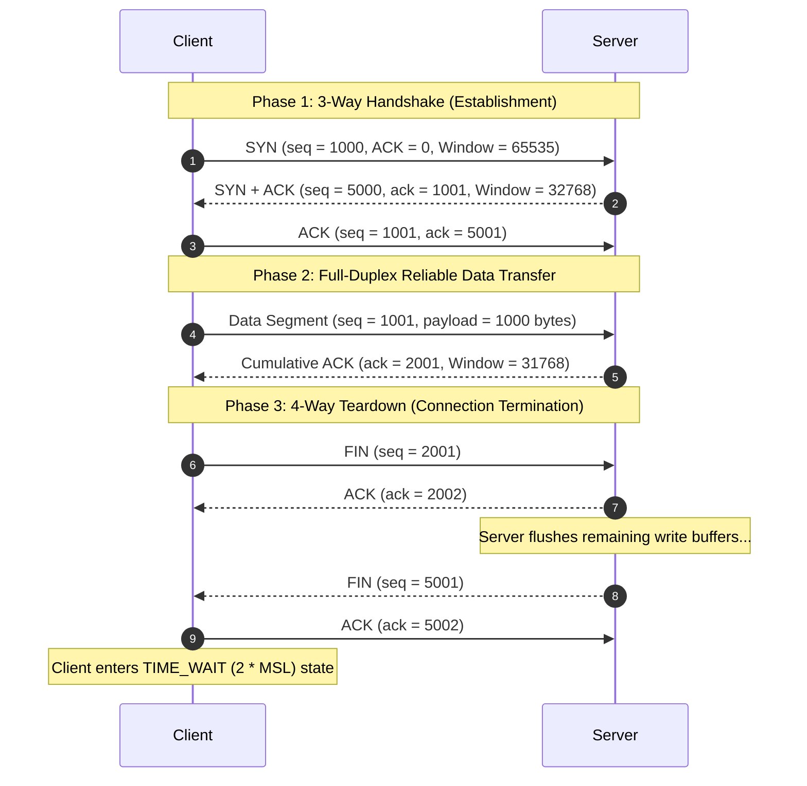

#### Detailed Breakdown of Handshake and Teardown
- **Step 1 (SYN)**: The client chooses an Initial Sequence Number ($\text{ISN}_C = 1000$) and sends a segment with $\text{SYN}=1, \text{ACK}=0$.
- **Step 2 (SYN+ACK)**: The server allocates connection state resources, selects its own sequence number ($\text{ISN}_S = 5000$), acknowledges the client's SYN by setting $\text{ack} = 1001$, and transmits $\text{SYN}=1, \text{ACK}=1$.
- **Step 3 (ACK)**: The client replies with $\text{ACK}=1, \text{seq}=1001, \text{ack}=5001$. The connection is now in the **ESTABLISHED** state.
- **Teardown (FIN/ACK exchange)**: Because TCP connections are full-duplex, each direction must be closed independently. When a node sends a FIN, it transitions to a half-closed state where it cannot send new data but can still receive data.
- **TIME_WAIT State**: The active closer enters a `TIME_WAIT` state for $2 \times \text{MSL}$ (Maximum Segment Lifetime, typically 120 seconds) to ensure that the final ACK was received by the remote server and that lingering delayed packets from the connection drain from the network.

---

### Flow Control: The Sliding Window Mechanism
TCP uses a **byte-oriented sliding window** mechanism to prevent a fast transmitter from overflowing a slow receiver's input buffers.

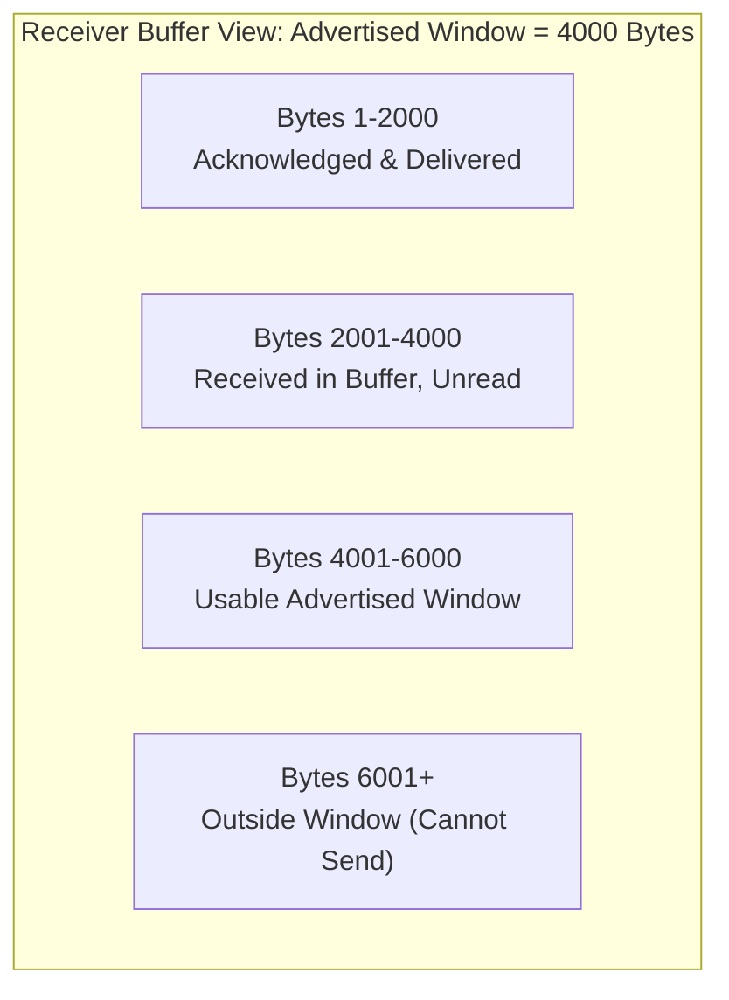

The receiver calculates its **Advertised Window (rwnd)** as:
$$\text{rwnd} = \text{MaxBufferSize} - (\text{BytesBuffered} - \text{BytesRead})$$
- If the receiving application reads data slowly, `rwnd` shrinks.
- If the buffer becomes full, the receiver advertises $\text{rwnd} = 0$, forcing the sender to halt transmission.
- To prevent deadlocks when the receiver later reopens its buffer (if the window update packet is lost), the sender maintains a **Persist Timer**. When this timer expires, the sender transmits a 1-byte **Window Probe** to trigger an updated window advertisement from the receiver.

---

### Congestion Control Algorithms: Tahoe vs. Reno
TCP monitors end-to-end network capacity dynamically using the **Congestion Window (cwnd)** variable. The sender is constrained by:
$$\text{Effective Window} = \min(\text{rwnd}, \text{cwnd})$$

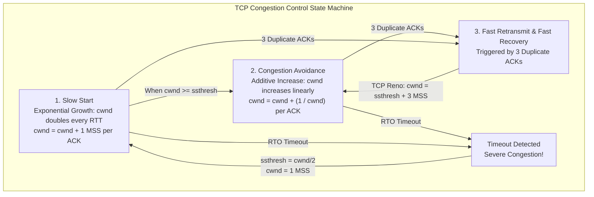

1. **Slow Start**: Initial phase where $\text{cwnd} = 1\text{ MSS}$. For each ACK received, $\text{cwnd}$ increases by 1 MSS, causing it to double every Round Trip Time (RTT):
   $$\text{cwnd} = \text{cwnd} \times 2 \quad (\text{per RTT})$$
   Continues until $\text{cwnd}$ reaches the Slow Start Threshold ($\text{ssthresh}$).
2. **Congestion Avoidance**: Once $\text{cwnd} \ge \text{ssthresh}$, the growth slows to an additive linear increase:
   $$\text{cwnd} = \text{cwnd} + 1\text{ MSS} \quad (\text{per RTT})$$
3. **Loss Event Handling**:
   - **Timeout (RTO expired)**: Indicates severe packet loss. TCP resets $\text{ssthresh} = \frac{\text{cwnd}}{2}$, collapses $\text{cwnd} = 1\text{ MSS}$, and restarts Slow Start.
   - **3 Duplicate ACKs**: Indicates a single dropped packet while subsequent packets arrived safely. **Fast Retransmit** immediately retransmits the missing segment without waiting for the timeout, and **Fast Recovery** (TCP Reno) sets $\text{ssthresh} = \frac{\text{cwnd}}{2}$ and $\text{cwnd} = \text{ssthresh}$, continuing linear growth from Congestion Avoidance rather than collapsing to 1 MSS.

---

## 2.3 Deep Dive: User Datagram Protocol (UDP) Architecture & Operation

UDP (standardized in RFC 768) is a minimal, connectionless transport protocol that provides best-effort delivery with near-zero overhead.

### UDP Datagram Header Format

```
 0                   1                   2                   3
 0 1 2 3 4 5 6 7 8 9 0 1 2 3 4 5 6 7 8 9 0 1 2 3 4 5 6 7 8 9 0 1
+-+-+-+-+-+-+-+-+-+-+-+-+-+-+-+-+-+-+-+-+-+-+-+-+-+-+-+-+-+-+-+-+
|          Source Port          |       Destination Port        |
+-+-+-+-+-+-+-+-+-+-+-+-+-+-+-+-+-+-+-+-+-+-+-+-+-+-+-+-+-+-+-+-+
|            Length             |           Checksum            |
+-+-+-+-+-+-+-+-+-+-+-+-+-+-+-+-+-+-+-+-+-+-+-+-+-+-+-+-+-+-+-+-+
|                             Data                              |
+-+-+-+-+-+-+-+-+-+-+-+-+-+-+-+-+-+-+-+-+-+-+-+-+-+-+-+-+-+-+-+-+
```

#### Field Breakdown:
1. **Source Port (16 bits)**: Port of the sending application (optional; set to zeros if no reply is expected).
2. **Destination Port (16 bits)**: Port of the target application on the receiving host (mandatory).
3. **Length (16 bits)**: Total length of the UDP datagram in bytes (Header + Payload). Minimum value is $8$ bytes (header only).
4. **Checksum (16 bits)**: Detects bit errors across the UDP header, payload, and the 12-byte IP pseudo-header. Optional in IPv4 (set to zeros if unused), but **strictly mandatory** in IPv6.

### Why UDP is Preferred in Modern Applications
- **Zero Handshake Latency**: Packets are transmitted immediately without waiting for a round-trip connection setup phase.
- **No Flow or Congestion Control**: Applications can push data at any rate without throttling from receiver windows or congestion backoff.
- **Preserved Message Boundaries**: UDP sends discrete, self-contained datagrams. If an application writes 512 bytes, the receiver reads exactly 512 bytes in a single read call (unlike TCP's unstructured byte stream).
- **Multicasting and Broadcasting Support**: UDP easily addresses 1-to-many communication channels (essential for IPTV, discovery protocols, routing updates).

---

## 2.4 Exhaustive Comparative Analysis: TCP vs. UDP

| Metric / Parameter | TCP (Transmission Control Protocol) | UDP (User Datagram Protocol) |
| :--- | :--- | :--- |
| **Connection Model** | Connection-Oriented (3-way handshake required) | Connectionless (no setup, immediate transmission) |
| **Reliability** | Guaranteed delivery (retransmits dropped packets) | Best-Effort (unreliable, no retransmissions) |
| **Ordering** | Strict in-order delivery via Sequence Numbers | Out-of-order delivery possible; no sequence numbers |
| **Transmission Type** | Continuous byte stream (boundaries lost) | Discrete datagrams (message boundaries preserved) |
| **Header Overhead** | 20 to 60 bytes (variable options) | 8 bytes (fixed size) |
| **Flow Control** | Dynamic Byte-Stream Sliding Window (`rwnd`) | None |
| **Congestion Control** | Additive-Increase/Multiplicative-Decrease (AIMD) | None (pushes data at arbitrary rates) |
| **Transmission Speed** | Slower due to handshake, ACKs, and retransmissions | Extremely fast with near-zero latency |
| **Broadcast / Multicast** | Unicast only (strictly point-to-point) | Unicast, Multicast, and Broadcast |
| **State Tracking** | Heavy state footprint (buffers, timers, sequence vars)| Stateless; minimal memory overhead |
| **Error Checking** | Mandatory 16-bit Checksum + ACKs | 16-bit Checksum (optional in IPv4, mandatory in IPv6) |
| **Header Complexity** | Sequence, Ack, Window, Flags, Urgent, Options | Source Port, Destination Port, Length, Checksum |
| **Typical Protocols** | HTTP, HTTPS, FTP, SFTP, SMTP, SSH, BGP | DNS, DHCP, TFTP, SNMP, RTP, SIP, QUIC |

---

## 2.5 Real-World Case Studies & Protocol Selection Criteria

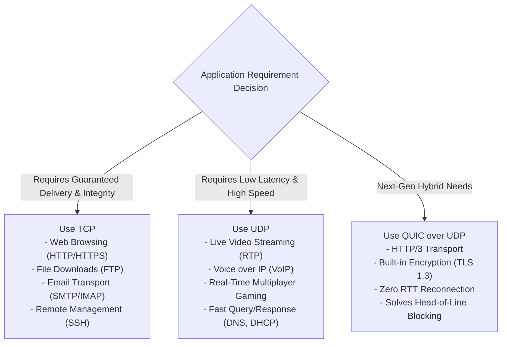

1. **DNS (Domain Name System)**: Uses UDP on Port 53 for standard hostname lookups because a single query fits in a single packet. Setting up a 3-way TCP handshake would double the lookup latency. However, DNS switches to TCP for zone transfers between servers where data integrity is critical.
2. **HTTP/3 and QUIC**: While HTTP/1.1 and HTTP/2 relied on TCP, they suffered from **Head-of-Line (HoL) Blocking**—if a single packet was dropped, TCP froze all multiplexed streams until that packet was retransmitted. HTTP/3 runs over **QUIC**, which sits atop **UDP**, implementing stream multiplexing, encryption, and custom congestion control at the application layer to eliminate HoL blocking entirely.

---

# Question 3: Switching Techniques in Computer Networks

## 3.1 Introduction and Fundamental Need for Switching

In an ideal network, every device would have a direct, dedicated physical link to every other device (a fully connected mesh topology). However, connecting $N$ communicating nodes in this manner requires:
$$\text{Total Links} = \frac{N(N-1)}{2} = O(N^2)$$
For a global network with millions of devices, this approach is mathematically and economically impossible.

A **Switched Network** solves this scalability challenge. Instead of point-to-point links between every pair of nodes, devices connect to a shared network of intermediate switching nodes. These switches accept incoming transmissions and steer them across internal paths toward their final destination.

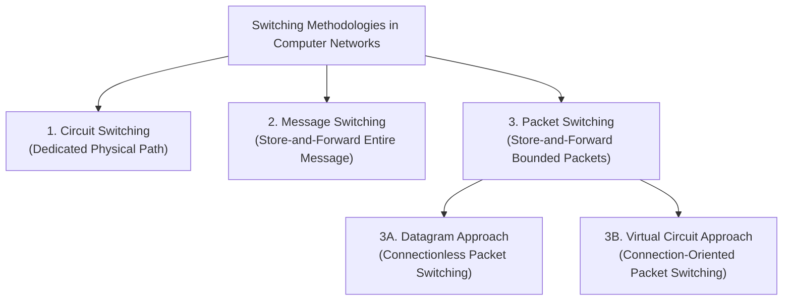

---

## 3.2 Circuit Switching: Architecture, Phases, and Space/Time Division

Circuit Switching establishes a dedicated, end-to-end physical communication channel between two stations through intermediate switches before any data can be transmitted.

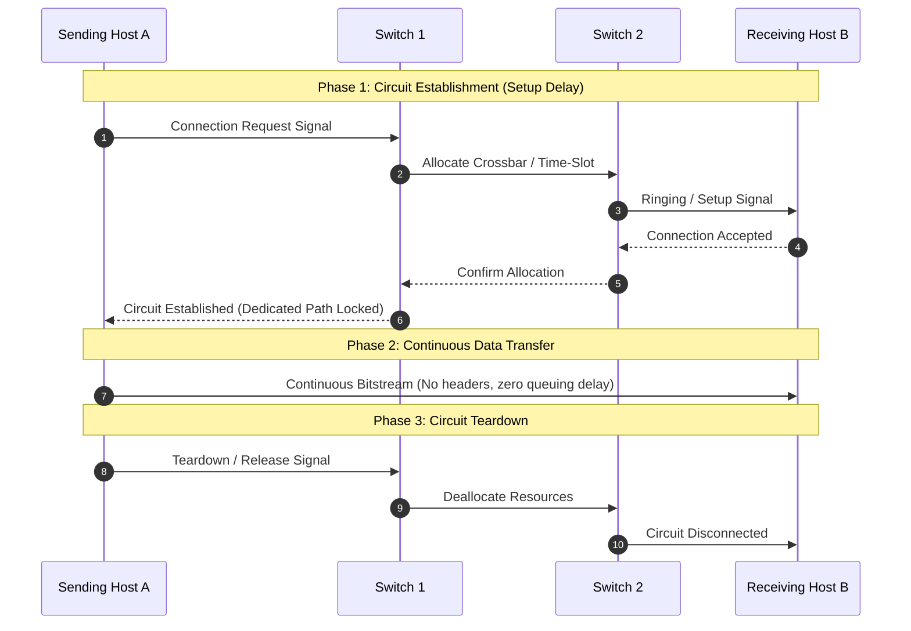

### The Three Operational Phases
1. **Circuit Establishment**: Prior to data transmission, an end-to-end path is negotiated. Intermediate switches reserve dedicated physical crossbar connections or specific Time-Division Multiplexing (TDM) time slots. If any link along the requested path lacks free capacity, the caller receives a busy signal and the attempt fails.
2. **Data Transmission**: Once established, the signal travels across the dedicated path as an analog waveform or continuous bitstream. Intermediate switches do not parse packet headers or buffer payload bytes; data simply propagates through locked physical channels.
3. **Circuit Teardown**: When communication concludes, a disconnect signal propagates through the network, instructing intermediate switches to deallocate reserved circuits and release capacity for other users.

### Space-Division vs. Time-Division Switching
- **Space-Division Switching**: Physical transmission paths are separated in space.
  - *Crossbar Switch*: Connects $n$ inputs to $m$ outputs via a grid of semiconductor crosspoints. A single-stage crossbar requires $n \times m$ crosspoints, making it prohibitively expensive and prone to single-point hardware failures.
  - *Multistage Clos Networks*: Overcomes crossbar limitations by splitting switching into cascaded stages of smaller crossbar matrices, dramatically reducing total crosspoints while providing alternative paths to minimize internal blocking.
- **Time-Division Switching**: Employs **Time-Slot Interchange (TSI)**. Digital audio samples are loaded into a shared Random Access Memory buffer and read out in a different chronological sequence, dynamically routing time slots from an incoming TDM frame to an outgoing TDM frame.

---

## 3.3 Message Switching: The Store-and-Forward Predecessor

Developed in the 1960s (used in telegraph systems and early military networks like AUTODIN), **Message Switching** eliminated dedicated physical circuits.

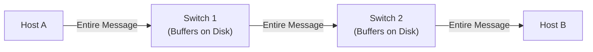

### Operational Principles & Critical Flaws
- In message switching, the sender treats an entire file, email, or telegram as a single monolithic block called a **Message**.
- When Host A transmits, Switch 1 buffers the **entire message to local storage (hard disk)**. Only after receiving, verifying, and storing every single byte does Switch 1 examine the header and forward the message to Switch 2.
- **Why Message Switching Failed in Modern Computer Networks**:
  1. *Massive Buffer Requirements*: Intermediate switches required massive storage capacity to hold large files.
  2. *Excessive Latency*: Interactive communication (web browsing, voice, remote shells) is impossible because intermediate switches must buffer the entire message before forwarding any part of it.
  3. *Costly Error Recovery*: If a single bit is corrupted near the end of a 100 MB message, the entire 100 MB message must be retransmitted from scratch across the network.

---

## 3.4 Packet Switching: Datagram Approach vs. Virtual Circuit Approach

Packet Switching overcomes the shortcomings of both circuit switching and message switching by segmenting large messages into small, standardized chunks called **Packets** (typically 64 to 1500 bytes).

### 1. The Datagram Approach (Connectionless Packet Switching)
In a datagram network (the architectural foundation of the Internet Protocol - IP):
- Each packet is treated as an independent, self-contained entity with its own destination address.
- Intermediate routers inspect the destination IP address of each packet, consult internal routing tables, and forward it along the best currently available outgoing path.
- **Packets may take different paths**: Due to shifting traffic loads or link failures, Packet 1 might travel via Router A $\to$ Router B, while Packet 2 travels via Router A $\to$ Router C.
- **Out-of-Order Delivery**: Packets may arrive out of sequence, with the receiving host's transport layer responsible for reassembling them in order.

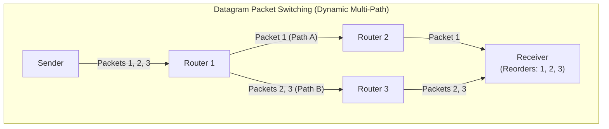

### 2. The Virtual Circuit Approach (Connection-Oriented Packet Switching)
In a Virtual Circuit network (such as X.25, Frame Relay, and ATM):
- A logical path called a **Virtual Circuit (VC)** is negotiated and established across intermediate switches using signaling protocols prior to data transmission.
- Packets do not require full destination IP addresses in their headers. Instead, they carry a short **Virtual Circuit Identifier (VCI)**.
- Intermediate switches maintain internal translation tables: when a packet arrives on port $P_{in}$ with identifier $\text{VCI}_{in}$, the switch swaps it for $\text{VCI}_{out}$ and forwards it to port $P_{out}$.
- **Guaranteed In-Order Delivery**: All packets follow the same path and arrive at the destination in exact sequence.
- **Permanent Virtual Circuits (PVC)** are statically provisioned by network administrators, whereas **Switched Virtual Circuits (SVC)** are established dynamically on demand.

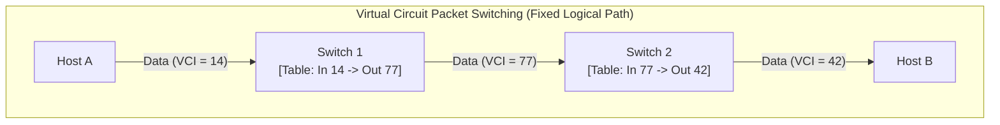

---

## 3.5 Mathematical Delay Analysis & Pipeline Transmission Comparison

To understand why packet switching is vastly superior to message switching, consider transmitting a message of size $M$ bits over a network of $k$ hops (where each hop is an intermediate link of bandwidth $R$ bps and propagation delay is negligible).

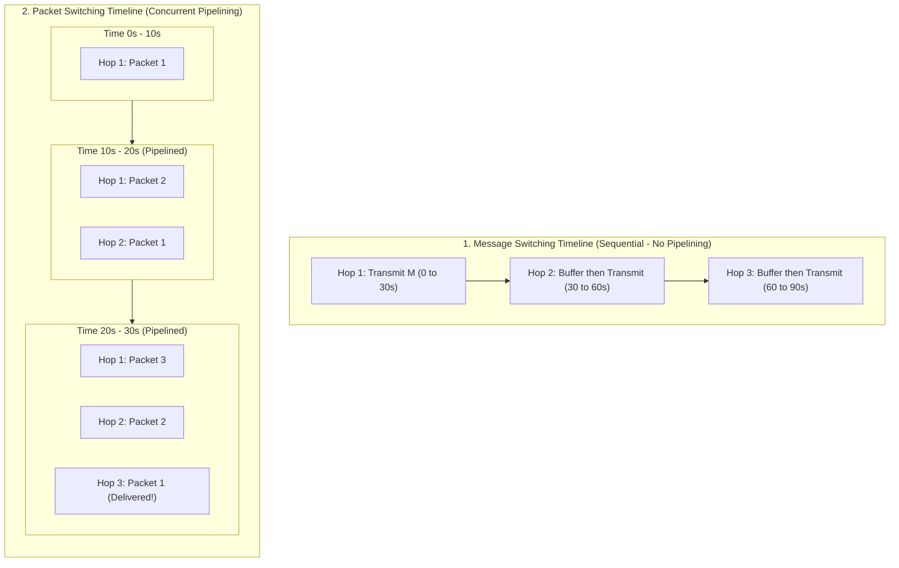

### Analytical Delay Formulas
- **Message Switching Total Transmission Time**:
  The message must be received in full at each switch before forwarding:
  $$T_{\text{message}} = k \times \frac{M}{R}$$
- **Packet Switching Total Transmission Time**:
  If the message $M$ is divided into $p$ packets of size $P = \frac{M}{p}$ bits (ignoring header overhead for simplicity):
  The first packet reaches the destination after $k$ hops ($k \times \frac{P}{R}$). The remaining $(p - 1)$ packets follow immediately in a pipelined fashion, arriving one packet transmission time ($\frac{P}{R}$) apart:
  $$T_{\text{packet}} = k \left(\frac{P}{R}\right) + (p - 1)\left(\frac{P}{R}\right) = (k + p - 1) \times \frac{P}{R}$$

#### Concrete Numerical Example
Assume a $12\text{ Mb}$ file is transmitted over a 3-hop path ($k = 3$) where each link has a bandwidth $R = 1\text{ Mbps}$.
1. **Message Switching**:
   $$T_{\text{message}} = 3 \times \frac{12\text{ Mb}}{1\text{ Mbps}} = 3 \times 12 = \mathbf{36\text{ seconds}}$$
2. **Packet Switching** (divided into 12 packets of $1\text{ Mb}$ each, so $p = 12$ and $P = 1\text{ Mb}$):
   $$T_{\text{packet}} = (3 + 12 - 1) \times \frac{1\text{ Mb}}{1\text{ Mbps}} = 14 \times 1 = \mathbf{14\text{ seconds}}$$
   **Pipelining reduces the total transmission time from 36 seconds to 14 seconds**—more than a 60% reduction in delay, while simultaneously reducing switch buffer memory requirements from $12\text{ MB}$ to just $1\text{ MB}$.

---

## 3.6 Master Comparison Matrix

| Evaluation Parameter | Circuit Switching | Datagram Packet Switching | Virtual Circuit Packet Switching |
| :--- | :--- | :--- | :--- |
| **Path Allocation** | Dedicated physical path established end-to-end | Independent dynamic path per packet | Fixed logical virtual circuit path |
| **Setup Phase** | Mandatory call setup phase | None (packets sent immediately) | Mandatory virtual circuit setup phase |
| **Addressing** | Initial signaling contains full address | Every packet contains full destination IP | Packets carry short VCI identifiers |
| **Resource Reservation** | Dedicated bandwidth and time-slots | Shared dynamically (Statistical Multiplexing)| Shared dynamically, but QoS can be reserved |
| **Bandwidth Utilization** | Poor (idle pauses waste full capacity) | Maximum efficiency | High efficiency |
| **Store-and-Forward** | No (continuous analog/digital signal flow) | Yes (intermediate routers buffer packets) | Yes (intermediate switches buffer packets) |
| **Packet Ordering** | Inherent in-order delivery | Packets can arrive out of sequence | Guaranteed in-order arrival |
| **Delay Profile** | High setup delay; zero queuing delay | Variable delay (queuing + processing) | Moderate setup delay; low queuing delay |
| **Congestion Behavior** | Call blocking (busy signal on overload) | Packets queued; drops occur on buffer overflow | Signaling packets rejected if congested |
| **Fault Tolerance** | Low (path link failure drops call) | High (routers dynamically reroute packets) | Moderate (link failure tears down VC) |
| **Charging Model** | Per minute / connection duration | Per volume of data transferred (bytes) | Combined connect time + volume |

---

# Question 4: Network Topologies

## 4.1 Concept and Classification of Network Topologies

The **Topology** of a network defines the geometric arrangement and structural relationship between links and nodes. It determines how devices are interconnected physically and how data signals propagate logically.

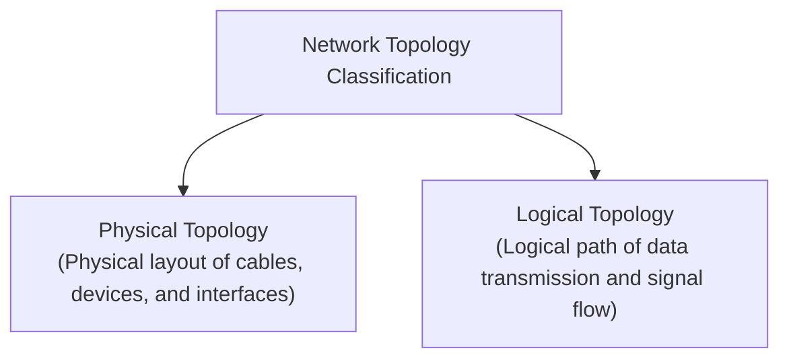

- **Physical Topology**: The physical arrangement of cables, patch panels, networking devices, and workstations in a building.
- **Logical Topology**: The operational path data frames take between devices.
  - *Example*: In traditional 10BASE-T Ethernet, cables run from workstations to a central multi-port hub. The **physical topology is a Star**, but because the hub broadcasts every frame across its shared internal bus backplane, the **logical topology is a Bus**.

---

## 4.2 Mesh Topology: Architecture, Mathematical Formulations, and Analysis

In a **Fully Connected Mesh Topology**, every station has a dedicated point-to-point physical link to every other station in the network.

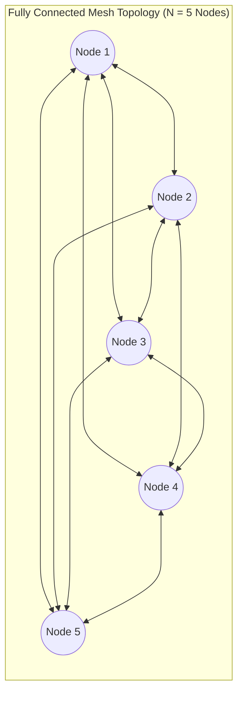

### Mathematical Formulations
For a network consisting of $N$ devices:
1. **Total Number of Duplex Physical Links**:
   $$\text{Links} = \frac{N(N - 1)}{2} = O(N^2)$$
2. **Number of I/O Interface Ports Required per Device**:
   $$\text{Ports per Device} = N - 1$$
3. **Total Network Interface Ports in the Entire System**:
   $$\text{Total Ports} = N(N - 1)$$

#### Concrete Scaling Analysis
- If $N = 6$ nodes: $\text{Links} = \frac{6 \times 5}{2} = 15\text{ links}$, with $5\text{ ports}$ per node.
- If $N = 100$ nodes: $\text{Links} = \frac{100 \times 99}{2} = 4,950\text{ links}$, with $99\text{ ports}$ per node.
- If $N = 1000$ nodes: $\text{Links} = \frac{1000 \times 999}{2} = 499,500\text{ links}$.

### In-Depth Advantages & Disadvantages
- **Advantages**:
  1. *Dedicated Channel Capacity*: Every link carries exclusively its own designated traffic, eliminating channel contention.
  2. *Extreme Fault Tolerance*: If a cable is severed, only traffic between those two specific nodes is disrupted; all other $(N - 1)$ communication paths remain fully operational.
  3. *Uncompromised Security & Privacy*: Transmissions travel over private point-to-point lines, preventing eavesdropping from other network hosts.
  4. *Rapid Fault Isolation*: Cable breaks and interface hardware failures can be pinpointed immediately.
- **Disadvantages**:
  1. *Prohibitive Cabling Costs*: The $O(N^2)$ link scaling makes full mesh wiring financially impossible for medium-to-large networks.
  2. *Excessive Hardware Port Requirements*: Standard computers cannot accommodate dozens or hundreds of dedicated Network Interface Cards.
  3. *Physical Cable Management*: Routing and bundling thousands of heavy copper cables through walls and conduits causes physical cable clutter.
- **Applications**: Core telecommunication WAN backbones, nuclear power plant control networks, military defense systems, and high-availability Storage Area Networks (SANs).

---

## 4.3 Star Topology: Centralized Control, Switching Dynamics, and Evaluation

In a **Star Topology**, every host maintains a dedicated point-to-point link to a central controller, commonly known as a **Network Switch** (or historically, a Hub).

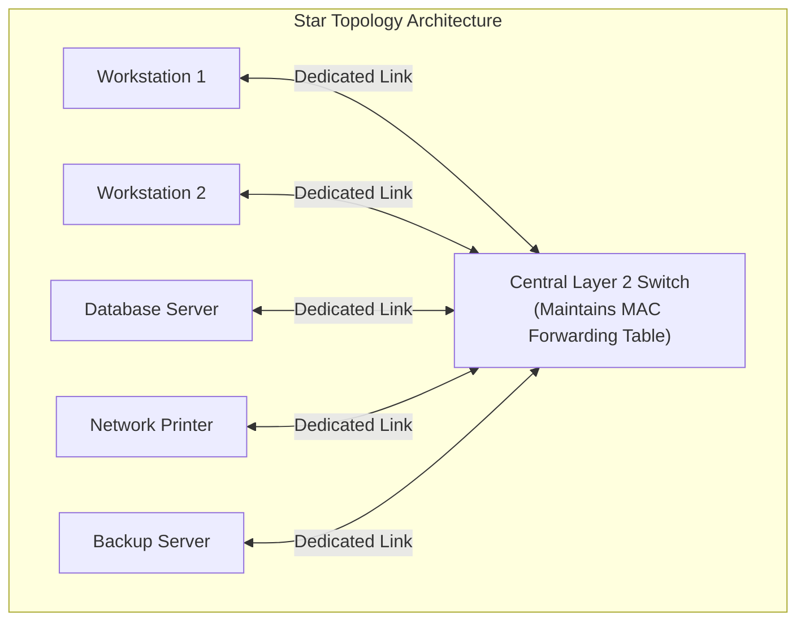

### Architectural Operation
- Nodes do not communicate directly with each other. If Workstation 1 wishes to send a frame to the Database Server, it sends the frame over its dedicated link to the central switch.
- The switch parses the destination MAC address, checks its **Content Addressable Memory (CAM) Table**, and forwards the frame exclusively to the port connected to the Database Server.

### Mathematical Parameters
- **Number of Physical Links**: Exactly $N$ links for $N$ peripheral nodes.
- **Hardware Ports**: Each device requires only **1** Network Interface Port. The central switch must have at least $N$ ports.

### Evaluation
- **Advantages**:
  1. *Low Cabling & Component Costs*: Cable length scales linearly ($O(N)$), drastically reducing wiring expenses compared to mesh networks.
  2. *High Fault Isolation*: A severed cable or failed NIC only takes that individual host offline; the rest of the network operates uninterrupted.
  3. *Zero Downtime Reconfiguration*: Adding, removing, or relocating workstations requires running a single drop cable to the central patch panel without disrupting live traffic.
  4. *Centralized Administration*: Network switches provide unified management, traffic monitoring, port mirroring, and VLAN segmentation.
- **Disadvantages**:
  1. *Single Point of Failure*: The central switch represents a critical bottleneck; if its power supply or backplane fails, the entire network goes dark.
  2. *Cable Length Compared to Bus*: Although far less than a mesh topology, star wiring requires more total cable length than a shared bus line because every node must run a dedicated line back to the central switch.
- **Applications**: Modern enterprise Ethernet LANs, home networks, university computer laboratories.

---

## 4.4 Bus Topology: Shared Media Backbone, CSMA/CD, and Limitations

A **Bus Topology** is a multipoint configuration where all network devices connect to a single, continuous communication cable called the **Backbone**.

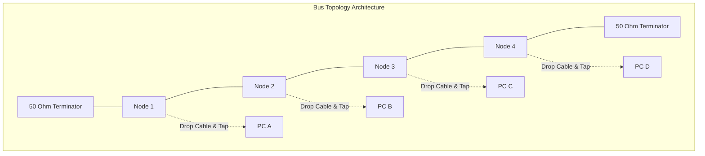

### Physical Construction & Operation
- Devices connect to the central coaxial cable (e.g., 10BASE5 Thicknet or 10BASE2 Thinnet) via **Drop Lines** and **Taps** (vampire taps or BNC T-connectors).
- **Terminators**: Both physical ends of the backbone cable must be capped with resistive terminators matching the cable's characteristic impedance (typically $50\,\Omega$). Without terminators, electrical signals reflect backward along the wire upon hitting the cable ends, causing destructive interference that corrupts data frames.
- **Media Access Control (CSMA/CD)**: Because all stations share a single broadcast wire, only one station can transmit at any given instant. Stations execute **Carrier Sense Multiple Access with Collision Detection (CSMA/CD)**:
  1. Listen before transmitting (*Carrier Sense*).
  2. If the wire is idle, transmit.
  3. If another station transmits simultaneously, the waveforms collide, generating an abnormal voltage level.
  4. Both stations detect the collision, abort transmission, transmit a 32-bit **Jam Signal**, and back off for a randomized interval using the **Truncated Binary Exponential Backoff Algorithm**.

### Evaluation
- **Advantages**:
  1. *Minimal Cable Consumption*: Uses the least total cable length of any physical topology.
  2. *Low Installation Cost*: Inexpensive to deploy in small, low-traffic environments.
- **Disadvantages**:
  1. *Difficult Fault Isolation*: Diagnosing a broken wire is difficult. Technicians often had to use Time-Domain Reflectometers (TDRs) to locate breaks.
  2. *Catastrophic Cable Failure*: A single break anywhere along the primary backbone cable halts all communication across the entire network by removing termination and inducing signal reflections.
  3. *Contention Bottleneck*: Adding more devices increases collision probability and forces frequent backoffs, causing throughput to collapse under moderate traffic loads.
- **Applications**: Early legacy Ethernet installations, industrial CAN bus automation systems in automobiles.

---

## 4.5 Ring Topology: Token Passing Operation and Dual-Ring Redundancy

In a **Ring Topology**, every station is connected to exactly two neighboring nodes, forming an unbroken circular loop. Data travels unidirectionally (or bidirectionally in dual rings) from node to node around the circle.

```mermaid
flowchart TD
    subgraph RingNet["Token Ring Topology Operation"]
        direction TB
        R1["Station 1"] -->|"1. Generates Frame"| R2["Station 2 (Repeater)"]
        R2 -->|"2. Regenerates Frame"| R3["Station 3 (Destination - Copies Data)"]
        R3 -->|"3. Sets ACK Bits"| R4["Station 4 (Repeater)"]
        R4 -->|"4. Returns to Sender"| R1
        R1 -.->|"5. Strips Frame & Releases Free Token"| R2
    end
```

### Token Passing Operational Workflow
1. A small, specialized 3-byte control frame called the **Token** circulates constantly around the ring when the network is idle.
2. A station wishing to transmit must wait until it captures the free token.
3. Upon capturing the token, the station changes a status bit from `0` (free) to `1` (busy), appends its data payload, and transmits the resulting data frame downstream.
4. Intermediate stations act as digital repeaters: they read the frame, regenerate its electrical signal, and pass it downstream.
5. When the destination station receives the frame, it copies the payload into its local buffer, flips the "Address Recognized" and "Frame Copied" status flags, and transmits the frame back onto the ring.
6. When the frame completes the full circle and returns to the originating sender, the sender verifies that the frame was successfully copied, strips the data frame from the ring, and releases a new free token for other stations.

### Dual-Ring Architecture (FDDI / SONET)
To overcome the vulnerability of a single broken link, advanced systems like **Fiber Distributed Data Interface (FDDI)** and **SONET** use two concentric counter-rotating rings: a **Primary Ring** for normal data transmission, and a **Secondary Ring** running in reverse.

```mermaid
flowchart LR
    subgraph SelfHealing["Self-Healing Dual-Ring Architecture"]
        direction LR
        S1["Station A"] <===>|"Primary Link"| S2["Station B"]
        S2 <===>|"CABLE FAULT!"| S3["Station C (Fault Detected)"]
        S3 <===>|"Loopback Wrapped"| S4["Station D"]
        S4 <===>|"Secondary Link"| S1
    end
```

If a cable is severed between Station B and Station C, the adjacent stations automatically wrap the primary ring into the secondary ring, forming a single operational closed loop that maintains connectivity without human intervention.

---

## 4.6 Tree and Hybrid Topologies: Hierarchical Enterprise Architectures

### 1. Tree (Hierarchical) Topology
A **Tree Topology** is a hierarchical variant of the Star topology where individual star hubs or switches are cascaded to a central root switch.

```mermaid
flowchart TD
    subgraph HierarchicalTree["Cisco 3-Layer Hierarchical Network Design"]
        CORE["Core Layer Switch<br/>(Ultra High-Speed Backbone)"]
        
        DIST1["Distribution Switch A<br/>(Routing, Policies, ACLs)"]
        DIST2["Distribution Switch B<br/>(Routing, Policies, ACLs)"]
        
        CORE <===> DIST1
        CORE <===> DIST2
        
        ACC1["Access Switch 1"]
        ACC2["Access Switch 2"]
        ACC3["Access Switch 3"]
        ACC4["Access Switch 4"]
        
        DIST1 --- ACC1
        DIST1 --- ACC2
        DIST2 --- ACC3
        DIST2 --- ACC4
        
        ACC1 --- PC1["Host 1"]
        ACC2 --- PC2["Host 2"]
        ACC3 --- PC3["Host 3"]
        ACC4 --- PC4["Host 4"]
    end
```

- **Core Layer**: High-speed switching backbone designed for rapid packet transport across enterprise buildings.
- **Distribution Layer**: Implements policy-based routing, packet filtering, Access Control Lists (ACLs), and VLAN routing.
- **Access Layer**: Connects end-user computers, access points, and printers directly into the enterprise network.

### 2. Hybrid Topologies
- **Star-Bus**: Several star switches are connected along a central bus backbone cable (common in multi-department campus buildings).
- **Star-Ring**: Workstations connect to a central **Multistation Access Unit (MAU)** in a physical star, but the MAU routes signals internally in a circular ring (the standard deployment of IBM Token Ring).

---

## 4.7 Master Comparison Matrix of All Network Topologies

| Metric | Mesh (Fully Connected) | Star | Bus | Ring | Tree (Hierarchical) |
| :--- | :--- | :--- | :--- | :--- | :--- |
| **Cabling Complexity** | Maximum ($O(N^2)$ links) | Moderate ($O(N)$ links) | Minimum ($O(N)$ backbone) | Low ($O(N)$ loop) | High ($O(N)$ structured) |
| **Installation Cost** | Extremely Expensive | Inexpensive | Low | Moderate | Moderate to High |
| **Port Requirements** | $(N - 1)$ ports per device | 1 per device ($+N$ on switch) | 1 tap per device | 2 ports per device | 1 per device ($+N$ switches) |
| **Fault Isolation** | Immediate and Simple | Excellent (per port) | Very Difficult | Difficult | Very Good (per branch) |
| **Single Failure Impact**| Zero impact on others | Switch failure kills network | Backbone break halts all | Ring break halts all | Branch switch drops branch |
| **Channel Contention** | None (dedicated links) | None (switched backplane) | High (CSMA/CD collisions) | None (Token Passing) | None on switched links |
| **Scalability** | Horrible ($O(N^2)$ barrier) | Excellent | Poor (bandwidth drops) | Poor | Outstanding |
| **Standard Tech** | Core WAN, SAN | Ethernet (802.3 1000BASE-T) | 10BASE2, CAN bus | Token Ring (802.5), FDDI| Enterprise Campus LAN |

---

# Question 5: Transmission Media

## 5.1 Introduction, Physical Layer Role, and Theoretical Channel Capacity

Transmission media reside directly beneath the Physical Layer of the OSI reference model, providing the physical conduit through which data signals propagate from sender to receiver.

```mermaid
flowchart TD
    TRANS_MEDIA["Classification of Transmission Media"]
    
    GM["1. Guided Media<br/>(Wired / Bounded / Conducted)"]
    UM["2. Unguided Media<br/>(Wireless / Unbounded / Radiated)"]
    
    TRANS_MEDIA --> GM
    TRANS_MEDIA --> UM
    
    GM --> TP["Twisted Pair Cable<br/>- Unshielded (UTP)<br/>- Shielded (STP)"]
    GM --> COAX["Coaxial Cable<br/>- Baseband (50 Ohm)<br/>- Broadband (75 Ohm)"]
    GM --> FIBER["Fiber-Optic Cable<br/>- Single-Mode (SMF)<br/>- Multi-Mode (MMF)"]
    
    UM --> RADIO["Radio Waves (3 kHz - 1 GHz)<br/>Omnidirectional, penetrates walls"]
    UM --> MICRO["Microwaves (1 GHz - 300 GHz)<br/>Line-of-Sight, directional dish"]
    UM --> INFRA["Infrared Waves (300 GHz - 400 THz)<br/>Short-range, blocked by walls"]
```

### Theoretical Channel Capacity: Nyquist and Shannon Theorems
The transmission capacity of any physical medium is fundamentally governed by two foundational mathematical theorems:

#### 1. Nyquist Bit Rate Formula (For Noiseless Channels)
Formulated by Harry Nyquist in 1928, this theorem defines the maximum theoretical data rate of a noiseless transmission channel with bandwidth $B$ (in Hertz) using $L$ discrete signal levels:
$$\text{Capacity}_{\text{Nyquist}} = 2 \times B \times \log_2(L) \quad \text{bits per second}$$
- *Example*: A noiseless channel with a bandwidth of $4\text{ kHz}$ transmitting a signal with 16 distinct voltage levels ($L = 16$):
  $$C = 2 \times 4000 \times \log_2(16) = 8000 \times 4 = \mathbf{32,000\text{ bps}}$$

#### 2. Shannon Capacity Formula (For Noisy Channels)
Formulated by Claude Shannon in 1948, this theorem determines the absolute theoretical upper limit of a noisy channel subject to Gaussian thermal noise:
$$\text{Capacity}_{\text{Shannon}} = B \times \log_2(1 + \text{SNR}) \quad \text{bits per second}$$
Where $\text{SNR}$ is the Signal-to-Noise Ratio (expressed as a power ratio: $\text{SNR} = \frac{\text{Signal Power}}{\text{Noise Power}}$). If the SNR is provided in decibels ($\text{dB}$):
$$\text{SNR}_{\text{dB}} = 10 \log_{10}(\text{SNR}) \implies \text{SNR} = 10^{\frac{\text{SNR}_{\text{dB}}}{10}}$$

- *Example*: A standard analog telephone line has a bandwidth of $3100\text{ Hz}$ and a typical $\text{SNR}_{\text{dB}} = 30\text{ dB}$:
  $$\text{SNR} = 10^{30/10} = 1000$$
  $$C = 3100 \times \log_2(1 + 1000) = 3100 \times \log_2(1001) \approx 3100 \times 9.967 = \mathbf{30,898\text{ bps}} \approx \mathbf{31\text{ kbps}}$$
  This explains why early dial-up telephone modems were physically incapable of exceeding $\approx 33.6\text{ kbps}$ on standard analog loops without specialized digital compression techniques.

---

## 5.2 Guided (Wired / Bounded) Transmission Media In-Depth

Guided transmission media constrain electromagnetic signals within physical conductor pathways.

### 1. Twisted Pair Cable
Twisted pair cabling consists of two insulated copper conductors (typically 22 to 26 AWG) twisted together in a regular helical pattern.

```mermaid
flowchart LR
    subgraph TwistedPair["Twisted Pair Physics: Noise Cancellation"]
        direction LR
        WIRE1["Wire A (Signal + Noise)"]
        WIRE2["Wire B (Signal - Noise)"]
        DIFF["Differential Receiver: (A - B)<br/>Noise Cancels Out!"]
        
        WIRE1 --> DIFF
        WIRE2 --> DIFF
    end
```

#### The Physics of Twisting and Noise Cancellation
- When an external electromagnetic interference (EMI) field crosses parallel wires, the wire closer to the noise source absorbs more induced current than the farther wire, creating a differential noise voltage that corrupts data signals.
- By continuously twisting the pair, each wire alternates being closer to and farther from the noise source. Over the length of the cable, both wires absorb approximately equal amounts of noise.
- At the receiver, a **Differential Operational Amplifier** subtracts the signals:
  $$\text{V}_{\text{out}} = (V_{\text{signal}} + V_{\text{noise}}) - (-V_{\text{signal}} + V_{\text{noise}}) = 2V_{\text{signal}}$$
  The external noise voltage cancels out entirely.
- Different pairs within a multi-pair cable use different twist rates (twists per meter) to prevent mutual crosstalk between adjacent pairs.

#### Cable Categories and Shielding Types
- **UTP (Unshielded Twisted Pair)**: Consists of insulated pairs encased in a simple plastic jacket with no internal metal foil shielding. Highly flexible, inexpensive, and universally used in home and office Ethernet.
- **STP (Shielded Twisted Pair)**: Wraps each individual pair in metallic foil and surrounds the outer bundle with a braided wire shield. Provides superior noise immunity in industrial environments, but is bulkier, more expensive, and requires proper electrical grounding.

| Category | Bandwidth Rating | Maximum Data Rate | Maximum Run Length | Primary Standard Applications |
| :--- | :--- | :--- | :--- | :--- |
| **Cat 3** | 16 MHz | 10 Mbps | 100 meters | Legacy 10BASE-T Ethernet, voice telephone lines |
| **Cat 5** | 100 MHz | 100 Mbps | 100 meters | 100BASE-TX Fast Ethernet |
| **Cat 5e** | 100 MHz | 1000 Mbps (1 Gbps)| 100 meters | 1000BASE-T Gigabit Ethernet (standard deployment) |
| **Cat 6** | 250 MHz | 10 Gbps | 55 m (10G) / 100 m (1G)| Gigabit & 10G Ethernet with internal plastic spline |
| **Cat 6a** | 500 MHz | 10 Gbps | 100 meters | 10GBASE-T full distance data center connectivity |
| **Cat 7** | 600 MHz | 10 Gbps | 100 meters | Fully shielded S/FTP industrial infrastructure |
| **Cat 8** | 2000 MHz (2 GHz)| 25G / 40 Gbps | 30 meters | Short-reach high-speed server-to-switch fabric |

---

### 2. Coaxial Cable
Coaxial cable ("coax") carries high-frequency signals with higher bandwidth and noise immunity than twisted pair cabling.

```
+-----------------------------------------------------------+ Outer Plastic Jacket (PVC)
  +-------------------------------------------------------+   Metallic Braided Shield
    +---------------------------------------------------+     Dielectric Insulator
      +===============================================+       Solid Central Copper Core
```

#### Physical Construction:
1. **Center Conductor**: A solid or stranded copper wire that carries the primary electrical signal.
2. **Dielectric Insulator**: A uniform polyethylene plastic layer that maintains a precise concentric distance between the center conductor and the outer shield.
3. **Braided Metallic Shield**: A woven copper or aluminum foil mesh that acts as the electrical ground and shields the inner core from external electromagnetic interference.
4. **Outer Protective Jacket**: A durable PVC or Teflon sheath that shields the inner layers from physical abrasion and moisture.

#### Primary Types & Connectors:
- **$50\,\Omega$ Coaxial (Digital Baseband)**: RG-58 (Thinnet, 10BASE2) and RG-8/RG-11 (Thicknet, 10BASE5). Uses **BNC connectors** (BNC T-connector, BNC barrel connector, $50\,\Omega$ BNC terminator).
- **$75\,\Omega$ Coaxial (Analog Broadband)**: RG-59 and RG-6. Used for Cable Television (CATV), satellite receiver feeds, and DOCSIS broadband internet modems. Uses threaded **F-Type connectors**.

---

### 3. Fiber-Optic Cable
Fiber-optic technology transmits data as pulses of light through thin strands of ultra-pure silica glass or plastic.

```mermaid
flowchart LR
    subgraph FiberTIR["Physics of Total Internal Reflection (TIR)"]
        direction LR
        CORE["Core (Refractive Index n1 = 1.48)"]
        CLAD["Cladding (Refractive Index n2 = 1.46)"]
        
        RAY["Light Ray enters Core<br/>Angle of Incidence > Critical Angle"]
        RAY -->|"Bounces at Boundary"| CORE
        CLAD -.->|"Reflects Light Back"| CORE
    end
```

#### Physics of Light Propagation: Snell's Law and Total Internal Reflection (TIR)
When light passes from an optically denser medium (core) with refractive index $n_1$ to an optically less dense medium (cladding) with refractive index $n_2$ (where $n_1 > n_2$), the light ray bends away from the normal according to **Snell's Law**:
$$n_1 \sin(\theta_1) = n_2 \sin(\theta_2)$$
As the angle of incidence $\theta_1$ increases, it reaches a threshold called the **Critical Angle ($\theta_c$)**:
$$\theta_c = \arcsin\left(\frac{n_2}{n_1}\right)$$
- If the light ray strikes the core-cladding boundary at an angle greater than the critical angle ($\theta_1 > \theta_c$), none of the light refracts into the cladding. Instead, 100% of the light energy is reflected back into the core. This is **Total Internal Reflection (TIR)**.

#### Single-Mode Fiber (SMF) vs. Multi-Mode Fiber (MMF)

```mermaid
flowchart TD
    subgraph SMF_View["1. Single-Mode Fiber (SMF) - Core Diameter: 8-10 Microns"]
        direction LR
        LASER["Laser Diode Source (1310 / 1550 nm)"] ===>|"Single Axial Ray (Zero Modal Dispersion)"| SMF_CORE["Narrow Core (~9 um)"]
    end

    subgraph MMF_View["2. Multi-Mode Fiber (MMF) - Core Diameter: 50-62.5 Microns"]
        direction LR
        LED["LED / VCSEL Source (850 / 1300 nm)"] -->|"Ray 1 (Direct)"| MMF_CORE["Wide Core (~50 um)"]
        LED -->|"Ray 2 (Bouncing High Angle)"| MMF_CORE
        LED -->|"Ray 3 (Bouncing Low Angle)"| MMF_CORE
    end
```

| Parameter | Single-Mode Fiber (SMF) | Multi-Mode Fiber (MMF) |
| :--- | :--- | :--- |
| **Core Diameter** | Very Narrow: 8 to 10 µm (microns) | Wide: 50 or 62.5 µm (microns) |
| **Cladding Diameter** | 125 µm | 125 µm |
| **Light Source** | Solid-state Laser Diode (LD) | Light Emitting Diode (LED) or VCSEL |
| **Operational Wavelength** | 1310 nm and 1550 nm (Infrared) | 850 nm and 1300 nm (Infrared) |
| **Modal Dispersion** | Effectively zero (single light path) | High (different rays travel different lengths) |
| **Transmission Distance** | Tens to hundreds of kilometers (> 40–100 km) | Short distances (< 500 meters to 2 km) |
| **Installation Cost** | High (precise laser transceivers & splicing) | Lower (inexpensive LED transceivers) |
| **Applications** | Long-distance telecom backbones, undersea cables | Campus LANs, data center server interconnects |

---

## 5.3 Unguided (Wireless / Unbounded) Transmission Media In-Depth

Unguided media convey electromagnetic waves through air, vacuum, or water without physical conductors.

### Electromagnetic Propagation Mechanisms

```mermaid
flowchart LR
    GW["1. Ground Wave Propagation<br/>(< 2 MHz)<br/>Follows curvature of the Earth"]
    SW["2. Sky Wave Propagation<br/>(2 - 30 MHz)<br/>Reflects off Ionosphere"]
    LOS["3. Line-of-Sight Propagation<br/>(> 30 MHz)<br/>Direct tower-to-tower / Satellite"]
```

1. **Ground Wave Propagation (< 2 MHz)**: Low-frequency electromagnetic waves travel through the lower atmosphere, hugging the curvature of the Earth. Waves can bend around terrain obstacles. Used in VLF/LF maritime navigation and AM radio broadcasts.
2. **Sky Wave Propagation (2 to 30 MHz)**: High-frequency signals radiate upward into the ionosphere (layers of charged particles created by solar radiation) and bounce back down to Earth. This skip-propagation enables intercontinental communication without cables. Used in international shortwave radio and amateur HAM radio.
3. **Line-of-Sight (LOS) Propagation (> 30 MHz)**: Very high-frequency signals travel in straight lines and cannot bend around the Earth's curvature or bounce off the ionosphere. Transmitting and receiving antennas must be pointed directly at one another along an unobstructed line of sight.

---

## 5.4 Radio Waves, Microwaves, and Infrared Characteristics

```mermaid
flowchart TD
    subgraph EMSpectrum["Unguided Wireless Bands Breakdown"]
        RADIO["Radio Waves<br/>Band: 3 kHz to 1 GHz<br/>Properties: Omnidirectional, penetrates walls, long range<br/>Uses: FM Radio, VHF Television, Paging, Cordless phones"]
        
        MICRO["Microwaves<br/>Band: 1 GHz to 300 GHz<br/>Properties: Unidirectional, parabolic dish, Line-of-Sight, rain absorption<br/>Uses: Satellite Links, Terrestrial Cellular, Wi-Fi (2.4/5GHz), Radar"]
        
        INFRA["Infrared Waves<br/>Band: 300 GHz to 400 THz<br/>Properties: Short-range, strictly line-of-sight, cannot penetrate solid walls<br/>Uses: Television Remotes, IrDA ports, optocouplers"]
    end
```

### Detailed Evaluation of the Three Wireless Classes

#### 1. Radio Waves (3 kHz to 1 GHz)
- **Radiation Pattern**: **Omnidirectional**—when an antenna transmits radio waves, energy radiates outward in all directions. Receiving antennas do not need to be physically aligned with the transmitter.
- **Wall Penetration**: Radio waves (especially lower frequencies in the VHF band) readily penetrate brick walls, glass, and building structures.
- **Vulnerabilities**: Susceptible to multipath fading (signals bouncing off buildings arrive out of phase, causing signal attenuation). Because transmissions broadcast in all directions, anyone with an antenna tuned to the frequency can eavesdrop, requiring strong encryption for security.

#### 2. Microwaves (1 GHz to 300 GHz)
- **Radiation Pattern**: **Unidirectional**—electromagnetic waves travel in narrow, focused beams. Requires directional parabolic dish antennas or horn antennas that must be aligned with high mechanical precision.
- **Characteristics & Limitations**:
  - Cannot penetrate solid physical obstacles.
  - Curvature of the Earth restricts terrestrial microwave tower spacing to approximately 30 to 50 km:
    $$d \approx 3.57 \left(\sqrt{h_1} + \sqrt{h_2}\right) \quad \text{kilometers}$$
    (where $h_1$ and $h_2$ are the heights of the transmitting and receiving antennas in meters).
  - Susceptible to **Rain Fade**: High-frequency microwaves are absorbed by water droplets in the atmosphere during heavy rainstorms.
- **Satellite Microwave Communication**:
  - Uses orbiting satellites as intermediate relays. The ground station transmits an **Uplink** frequency, and the satellite transponder amplifies and translates it to a different **Downlink** frequency to avoid self-interference.
  - **GEO (Geostationary Earth Orbit)**: Positioned at 35,786 km above the equator; orbital period matches Earth's rotation (24 hours). Provides fixed hemispheric coverage, but incurs a ~250 ms round-trip propagation latency.
  - **LEO (Low Earth Orbit)**: Altitude of 500 to 1200 km (e.g., Starlink). Provides low propagation latency (20 to 40 ms), but requires constellations of thousands of satellites tracking across the sky.

#### 3. Infrared Waves (300 GHz to 400 THz)
- **Propagation**: High-frequency waves that travel strictly in direct line of sight.
- **Security**: **Cannot penetrate solid walls**. This physical limitation makes infrared secure against eavesdropping: a transmission in one room cannot be intercepted in an adjacent room or outside the building.
- **Interference**: Sunlight contains high concentrations of infrared radiation. Consequently, outdoor infrared communication suffers from extreme solar interference, limiting practical use to indoor environments.

---

## 5.5 Master Comparison Matrix of Transmission Media

| Transmission Medium | Frequency / Bandwidth Range | Data Rate Capacity | Max Distance / Spacing | Attenuation Rate | EMI / RFI Noise Immunity | Cable & Installation Cost | Primary Use Case |
| :--- | :--- | :--- | :--- | :--- | :--- | :--- | :--- |
| **UTP (Cat 6a)** | Up to 500 MHz | Up to 10 Gbps | 100 meters | High (increases with frequency)| Low (cancelled by twists) | Inexpensive | Enterprise office LANs, workstation drops |
| **STP (Cat 7)** | Up to 600 MHz | Up to 10 Gbps | 100 meters | Moderate | High (braided foil shield) | Moderate to High | Industrial factory floors, high-EMI areas |
| **Coaxial Cable** | Up to 750–1000 MHz | Up to 1 Gbps (DOCSIS) | 500 meters | Moderate | High (solid coaxial shield) | Moderate | Cable TV networks, broadband internet drops |
| **Multi-Mode Fiber** | 850 / 1300 nm light | Up to 10–100 Gbps | 500 m to 2 km | Very Low | Immune to EMI/RFI | Moderate | Campus backbones, data center racks |
| **Single-Mode Fiber**| 1310 / 1550 nm light| Terabits/sec (WDM) | 40 km to 100+ km | Minimal (0.2 dB/km)| 100% Immune | High (laser transceivers) | Telecom WAN backbones, undersea cables |
| **Radio Waves** | 3 kHz to 1 GHz | Low to Moderate | Global / Regional | High (terrain absorption) | Susceptible to interference | Moderate (antennas & towers) | AM/FM radio, cellular networks, paging |
| **Terrestrial Microwave**| 1 GHz to 300 GHz | Up to 10 Gbps | 30 to 50 km | Moderate (rain fade)| Susceptible to weather | High (tower construction) | Long-distance line-of-sight relays |
| **Satellite Microwave**| 4 GHz to 30 GHz | Up to 1 Gbps | Global coverage | High propagation delay | Susceptible to solar storms | Very High (orbital launch) | GPS, transcontinental television, Starlink |
| **Infrared** | 300 GHz to 400 THz | Up to 16 Mbps (IrDA) | < 10 meters | High (blocked by walls) | Immune to RF; solar noise | Very Low | Remote controls, short-range indoor devices |
