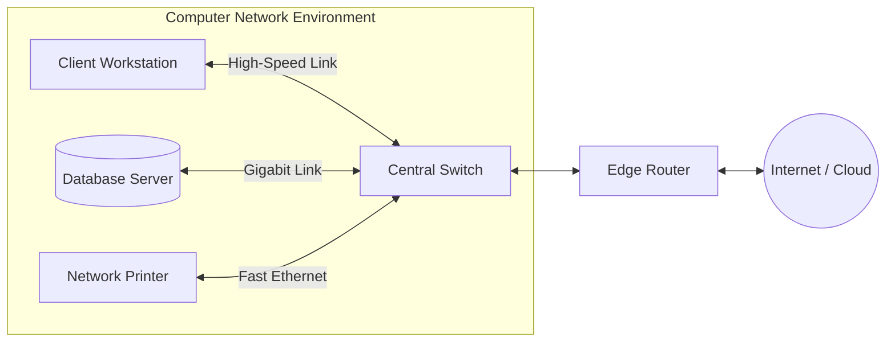
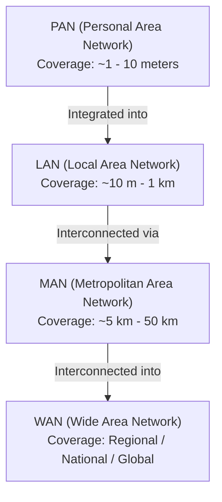
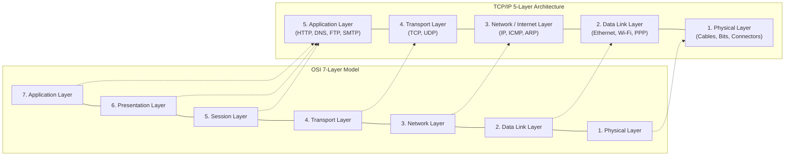
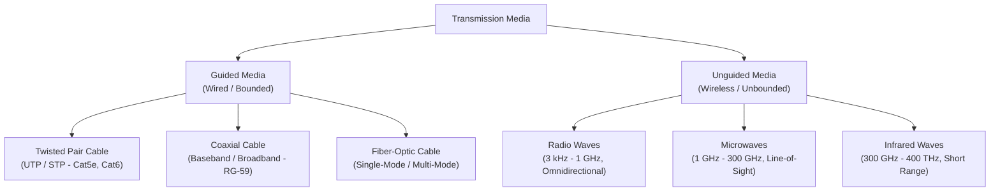
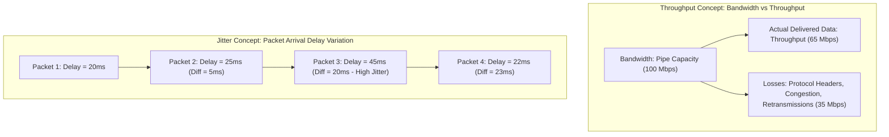
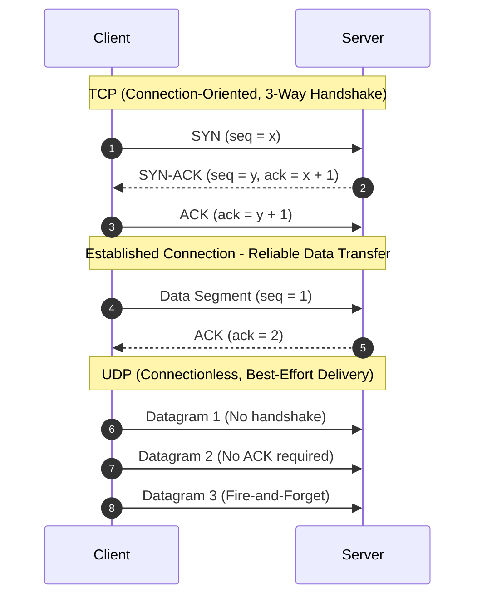
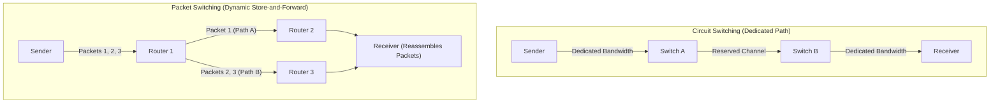
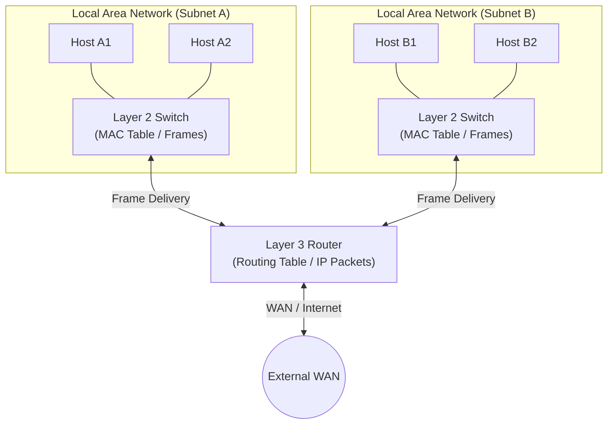
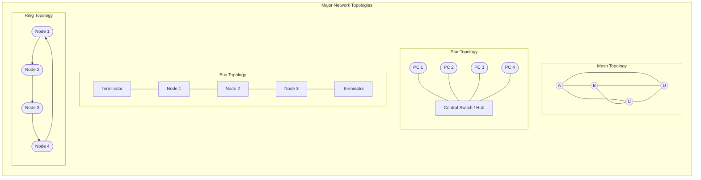
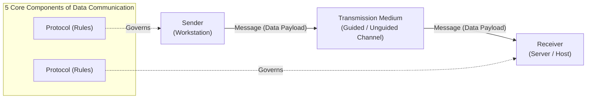

# Computer Networks (21CS302) — Unit 1 Short Questions & Answers

---

## Table of Contents
1. [Define Networks](#1-define-networks)
2. [What are the Types of Networks](#2-what-are-the-types-of-networks)
3. [Types of Layers (OSI & TCP/IP Reference Models)](#3-types-of-layers-osi--tcpip-reference-models)
4. [Summarize Transmission Media](#4-summarize-transmission-media)
5. [Define Jitter and Throughput](#5-define-jitter-and-throughput)
6. [Difference between TCP & UDP](#6-difference-between-tcp--udp)
7. [Difference between Circuit Switching & Packet Switching](#7-difference-between-circuit-switching--packet-switching)
8. [Contrast between Switch and Router](#8-contrast-between-switch-and-router)
9. [Explain about Topology](#9-explain-about-topology)
10. [Define Data Communication](#10-define-data-communication)
11. [Type of Line Configuration](#11-type-of-line-configuration)

---

## 1. Define Networks

### Definition
A **Computer Network** is an interconnected collection of autonomous computing devices (nodes) capable of exchanging data, sharing hardware and software resources, and communicating through wired or wireless transmission media governed by standardized protocols.

Nodes may encompass personal computers, servers, smartphones, network printers, switches, routers, and IoT sensors. Two devices are said to be networked if they can exchange information reliably.



### Essential Components of Data Communication
Every network system relies on five core building blocks:
1. **Message**: The payload information to be communicated (text, numbers, images, audio, video).
2. **Sender (Transmitter)**: The source node generating and sending the data message.
3. **Receiver**: The destination node receiving and interpreting the transmitted data.
4. **Transmission Medium**: The physical communication channel through which the signal propagates (copper wire, fiber-optic cable, or radio frequency waves).
5. **Protocol**: A strict set of syntactic and semantic rules governing data transmission, synchronization, and error handling between communicating entities.

### Key Criteria of an Effective Network
- **Performance**: Evaluated by transit time (time taken for a packet to reach the destination) and response time (elapsed time between an inquiry and a reply). Depends on user count, transmission media bandwidth, hardware processing speed, and routing efficiency.
- **Reliability**: Measured by the Mean Time Between Failures (MTBF), time required to recover from a failure, and resilience under catastrophic events.
- **Security**: Guarding data against unauthorized access, eavesdropping, corruption, malware, and applying systematic data encryption and backup policies.

---

## 2. What are the Types of Networks

Networks are primarily classified according to their **geographical span**, structural scale, and administrative ownership:



### 1. PAN (Personal Area Network)
- **Geographic Scope**: Up to 10 meters (centered around an individual person).
- **Key Technologies**: Bluetooth (IEEE 802.15.1), Zigbee (IEEE 802.15.4), Ultra-Wideband (UWB), and NFC.
- **Use Cases**: Syncing a smartwatch to a phone, wireless headphones, keyboard-to-PC connections.

### 2. LAN (Local Area Network)
- **Geographic Scope**: Spans a single room, office, home, school, or laboratory (up to a few kilometers).
- **Key Technologies**: Wired Ethernet (IEEE 802.3; 100 Mbps to 10 Gbps) and Wi-Fi (IEEE 802.11a/b/g/n/ac/ax).
- **Characteristics**: Privately owned, high data-transfer rates, very low transmission error rates, low propagation delay, and simple troubleshooting.

### 3. MAN (Metropolitan Area Network)
- **Geographic Scope**: Encompasses an entire municipality, city, or large university campus (approx. 5 to 50 km).
- **Key Technologies**: Cable Television (CATV) networks, Metro-Ethernet, FDDI, and WiMAX (IEEE 802.16).
- **Characteristics**: Often owned by a consortium of users or a single network service provider; bridges multiple local LANs across city blocks.

### 4. WAN (Wide Area Network)
- **Geographic Scope**: Crosses state, country, or continental boundaries (thousands of kilometers).
- **Key Technologies**: Fiber-optic submarine cables, satellite constellations, Frame Relay, ATM, and MPLS.
- **Characteristics**: Composed of transmission lines and routing switching elements (the Internet is the largest global public WAN). Typically owned by telecom carriers and Internet Service Providers (ISPs).

### Comparative Summary Matrix

| Parameter | PAN | LAN | MAN | WAN |
| :--- | :--- | :--- | :--- | :--- |
| **Geographic Span** | < 10 meters | Up to 1–2 km | Up to 50 km | > 100 km (Global) |
| **Data Transmission Rate** | Low to Moderate (~1–24 Mbps) | Very High (100 Mbps – 10 Gbps) | Moderate (44–155 Mbps) | Variable (Mbps to Gbps) |
| **Error Rate & Delay** | Low error, negligible delay | Lowest error, minimal delay | Moderate error, moderate delay | Highest error, significant delay |
| **Ownership** | Private / Personal | Private (Single Entity) | Public or Private Consortium | Distributed / Telecom Operators |
| **Installation & Maintenance** | Very Low cost | Inexpensive & Straightforward | High installation complexity | Very High capital & running cost |

---

## 3. Types of Layers (OSI & TCP/IP Reference Models)

Network architectures rely on **protocol layering** to achieve modularity, abstraction, and ease of troubleshooting. The two canonical models are the **ISO-OSI 7-Layer Model** and the **TCP/IP 5-Layer Model**.



### Detailed Breakdown of the OSI Reference Model

1. **Application Layer (Layer 7)**:
   - *Role*: Interface between user applications and the network services.
   - *Key Functions*: File transfer, virtual terminal access, email services, web browsing.
   - *Protocols*: HTTP, HTTPS, FTP, SMTP, DNS, Telnet, SSH.
   - *Data Unit (PDU)*: Message / Data.

2. **Presentation Layer (Layer 6)**:
   - *Role*: Resolves syntax and semantics differences between communicating endpoints.
   - *Key Functions*: 
     - **Translation**: Character encoding conversion (e.g., EBCDIC to ASCII).
     - **Encryption/Decryption**: Protecting sensitive data for privacy (e.g., TLS/SSL).
     - **Compression**: Lossless and lossy payload compression (e.g., JPEG, MPEG, gzip).

3. **Session Layer (Layer 5)**:
   - *Role*: Establishes, maintains, synchronizes, and terminates dialogues between processes.
   - *Key Functions*: Dialog control (half-duplex or full-duplex), token management, and synchronization checkpoints (resuming file transfer from the last checkpoint upon failure).

4. **Transport Layer (Layer 4)**:
   - *Role*: True end-to-end, process-to-process delivery of the entire message.
   - *Key Functions*: Service-point (port) addressing, message segmentation and reassembly, connection control, flow control (sliding window), and error control (checksums and retransmissions).
   - *Protocols*: TCP (reliable, connection-oriented), UDP (unreliable, connectionless).
   - *PDU*: Segment (TCP) / Datagram (UDP).

5. **Network Layer (Layer 3)**:
   - *Role*: Source-to-destination delivery of individual packets across multiple intermediate networks.
   - *Key Functions*: Logical addressing (IPv4/IPv6), packet routing (Dijkstra, Bellman-Ford, OSPF, BGP), and fragmentation/reassembly.
   - *Protocols*: IP, ICMP, IGMP, ARP.
   - *PDU*: Packet / Datagram.

6. **Data Link Layer (Layer 2)**:
   - *Role*: Hop-to-hop (node-to-node) error-free frame transmission over a single physical link.
   - *Key Functions*: Framing, physical (MAC) addressing, flow control, error detection/correction (CRC, parity), and Media Access Control (CSMA/CD, CSMA/CA).
   - *Sublayers*: LLC (Logical Link Control) and MAC (Media Access Control).
   - *PDU*: Frame.

7. **Physical Layer (Layer 1)**:
   - *Role*: Transmission of unstructured raw bit streams over a physical communication medium.
   - *Key Functions*: Representation of bits (voltage levels, optical pulses), data rate (bits per second), bit synchronization, physical topologies, and transmission modes (simplex, half-duplex, full-duplex).
   - *PDU*: Bit.

---

## 4. Summarize Transmission Media

**Transmission Media** represents the physical conduit located beneath the Physical Layer that conveys energy (signals) from a transmitter to a receiver. They are categorized into **Guided Media** and **Unguided Media**.



### A. Guided Media (Wired / Bounded)
Signals are physically constrained and directed within a physical boundary:

1. **Twisted Pair Cable**:
   - *Construction*: Two insulated copper conductors twisted in a helical spiral. The continuous twisting cancels electromagnetic interference (EMI) and crosstalk from adjacent pairs.
   - *Variants*: **UTP** (Unshielded Twisted Pair - widely used in office Ethernet like Cat5e, Cat6) and **STP** (Shielded Twisted Pair - incorporates metal braid foil for noisy industrial environments).
   - *Bandwidth & Distance*: Moderate bandwidth (up to 10 Gbps for Cat6a over short runs), high attenuation; limited to 100 meters per segment without repeaters.

2. **Coaxial Cable**:
   - *Construction*: A central solid copper core surrounded by a dielectric insulator, wrapped in an outer metallic braid/foil shield, and encased in a PVC jacket.
   - *Characteristics*: Higher bandwidth and noise immunity than twisted pair. Used historically in early 10BASE2/10BASE5 bus Ethernet, and currently in Cable TV and DOCSIS cable internet.

3. **Fiber-Optic Cable**:
   - *Construction*: A cylindrical glass or plastic core surrounded by a concentric cladding with a lower refractive index, protected by a buffer jacket.
   - *Principle*: Propagates light pulses based on **Total Internal Reflection (TIR)**.
   - *Variants*:
     - *Single-Mode Fiber (SMF)*: Extremely narrow core (~9 µm), laser source, minimal dispersion, used for long-distance telecommunication backbones (tens of kilometers).
     - *Multi-Mode Fiber (MMF)*: Wider core (~50–62.5 µm), LED source, prone to modal dispersion, used for short-haul campus links (< 2 km).
   - *Advantages*: Enormous bandwidth (terabits/sec), immunity to EMI/RFI, low attenuation, and high security (virtually impossible to tap without detection).

### B. Unguided Media (Wireless / Unbounded)
Electromagnetic waves propagate through air, water, or vacuum without physical confinement:

1. **Radio Waves (3 kHz to 1 GHz)**:
   - *Propagation*: Omnidirectional (broadcasts in all directions). Can penetrate solid walls easily.
   - *Applications*: AM/FM radio, television broadcasting, paging systems, cellular networks.

2. **Microwaves (1 GHz to 300 GHz)**:
   - *Propagation*: Highly directional, strictly line-of-sight (LOS). Antennas must be accurately aligned. Cannot penetrate solid obstacles effectively.
   - *Applications*: Terrestrial microwave towers, satellite communications, Wi-Fi (2.4 GHz & 5 GHz), and GPS.

3. **Infrared Waves (300 GHz to 400 THz)**:
   - *Propagation*: Line-of-sight, cannot penetrate walls or solid barriers (provides high security against accidental eavesdropping).
   - *Applications*: Short-range device communications, TV remote controls, and IrDA ports.

---

## 5. Define Jitter and Throughput

Both **Throughput** and **Jitter** are critical quality-of-service (QoS) metrics used to quantify the performance and stability of packet-switched communication systems.



### 1. Throughput

#### Definition
**Throughput** is a measure of how fast data is actually transferred through a network. It is defined as the volume of successful data payload (goodput/useful bits) delivered from the source to the destination per unit time.

#### Formula & Measurement
$$\text{Throughput} = \frac{\text{Total Payload Bits Successfully Received}}{\text{Total Elapsed Time (seconds)}}$$
- **Units**: Bits per second (bps), Kilobits per second (Kbps), Megabits per second (Mbps), or Gigabits per second (Gbps).

#### Bandwidth vs. Throughput Distinction
- **Bandwidth** is the theoretical maximum data-carrying capacity of a link (e.g., a Fast Ethernet link has a rated bandwidth of 100 Mbps).
- **Throughput** is the actual real-world rate observed, which is inevitably lower due to transmission framing overhead, transport layer acknowledgments, media access contention, and router queue delays (e.g., obtaining an actual throughput of 70 Mbps on a 100 Mbps link).
- **Bottleneck Principle**: In an end-to-end multi-hop path, overall throughput cannot exceed the rate of the slowest intermediate link (the bottleneck).

---

### 2. Jitter

#### Definition
**Jitter** (formally termed **Packet Delay Variation - PDV**) is the statistical variation in packet transit delay across a network. It represents the disparity in arrival time intervals between consecutive packets compared to the intervals at which they were dispatched.

#### Mathematical Representation
If packet $i$ is transmitted at time $T_i$ and arrives at time $A_i$, its transit delay is $D_i = A_i - T_i$.  
The instantaneous jitter between packet $i$ and packet $i+1$ is:
$$\text{Jitter} = |D_{i+1} - D_i|$$

#### Impact on Real-Time Applications
- If packets are sent every 20 ms and all arrive consistently spaced by 20 ms, jitter is **zero**.
- If some packets arrive after 20 ms, others after 80 ms, and others in rapid bursts after 5 ms, jitter is **high**.
- High jitter causes audio stutter, packet drops, video freezing, and echo in interactive applications like VoIP (Voice over IP), video conferencing (Zoom/Teams), and real-time online gaming.
- **Mitigation**: Networks use playback jitter buffers at the receiver endpoint and deploy Quality of Service (QoS) priority queuing algorithms (such as WFQ - Weighted Fair Queuing).

---

## 6. Difference between TCP & UDP

The Transport Layer relies on two principal transport protocols: **TCP (Transmission Control Protocol)** and **UDP (User Datagram Protocol)**.



### Detailed Comparison

| Feature / Metric | TCP (Transmission Control Protocol) | UDP (User Datagram Protocol) |
| :--- | :--- | :--- |
| **Connection Model** | **Connection-oriented**: Requires a 3-way handshake (SYN, SYN-ACK, ACK) before data transfer and 4-way teardown (FIN/ACK). | **Connectionless**: Sends datagrams immediately without session establishment or teardown. |
| **Reliability** | **Guaranteed Delivery**: Lost or damaged segments are detected via checksums, acknowledged, and retransmitted (Go-Back-N / Selective Repeat). | **Unreliable / Best-Effort**: Packets may be dropped, duplicated, or arrive out-of-order; no acknowledgments or retransmissions. |
| **Data Ordering** | **Strict In-Order Delivery**: Uses sequence numbers to reorder segments at the receiver before delivering to the application. | **No Ordering**: Datagrams arrive independently and may arrive out of sequence. |
| **Header Size** | **Variable**: 20 to 60 bytes (includes sequence, acknowledgment, window size, flags, options). | **Fixed**: Minimal 8 bytes (Source Port, Destination Port, Length, Checksum). |
| **Flow Control** | **Yes**: Utilizes a dynamic byte-stream sliding window mechanism to avoid overwhelming the receiver buffer. | **No**: Does not regulate flow rate. |
| **Congestion Control** | **Yes**: Advanced algorithms (Slow Start, Congestion Avoidance, Fast Retransmit, Fast Recovery) protect the network from congestion collapse. | **No**: Transmits at whichever rate the application pushes data. |
| **Transmission Nature** | Byte-stream oriented (no message boundaries preserved). | Message/Datagram oriented (preserves distinct packet boundaries). |
| **Speed & Overhead** | Slower throughput and higher processing overhead due to handshakes, state tracking, and retransmissions. | Extremely fast, lightweight, and low-latency. |
| **Broadcasting / Multicasting** | Only supports **Unicast** (point-to-point one-to-one communication). | Supports **Unicast, Multicast, and Broadcast**. |
| **Standard Applications** | Web (HTTP/HTTPS), File Transfer (FTP, SFTP), Email (SMTP, IMAP, POP3), Remote Shell (SSH). | DNS, DHCP, VoIP (SIP, RTP), Video Streaming, Online Gaming, SNMP, TFTP. |

---

## 7. Difference between Circuit Switching & Packet Switching

Switching is the mechanism of forwarding data from an incoming link to an outgoing link to establish an end-to-end communication channel.



### 1. Circuit Switching
- **Mechanism**: A dedicated physical or virtual circuit is reserved across all intermediate switches along the path before transmission starts. The process comprises three phases: **Connection Setup $\to$ Data Transfer $\to$ Circuit Teardown**.
- **Resource Reservation**: Complete channel capacity (bandwidth, switch buffers, time slots) is exclusively reserved for the session duration, regardless of whether data is actively flowing or the line is idle.
- **Delay Characteristics**: High initial setup latency; however, once established, propagation delay is deterministic with virtually zero jitter and no queuing delays.
- **Typical Application**: Traditional Public Switched Telephone Network (PSTN), ISDN.

### 2. Packet Switching
- **Mechanism**: Messages are divided into smaller chunks called **packets**. Each packet carries a header containing control information (source IP, destination IP, sequence number, TTL) and is routed independently through the network using **store-and-forward** intermediate switches/routers.
- **Resource Reservation**: No pre-allocated resources. Bandwidth is dynamically shared on demand via **statistical multiplexing**.
- **Approaches**:
  - *Datagram Approach*: Each packet is treated independently and may take entirely different paths to reach the destination; packets can arrive out of order.
  - *Virtual Circuit Approach*: A logical path is pre-calculated, but physical resources are still shared dynamically.
- **Typical Application**: The modern Internet (IP), Ethernet, Frame Relay.

### Detailed Comparison Table

| Attribute | Circuit Switching | Packet Switching |
| :--- | :--- | :--- |
| **Path Allocation** | Dedicated physical path established end-to-end. | Dynamic path; packets routed independently per hop. |
| **Resource Allocation** | Pre-allocated and reserved (guaranteed capacity). | Dynamic bandwidth sharing on-demand (statistical TDM). |
| **Bandwidth Efficiency** | Low (unused capacity during idle pauses is wasted). | High (links are utilized whenever data is ready to send). |
| **Setup Phase** | Mandatory call-setup phase before data transfer. | None needed in datagram networks (packets sent immediately). |
| **Delay Profile** | Deterministic delay (negligible queuing delay during transmission). | Variable delay (packets subject to queuing, processing, and retransmission delays). |
| **Store and Forward** | No; continuous bit-stream signal flow. | Yes; intermediate nodes buffer entire packets before forwarding. |
| **Handling Overload** | Blocks new calls (busy tone); existing calls unaffected. | Accepts packets but queuing delays increase and packet drops occur. |
| **Fault Tolerance** | Low; if any intermediate link fails, the entire circuit disconnects. | High; routers route subsequent packets around failed nodes or links. |
| **Charging Model** | Billed per connect time and distance. | Billed per volume of data transferred (bytes/packets). |

---

## 8. Contrast between Switch and Router

Switches and routers are the primary interconnecting devices operating at different layers of the OSI reference model.



### 1. Network Switch (Layer 2)
- Operates primarily at the **Data Link Layer (Layer 2)**.
- Forwards data using **hardware MAC (Physical) addresses**.
- Inspects incoming frame headers, dynamically builds an internal **MAC Address Table (CAM Table)** using the source MAC address, and selectively forwards the frame to the specific output port where the destination MAC resides.
- Micro-segments networks: every individual switch port represents an isolated **Collision Domain**, but all ports belong to the **same Broadcast Domain**.

### 2. Network Router (Layer 3)
- Operates at the **Network Layer (Layer 3)**.
- Forwards data across distinct logical networks using **IP (Logical) addresses**.
- Consults an internal **Routing Table** maintained via static routing or dynamic routing protocols (RIP, OSPF, BGP) to determine the optimal next-hop path.
- Acts as a barrier: **breaks both Collision Domains and Broadcast Domains** (does not forward broadcast frames by default).

### Comparison Matrix

| Parameter | Switch (Layer 2) | Router (Layer 3) |
| :--- | :--- | :--- |
| **Operating Layer** | Data Link Layer (OSI Layer 2). | Network Layer (OSI Layer 3). |
| **Primary Addressing** | Physical / MAC Address (48-bit). | Logical / IP Address (32-bit IPv4 / 128-bit IPv6). |
| **Data Unit** | Frames. | Packets. |
| **Device Scope** | Intranet / Internal LAN connectivity. | Inter-network / Connects distinct LANs and WANs. |
| **Collision Domains** | Each port is an independent collision domain. | Each interface is an independent collision domain. |
| **Broadcast Domains** | Single broadcast domain across all ports (unless partitioned via VLANs). | Separates broadcast domains on each interface (stops IP broadcasts). |
| **Forwarding Decision** | Based on CAM / MAC Address Lookup Table. | Based on IP Routing Table and Routing Metrics (hops, cost). |
| **Hardware Architecture** | ASIC-based hardware switching (wire-speed forwarding). | CPU/Microprocessor driven software/hardware routing logic. |
| **Network Services** | Supports VLAN configuration, Spanning Tree Protocol (STP), port mirroring. | Supports NAT, DHCP server/relay, packet filtering, firewall access lists (ACLs), QoS. |

---

## 9. Explain about Topology

### Definition
**Network Topology** refers to the geometric arrangement and schematic relationship of links and nodes (devices) forming a computer network. It defines how devices are arranged physically (**Physical Topology**) and how data flows through the network (**Logical Topology**).



---

### Detailed Analysis of Primary Topologies

#### 1. Mesh Topology
- **Structure**: Every node possesses a dedicated point-to-point link to every other node in the network.
- **Formula**: For $N$ nodes, total number of duplex links required is:
  $$\text{Number of Links} = \frac{N(N - 1)}{2}$$
  Each device requires $(N - 1)$ I/O ports.
- **Advantages**:
  - *Robustness & Fault Tolerance*: If one link fails, communication between all other nodes remains unaffected.
  - *Privacy & Security*: Dedicated links prevent unauthorized eavesdropping.
  - *No Traffic Contention*: Each link carries only its own designated traffic.
- **Disadvantages**: Enormous cabling requirements, high port counts, expensive installation, difficult maintenance. Used primarily in critical network backbones and core routers.

#### 2. Star Topology
- **Structure**: All devices connect directly to a central networking device (Switch or Hub) via dedicated point-to-point links. Nodes do not communicate with each other directly; traffic is relayed via the central controller.
- **Formula**: Requires $N$ links and $N$ ports on peripheral devices (plus an $N$-port central device).
- **Advantages**:
  - Inexpensive and straightforward installation and reconfiguration.
  - High fault isolation: if one cable breaks, only that node goes offline.
  - Centralized monitoring and administration.
- **Disadvantages**: The central switch/hub represents a **single point of failure**; if it goes down, the entire network fails.

#### 3. Bus Topology
- **Structure**: A multipoint configuration where all stations share a single common transmission backbone cable terminated at both ends by resistors (terminators) to prevent signal reflections. Devices attach to the bus via drop cables and taps.
- **Advantages**: Minimal cable usage, inexpensive, easy to connect stations in small temporary environments.
- **Disadvantages**:
  - Heavy traffic leads to collisions and severe performance degradation (CSMA/CD required).
  - Difficult fault isolation; a single break or severed cable along the main backbone terminates the entire network.
  - Signal attenuation limits the maximum length of the bus.

#### 4. Ring Topology
- **Structure**: Each device is connected to exactly two neighboring nodes, forming an unbroken circular loop. Data travels unidirectionally (or bidirectionally in dual-ring systems) around the ring from device to device using a token-passing mechanism.
- **Advantages**: Deterministic access time (no collisions, token passing controls transmission), equal access opportunity for all nodes.
- **Disadvantages**: A single broken link or failed node breaks the entire ring (unless redundant counter-rotating rings like FDDI are implemented). Addition or removal of nodes disrupts network operations.

#### 5. Hybrid & Tree Topologies
- **Tree Topology**: A hierarchical variation of the Star topology where groups of star-configured networks are connected to a linear backbone cable or root switch (widely used in enterprise multi-floor building networks).
- **Hybrid Topology**: Combines two or more distinct topologies (e.g., Star-Bus or Star-Ring) to leverage the advantages of each while mitigating individual constraints.

---

### Comparative Summary of Network Topologies

| Topology | Cable Length Required | Installation Complexity | Fault Isolation | Failure Impact | Common Use Case |
| :--- | :--- | :--- | :--- | :--- | :--- |
| **Mesh** | Maximum ($O(N^2)$) | Extremely High | Immediate & Simple | Zero impact on other nodes | Core WAN backbones, SANs |
| **Star** | Moderate ($O(N)$) | Easy | Excellent | Only affected node disabled | Modern Enterprise & Home LANs |
| **Bus** | Minimum ($O(N)$) | Simple | Very Difficult | Entire network fails if bus breaks | Legacy networks, industrial sensor buses |
| **Ring** | Low ($O(N)$) | Moderate | Difficult | Entire loop fails (in single ring) | Token Ring, FDDI, SONET rings |
| **Tree** | Moderate to High | High | Good (per branch) | Failure of branch switch isolates subnet | Campus networks, hierarchical designs |


---

## 10. Define Data Communication

### Definition
**Data Communication** is the exchange of data (in the form of digital or analog signals) between two devices via some form of transmission medium (such as a wire cable, optical fiber, or wireless radio link). For data communication to occur, the communicating devices must be part of a communication system made up of a combination of hardware (physical equipment) and software (programs and protocols).



### 1. Five Fundamental Components of Data Communication
As defined in Behrouz Forouzan's *Data Communications and Networking*, a data communication system consists of 5 fundamental elements:
1. **Message**: The data or information to be communicated. It can take forms such as text, numbers, pictures, audio, or video.
2. **Sender**: The device that creates and transmits the data message (e.g., computer, workstation, telephone handset, video camera).
3. **Receiver**: The device that receives the message (e.g., computer, printer, television, server).
4. **Transmission Medium**: The physical path over which a message travels from sender to receiver (e.g., twisted-pair wire, coaxial cable, fiber-optic cable, laser, or radio waves).
5. **Protocol**: A set of rules that governs data communications. It represents an agreement between the communicating devices. Without a protocol, two devices may be connected, but cannot communicate (just as two people speaking mutually unintelligible languages cannot understand each other).

### 2. Four Fundamental Characteristics of an Effective Data Communication System
The effectiveness of a data communication system depends on four key characteristics:
- **Delivery**: The system must deliver data to the correct destination. Data must be received by the intended device or user and only by that device or user.
- **Accuracy**: The system must deliver data accurately. Data that have been altered in transmission and left uncorrected are unusable.
- **Timeliness**: The system must deliver data in a timely manner. Data delivered late are often useless (e.g., in real-time audio and video transmissions, timely delivery means delivering data as they are produced, without significant delay).
- **Jitter**: The system must minimize jitter, which refers to the variation in packet arrival times (causing uneven quality in multimedia).

### 3. Data Flow Modes
Data communication between two devices can take place in three transmission modes:
- **Simplex**: Unidirectional communication where only one device can transmit and the other can only receive (e.g., keyboard to monitor, traditional TV broadcast).
- **Half-Duplex**: Bidirectional communication where both stations can transmit and receive, but **not at the same time** (e.g., Walkie-talkie).
- **Full-Duplex (Duplex)**: Simultaneous bidirectional communication where both stations can transmit and receive concurrently (e.g., telephone call, full-duplex Ethernet).

---

## 11. Type of Line Configuration

### Definition
**Line Configuration** (also referred to as **Connection Type**) defines the relationship by which two or more communication devices attach to a transmission link. A link is the physical communication pathway that transfers data from one device to another.

There are two primary types of line configuration:
1. **Point-to-Point Connection**
2. **Multipoint (or Multi-drop) Connection**

```mermaid
flowchart TD
    subgraph P2P["1. Point-to-Point Configuration (Dedicated Link)"]
        direction LR
        STA1["Station A"] <====="Dedicated Capacity Channel"=====> STA2["Station B"]
    end

    subgraph MP["2. Multipoint Configuration (Shared Link)"]
        direction LR
        MAST["Mainframe / Primary Station"] --- BB["Common Shared Backbone Cable"]
        BB -.- S1["Station 1"]
        BB -.- S2["Station 2"]
        BB -.- S3["Station 3"]
    end
```

### 1. Point-to-Point Configuration
- **Description**: Provides a **dedicated link** between two devices. The entire capacity of the channel is reserved exclusively for transmission between those two endpoints.
- **Characteristics**:
  - Direct connection between two nodes.
  - No contention for channel bandwidth with other devices.
  - Most point-to-point connections use an actual length of wire or cable, but microwave or satellite links can also establish point-to-point circuits.
- **Examples**:
  - Television remote control to television receiver (infrared link).
  - Dedicated leased line between two corporate branches.
  - Direct connection between a computer and a modem via an RS-232 serial cable.
  - Microwave link between two relay towers.

### 2. Multipoint (Multi-drop) Configuration
- **Description**: A configuration in which **more than two specific devices share a single link**.
- **Characteristics**:
  - The capacity of the channel is shared among multiple nodes either:
    - **Spatially Shared**: Several devices can use the link simultaneously if the channel provides multiple frequencies or division.
    - **Temporally (Time) Shared**: Users take turns accessing the shared medium (time-division access).
  - Devices connect to the main transmission line via drop lines and taps.
  - Requires media access control (MAC) mechanisms (e.g., CSMA/CD, polling, token passing) to prevent collisions.
- **Examples**:
  - Traditional Bus topology Ethernet (10BASE2 thinnet, 10BASE5 thicknet).
  - Mainframe computer connected to multiple dumb terminals over a shared multidrop line.
  - Shared Wi-Fi wireless channel accessed by multiple wireless laptops and phones in a room.

### Comparative Summary: Point-to-Point vs. Multipoint

| Feature | Point-to-Point Connection | Multipoint Connection |
| :--- | :--- | :--- |
| **Number of Devices** | Exactly two devices per link | More than two devices share a single link |
| **Channel Capacity** | Dedicated 100% capacity exclusively between the two endpoints | Shared capacity (spatially or time-shared among all stations) |
| **Cabling Requirement** | High (separate physical cable required for each pair of nodes) | Low (single common cable with drop lines/taps) |
| **Cost** | Higher due to dedicated wiring and multiple interface ports | Lower initial cabling and installation cost |
| **Installation & Maintenance** | Simple to configure; direct point-to-point troubleshooting | Complex to configure and troubleshoot; difficult to isolate cable faults |
| **Channel Contention** | None (no contention, exclusive access) | High (requires media access protocols like CSMA or polling to prevent collision) |
| **Reliability** | A fault only affects the two connected nodes | A break in the main backbone cable disrupts the entire network |
| **Associated Topologies** | Star, Mesh, Ring (individual point-to-point hops) | Bus Topology |
