# Computer Networks (21CS302) — Unit 2 Long Questions & Comprehensive Answers
### Master Study Guide for 16-Mark University Examinations (Data Link Layer & MAC)

---

## Table of Contents
1. [Question 1: Duties of the Data Link Layer](#question-1-duties-of-the-data-link-layer)
   - 1.1 Architectural Placement and Fundamental Role
   - 1.2 The Sublayer Division: LLC (IEEE 802.2) vs. MAC (IEEE 802.3 / 802.11)
   - 1.3 Framing Techniques: Byte Stuffing and Bit Stuffing
   - 1.4 Link-Layer Physical Addressing (MAC Addresses)
   - 1.5 Flow Control and Error Control Services
   - 1.6 Media Access Control (MAC) Arbitration
   - 1.7 Master Summary Matrix of Data Link Layer Responsibilities
2. [Question 2: Unicast, Multicast, and Broadcast Transmission Modes](#question-2-unicast-multicast-and-broadcast-transmission-modes)
   - 2.1 Foundational Concepts and Transmission Paradigms
   - 2.2 Unicast Transmission: Mechanics, Addressing, and Trade-offs
   - 2.3 Broadcast Transmission: Limited vs. Directed, Flooding, and Storms
   - 2.4 Multicast Transmission: Group Addressing, 32:1 MAC Mapping, and IGMP
   - 2.5 Anycast Transmission: One-to-Nearest Routing
   - 2.6 Master Comparison Matrix: Unicast vs. Multicast vs. Broadcast vs. Anycast
3. [Question 3: Address Resolution Protocol (ARP)](#question-3-address-resolution-protocol-arp)
   - 3.1 Motivation: Bridging the Logical IP and Physical MAC Gap
   - 3.2 Detailed ARP Message Format (RFC 826 Header Layout)
   - 3.3 The ARP Resolution Cycle: Broadcast Request & Unicast Reply
   - 3.4 ARP Cache Table Architecture, Aging Timers, and Cache Poisoning
   - 3.5 Specialized Variants: Gratuitous ARP and Proxy ARP
   - 3.6 Complete ARP Protocol Flowchart
4. [Question 4: Reverse Address Resolution Protocol (RARP)](#question-4-reverse-address-resolution-protocol-rarp)
   - 4.1 Historical Context: The Diskless Workstation Bootstrap Problem
   - 4.2 RARP Protocol Mechanics & Packet Structure (RFC 903)
   - 4.3 Operational Workflow: Broadcast Request and Unicast Reply
   - 4.4 Architectural Flaws and Reasons for Deprecation
   - 4.5 Evolutionary Replacement: From RARP to BOOTP to DHCP
   - 4.6 Master Comparison Matrix: ARP vs. RARP vs. BOOTP vs. DHCP
5. [Question 5: Error Detection and Correction](#question-5-error-detection-and-correction)
   - 5.1 Physics of Transmission Errors: Single-Bit vs. Burst Errors
   - 5.2 Redundancy Principles and Hamming Distance ($d_{\text{min}}$ Bounds)
   - 5.3 Parity Checks: Simple (1D) vs. Two-Dimensional Longitudinal (2D)
   - 5.4 Internet Checksum: 1's Complement Arithmetic and Implementation
   - 5.5 Cyclic Redundancy Check (CRC): Modulo-2 Polynomial Division Walkthrough
   - 5.6 Error Correction: Hamming Code ($2^r \ge m + r + 1$) Complete Numerical Trace
   - 5.7 Master Comparison Matrix of Error Detection and Correction Techniques

---

# Question 1: Duties of the Data Link Layer

## 1.1 Architectural Placement and Fundamental Role

The **Data Link Layer (DLL)** operates at Layer 2 of the ISO-OSI 7-layer model, positioned directly between the **Physical Layer (Layer 1)** and the **Network Layer (Layer 3)**.

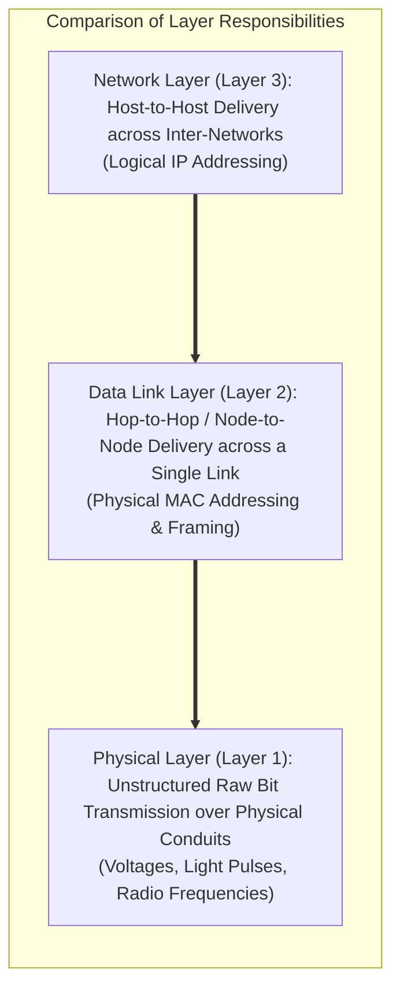

### Core Objective
The raw physical layer provides an error-prone, unstructured transmission stream of `0`s and `1`s subject to electrical noise, signal attenuation, and collisions. The primary objective of the Data Link Layer is to **transform this raw, imperfect physical transmission conduit into an error-free, reliable hop-to-hop communication link** for the upper Network Layer.

While the Network Layer oversees packet delivery between end-hosts across thousands of miles, the Data Link Layer is responsible exclusively for moving data frames from one physical interface to the next adjacent physical interface connected to the same physical cable or wireless link (e.g., from Workstation A to Switch 1, or Switch 1 to Router 1).

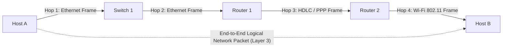

---

## 1.2 The Sublayer Division: LLC (IEEE 802.2) vs. MAC (IEEE 802.3 / 802.11)

In the late 1970s, the IEEE realized that local area networks (LANs) share common link-layer requirements (flow control, multiplexing) but differ widely in their physical media access mechanics (Ethernet coaxial/twisted-pair, Token Ring, wireless radio). Consequently, IEEE Project 802 split the Data Link Layer into two functional sublayers:

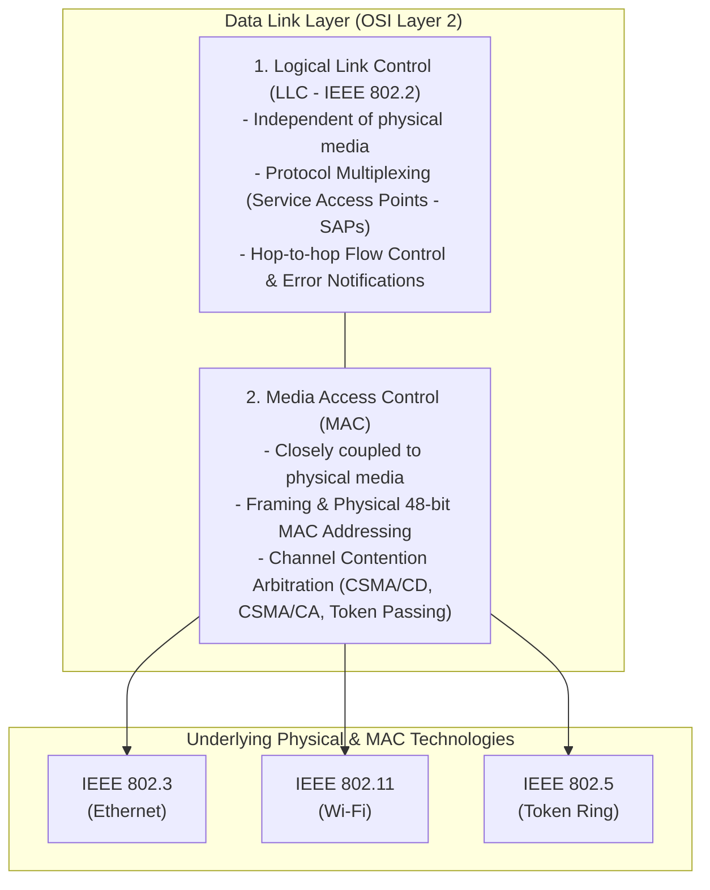

### 1. Logical Link Control (LLC) Sublayer (IEEE 802.2)
- **Media Independence**: Provides a uniform software interface to the Network Layer regardless of whether the underlying transmission medium is copper wire, fiber-optic cable, or wireless radio frequency.
- **Protocol Multiplexing**: Utilizes **Service Access Points (SAPs)**—specifically Destination SAP (DSAP) and Source SAP (SSAP)—to multiplex different network layer protocols (IPv4, IPv6, IPX, AppleTalk) over the same physical link.
- **Link-Layer Services**: Offers three operating modes: Unacknowledged connectionless service (fast, standard LAN traffic), Acknowledged connectionless service (used in high-loss wireless), and Connection-oriented service.

### 2. Media Access Control (MAC) Sublayer
- **Hardware Coupling**: Directly interfaces with physical transceivers and network interface card (NIC) hardware.
- **Assembly and Disassembly**: Encapsulates network layer packets into frames by prepending physical MAC address headers and appending Cyclic Redundancy Check (CRC-32) trailers.
- **Channel Access Arbitration**: Implements multi-access arbitration protocols (CSMA/CD in wired Ethernet, CSMA/CA in Wi-Fi) to resolve channel collisions over shared broadcast media.

---

## 1.3 Framing Techniques: Byte Stuffing and Bit Stuffing

Because the physical layer delivers an unbroken stream of raw binary bits, the Data Link Layer must divide this bitstream into distinct, manageable data blocks called **Frames**. To enable the receiver to identify where one frame ends and the next frame begins, the Data Link Layer implements **Framing**.

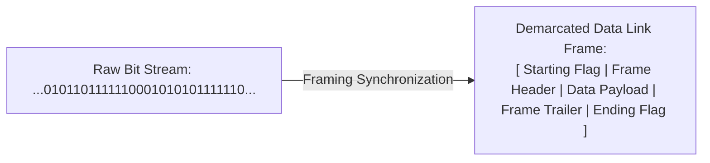

### Primary Framing Methods:

#### 1. Character Count (Length Field)
- A header field specifies the total number of characters/bytes in the frame.
- *Fatal Flaw*: If an electrical noise burst corrupts the count field (e.g., changing a count of $5$ to $7$), the receiver loses frame synchronization permanently, interpreting subsequent data payload bytes as header boundaries.

#### 2. Byte Stuffing (Character-Oriented Framing)
- Used in character-oriented protocols (e.g., BISYNC, PPP).
- Special reserved 1-byte patterns called **Flags** demarcate frame boundaries (e.g., `FLAG = 0x7E`).
- *The Escape Problem*: If the user's data payload happens to contain an identical byte pattern matching the `FLAG`, the receiver will mistakenly assume the frame has ended prematurely.
- *Solution (Byte Stuffing)*: The sender inserts an **Escape Character (`ESC = 0x7D`)** immediately before any accidental `FLAG` or `ESC` byte in the payload. The receiver removes the `ESC` byte and interprets the following byte as pure data.

```
Original Payload:        [ DATA ] [ FLAG ] [ DATA ] [ ESC  ] [ DATA ]
Transmitted on Wire:     [ FLAG ] [ DATA ] [ ESC ] [ FLAG ] [ DATA ] [ ESC ] [ ESC ] [ DATA ] [ FLAG ]
Receiver Extracts:       [ DATA ] [ FLAG ] [ DATA ] [ ESC  ] [ DATA ]
```

#### 3. Bit Stuffing (Bit-Oriented Framing)
- Standardized in **HDLC (High-Level Data Link Control)** and SDLC.
- Frames are delimited by a unique 8-bit flag pattern: **`01111110` (six consecutive `1`s)**.
- *The Rule*: Whenever the transmitting Data Link Layer detects **five consecutive `1`s** (`11111`) in the data payload, it **automatically injects (stuffs) a `0` bit** into the outgoing bitstream, regardless of whether the next bit is a `0` or a `1`.
- *Receiver De-Stuffing*: The receiver continuously monitors incoming bits. If it detects five consecutive `1`s followed by a `0`, it **automatically discards (un-stuffs) the `0` bit**. If it detects five consecutive `1`s followed by a `1` and a `0` (`01111110`), it recognizes a legitimate frame boundary flag.

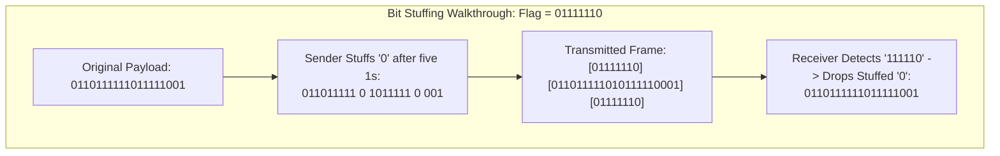

---

## 1.4 Link-Layer Physical Addressing (MAC Addresses)

Unlike Layer 3 logical IP addresses that change when a device moves to a new subnet, a **Media Access Control (MAC) Address** is a 48-bit (6-byte) physical hardware address permanently burned into the Read-Only Memory (ROM) of every Network Interface Card (NIC) during manufacturing.

```
 0                   1                   2                   3
 0 1 2 3 4 5 6 7 8 9 0 1 2 3 4 5 6 7 8 9 0 1 2 3 4 5 6 7 8 9 0 1
+-+-+-+-+-+-+-+-+-+-+-+-+-+-+-+-+-+-+-+-+-+-+-+-+-+-+-+-+-+-+-+-+
| Organizationally Unique Identifier (OUI)      | Extension Identifier          |
| (24 bits assigned to Vendor by IEEE)          | (24 bits assigned by Vendor)  |
+-+-+-+-+-+-+-+-+-+-+-+-+-+-+-+-+-+-+-+-+-+-+-+-+-+-+-+-+-+-+-+-+
```

- **Hexadecimal Representation**: Expressed as 12 hexadecimal digits grouped in pairs separated by colons or hyphens: `00:1A:2B:3C:4D:5E`.
- **First 24 Bits (OUI - Organizationally Unique Identifier)**: Allocated by the IEEE Registration Authority to hardware manufacturers (e.g., Cisco, Intel, Apple).
- **Last 24 Bits (NIC Specific)**: Assigned uniquely by the vendor to each physical network interface card.
- **Individual / Group (I/G) Bit**: The least significant bit of the first byte:
  - If bit is `0`: **Unicast Address** (identifies an individual physical workstation).
  - If bit is `1`: **Multicast / Broadcast Address** (identifies a group of devices).

---

## 1.5 Flow Control and Error Control Services

### 1. Flow Control
Flow control coordinates the volume and speed of frame transmission, preventing a high-speed transmitter from overwhelming a slow-processing receiver and causing buffer overflows.
- **Stop-and-Wait Flow Control**: The sender transmits a single frame and halts, waiting for an explicit acknowledgment (ACK) from the receiver before transmitting the next frame. Highly inefficient on links with high Bandwidth-Delay Products.
- **Sliding Window Flow Control**: The sender is permitted to transmit up to $W$ frames (the window size) before halting for an acknowledgment, dramatically increasing link utilization:
  $$\text{Utilization } U = \frac{N}{1 + 2a} \quad \text{where } a = \frac{T_{\text{prop}}}{T_{\text{trans}}}$$

### 2. Error Control
Raw physical signals are susceptible to noise bursts that corrupt bits. Error control ensures all frames arrive uncorrupted and in sequence:
- **Error Detection**: Senders calculate redundant bits (Parity, Checksum, CRC) and append them in the frame trailer ($T_2$). The receiver recomputes the checksum; if a mismatch occurs, the frame is rejected.
- **Automatic Repeat reQuest (ARQ)**:
  - *Stop-and-Wait ARQ*: Re-transmits the frame if an ACK is not received before a retransmission timer expires.
  - *Go-Back-N ARQ*: If frame $i$ is lost, the sender retransmits frame $i$ and all subsequent frames $i+1, i+2, \dots$ within the current window.
  - *Selective Repeat ARQ*: The receiver buffers out-of-order undamaged frames, and the sender retransmits **only the specific lost or damaged frame**.

---

## 1.6 Media Access Control (MAC) Arbitration

When multiple stations connect to a shared communication medium (e.g., traditional coaxial bus Ethernet or shared Wi-Fi radio channels), simultaneous transmissions collide, producing garbled, unusable waveforms. The Data Link Layer enforces **Multiple Access Protocols** to arbitrate channel access:

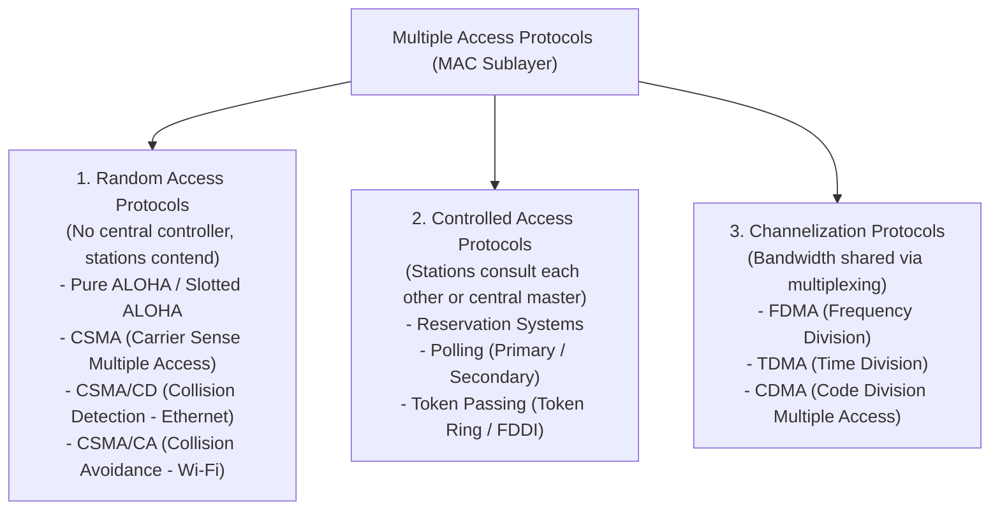

---

## 1.7 Master Summary Matrix of Data Link Layer Responsibilities

| Duty | Operational Purpose | Mechanism / Algorithm | Standard Technology Example |
| :--- | :--- | :--- | :--- |
| **Framing** | Demarcates packet boundaries in bitstream | Bit Stuffing (`01111110`), Byte Stuffing (`ESC`)| HDLC, PPP, Ethernet II |
| **Physical Addressing**| Identifies physical NICs on the local hop | 48-bit MAC Address (EUI-48)| Ethernet (802.3), Wi-Fi (802.11)|
| **Flow Control** | Prevents receiver buffer overflow | Stop-and-Wait, Sliding Window | IEEE 802.3x Flow Control |
| **Error Detection** | Detects corrupted bits in transit | Cyclic Redundancy Check (CRC-32) | Frame Check Sequence (FCS) |
| **Error Correction**| Recovers lost or damaged frames | Automatic Repeat reQuest (ARQ) | Go-Back-N, Selective Repeat |
| **Access Control** | Arbitrates shared broadcast media access | Contention & Collision handling | CSMA/CD (802.3), CSMA/CA (802.11)|
| **Link Management** | Establishes & terminates logical links | Point-to-Point LCP negotiation | PPP, HDLC ABM / NRM modes |

---

# Question 2: Unicast, Multicast, and Broadcast Transmission Modes

## 2.1 Foundational Concepts and Transmission Paradigms

Data communication systems disseminate information between nodes using different **Addressing and Forwarding Paradigms** depending on whether traffic is intended for a single destination, a designated interest group, or all devices across a network.

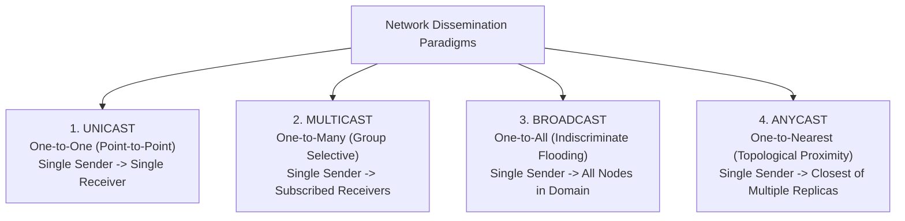

---

## 2.2 Unicast Transmission: Mechanics, Addressing, and Trade-offs

### Definition
**Unicast** is a point-to-point communication paradigm in which a message is transmitted from a **single source host to a single, uniquely identifiable destination host**.

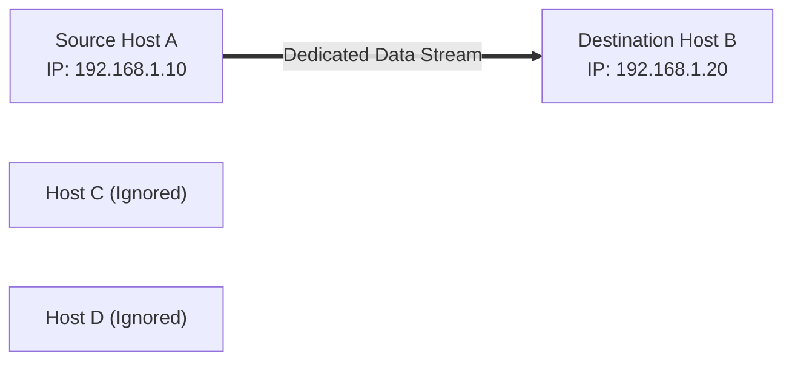

### Addressing Mechanics
- **Layer 2 (Data Link)**: The destination field contains the unique 48-bit MAC address of the target machine. The **Individual/Group (I/G) bit** (least significant bit of the first octet) is explicitly set to `0`:
  $$\text{Example: } \mathbf{00}:1A:2B:3C:4D:5E \implies 0000000\mathbf{0}_2 \quad (\text{I/G bit} = 0)$$
- **Layer 3 (Network)**: The destination IP is a standard unicast address (IPv4 Class A, B, or C; IPv6 Global Unicast `2000::/3`).

### Operational Forwarding
- When a Layer 2 switch receives a unicast frame, it checks its **MAC Address Table (CAM Table)**. If an entry exists for the destination MAC, the switch forwards the frame **exclusively out that specific physical port**, keeping the rest of the network free from traffic.
- If the destination is unknown, the switch floods the frame initially, updating its table upon receipt of a reply.

### Evaluation
- **Advantages**: Confidentiality (frames are delivered only to the target), support for individual flow and congestion control (TCP Sliding Window, ACKs), and simple troubleshooting.
- **Disadvantages**: Highly inefficient for mass content distribution. If a server streams a 1080p video (5 Mbps) to 1,000 users via unicast, the server and its uplink must generate and transmit **1,000 separate identical streams**, consuming $5\text{ Gbps}$ of redundant bandwidth.

---

## 2.3 Broadcast Transmission: Limited vs. Directed, Flooding, and Storms

### Definition
**Broadcast** is a one-to-all communication model where a message sent by a single host is **received and processed by every single active host within the local broadcast domain**.

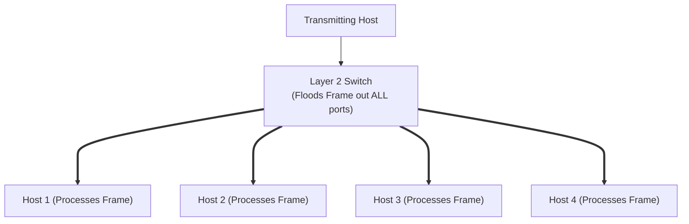

### 1. Limited Broadcast vs. Directed Broadcast
- **Limited Broadcast (Local Segment)**:
  - **IPv4 Address**: `255.255.255.255`
  - **Layer 2 MAC**: `FF:FF:FF:FF:FF:FF` (all 48 bits set to `1`).
  - *Behavior*: Delivered to all devices on the local physical segment. **Routers never forward limited broadcast packets**, preventing broadcast traffic from spilling across the global Internet.
- **Directed Broadcast (Target Subnet)**:
  - **IPv4 Address**: Network prefix + all host bits set to `1` (e.g., `192.168.1.255` on a `/24` subnet).
  - *Behavior*: Routed across intermediate networks like unicast until it arrives at the target subnet's final router, which broadcasts it locally to all hosts. (Disabled by default on modern routers to mitigate Smurf DDoS attacks).

### 2. Operational Hazards: Broadcast Storms
Because every broadcast frame forces every receiving host's network interface card to generate a hardware interrupt to the CPU for software processing, excessive broadcasts degrade network performance.
- If a switching loop exists (without Spanning Tree Protocol), broadcast frames circulate and replicate endlessly, saturating 100% of link capacity and crashing switch processors within seconds (**Broadcast Storm**).
- **IPv6 Evolution**: Due to these inefficiencies, **IPv6 completely eliminated the Broadcast address**, replacing it with scoped Multicast and Anycast.

---

## 2.4 Multicast Transmission: Group Addressing, 32:1 MAC Mapping, and IGMP

### Definition
**Multicast** is an efficient one-to-many communication model where a single stream of packets is delivered simultaneously to a **specific group of subscribed hosts**, without transmitting copies to uninterested nodes.

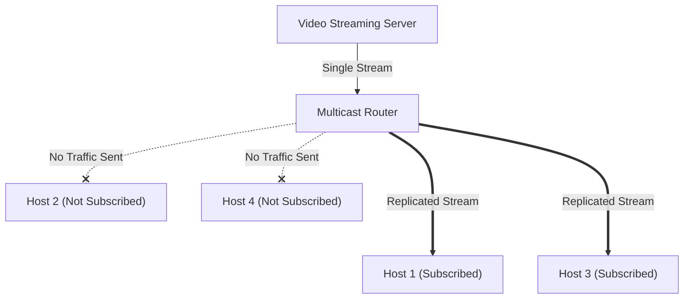

### Addressing Architecture

#### 1. Layer 3 IPv4 Multicast Addressing (Class D)
- IP range: `224.0.0.0` to `239.255.255.255` (leading bits: `1110`).
- Unlike unicast addresses, multicast IP addresses represent **abstract group identifiers**, not physical network interface cards.

#### 2. Layer 2 Ethernet MAC Multicast Addressing & The 32:1 Ambiguity
To transmit a Layer 3 multicast packet over Ethernet, the destination IP must be mapped into an Ethernet MAC address:
- IANA reserved the IEEE MAC block: **`01:00:5E:00:00:00` to `01:00:5E:7F:FF:FF`**.
- Notice the first byte: $01_{16} = 0000000\mathbf{1}_2$ (the **I/G bit is 1**, signifying a group/multicast frame).
- In this reserved block, the upper 25 bits are permanently fixed to `01:00:5E` + a leading `0` bit, leaving **only 23 bits** available to carry the multicast group address.
- However, an IPv4 Class D address contains **28 bits of group identifier** (32 bits minus the 4-bit `1110` prefix).

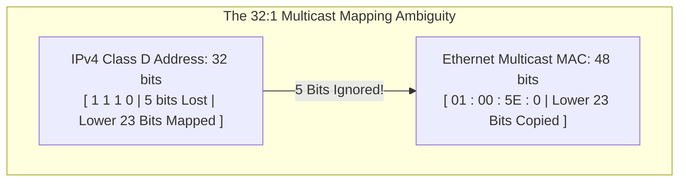

- **The Mathematical Result**: Because 5 bits of the IP multicast address are ignored during mapping, $2^5 = \mathbf{32 \text{ distinct IP multicast addresses}}$ map to the exact same Ethernet MAC address!
- *Example*: `224.1.1.1` and `224.129.1.1` map to the identical MAC: `01:00:5E:01:01:01`. The receiving host's network card accepts both frames, but the operating system's IP stack discards the unwanted group's packets after inspecting the Layer 3 header.

---

## 2.5 Anycast Transmission: One-to-Nearest Routing

In **Anycast**, the same IP address is assigned to multiple geographically distributed servers across the world.

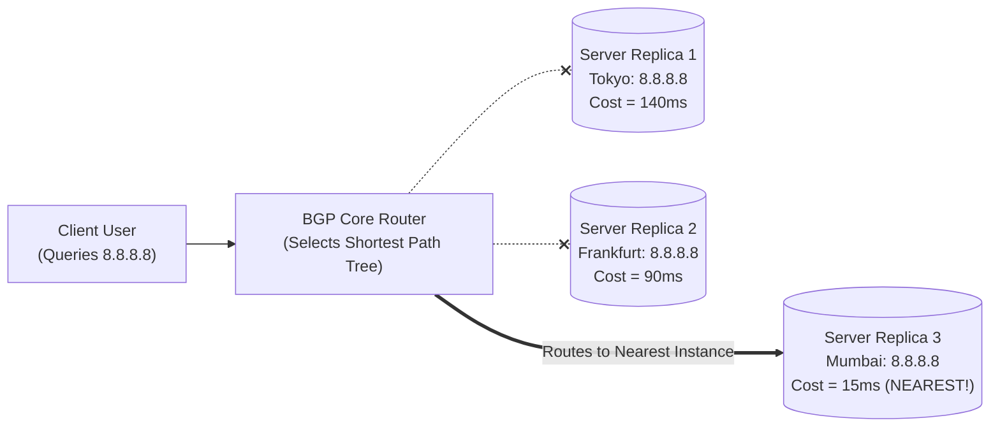

- When a client transmits a packet to an anycast address, intermediate BGP routers use standard routing metrics to route the packet to the **single topologically closest server replica**.
- If a server replica crashes, BGP withdraws the route, and traffic automatically reroutes to the next closest instance.
- **Applications**: Global DNS Root Servers, Cloudflare/Google CDN edge caches, Google Public DNS (`8.8.8.8`).

---

## 2.6 Master Comparison Matrix

| Parameter | Unicast | Broadcast | Multicast | Anycast |
| :--- | :--- | :--- | :--- | :--- |
| **Delivery Model** | One-to-One | One-to-All | One-to-Many (Selective) | One-to-Nearest |
| **Destination Identity**| Single unique host | All hosts on subnet | Dynamic group of subscribers | Multiple replicas sharing one IP |
| **Layer 2 MAC Format** | I/G bit = `0` | `FF:FF:FF:FF:FF:FF` | `01:00:5E:xx:xx:xx` (I/G = 1)| Uses Unicast MAC of nearest |
| **Layer 3 IPv4 Range** | Class A, B, C | `255.255.255.255` | Class D (`224.0.0.0/4`) | Standard Unicast IP pool |
| **IPv6 Status** | Supported (`2000::/3`) | **ELIMINATED** in IPv6 | Supported (`FF00::/8`) | Supported natively |
| **Router Forwarding** | Forwarded across hops | **Blocked by routers** | Requires Multicast Routers (PIM)| Routed to topologically nearest |
| **Bandwidth Efficiency**| Poor for mass audiences| Inefficient (wastes cycles)| Maximum efficiency for groups | High availability / Low latency |
| **Receiver Processing**| Only target processes | Every host CPU interrupted | Only subscribed hosts process | Only single nearest processes |
| **Standard Protocols** | HTTP, FTP, SSH, SMTP | ARP Request, DHCPDISCOVER | IPTV, OSPF, Zoom, PIM | DNS Root Servers, CDN Edges |

---

# Question 3: Address Resolution Protocol (ARP)

## 3.1 Motivation: Bridging the Logical IP and Physical MAC Gap

In the TCP/IP protocol suite, communication is governed by two distinct addressing schemes operating at different architectural layers:

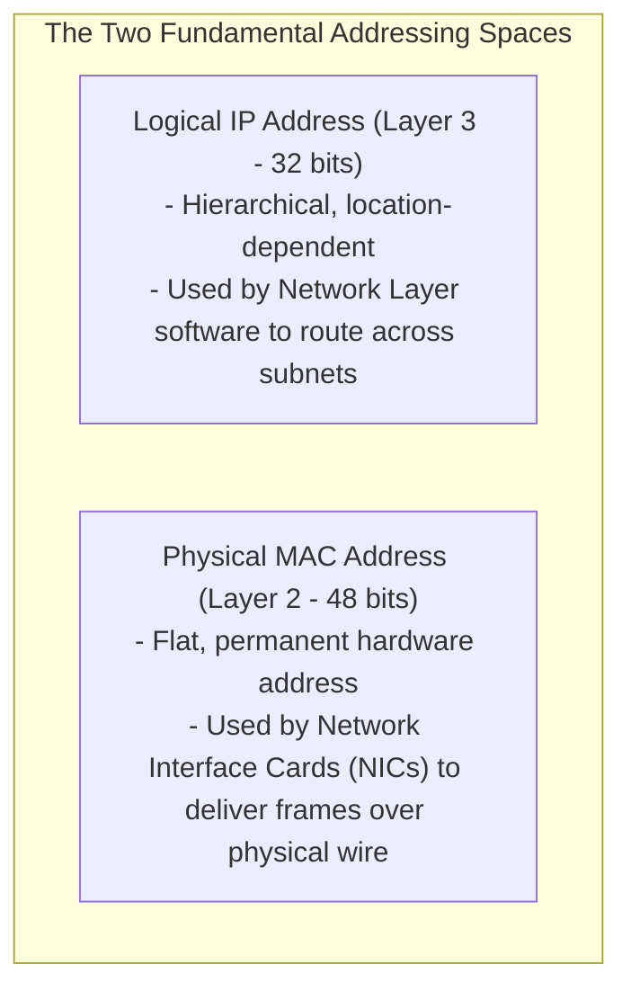

When an application wants to send data to an IP address, the network layer creates an IP packet. However, to transmit that packet across an Ethernet or Wi-Fi local network, the Data Link Layer must encapsulate the packet into a frame containing the **Destination MAC Address**. 

Because a host cannot guess a remote machine's hardware MAC address from its logical IP address, a dynamic translation mechanism is mandatory. This is the role of the **Address Resolution Protocol (ARP - RFC 826)**.

---

## 3.2 Detailed ARP Message Format (RFC 826 Header Layout)

ARP packets are encapsulated directly inside Layer 2 frames (EtherType **`0x0806`**).

```
 0                   1                   2                   3
 0 1 2 3 4 5 6 7 8 9 0 1 2 3 4 5 6 7 8 9 0 1 2 3 4 5 6 7 8 9 0 1
+-+-+-+-+-+-+-+-+-+-+-+-+-+-+-+-+-+-+-+-+-+-+-+-+-+-+-+-+-+-+-+-+
|          Hardware Type        |          Protocol Type        |
+-+-+-+-+-+-+-+-+-+-+-+-+-+-+-+-+-+-+-+-+-+-+-+-+-+-+-+-+-+-+-+-+
|  Hardware Len |  Protocol Len |          Operation Code       |
+-+-+-+-+-+-+-+-+-+-+-+-+-+-+-+-+-+-+-+-+-+-+-+-+-+-+-+-+-+-+-+-+
|                  Sender Hardware Address (Bytes 0 - 3)        |
+-+-+-+-+-+-+-+-+-+-+-+-+-+-+-+-+-+-+-+-+-+-+-+-+-+-+-+-+-+-+-+-+
|  Sender Hardware Addr (4 - 5) |  Sender Protocol Addr (0 - 1) |
+-+-+-+-+-+-+-+-+-+-+-+-+-+-+-+-+-+-+-+-+-+-+-+-+-+-+-+-+-+-+-+-+
|  Sender Protocol Addr (2 - 3) |  Target Hardware Addr (0 - 1) |
+-+-+-+-+-+-+-+-+-+-+-+-+-+-+-+-+-+-+-+-+-+-+-+-+-+-+-+-+-+-+-+-+
|                  Target Hardware Address (Bytes 2 - 5)        |
+-+-+-+-+-+-+-+-+-+-+-+-+-+-+-+-+-+-+-+-+-+-+-+-+-+-+-+-+-+-+-+-+
|                  Target Protocol Address (Bytes 0 - 3)        |
+-+-+-+-+-+-+-+-+-+-+-+-+-+-+-+-+-+-+-+-+-+-+-+-+-+-+-+-+-+-+-+-+
```

### Field Breakdown:
1. **Hardware Type (HTYPE, 16 bits)**: Specifies the physical link network protocol (`1` for 10/100/1000 Mbps Ethernet).
2. **Protocol Type (PTYPE, 16 bits)**: Specifies the higher-layer networking protocol being resolved (`0x0800` for IPv4).
3. **Hardware Address Length (HLEN, 8 bits)**: Size of the physical hardware address in bytes (`6` for 48-bit MAC).
4. **Protocol Address Length (PLEN, 8 bits)**: Size of the logical protocol address in bytes (`4` for 32-bit IPv4).
5. **Operation Code (OPER, 16 bits)**:
   - `1` = **ARP Request**
   - `2` = **ARP Reply**
   - `3` = **RARP Request**
   - `4` = **RARP Reply**
6. **Sender Hardware Address (SHA, 48 bits / 6 bytes)**: Physical MAC address of the device initiating the ARP message.
7. **Sender Protocol Address (SPA, 32 bits / 4 bytes)**: Logical IPv4 address of the sender.
8. **Target Hardware Address (THA, 48 bits / 6 bytes)**: Physical MAC address of the target destination. In an ARP Request, this field is set to all zeroes (`00:00:00:00:00:00`) because it is the unknown value being sought.
9. **Target Protocol Address (TPA, 32 bits / 4 bytes)**: Logical IPv4 address of the target host being resolved.

---

## 3.3 The ARP Resolution Cycle: Broadcast Request & Unicast Reply

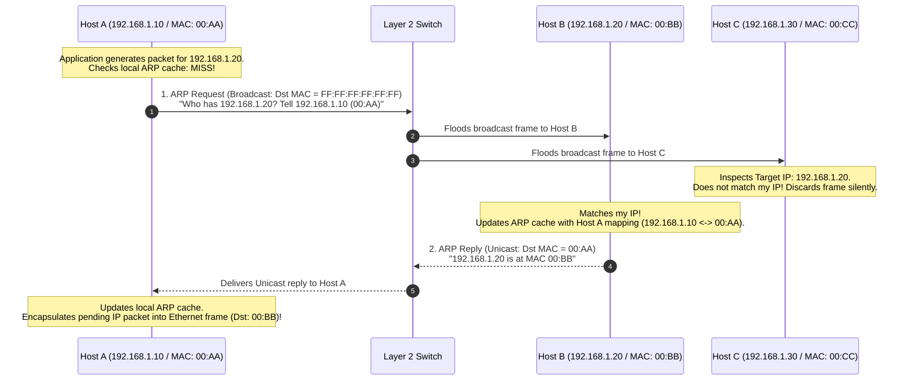

### The Two Steps Explained:
1. **ARP Request (Broadcast)**:
   - Host A needs to resolve IP `192.168.1.20`.
   - It sets `Target MAC = 00:00:00:00:00:00` and encapsulates the ARP packet in an Ethernet frame with **Destination MAC = `FF:FF:FF:FF:FF:FF` (Broadcast)**.
   - The Layer 2 switch floods the frame out all ports.
   - All hosts receive and parse the packet. Non-target machines discard it with zero processing overhead.
2. **ARP Reply (Unicast)**:
   - Host B sees its own IP in the Target Protocol Address field.
   - Before replying, Host B inserts Host A's mapping (`192.168.1.10` $\longleftrightarrow$ `00:AA:AA:AA:AA:AA`) into its own local ARP cache, anticipating that communication will be bidirectional.
   - Host B constructs an ARP Reply with `Opcode = 2`, setting `Target MAC = 00:AA:AA:AA:AA:AA`.
   - The reply is transmitted as a **Unicast frame** directly to Host A.

---

## 3.4 ARP Cache Table Architecture, Aging Timers, and Cache Poisoning

To prevent flooding the local network with ARP broadcast requests every time a packet is transmitted, every host maintains an in-memory **ARP Cache Table**:

```
Internet Address      Physical Address      Type
192.168.1.1           00-0c-29-3e-5a-11     dynamic
192.168.1.20          00-aa-bb-cc-dd-ee     dynamic
192.168.1.254         00-50-56-c0-00-08     static
```

- **Dynamic Entries**: Automatically populated via ARP replies. Each entry has an **Aging Timer** (typically 10 to 20 minutes in Windows/Linux). If an entry is not refreshed before the timer expires, it is purged to account for changed NICs or IP reassignments.
- **Static Entries**: Manually configured by an administrator; permanent and never expire.

### ARP Spoofing / Cache Poisoning Attack
Because standard ARP has no authentication mechanisms, any device can transmit an unsolicited ARP Reply. A malicious attacker can transmit fake ARP replies to a victim claiming: *"I am the Default Gateway (192.168.1.1), my MAC is [Attacker MAC]"*. The victim overwrites its ARP cache and directs all outbound Internet traffic to the attacker (**Man-in-the-Middle Attack**).
- *Mitigation*: **Dynamic ARP Inspection (DAI)** on enterprise managed switches validates ARP packets against a trusted DHCP Snooping binding database.

---

## 3.5 Specialized Variants: Gratuitous ARP and Proxy ARP

### 1. Gratuitous ARP
A host transmits an ARP Request where the **Sender IP and Target IP are identical** (the host queries its own IP address).
- **IP Conflict Detection**: During system boot, the host broadcasts a Gratuitous ARP for its newly configured IP. If any other machine replies, an IP conflict exists, prompting an error message and halting network configuration.
- **Updating Neighboring Caches**: When a network interface card is replaced or a cluster node fails over, a Gratuitous ARP updates the MAC tables of all neighboring switches and the ARP caches of neighboring hosts instantly.

### 2. Proxy ARP (RFC 1027)
A router intercepts an ARP Request from a local host looking for a remote host on another subnet. Instead of dropping the request, the router responds with **its own physical MAC address**, effectively acting as a proxy. The sending host transmits frames to the router, which unpacks the Layer 3 packet and forwards it toward the destination.

---

## 3.6 Complete ARP Protocol Flowchart

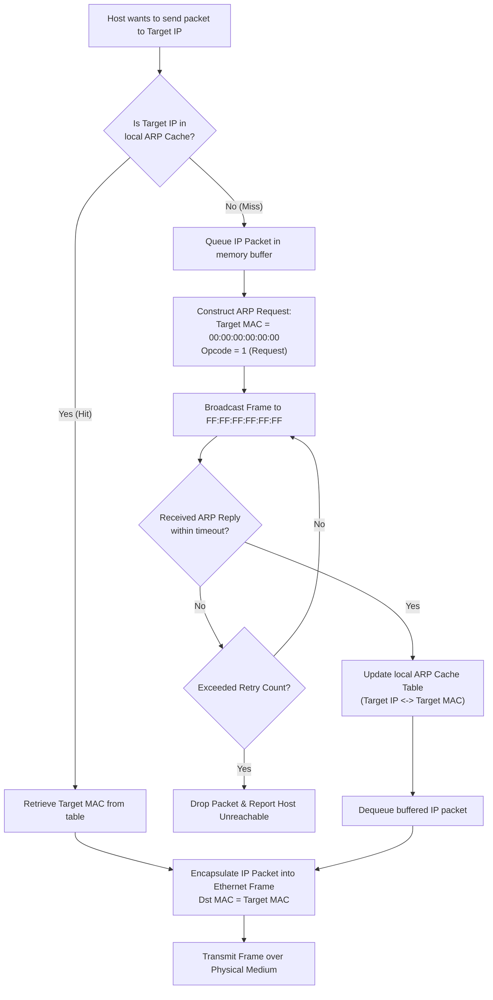

---

# Question 4: Reverse Address Resolution Protocol (RARP)

## 4.1 Historical Context: The Diskless Workstation Bootstrap Problem

During the early computing era of the 1980s, computer hardware was exceptionally costly. To minimize capital expenditures and improve centralized security in academic and corporate environments, organizations deployed **Diskless Workstations** (terminals without internal hard drives or persistent non-volatile storage).

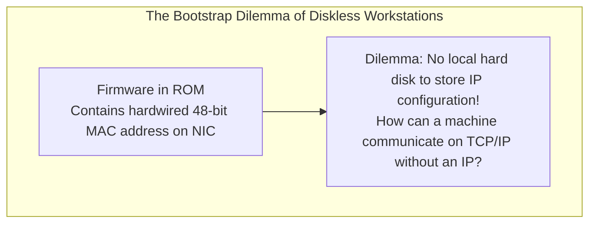

When a diskless workstation powered on, its bootstrap code in Read-Only Memory (ROM) could access its burned-in **48-bit Physical MAC Address** from the Network Interface Card. However, it had no persistent storage from which to read its **32-bit Logical IP Address**.

The machine needed a mechanism to query a central network server using its known physical MAC address to discover its assigned logical IP address. This led the IETF to standardize the **Reverse Address Resolution Protocol (RARP - RFC 903)** in 1984.

---

## 4.2 RARP Protocol Mechanics & Packet Structure (RFC 903)

RARP was designed as an extension of ARP, reusing the identical 28-byte packet structure:

```
 0                   1                   2                   3
 0 1 2 3 4 5 6 7 8 9 0 1 2 3 4 5 6 7 8 9 0 1 2 3 4 5 6 7 8 9 0 1
+-+-+-+-+-+-+-+-+-+-+-+-+-+-+-+-+-+-+-+-+-+-+-+-+-+-+-+-+-+-+-+-+
|          Hardware Type (1)    |          Protocol Type (0x0800)|
+-+-+-+-+-+-+-+-+-+-+-+-+-+-+-+-+-+-+-+-+-+-+-+-+-+-+-+-+-+-+-+-+
|  Hardware Len (6) | Protocol Len(4)|     Opcode (3 = RARP Req) |
+-+-+-+-+-+-+-+-+-+-+-+-+-+-+-+-+-+-+-+-+-+-+-+-+-+-+-+-+-+-+-+-+
|                  Sender Hardware Address (Client MAC)         |
+-+-+-+-+-+-+-+-+-+-+-+-+-+-+-+-+-+-+-+-+-+-+-+-+-+-+-+-+-+-+-+-+
|  Sender Hardware Addr (cont)  |  Sender IP Addr (0.0.0.0)     |
+-+-+-+-+-+-+-+-+-+-+-+-+-+-+-+-+-+-+-+-+-+-+-+-+-+-+-+-+-+-+-+-+
|  Sender IP Addr (cont)        |  Target Hardware Addr (Client)|
+-+-+-+-+-+-+-+-+-+-+-+-+-+-+-+-+-+-+-+-+-+-+-+-+-+-+-+-+-+-+-+-+
|                  Target Hardware Address (cont)               |
+-+-+-+-+-+-+-+-+-+-+-+-+-+-+-+-+-+-+-+-+-+-+-+-+-+-+-+-+-+-+-+-+
|                  Target Protocol Address (Assigned IP - Reply)|
+-+-+-+-+-+-+-+-+-+-+-+-+-+-+-+-+-+-+-+-+-+-+-+-+-+-+-+-+-+-+-+-+
```

### The Key Differences from Standard ARP:
1. **Ethernet Frame Type**: Standard ARP uses EtherType `0x0806`, while RARP frames use a dedicated EtherType: **`0x8035`**.
2. **Operation Codes (OPER)**:
   - `3` = **RARP Request**
   - `4` = **RARP Reply**
3. **Field Configuration in Request**:
   - The client sets both the **Sender Hardware Address (SHA)** and **Target Hardware Address (THA)** to its own burned-in physical MAC address.
   - The client sets the **Sender Protocol Address (SPA)** and **Target Protocol Address (TPA)** to zeroes (`0.0.0.0`), as its IP address is unknown.

---

## 4.3 Operational Workflow: Broadcast Request and Unicast Reply

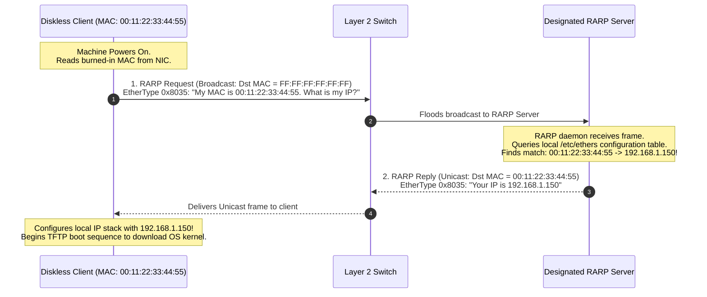

### Operational Steps:
1. Upon boot, the client constructs a RARP Request (`Opcode = 3`), inserts its physical MAC address into the payload, and encapsulates it in an Ethernet frame addressed to `FF:FF:FF:FF:FF:FF`.
2. The broadcast reaches all devices on the local segment. Regular workstations ignore the `0x8035` frame.
3. A central **RARP Server** running a background daemon intercepts the request and consults an internal mapping database (e.g., `/etc/ethers` on UNIX).
4. Upon locating the client's MAC address, the server fills in the client's assigned IP address into the **Target Protocol Address** field, changes the Opcode to `4` (RARP Reply), and unicasts the frame directly back to the client's MAC address.

---

## 4.4 Architectural Flaws and Reasons for Deprecation

Although RARP successfully solved the initial diskless workstation dilemma, it suffered from severe architectural limitations:

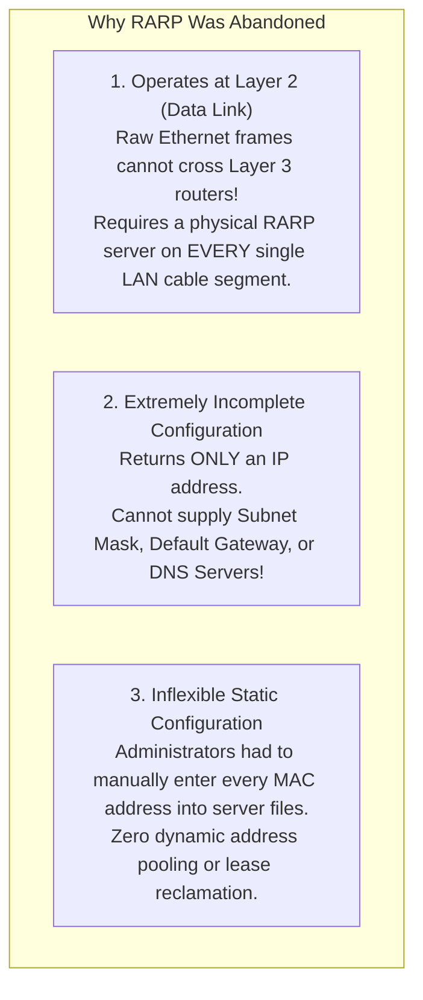

1. **Non-Routable (Layer 2 Confinement)**: Because RARP operates directly over raw Ethernet frames without an IP header, routers block RARP broadcasts. A multi-subnet enterprise network had to deploy and maintain an expensive physical RARP server on **every individual subnet**.
2. **Incomplete Network Parameters**: An IP address alone is insufficient for modern internetworking. RARP could not deliver:
   - The **Subnet Mask** (making subnetting impossible).
   - The **Default Gateway** (confining the client to the local LAN segment).
   - **DNS Server Addresses** (disabling domain name resolution).
3. **Static Allocation Burden**: RARP provided zero dynamic address pooling; an administrator had to manually pre-bind every MAC address to a fixed IP in server configuration files.

---

## 4.5 Evolutionary Replacement: From RARP to BOOTP to DHCP

To overcome RARP's fatal limitations, the IETF developed two successive generations of host configuration protocols:

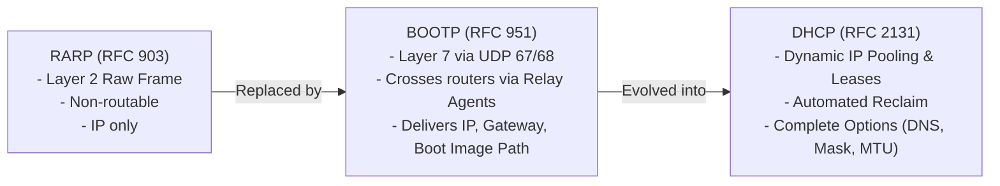

1. **Bootstrap Protocol (BOOTP - RFC 951)**: Moved configuration up to the **Application Layer**, running over standard **UDP Ports 67 and 68**. Because BOOTP packets are encapsulated inside IP datagrams, routers equipped with **BOOTP Relay Agents** could forward client requests across subnets to a single centralized server. Furthermore, BOOTP delivered the default gateway and TFTP boot filename.
2. **Dynamic Host Configuration Protocol (DHCP - RFC 2131)**: Built directly upon the BOOTP message format, adding **dynamic address pooling**, **temporary lease times**, and extensible **Option fields** (DNS, subnet mask, domain name).

---

## 4.6 Master Comparison Matrix: ARP vs. RARP vs. BOOTP vs. DHCP

| Feature | ARP | RARP | BOOTP | DHCP |
| :--- | :--- | :--- | :--- | :--- |
| **Primary Query** | "I know IP, what is MAC?" | "I know MAC, what is IP?" | "Configure my host!" | "Lease me an IP configuration!"|
| **OSI Operating Layer** | Data Link / Network Interface | Data Link (Layer 2) | Application Layer (Layer 7) | Application Layer (Layer 7) |
| **Encapsulation** | Raw Frame (EtherType `0x0806`)| Raw Frame (EtherType `0x8035`)| UDP Ports 67 & 68 | UDP Ports 67 & 68 |
| **Router Traversal** | Blocked (Local Subnet Only)| Blocked (Local Subnet Only)| Routed via BOOTP Relay | Routed via DHCP Relay (`ip helper`)|
| **Configuration Scope** | Dynamic MAC resolution | IP Address Only | IP, Gateway, Bootfile | IP, Mask, Gateway, DNS, MTU, Lease|
| **Address Allocation** | N/A (Address Discovery) | Static Manual File Mapping | Static Manual Binding | Dynamic, Automatic, and Static |
| **Address Reclamation**| N/A | No (Permanent) | No (Permanent) | Yes (Lease Timers $T_1, T_2$, Exp)|
| **Operational Status** | Active (Standard Internet) | **DEPRECATED & OBSOLETE** | Legacy (Superseded by DHCP)| **Current Universal Standard** |

---

# Question 5: Error Detection and Correction

## 5.1 Physics of Transmission Errors: Single-Bit vs. Burst Errors

During transmission across physical media (copper wires, fiber-optic glass, wireless air), electromagnetic signals are distorted by thermal noise, lightning surges, cross-talk from adjacent cables, and multipath fading. These physical impairments alter signal voltage levels, causing the receiver to interpret transmitted bits incorrectly.

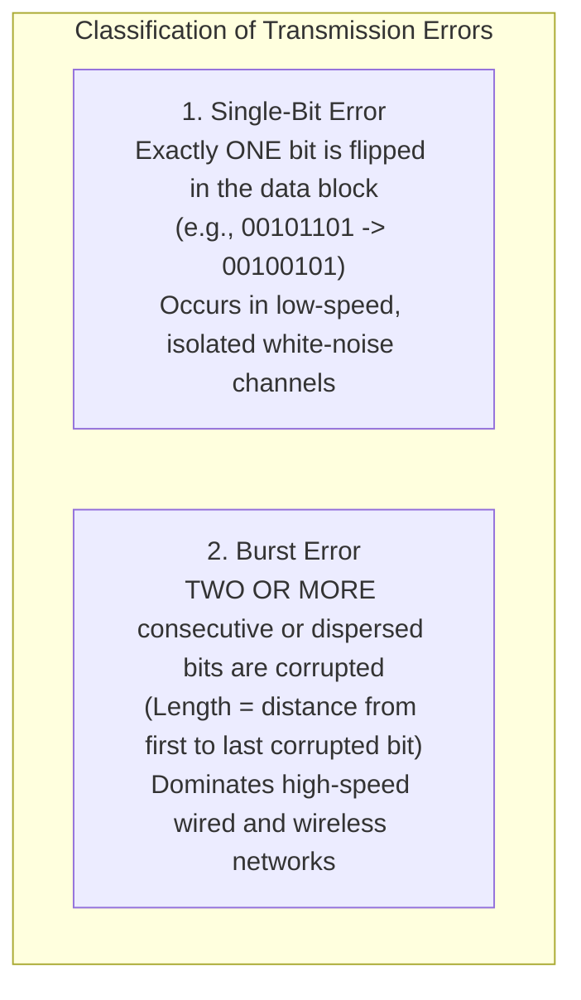

- **Single-Bit Errors**: Rare in high-speed digital communications because physical noise bursts typically endure for durations far longer than a single bit interval ($T_b = 1/R$).
- **Burst Errors**: If a noise spike lasts for $1\text{ millisecond}$ ($0.001\text{ s}$) on a $1\text{ Gbps}$ Gigabit Ethernet link, the number of corrupted bits is:
  $$\text{Corrupted Bits} = 10^9 \text{ bps} \times 0.001 \text{ s} = \mathbf{1,000,000 \text{ consecutive bits!}}$$
  Consequently, real-world error control mechanisms must be engineered to detect large burst errors rather than isolated single-bit errors.

---

## 5.2 Redundancy Principles and Hamming Distance

The foundational concept underlying all error detection and correction is **Redundancy**: appending additional, carefully calculated control bits ($r$) to the original data payload ($m$) before transmission.

```
Transmitted Codeword (n bits) = [ Data Bits: m ] + [ Redundant Check Bits: r ]
```

### 1. Hamming Distance $d(x, y)$
Formulated by Richard Hamming, the **Hamming Distance** between two binary codewords of equal length is the **number of bit positions in which the corresponding bits differ**.
- Mathematically calculated by executing a bitwise XOR ($\oplus$) between the two words and counting the number of `1`s (the Hamming weight):
  $$x = 10\mathbf{1}0\mathbf{1}, \quad y = 10\mathbf{0}0\mathbf{0} \implies x \oplus y = 00101 \implies d(x, y) = \mathbf{2}$$

### 2. Minimum Hamming Distance ($d_{\text{min}}$) and Detection/Correction Bounds
The **Minimum Hamming Distance ($d_{\text{min}}$)** of a coding system is the smallest Hamming distance between any pair of valid valid codewords in the codebook.

#### Mathematical Detection Bound:
To guarantee the detection of up to $s$ bit errors across a block:
$$\mathbf{d_{\text{min}} \ge s + 1}$$
*Intuition*: If codewords are separated by at least $s + 1$ bits, changing any $s$ bits will produce an invalid codeword that cannot be mistaken for another valid codeword.

#### Mathematical Correction Bound:
To guarantee the automatic correction of up to $t$ bit errors:
$$\mathbf{d_{\text{min}} \ge 2t + 1}$$
*Intuition*: If two valid codewords are separated by at least $2t + 1$ bits, a corrupted codeword with up to $t$ errors will still be geometrically closer to the original valid codeword than to any other valid codeword, enabling unambiguous identification and correction.

---

## 5.3 Parity Checks: Simple (1D) vs. Two-Dimensional Longitudinal (2D)

### 1. Simple Parity (One-Dimensional)
- Appends a single redundant bit to a block of data bits so that the total count of `1`s is either **Even** (Even Parity) or **Odd** (Odd Parity).
  - *Example (Even Parity)*: Data $= 1011001$ (contains four `1`s). Parity bit $= 0 \implies \text{Codeword} = 1011001\mathbf{0}$.
  - *Example (Even Parity)*: Data $= 1011011$ (contains five `1`s). Parity bit $= 1 \implies \text{Codeword} = 1011011\mathbf{1}$.
- **Performance**:
  - $d_{\text{min}} = 2$.
  - Detects **all single-bit errors** and any **odd number of bit errors**.
  - **Fails completely** if an even number of bits ($2, 4, 6, \dots$) flip simultaneously (50% failure rate against random noise). Zero error correction capability.

---

### 2. Two-Dimensional Parity (LRC / VRC)
Organizes data bits into a rectangular two-dimensional matrix of $m$ rows and $k$ columns:

```mermaid
flowchart TD
    subgraph TwoDimParityMatrix["Two-Dimensional (2D) Parity Generation"]
        direction TB
        R1["Row 1:  1  0  1  1  0  0  1  | Row Parity: 0"]
        R2["Row 2:  0  1  1  0  1  0  1  | Row Parity: 1"]
        R3["Row 3:  1  1  0  1  0  1  0  | Row Parity: 0"]
        R4["Row 4:  0  0  1  0  1  1  0  | Row Parity: 1"]
        
        COL_PAR["Col Par: 0  0  1  0  0  0  0  | Corner Par: 0"]
        
        R1 --- R2 --- R3 --- R4 --- COL_PAR
    end
```

- **Row Parity (VRC - Vertical Redundancy Check)**: Computed for each individual row.
- **Column Parity (LRC - Longitudinal Redundancy Check)**: Computed down each individual column.
- **Performance**:
  - Dramatically improves detection: detects all 1-bit, 2-bit, and 3-bit errors, and most burst errors.
  - **Single-Bit Correction**: If a single bit flips anywhere in the matrix, it triggers a parity mismatch in exactly **one row** and **one column**. The intersection of that row and column pinpoints the exact corrupted bit, which the receiver flips to correct automatically!

---

## 5.4 Internet Checksum: 1's Complement Arithmetic

Used extensively in transport and network layers (IPv4, TCP, UDP), the **Internet Checksum** treats data as a sequence of 16-bit binary integers.

### Algorithm:
1. The sender divides the data unit into equal 16-bit words.
2. All 16-bit words are summed using **1's Complement Arithmetic** (any carry bit overflowing past the 16th bit is wrapped around and added back into the least significant bit).
3. The sender inverts (complements) the final sum bit-by-bit; this becomes the Checksum.
4. The receiver sums all incoming 16-bit words **plus the received checksum**. If the result is all `1`s (`0xFFFF`, which inverts to `0x0000`), the data is accepted as uncorrupted.

#### Concrete Numerical Example:
Suppose sender transmits two 8-bit numbers: `10011001` and `11100010`.
1. **Sum the numbers**:
   ```
     10011001
   + 11100010
   ----------
   1 01111011  (Overflow carry bit generated!)
   ```
2. **Wrap around carry**:
   $$01111011 + 1 = 01111100$$
3. **Invert to create Checksum**:
   $$\text{Checksum} = \sim(01111100) = \mathbf{10000011}$$
4. **Receiver Verification**:
   Receiver adds: `10011001` + `11100010` + `10000011` (checksum):
   $$\text{Sum} = 01111100 + 10000011 = \mathbf{11111111} \implies \text{Valid!}$$

---

## 5.5 Cyclic Redundancy Check (CRC): Modulo-2 Polynomial Division

The **Cyclic Redundancy Check (CRC)** is the most robust and widely deployed error-detection mechanism in data link protocols (Ethernet, Wi-Fi, HDLC). It is based on **binary polynomial division using Modulo-2 arithmetic** (XOR logic with no carries or borrows).

```mermaid
flowchart LR
    M_DATA["Data Message M(x)<br/>(k bits)"] --> APPEND["Append r Zeroes to Message:<br/>M(x) * 2^r"]
    APPEND --> DIVIDE["Modulo-2 Binary Division by<br/>Generator Polynomial G(x) of degree r"]
    DIVIDE --> REMAINDER["Remainder R(x) = CRC Checksum (r bits)"]
    REMAINDER --> TRANSMIT["Transmitted Frame T(x):<br/>[ Message M(x) ] + [ CRC Remainder R(x) ]"]
```

### Step-by-Step Mathematical Walkthrough
Let:
- Data Message $M = \mathbf{1010000}$ ($k = 7\text{ bits}$).
- Generator Polynomial $G(x) = x^3 + 1 \implies \text{Binary: } \mathbf{1001}$ ($r = 3\text{ bits}$).

#### 1. Append $r = 3$ Zeroes to $M$:
$$M \times 2^3 = \mathbf{1010000000}$$

#### 2. Modulo-2 Binary Division ($1010000000 \div 1001$):
*(Remember: Subtraction in Modulo-2 is identical to XOR)*:
```
           1011011  (Quotient)
     -------------
1001 ) 1010000000
       1001
       ----
        0110
        0000
        ----
         1100
         1001
         ----
          1010
          1001
          ----
           0110
           0000
           ----
            1100
            1001
            ----
             1010
             1001
             ----
              011  <-- Remainder R = 011 (CRC Checksum)
```

#### 3. Construct Transmitted Frame $T$:
$$T = \text{Data} + \text{Remainder} = 1010000\mathbf{011}$$

#### 4. Receiver Verification:
The receiver divides the incoming frame $T = 1010000011$ by $G = 1001$. Because the remainder was added, the division yields a **remainder of exactly $000$**, confirming zero transmission errors!

### Standard CRC Polynomials:
- **CRC-8**: $x^8 + x^2 + x + 1$ (ATM headers)
- **CRC-16**: $x^{16} + x^{15} + x^2 + 1$ (Modbus, USB)
- **CRC-32 (IEEE 802.3 Ethernet)**:
  $$G(x) = x^{32} + x^{26} + x^{23} + x^{22} + x^{16} + x^{12} + x^{11} + x^{10} + x^8 + x^7 + x^5 + x^4 + x^2 + x + 1$$
- **Error Detection Capability of CRC**: Detects **100% of single-bit errors**, **100% of double errors**, **100% of all odd numbers of errors**, and **100% of burst errors of length $\le r$ bits**.

---

## 5.6 Error Correction: Hamming Code Numerical Trace

The **Hamming Code** is a Forward Error Correction (FEC) scheme that automatically detects and corrects single-bit errors without requiring retransmissions.

### 1. The Redundancy Inequality Rule
To encode $m$ data bits with $r$ parity bits, $r$ must satisfy:
$$\mathbf{2^r \ge m + r + 1}$$
*Example*: For $m = 4$ data bits:
- Try $r = 2 \implies 2^2 = 4 < 4 + 2 + 1 = 7$ (False).
- Try $r = 3 \implies 2^3 = 8 \ge 4 + 3 + 1 = 8$ (True! $\implies r = 3$ parity bits required).
- Total codeword length $n = m + r = 4 + 3 = \mathbf{7\text{ bits}}$ (the **Hamming (7, 4) Code**).

---

### 2. Bit Position Layout Rule
Parity bits $P_1, P_2, P_4, \dots$ occupy positions that are **powers of 2** ($1, 2, 4, 8, \dots$). Data bits $D_3, D_5, D_6, D_7$ occupy the remaining positions:

```
Bit Position:    1    2    3    4    5    6    7
Bit Assignment: P1   P2   D3   P4   D5   D6   D7
Binary Index:  001  010  011  100  101  110  111
```

Each parity bit covers all bit positions whose binary representation has a `1` in that parity bit's power-of-2 index position:
- **$P_1$ (checks bit 1 of binary index)**: Covers positions $1, 3, 5, 7$ (binary: $00\mathbf{1}, 01\mathbf{1}, 10\mathbf{1}, 11\mathbf{1}$).
- **$P_2$ (checks bit 2 of binary index)**: Covers positions $2, 3, 6, 7$ (binary: $0\mathbf{1}0, 0\mathbf{1}1, 1\mathbf{1}0, 1\mathbf{1}1$).
- **$P_4$ (checks bit 3 of binary index)**: Covers positions $4, 5, 6, 7$ (binary: $\mathbf{1}00, \mathbf{1}01, \mathbf{1}10, \mathbf{1}11$).

---

### 3. Step-by-Step Encoding Walkthrough
Encode the 4-bit data: **`1011`** ($D_3=1, D_5=0, D_6=1, D_7=1$) using Even Parity:
1. **Calculate $P_1$** (covers $1, 3, 5, 7$):
   $$P_1 \oplus D_3 \oplus D_5 \oplus D_7 = 0 \implies P_1 \oplus 1 \oplus 0 \oplus 1 = 0 \implies P_1 \oplus 0 = 0 \implies \mathbf{P_1 = 0}$$
2. **Calculate $P_2$** (covers $2, 3, 6, 7$):
   $$P_2 \oplus D_3 \oplus D_6 \oplus D_7 = 0 \implies P_2 \oplus 1 \oplus 1 \oplus 1 = 0 \implies P_2 \oplus 1 = 0 \implies \mathbf{P_2 = 1}$$
3. **Calculate $P_4$** (covers $4, 5, 6, 7$):
   $$P_4 \oplus D_5 \oplus D_6 \oplus D_7 = 0 \implies P_4 \oplus 0 \oplus 1 \oplus 1 = 0 \implies P_4 \oplus 0 = 0 \implies \mathbf{P_4 = 0}$$

$$\text{Transmitted 7-bit Codeword: } \mathbf{0110011} \quad (P_1=0, P_2=1, D_3=1, P_4=0, D_5=0, D_6=1, D_7=1)$$

---

### 4. Error Injection and Syndrome Correction Walkthrough
Suppose transmission noise **flips Bit 5** ($0 \to 1$) in transit:
$$\text{Received Codeword: } \mathbf{0110111} \quad (\text{Bit 5 is inverted})$$

The receiver calculates the **Syndrome Bits ($C_4 C_2 C_1$)**:
- **$C_1$** (checks positions $1, 3, 5, 7$):
  $$C_1 = \text{Bit } 1 \oplus \text{Bit } 3 \oplus \text{Bit } 5 \oplus \text{Bit } 7 = 0 \oplus 1 \oplus 1 \oplus 1 = \mathbf{1}$$
- **$C_2$** (checks positions $2, 3, 6, 7$):
  $$C_2 = \text{Bit } 2 \oplus \text{Bit } 3 \oplus \text{Bit } 6 \oplus \text{Bit } 7 = 1 \oplus 1 \oplus 1 \oplus 1 = \mathbf{0}$$
- **$C_4$** (checks positions $4, 5, 6, 7$):
  $$C_4 = \text{Bit } 4 \oplus \text{Bit } 5 \oplus \text{Bit } 6 \oplus \text{Bit } 7 = 0 \oplus 1 \oplus 1 \oplus 1 = \mathbf{1}$$

Combine the syndrome bits in reverse order:
$$\text{Syndrome} = C_4 C_2 C_1 = \mathbf{101}_2 = \mathbf{5}_{10}$$
The syndrome value **$5$** mathematically pinpoints that **Bit 5 is corrupted**!  
The receiver flips Bit 5 ($1 \to 0$), restoring the original undamaged codeword: `0110011` without requiring a retransmission.

---

## 5.7 Master Comparison Matrix of Error Detection and Correction Techniques

| Parameter | Simple Parity (1D) | 2D Parity (LRC/VRC) | Internet Checksum | Cyclic Redundancy Check (CRC) | Hamming Code (FEC) |
| :--- | :--- | :--- | :--- | :--- | :--- |
| **Primary Function** | Error Detection | Error Detection & 1-bit Correction | Error Detection | Error Detection | Error Correction & Detection |
| **Underlying Math** | Modulo-2 Bit Summation | Matrix Row & Column XOR | 1's Complement Arithmetic | Modulo-2 Polynomial Division | Linear Block Parity Equations |
| **Single-Bit Detection**| 100% | 100% | 100% | 100% | 100% |
| **Burst Error Detection**| Extremely Poor | Good (up to matrix size) | Moderate | **Outstanding (100% $\le r$ bits)**| Limited to single bit |
| **Correction Capability**| None (0 bits) | Exactly 1 bit (at intersection) | None (0 bits) | None (delegated to ARQ) | **Guaranteed 1 bit ($2^r \ge m+r+1$)**|
| **Redundancy Overhead** | Minimal (1 bit per block) | Moderate ($m + k + 1$ bits) | Low (16 bits per packet) | Low ($r$ bits: 16 or 32 bits) | High ($r$ bits: $\approx \log_2 m$)|
| **Implementation** | Trivial XOR logic | Buffer array memory | Software CPU loops | High-speed hardware shift registers| Hardware matrix decoders |
| **Standard Usage** | Character ASCII, UART | Magnetic tape, serial links | IPv4, TCP, UDP headers | Ethernet (802.3), Wi-Fi, HDLC | ECC Computer RAM, Satellite Links |
