# Computer Networks (21CS302) — Unit 3 Long Questions & Comprehensive Answers
### Master Study Guide for 16-Mark University Examinations (Network Layer & Routing)

---

## Table of Contents
1. [Question 1: Duties of the Network Layer](#question-1-duties-of-the-network-layer)
   - 1.1 Architectural Placement and Fundamental Role
   - 1.2 Comprehensive Breakdown of Network Layer Duties
   - 1.3 Internal Router Architecture and Forwarding Mechanics
   - 1.4 Packet Fragmentation and Reassembly Process
   - 1.5 Master Summary Matrix of Network Layer Responsibilities
2. [Question 2: Different Address Classes (Classful Addressing: Class A, B, C, D, E)](#question-2-different-address-classes-classful-addressing-class-a-b-c-d-e)
   - 2.1 Introduction to IPv4 Addressing & Historical Context
   - 2.2 Binary Structural Rules & Identification Mechanisms
   - 2.3 Comprehensive Analysis of Classes A, B, C, D, and E
   - 2.4 Special, Reserved, and Private IP Address Blocks
   - 2.5 Inefficiencies of Classful Addressing & Evolution to CIDR
   - 2.6 Master Comparison Matrix of IPv4 Address Classes
3. [Question 3: Routing Techniques (Distance Vector, Link State, Spanning Tree)](#question-3-routing-techniques-distance-vector-link-state-spanning-tree)
   - 3.1 Introduction to Routing Concepts & Graph Abstraction
   - 3.2 Distance Vector Routing (Bellman-Ford Algorithm & Count-to-Infinity)
   - 3.3 Link State Routing (Dijkstra's Algorithm & Reliable Flooding)
   - 3.4 Spanning Tree Protocol (IEEE 802.1D Bridge Loop Prevention)
   - 3.5 Master Comparison Matrix: Distance Vector vs. Link State vs. Spanning Tree
4. [Question 4: Carrier Sense Multiple Access with Collision Avoidance (CSMA/CA)](#question-4-carrier-sense-multiple-access-with-collision-avoidance-csmaca)
   - 4.1 The Wireless Dilemma: Why CSMA/CD Fails in Wireless Networks
   - 4.2 The Hidden Terminal and Exposed Terminal Problems
   - 4.3 CSMA/CA Operational Pillars: IFS, Backoff, and ACK
   - 4.4 The 4-Way Handshake: RTS/CTS and Virtual Carrier Sensing (NAV)
   - 4.5 Complete CSMA/CA Protocol Execution Flowchart & State Logic
   - 4.6 Comprehensive Comparison Matrix: CSMA/CD vs. CSMA/CA
5. [Question 5: Internet Protocol Version 4 (IPv4)](#question-5-internet-protocol-version-4-ipv4)
   - 5.1 Design Philosophy, Service Model, and Addressing
   - 5.2 Exhaustive IPv4 Datagram Header Format (Bit-by-Bit Field Breakdown)
   - 5.3 Mathematical Fragmentation & Reassembly Walkthrough
   - 5.4 Subnetting, Supernetting, and CIDR Hierarchy
   - 5.5 Limitations of IPv4 and Architectural Comparison with IPv6
6. [Question 6: Routing Protocols: OSPF, RIP, and BGP](#question-6-routing-protocols-ospf-rip-and-bgp)
   - 6.1 Autonomous Systems and Routing Protocol Taxonomy
   - 6.2 Routing Information Protocol (RIP): Hop Count & Bellman-Ford
   - 6.3 Open Shortest Path First (OSPF): Hierarchical Areas, LSAs & Dijkstra
   - 6.4 Border Gateway Protocol (BGP-4): Path Vector, AS-PATH & Internet Core
   - 6.5 Master Routing Protocol Comparison Matrix (RIP vs. OSPF vs. BGP)
7. [Question 7: Dynamic Host Configuration Protocol (DHCP)](#question-7-dynamic-host-configuration-protocol-dhcp)
   - 7.1 Introduction, Historical Evolution (RARP to BOOTP to DHCP), and Motivation
   - 7.2 Three Address Allocation Mechanisms & Configuration Parameters
   - 7.3 Detailed DHCP Message Format (RFC 2131 Header Layout)
   - 7.4 The 4-Step DORA Exchange Protocol Lifecycle
   - 7.5 Lease Renewal Timers (T1, T2, Expiration) and State Machine
   - 7.6 Cross-Subnet DHCP Relay Agent Architecture
   - 7.7 Security Threats & Mitigations (DHCP Starvation and Rogue Servers)
   - 7.8 Master Comparison Matrix: RARP vs. BOOTP vs. DHCP
8. [Question 8: Congestion Control Algorithms](#question-8-congestion-control-algorithms)
   - 8.1 Network Congestion Principles & The Congestion Collapse Curve
   - 8.2 General Taxonomy: Open-Loop (Preventative) vs. Closed-Loop (Reactive)
   - 8.3 Traffic Shaping (Open-Loop): The Leaky Bucket Algorithm
   - 8.4 Traffic Shaping (Open-Loop): The Token Bucket Algorithm & Mathematical Proof
   - 8.5 Closed-Loop Congestion Control: Backpressure, Choke Packets, and ECN
   - 8.6 Master Comparison Matrix of Congestion Control Techniques

---

# Question 1: Duties of the Network Layer

## 1.1 Architectural Placement and Fundamental Role

The **Network Layer** sits at Layer 3 of the ISO-OSI 7-layer reference model and corresponds directly to the Internet Layer of the TCP/IP architecture. Its primary objective is to facilitate **end-to-end, host-to-host delivery** of individual packets across multiple independent, heterogeneous intermediate networks (subnets).

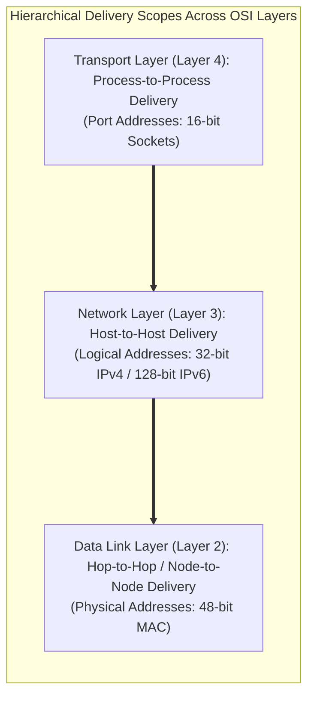

### The Fundamental Distinction: Hop-to-Hop vs. Host-to-Host
- The **Data Link Layer** is responsible only for delivering frames between two physically adjacent devices connected to the same physical medium (e.g., from Workstation A to Switch 1, or Router 1 to Router 2). It has no awareness of the overall network topology beyond the local link.
- The **Network Layer** oversees the complete transmission trajectory from the original source host to the ultimate destination host. It selects multi-hop paths, handles intermediate protocol and MTU differences, and ensures packets reach networks thousands of miles away.

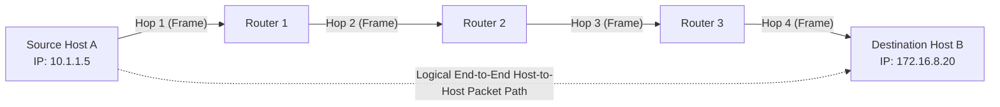

---

## 1.2 Comprehensive Breakdown of Network Layer Duties

The duties of the Network Layer can be organized into seven core responsibilities:

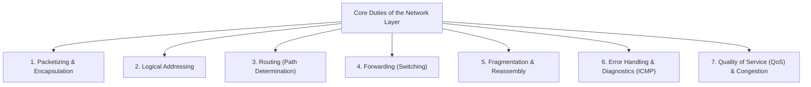

### Duty 1: Packetizing (Encapsulation and Decapsulation)
- **Source Host Encapsulation**: Accepts a Transport Layer segment (from TCP or UDP), prepends an IP header containing source/destination logical addresses, protocol identifiers, and lifecycle controls, and forms a **Network Datagram (Packet)**. The Network Layer does not inspect or alter upper-layer data.
- **Intermediate Router Inspection**: Intermediate routers strip the Layer 2 framing headers, examine the destination IP in the Layer 3 header to make forwarding decisions, decrement the Time-to-Live (TTL) field, recalculate the header checksum, and re-encapsulate the datagram into a new Layer 2 frame matching the next link's physical technology.
- **Destination Host Decapsulation**: The destination host strips the IP header, verifies the checksum, reassembles fragments if necessary, and passes the payload to the appropriate transport protocol based on the Protocol field (e.g., TCP = 6, UDP = 17).

---

### Duty 2: Logical Addressing (Hierarchical Address Spaces)
Physical MAC addresses are "flat"—burned permanently into network interface hardware with no geographical or topological structure. If global routing used MAC addresses, every core router on the Internet would need to maintain forwarding entries for billions of individual devices, causing routing table exhaustion.

The Network Layer implements **Hierarchical Logical Addressing** (IPv4 and IPv6):
- Addresses are split into a **Network Prefix (Network ID)** and a **Host Suffix (Host ID)**.
- Routers forward packets based solely on the Network Prefix. Intermediate transit routers do not need to know the specific identity of the destination machine; they only need to know how to reach the destination network. Only the final router connected to the target subnet uses the Host ID to deliver the frame locally via ARP.

---

### Duty 3: Routing (Global Path Determination)
Routing is the mathematical and algorithmic process of determining the optimal, lowest-cost end-to-end path through a mesh network of interconnected routers.
- The network is modeled as a weighted directed graph $G = (V, E)$, where vertices $V$ represent routers and edges $E$ represent physical links with assigned weights (cost, delay, bandwidth, hop count).
- Dynamic routing protocols (RIP, OSPF, BGP) exchange topological information and construct optimal paths using algorithms such as Dijkstra's Shortest Path First or Bellman-Ford.

---

### Duty 4: Forwarding (Local Switching Execution)
While **Routing** represents the control-plane process of building routing tables, **Forwarding** is the data-plane action of transferring an incoming packet from an input interface to the appropriate output interface within a router:
1. An incoming frame arrives at an input port and undergoes physical/data-link decapsulation.
2. The router extracts the destination IP address.
3. The router queries its **Forwarding Information Base (FIB)** using the **Longest Prefix Match (LPM)** algorithm.
4. The packet traverses the internal switching fabric to the designated output port.

---

### Duty 5: Fragmentation and Reassembly
Different data link layer technologies have physical limitations on the maximum frame payload they can transmit, termed the **Maximum Transmission Unit (MTU)**:
- Ethernet: $\text{MTU} = 1500\text{ bytes}$
- PPPoE: $\text{MTU} = 1492\text{ bytes}$
- FDDI: $\text{MTU} = 4352\text{ bytes}$
- Token Ring (16 Mbps): $\text{MTU} = 17800\text{ bytes}$

When a router receives a packet larger than the MTU of the outbound link, the Network Layer splits the datagram into smaller fragments, replicating control information and calculating byte offsets. Reassembly is performed at the final destination host to avoid burdening intermediate routers.

---

### Duty 6: Error Reporting and Network Diagnostics (ICMP)
IP is intentionally designed as an unreliable, connectionless, "best-effort" protocol. It does not provide built-in acknowledgments or flow control.

To handle operational errors, the Network Layer incorporates the **Internet Control Message Protocol (ICMPv4 / ICMPv6)**:
- **Destination Unreachable**: Generated when a router cannot find a route to the target network or host, or when a firewall blocks a port.
- **Time Exceeded (TTL = 0)**: Generated when a packet's Time-to-Live expires, preventing packets from circulating endlessly in routing loops. This mechanism forms the foundation of the `traceroute` utility.
- **Echo Request and Echo Reply**: Provides connectivity verification, serving as the basis for the `ping` utility.
- **Fragmentation Needed but DF bit set**: Informs the sender that a packet cannot be forwarded without fragmentation, but the "Don't Fragment" flag was set (the foundation of Path MTU Discovery).

---

### Duty 7: Quality of Service (QoS) and Congestion Control
When network traffic exceeds available buffer capacity on intermediate links, queues overflow and packets are dropped. The Network Layer implements traffic management:
- **Traffic Shaping & Policing**: Algorithms like the **Leaky Bucket** (enforces a constant output rate) and **Token Bucket** (accommodates bursty traffic up to a token limit).
- **Differentiated Services (DiffServ)**: Uses the 6-bit Differentiated Services Code Point (DSCP) field in the IPv4 header to classify traffic into classes (Expedited Forwarding for voice/video, Assured Forwarding for business transactions, Best-Effort for standard web browsing).
- **Explicit Congestion Notification (ECN)**: Allows intermediate routers experiencing queue congestion to mark two bits in the IP header, notifying endpoints to reduce transmission rates before packet drops occur.

---

## 1.3 Internal Router Architecture and Forwarding Mechanics

A modern router is a specialized computing device designed to process and switch millions of packets per second.

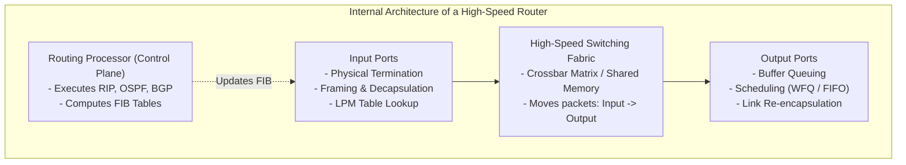

### Components:
1. **Input Ports**: Terminate incoming physical links, verify data link frames, extract IP datagrams, and perform fast table lookups using specialized **Ternary Content Addressable Memory (TCAM)** hardware.
2. **Switching Fabric**: The internal hardware interconnect connecting input ports to output ports:
   - *Switching via Memory*: Packets are copied into system RAM over a shared bus (used in early routers; bottlenecked by memory bus bandwidth).
   - *Switching via Bus*: Input ports transfer packets directly to output ports across a shared internal bus without CPU intervention (limited by bus contention).
   - *Switching via Crossbar (Interconnection Network)*: A 2D mesh of $N \times N$ switching crossbars allowing multiple packets to traverse concurrently, provided they target different output ports.
3. **Output Ports**: Buffer packets when arrival rates exceed outgoing link transmission rates. Implements queue management (Drop Tail, Random Early Detection - RED) and packet scheduling (Weighted Fair Queuing - WFQ).
4. **Routing Processor (Control Plane)**: Executes routing protocol daemons, processes ICMP control messages, and maintains the master Routing Table, compiling it into hardware FIB tables distributed across line cards.

---

## 1.4 Packet Fragmentation and Reassembly Process

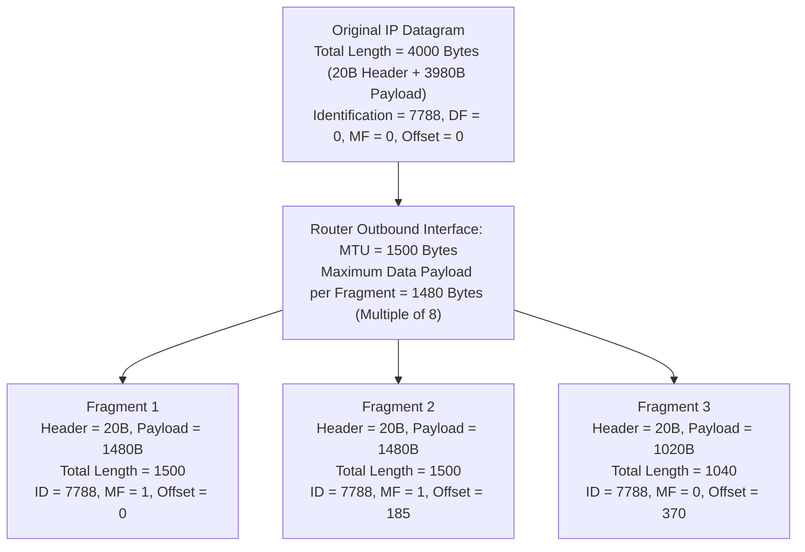

### The Mathematics of Fragmentation
1. **Payload Division Rule**: Every fragment's payload length must be an integer multiple of 8 bytes (because the Fragment Offset field measures offset in 8-byte units: $13\text{ bits} \implies 2^{13} \times 8 = 65,536\text{ bytes}$).
2. **Fragment Calculations**:
   - Total original payload $= 4000 - 20 = 3980\text{ bytes}$.
   - Max payload per fragment $= 1500 - 20 = 1480\text{ bytes}$ (divisible by 8: $1480 / 8 = 185$).
   - **Fragment 1**: Carries bytes 0 through 1479 ($1480\text{ bytes}$). $\text{Offset} = 0 / 8 = 0$. $\text{MF} = 1$ (more fragments follow). $\text{Length} = 1500$.
   - **Fragment 2**: Carries bytes 1480 through 2959 ($1480\text{ bytes}$). $\text{Offset} = 1480 / 8 = 185$. $\text{MF} = 1$. $\text{Length} = 1500$.
   - **Fragment 3**: Carries bytes 2960 through 3979 ($1020\text{ bytes}$). $\text{Offset} = 2960 / 8 = 370$. $\text{MF} = 0$ (final fragment). $\text{Length} = 1020 + 20 = 1040$.

---

## 1.5 Master Summary Matrix of Network Layer Responsibilities

| Responsibility | Architectural Purpose | Key Hardware / Mechanism | Associated Protocols / Fields |
| :--- | :--- | :--- | :--- |
| **Packetization** | Encapsulates transport segments into network packets | Network Interface Cards, IP Stack | IPv4 Header, IPv6 Header |
| **Logical Addressing**| Provides hierarchical global device identification | Distributed Addressing, DHCP | IPv4 (32-bit), IPv6 (128-bit) |
| **Routing** | Computes optimal global path across subnets | Routing Processor, Link State / Vector | OSPF, RIP, BGP, IS-IS |
| **Forwarding** | Local switching from input port to output port | TCAM, Switching Fabric, FIB Table | Longest Prefix Match (LPM) |
| **Fragmentation** | Splits oversized datagrams across low MTU links | Intermediate Routers, Reassembly Buffer | Identification, Flags, Offset |
| **Error Handling** | Reports operational transmission failures | Control Plane ICMP Generator | ICMPv4, ICMPv6 |
| **Traffic Control** | Manages link congestion and allocates bandwidth | Output Buffers, Schedulers (WFQ) | DiffServ (DSCP), ECN, Leaky Bucket |

---

# Question 2: Different Address Classes (Classful Addressing: Class A, B, C, D, E)

## 2.1 Introduction to IPv4 Addressing & Historical Context

An **IPv4 Address** is a 32-bit binary number that uniquely and universally identifies the connection of a device (computer, server, router interface) to the global Internet.

To make these 32-bit numbers human-readable, **Dotted-Decimal Notation** was introduced. The 32 bits are partitioned into four 8-bit fields called **octets**, separated by periods. Each octet is expressed as a decimal value ranging from 0 to 255:

$$\text{Binary: } \underbrace{11000000}_{192} \cdot \underbrace{10101000}_{168} \cdot \underbrace{00000001}_{1} \cdot \underbrace{00001010}_{10} \implies \mathbf{192.168.1.10}$$

### Total Address Space
The total number of addresses supported by a 32-bit address space is:
$$\text{Total Space} = 2^{32} = 4,294,967,296 \text{ distinct addresses} \approx 4.3 \text{ billion}$$

### The Birth of Classful Addressing
In 1981, **RFC 791** standardized **Classful Addressing**. To accommodate networks of varying scales, the address space was divided into five distinct classes: **Class A, Class B, Class C, Class D, and Class E**. Under this scheme, the boundary between the **Network ID (NetID)** and **Host ID (HostID)** was fixed based on the leading bits of the first octet.

---

## 2.2 Binary Structural Rules & Identification Mechanisms

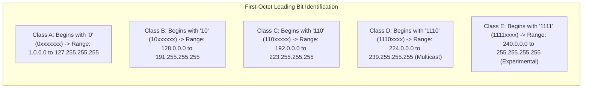

### Binary Architecture Layout

```
Class A:  [ 0 | 7-bit NetID ] [ 8-bit HostID ] [ 8-bit HostID ] [ 8-bit HostID ]
          <- NetID: 8 bits -> <---------------- HostID: 24 bits --------------->

Class B:  [ 1 0 | 14-bit NetID       ] [ 8-bit HostID ] [ 8-bit HostID ]
          <---- NetID: 16 bits ------> <------- HostID: 16 bits ------->

Class C:  [ 1 1 0 | 21-bit NetID                      ] [ 8-bit HostID ]
          <----------- NetID: 24 bits ----------------> <- HostID: 8 b ->

Class D:  [ 1 1 1 0 | 28-bit Multicast Group Identification Identifier ]

Class E:  [ 1 1 1 1 | 28-bit Reserved for Experimental / Research Uses  ]
```

---

## 2.3 Comprehensive Analysis of Classes A, B, C, D, and E

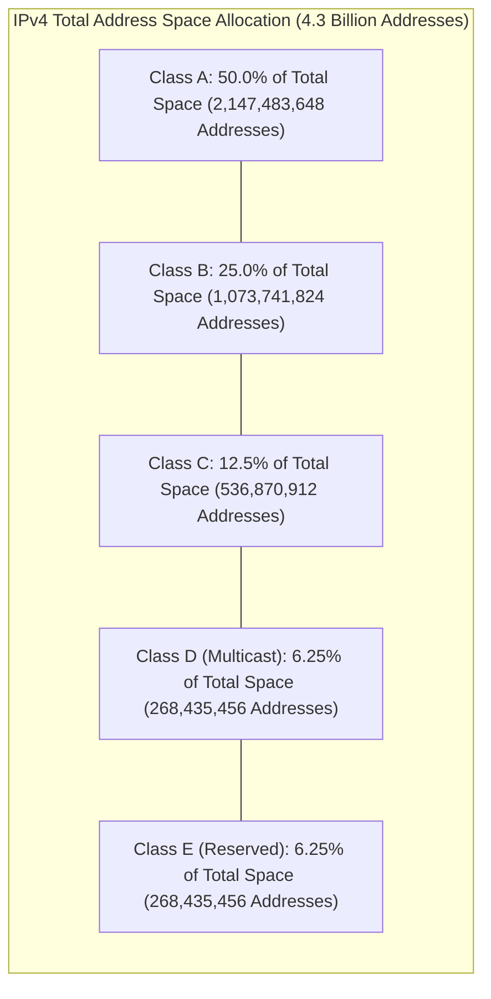

### 1. Class A (Very Large Networks)
- **First-Octet Rule**: First bit is permanently fixed to `0`. Binary range: `00000000` to `01111111` (Decimal: 0 to 127).
- **Network & Host Boundary**: 8 bits of NetID, 24 bits of HostID.
- **Default Subnet Mask**: `255.0.0.0` (CIDR `/8`).
- **Number of Networks**:
  $$\text{Networks} = 2^{7} - 2 = 126 \text{ networks}$$
  *(Network `0.0.0.0` is reserved for default routing, and network `127.0.0.0` is reserved for loopback testing).*
- **Hosts per Network**:
  $$\text{Hosts per Net} = 2^{24} - 2 = 16,777,216 - 2 = \mathbf{16,777,214 \text{ hosts}}$$
- **Share of Address Space**: Represents $50\%$ of the entire global IPv4 address space ($2^{31} = 2,147,483,648$ addresses).
- **Target Deployments**: National telecommunications carriers, massive multinational defense networks, IBM, MIT.

---

### 2. Class B (Medium to Large Organizations)
- **First-Octet Rule**: First two bits are fixed to `10`. Binary range: `10000000` to `10111111` (Decimal: 128 to 191).
- **Network & Host Boundary**: 16 bits of NetID, 16 bits of HostID.
- **Default Subnet Mask**: `255.255.0.0` (CIDR `/16`).
- **Number of Networks**:
  $$\text{Networks} = 2^{14} = \mathbf{16,384 \text{ networks}}$$
- **Hosts per Network**:
  $$\text{Hosts per Net} = 2^{16} - 2 = 65,536 - 2 = \mathbf{65,534 \text{ hosts}}$$
- **Share of Address Space**: Represents $25\%$ of the total IPv4 space ($2^{30} = 1,073,741,824$ addresses).
- **Target Deployments**: Major universities, large hospitals, mid-to-large corporate enterprises.

---

### 3. Class C (Small Local Networks)
- **First-Octet Rule**: First three bits are fixed to `110`. Binary range: `11000000` to `11011111` (Decimal: 192 to 223).
- **Network & Host Boundary**: 24 bits of NetID, 8 bits of HostID.
- **Default Subnet Mask**: `255.255.255.0` (CIDR `/24`).
- **Number of Networks**:
  $$\text{Networks} = 2^{21} = \mathbf{2,097,152 \text{ networks}}$$
- **Hosts per Network**:
  $$\text{Hosts per Net} = 2^{8} - 2 = 256 - 2 = \mathbf{254 \text{ hosts}}$$
- **Share of Address Space**: Represents $12.5\%$ of the total IPv4 space ($2^{29} = 536,870,912$ addresses).
- **Target Deployments**: Small businesses, individual branch offices, home networks.

---

### 4. Class D (Multicast Group Addressing)
- **First-Octet Rule**: First four bits are fixed to `1110`. Binary range: `11100000` to `11101111` (Decimal: 224 to 239).
- **Network & Host Boundary**: No NetID or HostID division. There is no subnet mask. The remaining 28 bits specify a **Multicast Group Identifier**.
- **Operational Principle**: A packet sent to a Class D address is not delivered to a single host (unicast), but is replicated by routers to all hosts registered in that multicast group.
- **Well-Known Multicast Groups**:
  - `224.0.0.1`: All systems (hosts and routers) on the local subnet.
  - `224.0.0.2`: All routers on the local subnet.
  - `224.0.0.5`: All OSPF routers.
  - `224.0.0.9`: All RIPv2 routers.
- **Share of Address Space**: $6.25\%$ ($2^{28} = 268,435,456$ addresses).

---

### 5. Class E (Experimental and Reserved)
- **First-Octet Rule**: First four bits are fixed to `1111`. Decimal range: 240 to 255.
- **Purpose**: Reserved by the IETF for experimental, research, and future operational use. Packets with Class E destination addresses are dropped by standard Internet transit routers.
- **Exception**: `255.255.255.255` is designated as the **Limited Broadcast Address**.

---

## 2.4 Special, Reserved, and Private IP Address Blocks

In any IP network, two host addresses within a subnet are permanently reserved:
1. **Network Address**: All host bits set to `0` (e.g., `192.168.1.0`). Identifies the network itself in routing tables.
2. **Directed Broadcast Address**: All host bits set to `1` (e.g., `192.168.1.255`). Broadcasts to all hosts on that target subnet.

### Private IP Address Blocks (RFC 1918)
To conserve IPv4 addresses, the IETF allocated specific blocks for non-routable private intranets. These addresses cannot route over the public Internet; traffic must pass through Network Address Translation (NAT) gateways:

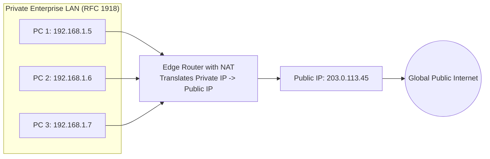

- **Class A Private Range**: `10.0.0.0` to `10.255.255.255` (1 single Class A network: `10.0.0.0/8`, 16.7 million IPs).
- **Class B Private Range**: `172.16.0.0` to `172.31.255.255` (16 contiguous Class B networks: `172.16.0.0/12`, ~1 million IPs).
- **Class C Private Range**: `192.168.0.0` to `192.168.255.255` (256 contiguous Class C networks: `192.168.0.0/16`, 65,536 IPs).

### Other Specialized Reserved Addresses
- **Loopback Address Block**: `127.0.0.0/8` (typically `127.0.0.1`). Packets sent to this address loop back internally within the host's TCP/IP stack without touching physical network hardware. Used for local testing and IPC.
- **Limited Broadcast Address**: `255.255.255.255`. Broadcasts to all devices on the local physical network segment without being forwarded across routers.
- **Automatic Private IP Addressing (APIPA)**: `169.254.0.0/16`. Dynamically self-assigned by hosts when a DHCP server is unreachable.

---

## 2.5 Inefficiencies of Classful Addressing & Evolution to CIDR

Classful addressing suffered from an **allocation granularity problem**:
- If an organization required 500 IP addresses, a Class C network (254 hosts) was too small.
- The organization was forced to request a Class B network (65,534 hosts).
- In utilizing 500 addresses from a Class B block, the organization left **65,034 addresses unused and stranded**, wasting over $99\%$ of the allocated block.

### The Solution: CIDR (Classless Inter-Domain Routing)
In 1993, **RFC 1519** introduced **CIDR**, eliminating fixed class boundaries entirely:
- Subnet masks can be of arbitrary bit lengths (`/1` through `/32`).
- An organization requiring 500 hosts receives a `/23` block ($2^{32 - 23} - 2 = 510\text{ usable hosts}$), reducing address waste from tens of thousands of addresses to near zero.
- Enables **Route Aggregation (Supernetting)**: Hundreds of smaller contiguous network entries can be summarized into a single prefix in core router tables, preventing global routing table bloat.

---

## 2.6 Master Comparison Matrix of IPv4 Address Classes

| Parameter | Class A | Class B | Class C | Class D | Class E |
| :--- | :--- | :--- | :--- | :--- | :--- |
| **Leading Bits** | `0` | `10` | `110` | `1110` | `1111` |
| **First Octet Range** | 1 to 126 | 128 to 191 | 192 to 223 | 224 to 239 | 240 to 255 |
| **NetID / HostID Split** | 8 bits / 24 bits | 16 bits / 16 bits | 24 bits / 8 bits | None | None |
| **Default Subnet Mask** | `255.0.0.0` (`/8`) | `255.255.0.0` (`/16`)| `255.255.255.0` (`/24`)| None | None |
| **Total Networks** | 126 | 16,384 | 2,097,152 | N/A | N/A |
| **Usable Hosts / Net** | 16,777,214 | 65,534 | 254 | N/A (Multicast) | N/A (Reserved) |
| **% of IPv4 Space** | 50% | 25% | 12.5% | 6.25% | 6.25% |
| **Primary Use Case** | National / Global WAN | Campus / Mid Enterprise| Small Business LAN | Multimedia Multicast | Experimental / Research |

---

# Question 3: Routing Techniques (Distance Vector, Link State, Spanning Tree)

## 3.1 Introduction to Routing Concepts & Graph Abstraction

**Routing** is the mechanism by which intermediate nodes determine the optimal path for forwarding packets from a source to a destination. The network topology is abstracted as an undirected weighted graph:
$$G = (V, E)$$
Where:
- $V$ is the set of routers (nodes): $V = \{A, B, C, D, \dots\}$
- $E$ is the set of operational physical links connecting routers.
- Each link $(u, v) \in E$ has a non-negative cost metric $c(u, v)$ reflecting propagation delay, dollar cost, inverse bandwidth, or administrative preference.
- The objective of any routing algorithm is to compute the **least-cost path** between all pairs of nodes.

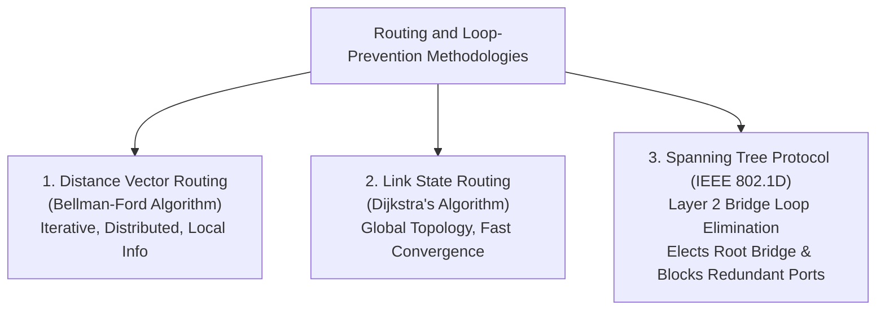

---

## 3.2 Distance Vector Routing (Bellman-Ford Algorithm & Count-to-Infinity)

Distance Vector Routing is a distributed, asynchronous routing architecture based on the **Bellman-Ford Shortest Path Algorithm**.

### Core Philosophy
*"Tell your immediate neighbors about your view of the entire network."*
- Every router maintains a routing table containing:
  1. A list of all known destination networks.
  2. The estimated least cost to reach each destination (**Distance**).
  3. The next router along that path (**Vector / Next Hop**).
- Routers periodically transmit copies of their routing tables exclusively to their directly connected immediate neighbors.

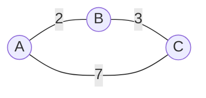

### The Bellman-Ford Mathematical Formulation
Let $D_x(y)$ be the cost of the least-cost path from node $x$ to node $y$. The relation is governed by the Bellman-Ford optimality equation:
$$D_x(y) = \min_v \{ c(x, v) + D_v(y) \}$$
Where the minimum is evaluated across all direct neighbors $v$ of node $x$, $c(x, v)$ is the physical link cost from $x$ to $v$, and $D_v(y)$ is neighbor $v$'s advertised cost to reach $y$.

---

### Step-by-Step Distance Vector Convergence Example

Consider a 4-node network: $A - B - C - D$, with unit link costs ($1$ hop each).

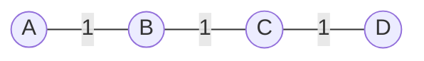

1. **Initialization**: Each router knows only the cost to its immediate physical neighbors; all other destinations are marked as $\infty$.
   - Router A table: $\{A:0, B:1, C:\infty, D:\infty\}$
   - Router B table: $\{A:1, B:0, C:1, D:\infty\}$
2. **Iteration 1**: B sends its vector to A and C.
   - Router A computes:
     $$D_A(C) = \min \{ c(A, B) + D_B(C) \} = 1 + 1 = 2 \implies \text{Next Hop: } B$$
     A's updated table: $\{A:0, B:1, C:2, D:\infty\}$
3. **Iteration 2**: C shares its vector with B; B updates its vector and sends it to A.
   - Router A computes:
     $$D_A(D) = c(A, B) + D_B(D) = 1 + 2 = 3 \implies \text{Next Hop: } B$$
   - The network reaches **convergence**.

---

### The Count-to-Infinity Problem and Routing Loops
The primary failure mode of Distance Vector Routing is its vulnerability to routing loops when a link fails, known as the **Count-to-Infinity Problem**.

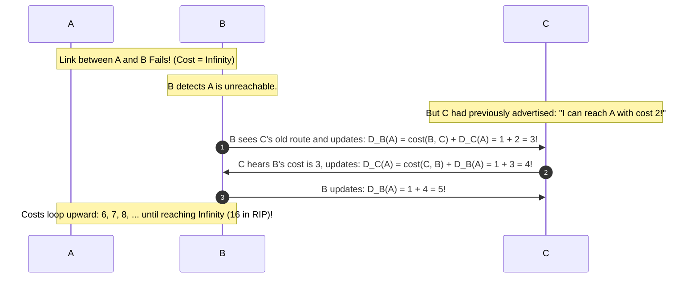

#### Loop Mitigation Techniques:
1. **Defining Infinity**: Set infinity to a small integer (in RIP, $\infty = 16$). This bounds the loop so it terminates after 16 iterations rather than cycling endlessly.
2. **Split Horizon**: A router must **never advertise a route back out the same interface through which it learned it**. If B learns its route to A from C, B will not advertise a path to A back to C.
3. **Poison Reverse**: An explicit variant of Split Horizon. Instead of omitting the route, B advertises the route back to C with a cost of **$\infty$ (Poisoned)**: *"I reach A through you, so you cannot reach A through me."*
4. **Hold-Down Timers**: When a router receives an update indicating that a previously accessible link has failed, it starts a timer (e.g., 180 seconds). During this period, it ignores any updates claiming to reach that destination with an inferior metric, allowing topological changes to stabilize.

---

## 3.3 Link State Routing (Dijkstra's Algorithm & Reliable Flooding)

Link State Routing addresses the slow convergence and routing loops of Distance Vector algorithms by providing every router with a **complete, identical view of the global network topology**.

### Core Philosophy
*"Tell the entire network about your immediate neighbors."*

### The Five Operational Phases
1. **Neighbor Discovery**: Upon boot, a router transmits small **HELLO** packets out all physical interfaces. Directly connected neighbors reply, allowing the router to discover active neighbors and their link interfaces.
2. **Link Metric Measurement**: The router measures the cost to each neighbor by sending echo probes to measure Round Trip Time (delay) or reading interface bandwidth ratings.
3. **Link State Packet (LSP) Construction**: The router packages its local connectivity state into an **LSP**:
   $$\text{LSP Structure} = \{\text{Source Router ID}, \text{Sequence Number}, \text{Age}, [\text{Neighbor } 1, \text{Cost}], [\text{Neighbor } 2, \text{Cost}], \dots\}$$
4. **Reliable Flooding of LSPs**: The router floods the LSP out all interfaces. Intermediate routers store the LSP in their **Link State Database (LSDB)** and forward it to all other neighbors. Sequence numbers prevent duplicate processing, and the Age field decrements to eliminate stale routing information.
5. **Shortest Path Computation (Dijkstra's Algorithm)**: Once every router has an identical LSDB, each router independently executes **Dijkstra's Algorithm**, treating itself as the root to construct a **Shortest Path Tree (SPT)** and generate its forwarding table.

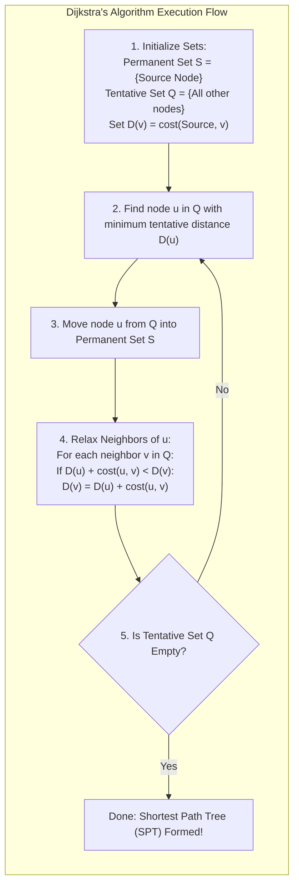

### Advantages of Link State over Distance Vector:
- **Instantaneous Convergence**: LSPs flood immediately without waiting for step-by-step neighbor table recalculations.
- **Immunity to Routing Loops**: Every router computes its shortest path tree locally on an identical global topological map.
- **Bandwidth Scalability**: LSPs are flooded only when physical link states change, eliminating the bandwidth overhead of periodic full-table broadcasts.

---

## 3.4 Spanning Tree Protocol (IEEE 802.1D Bridge Loop Prevention)

While Distance Vector and Link State operate at Layer 3, redundant physical links at the **Layer 2 Data Link Layer** create catastrophic vulnerabilities.

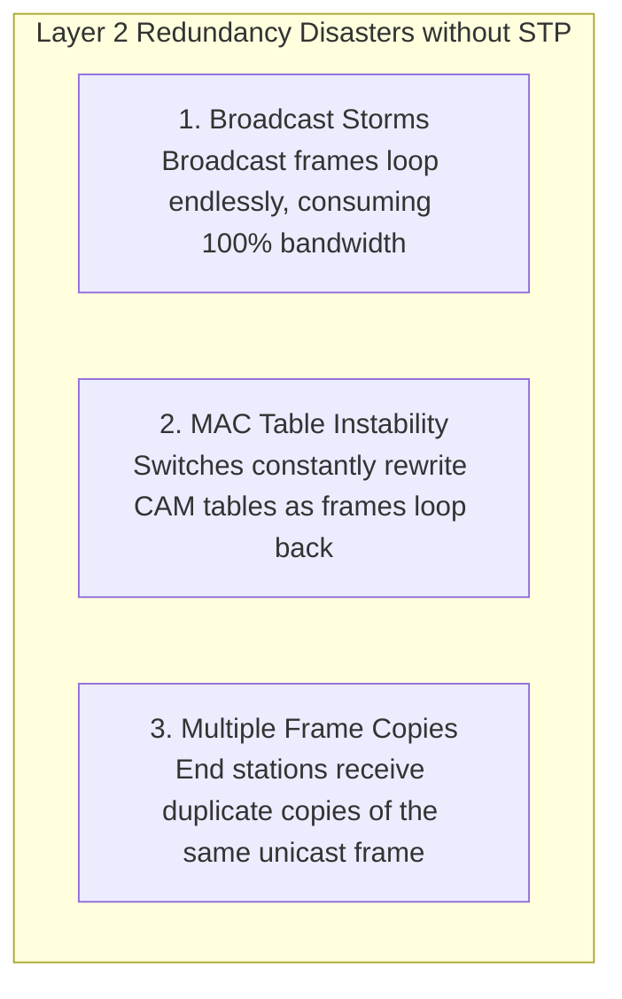

Because Ethernet frame headers lack a Time-to-Live (TTL) field, a broadcast frame circulating in a physical switching loop will cycle indefinitely, causing a **Broadcast Storm** that crashes switch backplanes and saturates physical links.

### Spanning Tree Graph Theory
A **Spanning Tree** is an acyclic subgraph of a network that connects all vertices (switches) without containing any closed loops:
$$\text{For } V \text{ vertices, a Spanning Tree contains exactly } (V - 1) \text{ edges}$$

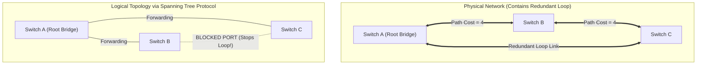

### The STP Convergence Algorithm (IEEE 802.1D)
Switches continuously exchange specialized Layer 2 control packets called **Bridge Protocol Data Units (BPDUs)** to converge on a loop-free tree:
1. **Elect the Root Bridge**: The switch with the lowest **Bridge Identifier (BID)** is elected as the root of the tree:
   $$\text{Bridge ID (8 bytes)} = \text{Bridge Priority (2 bytes, default 32768)} + \text{Base MAC Address (6 bytes)}$$
2. **Elect Root Ports (RP)**: Every non-root switch identifies one port that provides the lowest cumulative **Root Path Cost** back to the Root Bridge.
3. **Elect Designated Ports (DP)**: On each physical LAN link segment, the switch port advertising the lowest root path cost is elected as the Designated Port (placed in the **Forwarding** state).
4. **Block Redundant Alternate Ports**: All remaining ports that are neither Root Ports nor Designated Ports are placed in the **Blocking** state. Blocked ports drop regular data frames, breaking physical switching loops while remaining on standby to take over if an active link fails.

### STP Port States Lifecycle
$$\text{Blocking} \xrightarrow{20\text{s Max Age}} \text{Listening} \xrightarrow{15\text{s Forward Delay}} \text{Learning} \xrightarrow{15\text{s Forward Delay}} \text{Forwarding}$$
Total default convergence time from link failure to recovery is **50 seconds** (reduced to sub-second intervals in 802.1w Rapid Spanning Tree Protocol - RSTP).

---

## 3.5 Master Comparison Matrix: Distance Vector vs. Link State vs. Spanning Tree

| Parameter | Distance Vector Routing | Link State Routing | Spanning Tree Protocol (STP) |
| :--- | :--- | :--- | :--- |
| **Operating OSI Layer** | Network Layer (Layer 3) | Network Layer (Layer 3) | Data Link Layer (Layer 2) |
| **Fundamental Algorithm**| Bellman-Ford Algorithm | Dijkstra's Shortest Path Algorithm | Spanning Tree Algorithm (Radia Perlman)|
| **Network Knowledge** | Knows only neighbor vectors ("by rumor")| Complete global topological map | Tree spanning active switch bridges |
| **Routing Metric** | Hop Count (RIP), Delay/Load (EIGRP) | Cost (inversely related to bandwidth) | Path Cost (port speed based: 4, 19, 100)|
| **Convergence Speed** | Slow (vulnerable to Count-to-Infinity) | Fast (instantaneous flooding of LSPs) | Slow (30 to 50 seconds in legacy 802.1D) |
| **Loop Handling** | Split Horizon, Poison Reverse, Timers | Inherent loop-free shortest path tree | Physically blocks redundant ports |
| **Control Messages** | Routing Table Updates | Link State Advertisements (LSAs) | Bridge Protocol Data Units (BPDUs) |
| **Memory / CPU Overhead**| Very Low memory, minimal CPU | High RAM (LSDB) and intensive CPU | Low memory, runs locally on switches |
| **Primary Standard Tech**| RIPv1, RIPv2, IGRP | OSPFv2, OSPFv3, IS-IS | IEEE 802.1D (STP), IEEE 802.1w (RSTP)|

---

# Question 4: Carrier Sense Multiple Access with Collision Avoidance (CSMA/CA)

## 4.1 The Wireless Dilemma: Why CSMA/CD Fails in Wireless Networks

In wired Ethernet networks (IEEE 802.3), stations arbitrate media access using **Carrier Sense Multiple Access with Collision Detection (CSMA/CD)**: a station transmits and simultaneously monitors the wire; if the signal voltage spikes, it detects a collision, transmits a jam signal, and backs off.

However, CSMA/CD **cannot be implemented in wireless RF networks (IEEE 802.11 Wi-Fi)** for two fundamental physical reasons:

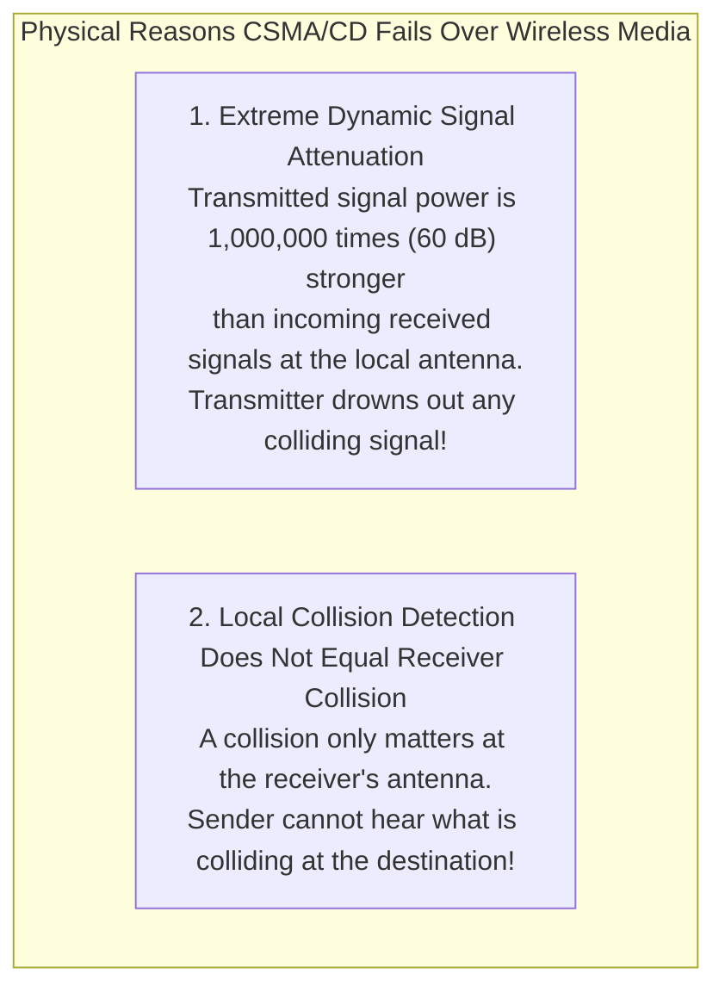

1. **Extreme Dynamic Range Disparity**: A wireless transceiver's broadcast power is hundreds of thousands of times greater than the incoming signals it receives from distant nodes. If a station transmits, its local antenna is saturated by its own signal energy, making it impossible to detect a faint colliding transmission from another station.
2. **Spatial Separation of Collisions**: A collision occurs at the **receiver's antenna**, not at the transmitter's antenna. A transmitting station cannot determine whether its signal collided with another waveform at a remote receiving station.

---

## 4.2 The Hidden Terminal and Exposed Terminal Problems

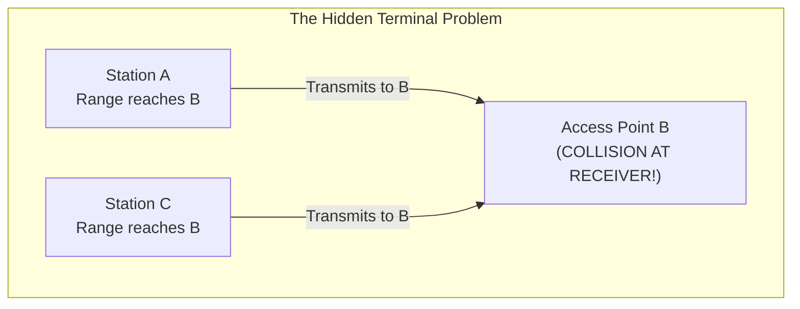

### 1. The Hidden Terminal Problem
- Consider three wireless stations positioned in a line: **Station A $\longleftrightarrow$ Access Point B $\longleftrightarrow$ Station C**.
- The transmission range of Station A reaches Access Point B, but cannot reach Station C.
- The transmission range of Station C reaches Access Point B, but cannot reach Station A.
- **The Failure**: Station A wants to transmit to B. It senses the medium, detects no carrier (because C is out of range), and begins transmitting. Simultaneously, Station C senses the medium, also detects no carrier, and transmits to B.
- Both signals arrive simultaneously at Access Point B, causing a **destructive packet collision**, even though neither sender detected a channel conflict.

---

### 2. The Exposed Terminal Problem

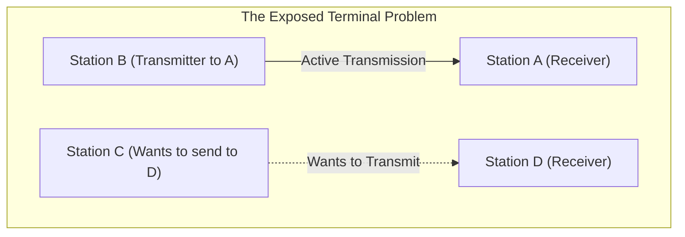

- Station B is transmitting data to Station A.
- Station C wants to transmit data to Station D (where D is out of range of B).
- Station C senses the wireless medium and hears Station B's transmission.
- C incorrectly assumes the channel is occupied and defers its transmission, even though a transmission from C to D would not have interfered with reception at A. This is an **Exposed Terminal**, resulting in wasted channel bandwidth.

---

## 4.3 CSMA/CA Operational Pillars: IFS, Backoff, and ACK

Because collisions cannot be reliably detected, the 802.11 standard shifts the paradigm to **Collision Avoidance (CSMA/CA)**, built upon three operational pillars:

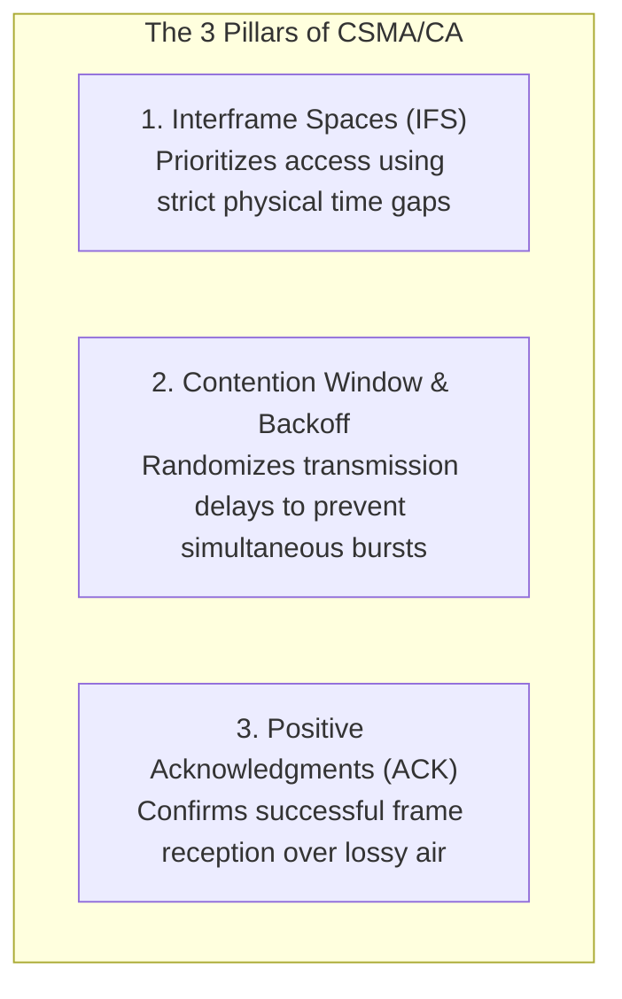

### 1. Interframe Spaces (IFS)
Stations must wait for the medium to remain continuously idle for an **Interframe Space (IFS)** before attempting transmission. Differing IFS durations enforce traffic priority:

```
+------------ SIFS ------------+ (Shortest: Highest Priority - Control Frames: ACK, CTS)
+----------------- PIFS -----------------+ (PCF Priority: Central AP Polling)
+---------------------- DIFS ----------------------+ (DCF Standard: Regular Data Frames)
```

- **SIFS (Short Interframe Space)**: The shortest time gap. Gives highest priority to completion exchanges: immediate ACKs, CTS frames, and subsequent fragments.
- **PIFS (PCF Interframe Space)**: Mid-length time gap used in Point Coordination Function (centralized contention-free AP polling).
- **DIFS (DCF Interframe Space)**: Standard time gap required before any station can attempt to transmit normal data frames in Distributed Coordination Function.
- **EIFS (Extended Interframe Space)**: Longest time gap, invoked when a station receives an unparseable or corrupted frame, giving other stations time to clear errors.

---

### 2. The Randomized Contention Window & Exponential Backoff
If the channel remains idle for a full DIFS period, the station does not transmit immediately (which would cause a collision if multiple stations were waiting). Instead, it enters a **Randomized Backoff Phase**:
1. The station chooses a random integer backoff value $k$ from a uniform distribution:
   $$k \in [0, CW - 1]$$
   Where $CW$ is the **Contention Window** (starts at $CW_{\text{min}} = 15$).
2. The station waits $k$ slot times ($\text{SlotTime} = 9\text{ µs}$ or $20\text{ µs}$).
3. The station decrements its backoff counter only while the medium remains idle. If another station transmits, the countdown timer **freezes**.
4. When the channel becomes idle again for a DIFS duration, the countdown **resumes from its frozen state**, preserving fairness.
5. If an acknowledgment is not received (indicating a collision or corruption), the contention window doubles:
   $$CW_{\text{new}} = \min(2 \times (CW_{\text{old}} + 1) - 1, CW_{\text{max}})$$
   (where $CW_{\text{max}} = 1023$).

---

### 3. Positive Acknowledgment (ACK)
Because the transmitter cannot detect collisions, every successfully received unicast data frame must be explicitly acknowledged by the receiver by returning an **ACK frame** within a SIFS duration. If the transmitter does not receive an ACK before its retransmission timer expires, it assumes a collision occurred and retransmits.

---

## 4.4 The 4-Way Handshake: RTS/CTS and Virtual Carrier Sensing (NAV)

To resolve the Hidden Terminal problem, IEEE 802.11 provides an optional 4-way control handshake utilizing **RTS (Request to Send)** and **CTS (Clear to Send)** frames.

```mermaid
sequenceDiagram
    autonumber
    participant Sender as Transmitting Station
    participant Other as Overhearing Stations
    participant AP as Access Point (Receiver)
    
    Note over Sender: Channel idle for DIFS + Backoff
    Sender->>AP: 1. RTS (Request to Send - Duration = NAV)
    Note over Other: Overhearing stations parse RTS Duration
    Note over Other: Set Virtual Carrier Sense (NAV) Timer!
    AP-->>Sender: 2. CTS (Clear to Send - Duration = Remaining NAV)
    Note over Other: Stations in AP range hear CTS; update NAV!
    Sender->>AP: 3. DATA Frame (Payload)
    AP-->>Sender: 4. ACK Frame (Transmission Confirmed)
    Note over Other: NAV timer expires; channel available again
```

### The Mechanics of the Network Allocation Vector (NAV)
1. **RTS Transmission**: The sender transmits an RTS frame containing a **Duration Value** specifying the total time required to transmit the pending data frame, the receiver's CTS, the final ACK, and the three intervening SIFS intervals:
   $$T_{\text{reservation}} = \text{SIFS} + T_{\text{CTS}} + \text{SIFS} + T_{\text{DATA}} + \text{SIFS} + T_{\text{ACK}}$$
2. **CTS Transmission**: The receiver replies with a CTS frame repeating this reservation time.
3. **Virtual Carrier Sensing (NAV)**: Every station that overhears either the RTS or the CTS updates an internal countdown timer called the **Network Allocation Vector (NAV)**. Even if their physical antennas detect no RF energy on the channel, stations treat the medium as logically busy until their NAV counter reaches zero.
- This solves the **Hidden Terminal Problem**: Station C (out of range of A's RTS) hears Access Point B's CTS. It parses the duration field and sets its NAV, preventing it from transmitting and colliding with A's incoming data frame at B.

---

## 4.5 Complete CSMA/CA Protocol Execution Flowchart

```mermaid
flowchart TD
    START["Station has a frame ready to transmit"] --> SENSE1{"Sense physical channel:<br/>Is medium idle?"}
    
    SENSE1 -- No (Busy) --> WAIT_BUSY["Wait until channel becomes idle"]
    WAIT_BUSY --> WAIT_DIFS["Wait for full DIFS idle period"]
    
    SENSE1 -- Yes (Idle) --> WAIT_DIFS
    
    WAIT_DIFS --> SENSE2{"Did channel remain<br/>idle for entire DIFS?"}
    SENSE2 -- No --> WAIT_BUSY
    SENSE2 -- Yes --> PICK_CW["Select random backoff k in [0, CW - 1]"]
    
    PICK_CW --> COUNTDOWN{"Channel still idle?"}
    COUNTDOWN -- Yes --> DEC_K["Decrement backoff counter k"]
    DEC_K --> ZERO_CHECK{"Is k == 0?"}
    
    COUNTDOWN -- No (Busy) --> FREEZE["Freeze counter k until channel idle for DIFS"]
    FREEZE --> COUNTDOWN
    
    ZERO_CHECK -- No --> COUNTDOWN
    ZERO_CHECK -- Yes --> SEND_RTS["Send RTS frame (if enabled)"]
    
    SEND_RTS --> WAIT_CTS{"Received CTS<br/>within timeout?"}
    WAIT_CTS -- No (Collision) --> DOUBLE_CW["Double CW: CW = min(2*CW, CWmax)<br/>Increment attempt counter"]
    DOUBLE_CW --> RETRY_CHECK{"Exceeded max retries?"}
    RETRY_CHECK -- Yes --> DROP["Drop frame & Report Error"]
    RETRY_CHECK -- No --> PICK_CW
    
    WAIT_CTS -- Yes --> SEND_DATA["Wait SIFS and transmit DATA frame"]
    SEND_DATA --> WAIT_ACK{"Received ACK<br/>within timeout?"}
    WAIT_ACK -- No --> DOUBLE_CW
    WAIT_ACK -- Yes --> SUCCESS["Transmission Successful!<br/>Reset CW = CWmin"]
```

---

## 4.6 Comprehensive Comparison Matrix: CSMA/CD vs. CSMA/CA

| Parameter | CSMA/CD (Collision Detection) | CSMA/CA (Collision Avoidance) |
| :--- | :--- | :--- |
| **Physical Medium** | Wired Copper Cable (Ethernet IEEE 802.3) | Wireless Radio Frequency (Wi-Fi IEEE 802.11) |
| **Operational Philosophy**| Transmit, listen, and recover if collision occurs | Mitigate and prevent collisions before transmission |
| **Detection Method** | Voltage threshold monitoring on copper wire | Cannot detect; relies on timer timeouts and lost ACKs |
| **Hidden Terminal Mitigation**| N/A (all stations share the common bus wire) | 4-Way Handshake: RTS/CTS and NAV Virtual Sensing |
| **Interframe Spacing** | Uniform Interpacket Gap (96 bit-times) | Tiered IFS priorities: SIFS, PIFS, DIFS, EIFS |
| **Collision Notification**| Transmits a 32-bit jamming signal | None; silence implies packet loss or collision |
| **Acknowledgment** | No link-level ACK needed (detection is certain)| Mandatory Layer 2 ACK frame for all unicast frames |
| **Channel Utilization** | High efficiency on dedicated links | Higher protocol overhead due to RTS, CTS, and ACKs |
| **Backoff Algorithm** | Truncated Binary Exponential Backoff | Contention Window ($CW$) random slot countdown |

---

# Question 5: Internet Protocol Version 4 (IPv4)

## 5.1 Design Philosophy, Service Model, and Addressing

The **Internet Protocol Version 4 (IPv4)**, standardized in 1981 via **RFC 791**, is the foundational network-layer routing protocol of the global Internet.

### The IPv4 Architectural Service Model
1. **Connectionless Delivery**: IPv4 treats every packet as an independent datagram. No prior call setup or end-to-end path reservation is performed. Packets may traverse different intermediate routes and arrive at the destination out of sequence.
2. **Best-Effort (Unreliable) Delivery**: IPv4 provides no inherent guarantee that a datagram will reach its destination. Datagrams may be corrupted, duplicated, delayed, or discarded due to router buffer exhaustion. Reliability is delegated to upper-layer transport protocols (TCP).
3. **Host-to-Host Addressing**: Utilizes 32-bit hierarchical logical IP addresses to deliver packets across multiple intermediate routing hops.

---

## 5.2 Exhaustive IPv4 Datagram Header Format

```
 0                   1                   2                   3
 0 1 2 3 4 5 6 7 8 9 0 1 2 3 4 5 6 7 8 9 0 1 2 3 4 5 6 7 8 9 0 1
+-+-+-+-+-+-+-+-+-+-+-+-+-+-+-+-+-+-+-+-+-+-+-+-+-+-+-+-+-+-+-+-+
|Version|  IHL  |    DSCP   |ECN|          Total Length         |
+-+-+-+-+-+-+-+-+-+-+-+-+-+-+-+-+-+-+-+-+-+-+-+-+-+-+-+-+-+-+-+-+
|         Identification        |Flags|      Fragment Offset    |
+-+-+-+-+-+-+-+-+-+-+-+-+-+-+-+-+-+-+-+-+-+-+-+-+-+-+-+-+-+-+-+-+
|  Time to Live |    Protocol   |        Header Checksum        |
+-+-+-+-+-+-+-+-+-+-+-+-+-+-+-+-+-+-+-+-+-+-+-+-+-+-+-+-+-+-+-+-+
|                       Source IP Address                       |
+-+-+-+-+-+-+-+-+-+-+-+-+-+-+-+-+-+-+-+-+-+-+-+-+-+-+-+-+-+-+-+-+
|                    Destination IP Address                     |
+-+-+-+-+-+-+-+-+-+-+-+-+-+-+-+-+-+-+-+-+-+-+-+-+-+-+-+-+-+-+-+-+
|                    Options and Padding (if any)               |
+-+-+-+-+-+-+-+-+-+-+-+-+-+-+-+-+-+-+-+-+-+-+-+-+-+-+-+-+-+-+-+-+
|                             Data                              |
+-+-+-+-+-+-+-+-+-+-+-+-+-+-+-+-+-+-+-+-+-+-+-+-+-+-+-+-+-+-+-+-+
```

### Bit-by-Bit Field Breakdown

1. **Version (4 bits)**: Specifies the IP version. For IPv4, this value is fixed to `0100` (binary $4$).
2. **Internet Header Length (IHL) (4 bits)**: Specifies the length of the IP header in **32-bit (4-byte) words**.
   - Minimum value: $5 \implies 5 \times 4 = \mathbf{20\text{ bytes}}$ (standard header with no options).
   - Maximum value: $15 \implies 15 \times 4 = \mathbf{60\text{ bytes}}$ (header with 40 bytes of options).
3. **Differentiated Services Code Point (DSCP) (6 bits)**: Replaced the legacy Type of Service (ToS) field. Classifies packets for quality of service (QoS) traffic prioritization (voice, video, best-effort).
4. **Explicit Congestion Notification (ECN) (2 bits)**: Allows intermediate routers experiencing queue congestion to mark packets without dropping them, prompting TCP endpoints to reduce window sizes.
5. **Total Length (16 bits)**: Defines the entire size of the IP datagram (Header + Payload) in bytes.
   - Theoretical maximum: $2^{16} - 1 = \mathbf{65,535\text{ bytes}}$.
   - Minimum size: $20\text{ bytes}$ (empty data payload).
6. **Identification (16 bits)**: A unique integer counter assigned by the sending host. All fragments generated from the same original datagram share the identical Identification number, allowing the destination host to group fragments during reassembly.
7. **Flags (3 bits)**:
   - **Bit 0**: Reserved; must be set to `0`.
   - **Bit 1 - DF (Don't Fragment)**: If set to `1`, intermediate routers are forbidden from fragmenting this packet. If the packet exceeds a link's MTU, the router drops it and returns an ICMP Type 3 Code 4 message ("Fragmentation Needed but DF set"). Used in Path MTU Discovery.
   - **Bit 2 - MF (More Fragments)**: If set to `1`, it indicates that additional fragments follow. If set to `0`, it indicates that this is either the final fragment or an unfragmented datagram.
8. **Fragment Offset (13 bits)**: Specifies the relative position of the fragment's payload data relative to the beginning of the original unfragmented payload, expressed in **units of 8-byte blocks**.
9. **Time to Live (TTL) (8 bits)**: An integer hop counter (typically initialized to 64, 128, or 255) decremented by at least 1 by every router that forwards the packet. If the TTL reaches `0`, the router drops the datagram and returns an **ICMP Time Exceeded (Type 11)** error to the sender, preventing packets from looping indefinitely.
10. **Protocol (8 bits)**: Identifies the higher-layer transport protocol whose payload is encapsulated within the IP datagram:
    - `1` = ICMP (Internet Control Message Protocol)
    - `2` = IGMP (Internet Group Management Protocol)
    - `6` = TCP (Transmission Control Protocol)
    - `17` = UDP (User Datagram Protocol)
    - `89` = OSPF (Open Shortest Path First)
11. **Header Checksum (16 bits)**: A 16-bit 1's complement checksum calculated **exclusively over the IP header fields** (excluding the data payload). Because the TTL field decrements at every router hop, intermediate routers must recalculate the checksum at every hop.
12. **Source IP Address (32 bits)**: The logical IP address of the originating sender.
13. **Destination IP Address (32 bits)**: The logical IP address of the target destination.
14. **Options & Padding (0 to 40 bytes)**: Optional control features:
    - *Record Route*: Each router appends its outgoing IP interface address.
    - *Strict Source Routing*: The sender specifies the exact sequence of router hops the datagram must traverse.
    - *Loose Source Routing*: The sender specifies mandatory milestone routers that must be visited along the path.
    - *Timestamp*: Each router appends its local timestamp.

---

## 5.3 Mathematical Fragmentation & Reassembly Walkthrough

### Scenario:
A host generates an IP datagram with a **Total Length of 4000 bytes** (20-byte IP header + 3980-byte data payload) with an assigned $\text{Identification} = \mathbf{54321}$. This packet must cross an intermediate link with an $\text{MTU} = \mathbf{1500\text{ bytes}}$.

```mermaid
flowchart TD
    IN_PKT["Input IP Datagram<br/>Total Length = 4000B, Data = 3980B<br/>ID = 54321, DF = 0, MF = 0, Offset = 0"]
    
    FRAG_ENG["Router Fragmentation Engine<br/>Link MTU = 1500B -> Max Payload = 1480B (185 blocks of 8B)"]
    
    IN_PKT --> FRAG_ENG
    
    FRAG_ENG --> F1["Fragment 1<br/>Total Length: 1500B (20B Header + 1480B Data)<br/>ID = 54321, MF = 1, Fragment Offset = 0"]
    FRAG_ENG --> F2["Fragment 2<br/>Total Length: 1500B (20B Header + 1480B Data)<br/>ID = 54321, MF = 1, Fragment Offset = 185"]
    FRAG_ENG --> F3["Fragment 3<br/>Total Length: 1040B (20B Header + 1020B Data)<br/>ID = 54321, MF = 0, Fragment Offset = 370"]
```

### Step-by-Step Calculation:
1. **Determine Maximum Fragment Payload**:
   $$\text{Max Payload} = \text{MTU} - \text{Header Size} = 1500 - 20 = 1480\text{ bytes}$$
   Check divisibility by 8: $\frac{1480}{8} = 185$ (divisible by 8).
2. **Fragment 1**:
   - Data carried: Bytes $0$ through $1479$ ($1480\text{ bytes}$).
   - $\text{Total Length} = 1480 + 20 = \mathbf{1500\text{ bytes}}$.
   - $\text{Fragment Offset} = \frac{0}{8} = \mathbf{0}$.
   - $\text{MF Flag} = \mathbf{1}$ (additional fragments follow).
3. **Fragment 2**:
   - Data carried: Bytes $1480$ through $2959$ ($1480\text{ bytes}$).
   - $\text{Total Length} = 1480 + 20 = \mathbf{1500\text{ bytes}}$.
   - $\text{Fragment Offset} = \frac{1480}{8} = \mathbf{185}$.
   - $\text{MF Flag} = \mathbf{1}$.
4. **Fragment 3**:
   - Remaining Data: $3980 - 1480 - 1480 = 1020\text{ bytes}$.
   - Bytes carried: $2960$ through $3979$.
   - $\text{Total Length} = 1020 + 20 = \mathbf{1040\text{ bytes}}$.
   - $\text{Fragment Offset} = \frac{2960}{8} = \mathbf{370}$.
   - $\text{MF Flag} = \mathbf{0}$ (signals the destination that this is the final fragment).

---

## 5.4 Subnetting, Supernetting, and CIDR Hierarchy

```mermaid
flowchart TD
    subgraph SubnetDivision["Subnetting Mechanics: /24 Network Split into Two /25 Subnets"]
        direction TB
        NET["Original Class C Network: 192.168.10.0/24 (254 Usable Hosts)<br/>Mask: 255.255.255.0"]
        
        SUB1["Subnet 1: 192.168.10.0/25<br/>Mask: 255.255.255.128<br/>Usable Range: 192.168.10.1 - 192.168.10.126 (126 Hosts)<br/>Broadcast: 192.168.10.127"]
        SUB2["Subnet 2: 192.168.10.128/25<br/>Mask: 255.255.255.128<br/>Usable Range: 192.168.10.129 - 192.168.10.254 (126 Hosts)<br/>Broadcast: 192.168.10.255"]
        
        NET -->|"Borrow 1 Host Bit"| SUB1
        NET -->|"Borrow 1 Host Bit"| SUB2
    end
```

### Mathematical Subnetting Formulas
When borrowing $s$ bits from the host field to create subnets:
$$\text{Number of Created Subnets} = 2^s$$
$$\text{Number of Usable Hosts per Subnet} = 2^{h - s} - 2$$
Where $h$ is the original number of host bits, and $2$ addresses are subtracted for the Subnet Network Address and Subnet Broadcast Address.

---

## 5.5 Limitations of IPv4 and Architectural Comparison with IPv6

The massive proliferation of smartphones, home IoT devices, and cloud computing led to the exhaustion of unallocated IPv4 address blocks by IANA in February 2011, accelerating the transition to **IPv6 (RFC 8200)**.

| Comparison Feature | IPv4 (RFC 791) | IPv6 (RFC 8200) |
| :--- | :--- | :--- |
| **Address Length** | 32 bits (4 bytes) | 128 bits (16 bytes) |
| **Address Space Capacity**| $\approx 4.3 \times 10^9$ addresses | $\approx 3.4 \times 10^{38}$ addresses ($2^{128}$) |
| **Notation Representation**| Dotted Decimal (e.g., `192.168.1.1`) | Hexadecimal Colon (e.g., `2001:0db8::1`)|
| **Header Size** | Variable: 20 to 60 bytes | Fixed: Exactly 40 bytes |
| **Header Checksum** | Yes (recalculated at every hop) | Removed (delegated to Layer 2 and Layer 4)|
| **Fragmentation Control** | Performed by routers & sending hosts | Performed **exclusively by sending hosts** |
| **Address Autoconfiguration**| Manual or via DHCPv4 | SLAAC (Stateless Address Autoconfiguration) |
| **Broadcast Addressing** | Yes (`255.255.255.255`) | Eliminated (replaced by Multicast & Anycast)|
| **Security Architecture**| Optional add-on (IPsec) | Native mandatory support for IPsec |

---

# Question 6: Routing Protocols: OSPF, RIP, and BGP

## 6.1 Autonomous Systems and Routing Protocol Taxonomy

The global Internet is organized into thousands of independently administered network domains called **Autonomous Systems (AS)**.

```mermaid
flowchart TD
    subgraph InternetHierarchy["Autonomous System Routing Protocol Hierarchy"]
        direction TB
        
        subgraph AS1["Autonomous System 100 (Enterprise ISP A)"]
            direction LR
            R1["Router A1"] <--->|"OSPF (Link State)"| R2["Router A2"]
        end

        subgraph AS2["Autonomous System 200 (Transit Carrier B)"]
            direction LR
            R3["Router B1"] <--->|"RIP / IS-IS"| R4["Router B2"]
        end

        AS1 <=====>|"BGP-4 (Path Vector EGP - Inter-AS Peering)"| AS2
    end
```

### Definitions:
- **Autonomous System (AS)**: A collection of IP networks and routers controlled by a single administrative entity (university, corporation, ISP) presenting a consistent, unified internal routing policy. Each public AS is assigned a unique globally registered **Autonomous System Number (ASN)** (e.g., ASN 15169 for Google).
- **Interior Gateway Protocols (IGP)**: Routing protocols used to exchange reachability information and optimize paths **inside a single Autonomous System** (RIP, OSPF, IS-IS, EIGRP).
- **Exterior Gateway Protocols (EGP)**: Routing protocols used to route data **between distinct Autonomous Systems** across the global Internet backbone (BGP-4).

---

## 6.2 Routing Information Protocol (RIP)

RIP (standardized in RFC 1058 for RIPv1, RFC 2453 for RIPv2) is an Interior Gateway Protocol based on the **Distance Vector** algorithm.

### Core Mechanics
- **Routing Metric**: Measures path cost strictly using **Hop Count** (the number of intermediate routers crossed).
- Every directly connected link has a hop cost of $1$.
- **Bandwidth Blind**: RIP chooses a 1-hop 56 kbps legacy serial link over a 2-hop 10 Gbps fiber path because $1 < 2$, resulting in suboptimal routing across high-speed networks.
- **Maximum Metric Limit**: Path diameter is capped at **15 hops**. A metric of $16$ signifies **infinity (unreachable destination)**, restricting RIP to small networks.
- **Update Frequency**: Every 30 seconds, routers broadcast or multicast their complete routing table to all active interfaces.
- **Transport Mechanism**: Operates over **UDP Port 520**.

### RIPv1 vs. RIPv2 Evolution
- **RIPv1 (Legacy)**: Classful routing protocol. Does not transmit subnet mask information in routing updates, prohibiting Variable Length Subnet Masking (VLSM) and CIDR. Broadcasts updates to `255.255.255.255`. Provides no cryptographic authentication.
- **RIPv2 (Modernized)**: Classless routing protocol. Carries 32-bit subnet masks in route advertisements, supporting VLSM and CIDR. Multicasts updates to `224.0.0.9` (reducing processing overhead on non-RIP nodes). Supports MD5 cryptographic authentication.

---

## 6.3 Open Shortest Path First (OSPF)

OSPF (RFC 2328 for OSPFv2, RFC 5340 for OSPFv3) is an open-standard, link-state Interior Gateway Protocol widely deployed in enterprise networks and campus backbones.

```mermaid
flowchart TD
    subgraph OSPF_Hierarchy["Hierarchical Two-Tier OSPF Area Architecture"]
        direction TB
        
        subgraph Area0["Backbone Area (Area 0 / 0.0.0.0)"]
            CORE_R1["Core Router 1"] <---> CORE_R2["Core Router 2"]
        end
        
        subgraph Area1["Standard Area 1 (Engineering)"]
            IR1["Internal Router 1"] --- ABR1["Area Border Router (ABR 1)"]
        end
        
        subgraph Area2["Standard Area 2 (Finance)"]
            IR2["Internal Router 2"] --- ABR2["Area Border Router (ABR 2)"]
        end
        
        ABR1 <===> CORE_R1
        ABR2 <===> CORE_R2
    end
```

### 1. Hierarchical Area Partitioning
To scale to large enterprise networks without overwhelming routers with massive LSDBs, OSPF partitions an AS into **Areas**:
- **Backbone Area (Area 0 / 0.0.0.0)**: The core central area to which all other non-backbone areas must physically connect. Transports traffic between distinct areas.
- **Area Border Router (ABR)**: A router with interfaces in multiple areas (e.g., connected to both Area 1 and Area 0). Summarizes internal area routes and advertises them into the backbone.
- **Autonomous System Boundary Router (ASBR)**: A router that connects the OSPF network to external networks or other routing domains (BGP, RIP, static routes), injecting redistributed external routes.

---

### 2. The OSPF Metric: Cost Calculation
OSPF calculates link cost inversely proportional to link bandwidth:
$$\text{Cost} = \frac{\text{Reference Bandwidth}}{\text{Interface Bandwidth in bps}}$$
*(Default Reference Bandwidth is $10^8\text{ bps} = 100\text{ Mbps}$)*:
- $10\text{ Mbps Ethernet} \implies \text{Cost} = \frac{100\text{ Mbps}}{10\text{ Mbps}} = \mathbf{10}$
- $100\text{ Mbps Fast Ethernet} \implies \text{Cost} = \frac{100\text{ Mbps}}{100\text{ Mbps}} = \mathbf{1}$
- $1\text{ Gbps Gigabit Ethernet} \implies \text{Cost} = 1$ (requires updating the reference bandwidth to $100\text{ Gbps}$ in modern networks to differentiate Gigabit and 10G links).

---

### 3. OSPF Packet Types & Adjacency Formation
OSPF runs directly on top of the **IP Layer (Protocol Number 89)** without transport-layer encapsulation.

```mermaid
stateDiagram-v2
    [*] --> Down
    Down --> Init: Sends Hello Packet
    Init --> TwoWay: Neighbor sees self in Hello (2-Way)
    TwoWay --> ExStart: Elect Master/Slave & Sequence
    ExStart --> Exchange: Exchange Database Descriptions (DBD)
    Exchange --> Loading: Request missing LSAs via LSR / LSU
    Loading --> Full: Database Synchronized (Full Adjacency)
    Full --> [*]
```

- **Five OSPF Packet Types**:
  1. *Type 1 (Hello)*: Discovers neighbors, establishes adjacencies, and maintains keepalives.
  2. *Type 2 (Database Description - DBD)*: Summary of the router's LSDB contents.
  3. *Type 3 (Link State Request - LSR)*: Requests detailed records for specific missing LSAs.
  4. *Type 4 (Link State Update - LSU)*: Carries the actual flooded Link State Advertisements (LSAs).
  5. *Type 5 (Link State Acknowledgment - LSAck)*: Explicitly acknowledges received LSUs.

---

### 4. DR and BDR Election on Multi-Access Networks
On a shared broadcast multi-access network (such as an Ethernet switch connecting 10 OSPF routers), forming point-to-point adjacencies between every router would require:
$$\text{Adjacencies} = \frac{N(N - 1)}{2} = \frac{10 \times 9}{2} = 45 \text{ full adjacencies}$$
To eliminate this $O(N^2)$ scaling issue, routers elect:
- **Designated Router (DR)**: Acts as the central clearinghouse for LSA distribution. All other routers form adjacencies exclusively with the DR.
- **Backup Designated Router (BDR)**: Listens to all updates and steps in immediately if the DR fails.
- Routers communicate with the DR/BDR using multicast `224.0.0.6`, while the DR communicates with all OSPF routers using multicast `224.0.0.5`.

---

## 6.4 Border Gateway Protocol (BGP-4)

**BGP-4** (RFC 4271) is the core routing protocol of the global Internet. It is a **Path Vector Protocol** designed to manage routing across independent Autonomous Systems.

```mermaid
flowchart LR
    subgraph AS100["AS 100 (Google)"]
        R_A["Border Router A"]
    end

    subgraph AS200["AS 200 (Transit ISP)"]
        R_B["Border Router B"]
    end

    subgraph AS300["AS 300 (End User ISP)"]
        R_C["Border Router C"]
    end

    R_A <===>|"eBGP Peering (TCP 179)<br/>Advertises Prefix: 8.8.8.0/24<br/>AS-PATH: [100]"| R_B
    R_B <===>|"eBGP Peering (TCP 179)<br/>Advertises Prefix: 8.8.8.0/24<br/>AS-PATH: [200, 100]"| R_C
```

### 1. The Path Vector Principle & AS-PATH Loop Elimination
Unlike IGPs that track link costs or hop counts, BGP advertises reachable network prefixes paired with an ordered list of Autonomous Systems that traffic must traverse to reach the destination—the **AS-PATH Attribute**:
- If Router C in AS 300 receives an update for `8.8.8.0/24` with an $\text{AS-PATH} = [200, 100]$, it knows the packet must cross AS 200 and then AS 100.
- **Loop Prevention**: If a border router receives an update whose AS-PATH already contains its own local ASN, it detects an inter-domain routing loop and **immediately discards the advertisement**, providing complete loop immunity.

### 2. Operational Attributes & Policy-Based Routing
BGP does not seek the "shortest physical path." Instead, it enforces economic, business, and security policies using **BGP Path Attributes**:
- **NEXT_HOP**: Specifies the IP address of the next-hop router that must be used to reach the advertised destination prefix.
- **LOCAL_PREF**: An internal attribute evaluated within an AS to prefer one outbound exit point over another (higher value wins).
- **Multi-Exit Discriminator (MED)**: Suggested preference sent to an external peer AS to influence which ingress link it should use to send traffic into the local AS (lower value wins).

### 3. Transport Mechanism: TCP Port 179
Because the global Internet contains over 900,000 active routing prefixes, BGP does not implement custom packet fragmentation, sequencing, or retransmission mechanisms. Instead, it forms peering sessions over reliable **TCP Port 179**, inheriting TCP's built-in reliability and flow control.

---

## 6.5 Master Routing Protocol Comparison Matrix (RIP vs. OSPF vs. BGP)

| Evaluation Parameter | RIP (v1 / v2) | OSPF (v2 / v3) | BGP (BGP-4) |
| :--- | :--- | :--- | :--- |
| **Protocol Classification**| Interior Gateway Protocol (IGP)| Interior Gateway Protocol (IGP)| Exterior Gateway Protocol (EGP)|
| **Underlying Algorithm** | Distance Vector (Bellman-Ford)| Link State (Dijkstra SPF) | Path Vector Protocol |
| **Operational Scope** | Small, flat internal networks | Large, multi-area enterprise AS | Global Internet / Inter-AS Core|
| **Routing Metric** | Hop Count (strictly 1 to 15) | Cost ($\text{RefBW} / \text{InterfaceBW}$) | Multi-Attribute Policy (AS-PATH, MED) |
| **Maximum Metric Limit** | 15 Hops ($16 = \infty$) | Unbounded (16-bit metric sum) | Unbounded AS-PATH list |
| **Underlying Transport** | UDP Port 520 | IP Protocol 89 (Raw IP) | TCP Port 179 |
| **Network Hierarchy** | Flat (no area concept) | Two-Tier (Backbone Area 0 + Areas)| Autonomous System Topology |
| **Convergence Speed** | Slow (periodic 30s updates) | Fast (event-driven LSA floods) | Moderate (policy-driven BGP updates) |
| **VLSM / CIDR Support** | No (v1) / Yes (v2) | Full Support (Classless) | Full Support (Classless / Supernetting)|
| **Loop Prevention** | Split Horizon, Poison Reverse | Inherent to Dijkstra Tree | AS-PATH attribute examination |
| **Traffic Scalability** | Limited (< 15 routers) | High (thousands of routers) | Global Internet (> 900,000 prefixes)|
| **Standard Specifications**| RFC 1058 (v1), RFC 2453 (v2) | RFC 2328 (OSPFv2), RFC 5340 (v3)| RFC 4271 (BGP-4) |


---

# Question 7: Dynamic Host Configuration Protocol (DHCP)

## 7.1 Introduction, Historical Evolution, and Motivation

In any TCP/IP network, a host cannot communicate over the Internet without proper network layer configuration parameters, including:
1. A unique **IPv4 Address**.
2. A **Subnet Mask** defining the local network boundary.
3. The **Default Gateway** (router interface IP) to forward off-subnet traffic.
4. One or more **Domain Name System (DNS) Server IP Addresses** to resolve hostnames.

### The Evolution: Manual Configuration $\to$ RARP $\to$ BOOTP $\to$ DHCP
- **Manual Static Configuration**: In early networks, network administrators manually walked to every machine, typed in a static IP address, subnet mask, and gateway. In modern enterprise networks with thousands of dynamic smartphones, laptops, and IoT devices, manual assignment leads to IP address conflicts, administrative gridlock, and massive configuration errors when network topology or gateway IPs change.
- **Reverse Address Resolution Protocol (RARP - RFC 903)**: Allowed a diskless workstation that knew its 48-bit physical MAC address to broadcast an inquiry to a RARP server to discover its assigned 32-bit IP address. However, RARP operated strictly at the Data Link Layer (Layer 2) and could not cross router boundaries, could not configure subnet masks or default gateways, and required a dedicated RARP server on every physical wire.
- **Bootstrap Protocol (BOOTP - RFC 951)**: Introduced an Application Layer protocol running over UDP (Ports 67 and 68) that could cross routers using relay agents and deliver an IP address along with a boot filename and gateway. However, BOOTP was static: an administrator had to manually pre-populate a lookup table matching each device's MAC address to a fixed IP. It lacked dynamic address pooling and automatic lease reclamation.
- **Dynamic Host Configuration Protocol (DHCP - RFC 2131)**: Standardized by the IETF to provide complete, automated, and dynamic network parameter configuration, supporting temporary address leasing, dynamic pooling, and seamless mobile roaming across subnets.

```mermaid
flowchart TD
    EVOL["Evolution of Host IP Configuration Protocols"]
    
    MAN["1. Manual Configuration<br/>- Error-prone, static, high administrative burden<br/>- Frequent duplicate IP address conflicts"]
    RARP["2. RARP (RFC 903 - Layer 2)<br/>- Resolves MAC to IP<br/>- Cannot cross routers, no gateway or DNS delivery"]
    BOOTP["3. BOOTP (RFC 951 - UDP 67/68)<br/>- Traverses routers via Relay Agents<br/>- Static pre-configured 1:1 MAC-to-IP binding only"]
    DHCP["4. DHCP (RFC 2131 - Modern Standard)<br/>- Dynamic IP Pooling, Temporary Leases<br/>- Distributes IP, Mask, Gateway, DNS, MTU automatically"]
    
    MAN --> RARP --> BOOTP --> DHCP
```

---

## 7.2 Three Address Allocation Mechanisms & Configuration Parameters

DHCP supports three distinct IP address allocation mechanisms:
1. **Dynamic Allocation (The Standard)**: The DHCP server manages a pool of available IP addresses. When a client boots or connects to the network, the server leases an IP address for a specified duration (the **Lease Time**). When the lease expires (or the client disconnects without renewing), the IP address returns to the pool for reallocation to another device.
2. **Automatic Allocation**: The server assigns a permanent, static IP address from the pool to a requesting client upon its first connection. The address is never expired or reassigned to another host.
3. **Manual / Static Reservation (MAC Binding)**: The network administrator configures a table on the DHCP server binding a specific hardware MAC address (e.g., `00:1A:2B:3C:4D:5E`) to a fixed reserved IP address (e.g., `192.168.1.10`). Whenever that machine requests an IP, the server always returns that exact IP (ideal for network printers, file servers, and management interfaces).

```mermaid
flowchart TD
    subgraph DHCPAllocations["DHCP IP Allocation Modes"]
        DYN["1. Dynamic Allocation<br/>Temporary Lease from Pool (Hours/Days)<br/>Reclaimed upon expiration or release"]
        AUTO["2. Automatic Allocation<br/>Permanent unexpired assignment<br/>Allocated automatically on first connection"]
        RES["3. Manual / Reservation<br/>Fixed binding: Static MAC <-> Fixed IP<br/>Used for Servers, Switches, Printers"]
    end
```

### Essential Configuration Parameters Delivered to Clients
A single DHCP transaction automatically distributes:
- **IP Address**: The 32-bit logical address assigned to the host's NIC.
- **Subnet Mask** (Option 1): Defines the network prefix and host portions.
- **Default Gateway / Router IP** (Option 3): The IP of the local router interface.
- **Domain Name Servers** (Option 6): Primary and secondary DNS resolvers (e.g., `8.8.8.8`, `1.1.1.1`).
- **Domain Name** (Option 15): The local domain suffix (e.g., `corp.university.edu`).
- **IP Lease Time** (Option 51): Duration in seconds for which the lease remains valid.
- **Interface MTU** (Option 26): Prevents local packet fragmentation issues.

---

## 7.3 Detailed DHCP Message Format (RFC 2131 Header Layout)

DHCP operates as an Application Layer protocol encapsulated directly inside **UDP datagrams**:
- **DHCP Server Port**: UDP Port **67**
- **DHCP Client Port**: UDP Port **68**

```
 0                   1                   2                   3
 0 1 2 3 4 5 6 7 8 9 0 1 2 3 4 5 6 7 8 9 0 1 2 3 4 5 6 7 8 9 0 1
+-+-+-+-+-+-+-+-+-+-+-+-+-+-+-+-+-+-+-+-+-+-+-+-+-+-+-+-+-+-+-+-+
|     op (1)    |   htype (1)   |   hlen (1)    |   hops (1)    |
+-+-+-+-+-+-+-+-+-+-+-+-+-+-+-+-+-+-+-+-+-+-+-+-+-+-+-+-+-+-+-+-+
|                            xid (4)                            |
+-+-+-+-+-+-+-+-+-+-+-+-+-+-+-+-+-+-+-+-+-+-+-+-+-+-+-+-+-+-+-+-+
|           secs (2)            |           flags (2)           |
+-+-+-+-+-+-+-+-+-+-+-+-+-+-+-+-+-+-+-+-+-+-+-+-+-+-+-+-+-+-+-+-+
|                          ciaddr (4)                           |
+-+-+-+-+-+-+-+-+-+-+-+-+-+-+-+-+-+-+-+-+-+-+-+-+-+-+-+-+-+-+-+-+
|                          yiaddr (4)                           |
+-+-+-+-+-+-+-+-+-+-+-+-+-+-+-+-+-+-+-+-+-+-+-+-+-+-+-+-+-+-+-+-+
|                          siaddr (4)                           |
+-+-+-+-+-+-+-+-+-+-+-+-+-+-+-+-+-+-+-+-+-+-+-+-+-+-+-+-+-+-+-+-+
|                          giaddr (4)                           |
+-+-+-+-+-+-+-+-+-+-+-+-+-+-+-+-+-+-+-+-+-+-+-+-+-+-+-+-+-+-+-+-+
|                                                               |
|                          chaddr (16)                          |
|                                                               |
|                                                               |
+-+-+-+-+-+-+-+-+-+-+-+-+-+-+-+-+-+-+-+-+-+-+-+-+-+-+-+-+-+-+-+-+
|                          sname (64)                           |
+-+-+-+-+-+-+-+-+-+-+-+-+-+-+-+-+-+-+-+-+-+-+-+-+-+-+-+-+-+-+-+-+
|                          file (128)                           |
+-+-+-+-+-+-+-+-+-+-+-+-+-+-+-+-+-+-+-+-+-+-+-+-+-+-+-+-+-+-+-+-+
|                        options (variable)                     |
+-+-+-+-+-+-+-+-+-+-+-+-+-+-+-+-+-+-+-+-+-+-+-+-+-+-+-+-+-+-+-+-+
```

### Field-by-Field Breakdown

1. **op (Operation Code / Message Type, 8 bits)**:
   - `1` = `BOOTREQUEST` (transmitted by client to server).
   - `2` = `BOOTREPLY` (transmitted by server to client).
2. **htype (Hardware Address Type, 8 bits)**: Specifies the physical network architecture (`1` for 10/100/1000 Mbps Ethernet).
3. **hlen (Hardware Address Length, 8 bits)**: Length of the physical MAC address in bytes (`6` for 48-bit Ethernet MAC).
4. **hops (8 bits)**: Incremented by intermediate DHCP Relay Agents when forwarding messages across subnets. Prevents loops (dropped if hops exceed 16).
5. **xid (Transaction Identifier, 32 bits)**: A randomized integer generated by the client to correlate requests with server replies.
6. **secs (Seconds Elapsed, 16 bits)**: Seconds elapsed since the client began the address acquisition or renewal process.
7. **flags (16 bits)**:
   - Leftmost bit is the **Broadcast Flag**: If set to `1`, the client informs the server: *"I do not yet have an IP address configured and cannot receive unicast packets; please broadcast your reply to `255.255.255.255`."*
   - Remaining 15 bits are reserved and must be set to `0`.
8. **ciaddr (Client IP Address, 32 bits)**: The client's existing IP address. Set to `0.0.0.0` during initial discovery; populated with the client's current IP during renewal.
9. **yiaddr ('Your' IP Address, 32 bits)**: The IP address being offered or assigned by the server to the client.
10. **siaddr (Server IP Address, 32 bits)**: The IP address of the next boot server to use in bootstrap configuration.
11. **giaddr (Gateway / Relay Agent IP Address, 32 bits)**: Populated with the router's incoming interface IP when a DHCP Relay Agent forwards a client request to a remote server.
12. **chaddr (Client Hardware Address, 16 bytes / 128 bits)**: The client's physical MAC address (e.g., `00:1A:2B:3C:4D:5E`, padded with zeroes to 16 bytes).
13. **sname (Server Host Name, 64 bytes)**: Optional null-terminated string containing the server hostname.
14. **file (Boot File Name, 128 bytes)**: Optional null-terminated string specifying a PXE network boot image path.
15. **options (Variable Length)**: Begins with the 4-byte **Magic Cookie** (`99.130.83.99` in dotted-decimal) followed by TLV (Type-Length-Value) encoded option fields:
    - *Option 53 (DHCP Message Type)*: Identifies the specific DHCP message (1=Discover, 2=Offer, 3=Request, 4=Decline, 5=Ack, 6=Nak, 7=Release, 8=Inform).
    - *Option 1*: Subnet Mask.
    - *Option 3*: Router (Default Gateway).
    - *Option 6*: Domain Name Server (DNS).
    - *Option 51*: IP Address Lease Time.
    - *Option 255*: End Option (delimiter `0xFF`).

---

## 7.4 The 4-Step DORA Exchange Protocol Lifecycle

When an unconfigured client joins a network, it obtains an IP configuration through the **DORA** transaction:

```mermaid
sequenceDiagram
    autonumber
    participant Client as DHCP Client (0.0.0.0:68)
    participant Server1 as DHCP Server 1 (192.168.1.1:67)
    participant Server2 as DHCP Server 2 (192.168.1.2:67)
    
    Note over Client: Step 1: D - DISCOVER (Broadcast)
    Client->>Server1: DHCPDISCOVER (Src: 0.0.0.0:68 -> Dst: 255.255.255.255:67, xid=101)
    Client->>Server2: DHCPDISCOVER (Broadcast heard by all local servers)
    
    Note over Server1,Server2: Step 2: O - OFFER (Propose IP)
    Server1-->>Client: DHCPOFFER (yiaddr: 192.168.1.100, ServerID: 192.168.1.1)
    Server2-->>Client: DHCPOFFER (yiaddr: 192.168.1.200, ServerID: 192.168.1.2)
    
    Note over Client: Step 3: R - REQUEST (Client accepts Server 1)
    Client->>Server1: DHCPREQUEST (Broadcast: ServerID = 192.168.1.1, RequestIP = 192.168.1.100)
    Client->>Server2: DHCPREQUEST (Server 2 sees it was not chosen; frees 192.168.1.200!)
    
    Note over Server1: Step 4: A - ACKNOWLEDGE (Commit Lease)
    Server1-->>Client: DHCPACK (yiaddr: 192.168.1.100, Mask: /24, GW: 192.168.1.1, Lease: 86400s)
    Note over Client: Client performs Gratuitous ARP: IP is conflict-free!
```

### 1. D — DHCPDISCOVER
- **Source IP**: `0.0.0.0` (Client has no IP).
- **Destination IP**: `255.255.255.255` (Limited Broadcast).
- **Transport**: UDP Src Port `68`, Dst Port `67`.
- **Purpose**: Broadcast to locate any available DHCP servers on the local segment. Contains the client's MAC address in `chaddr` and a unique random transaction ID (`xid`).

### 2. O — DHCPOFFER
- **Source IP**: DHCP Server's IP (e.g., `192.168.1.1`).
- **Destination IP**: `255.255.255.255` (Broadcast) or Client MAC Unicast.
- **Payload**: The server temporarily reserves an unallocated IP from its scope and returns it in the `yiaddr` field, along with the proposed subnet mask, default lease time, and the server's own IP address in Option 54 (Server Identifier).
- Multiple DHCP servers may respond with distinct offers.

### 3. R — DHCPREQUEST
- **Source IP**: `0.0.0.0`.
- **Destination IP**: `255.255.255.255` (Broadcast).
- **Why Broadcast?**: The client selects one offer (typically the first received) and broadcasts its acceptance. Broadcasting notifies the winning server that its offer was accepted, while simultaneously notifying all other competing DHCP servers that their offers were declined, allowing them to return their reserved IPs back to their available address pools.

### 4. A — DHCPACK (or DHCPNAK)
- The selected server commits the lease binding to its permanent storage and transmits a **DHCPACK** packet containing complete network configuration parameters (IP, Subnet Mask, Gateway, DNS, Lease Time).
- If the requested IP address becomes unavailable in the interim (e.g., allocated to another host), the server returns a **DHCPNAK (Negative Acknowledgment)**, forcing the client to restart the DORA cycle from Discover.
- **Gratuitous ARP Verification**: Upon receiving the DHCPACK, the client transmits an ARP request for its newly acquired IP address. If another host replies, an IP conflict exists: the client transmits a **DHCPDECLINE** message to the server and restarts DORA.

---

## 7.5 Lease Renewal Timers (T1, T2, Expiration) and State Machine

A DHCP lease is governed by three critical time thresholds:

```mermaid
stateDiagram-v2
    [*] --> Init: Client Boots
    Init --> Selecting: Broadcasts DHCPDISCOVER
    Selecting --> Requesting: Receives DHCPOFFER, sends DHCPREQUEST
    Requesting --> Bound: Receives DHCPACK (Lease active!)
    
    Bound --> Renewing: Timer T1 (50% Lease) Expires<br/>Unicasts DHCPREQUEST to original server
    Renewing --> Bound: Receives DHCPACK (Lease extended back to 100%!)
    
    Renewing --> Rebinding: Timer T2 (87.5% Lease) Expires<br/>No reply from original server! Broadcasts DHCPREQUEST
    Rebinding --> Bound: Receives DHCPACK from ANY server
    
    Rebinding --> Init: Lease Expires (100%)<br/>Halts traffic, drops IP, restarts DORA
    Bound --> Init: User disconnects (Sends DHCPRELEASE)
```

1. **Timer T1 (Renewal Timer - 50% of Lease)**:
   - Default value: $0.5 \times \text{Lease Duration}$ (e.g., at 12 hours of a 24-hour lease).
   - The client enters the **Renewing State** and transmits a **unicast DHCPREQUEST** directly to the original granting DHCP server.
   - If the server replies with a DHCPACK, the lease timer resets to $100\%$ and the client returns to the Bound state.
2. **Timer T2 (Rebinding Timer - 87.5% of Lease)**:
   - Default value: $0.875 \times \text{Lease Duration}$ (e.g., at 21 hours of a 24-hour lease).
   - If the original server crashed or is unreachable, the client enters the **Rebinding State**. It **broadcasts a DHCPREQUEST to `255.255.255.255`**, asking any active DHCP server on the network to extend its lease.
3. **Lease Expiration (100% of Lease)**:
   - If no DHCPACK is received by the time the lease reaches $100\%$, the client must immediately release the IP address, cease all network communication, and transition back to the **Init State**, broadcasting a new DHCPDISCOVER.
4. **Explicit Release (`DHCPRELEASE`)**:
   - When a workstation performs a clean shutdown or an administrator executes `ipconfig /release`, the client sends an unacknowledged **DHCPRELEASE** unicast to the server, releasing the lease immediately.

---

## 7.6 Cross-Subnet DHCP Relay Agent Architecture

By default, routers are configured to block broadcast packets (`255.255.255.255`) to prevent broadcast storms. If a network consists of multiple subnets, deploying a dedicated physical DHCP server on every single subnet is economically wasteful.

The solution is a **DHCP Relay Agent (RFC 1542 / RFC 2131)**, typically built directly into the local router interface:

```mermaid
flowchart LR
    subgraph SubnetA["Subnet A: 192.168.10.0/24"]
        CLIENT["DHCP Client<br/>MAC: 00:AA:BB:CC:DD:EE"]
    end

    subgraph EdgeRouter["Intermediate Edge Router (DHCP Relay Agent)"]
        direction TB
        INT_A["Interface G0/0: 192.168.10.1<br/>Config: ip helper-address 10.0.0.50"]
        INT_WAN["Interface G0/1: 10.0.0.1"]
        INT_A --- INT_WAN
    end

    subgraph CentralSubnet["Server Farm Subnet: 10.0.0.0/24"]
        DHCPSRV[("Central Enterprise<br/>DHCP Server: 10.0.0.50")]
    end

    CLIENT -->|"1. Local Broadcast:<br/>Src: 0.0.0.0 Dst: 255.255.255.255"| INT_A
    INT_A -->|"2. Unicast Forward:<br/>Sets giaddr = 192.168.10.1<br/>Src: 10.0.0.1 Dst: 10.0.0.50"| DHCPSRV
    DHCPSRV -->|"3. Unicast Reply:<br/>Picks IP from 192.168.10.0 pool<br/>Dst: 10.0.0.1"| INT_WAN
    INT_A -->|"4. Local Delivery to Client"| CLIENT
```

### Operational Steps of the Relay Agent:
1. The client broadcasts a `DHCPDISCOVER` on Subnet A (`192.168.10.0/24`).
2. The router's local interface receives the broadcast on UDP Port 67. Recognizing the `ip helper-address 10.0.0.50` command, the router acts as a Relay Agent.
3. The router populates the **`giaddr` (Gateway IP Address)** field in the DHCP header with its own local interface address (`192.168.10.1`).
4. The router encapsulates the DHCP message in a **unicast IP packet** ($\text{Src: } 10.0.0.1, \text{Dst: } 10.0.0.50$) and routes it across the enterprise network to the central DHCP server.
5. The central DHCP server inspects `giaddr = 192.168.10.1`. It recognizes that the client resides on Subnet A, selects an available IP from the `192.168.10.0/24` scope, and unicasts a `DHCPOFFER` back to the router.
6. The router decapsulates the packet and delivers the offer locally to the client.

---

## 7.7 Security Threats & Mitigations

Because early DHCP protocols lacked authentication, dynamic networks face two primary security threats:
1. **DHCP Starvation Attack**: A malicious attacker uses automated tools (e.g., Gobbler) to generate thousands of bogus `DHCPDISCOVER` packets with randomized spoofed MAC addresses. The DHCP server exhausts its entire address pool, denying network access to legitimate users (**Denial of Service**).
   - *Mitigation*: **Switch Port Security** restricts the maximum number of unique MAC addresses learned on an access switch port.
2. **Rogue DHCP Server Attack**: An unauthorized rogue router or attacker on the local network responds to `DHCPDISCOVER` broadcasts faster than the legitimate server, offering its own IP as the Default Gateway and DNS server. This allows the attacker to intercept all outbound user traffic (**Man-in-the-Middle Attack**).
   - *Mitigation*: **DHCP Snooping** on Layer 2 managed switches. Switch ports are categorized as **Trusted** (uplinks connected to authorized DHCP servers) or **Untrusted** (user access ports). The switch drops any `DHCPOFFER` or `DHCPACK` packets arriving on untrusted ports.

---

## 7.8 Master Comparison Matrix: RARP vs. BOOTP vs. DHCP

| Parameter | RARP (RFC 903) | BOOTP (RFC 951) | DHCP (RFC 2131) |
| :--- | :--- | :--- | :--- |
| **OSI Layer** | Data Link Layer (Layer 2) | Application Layer (Layer 7) | Application Layer (Layer 7) |
| **Transport Layer** | Raw Ethernet frames (Type `0x8035`)| UDP (Port 67 Server / 68 Client)| UDP (Port 67 Server / 68 Client)|
| **Router Traversal** | Cannot cross routers | Crosses routers via Relay Agents| Crosses routers via Relay Agents|
| **Address Allocation** | Static 1:1 hardware lookup | Static 1:1 manual table binding | Dynamic, Automatic, and Static |
| **Lease Mechanism** | No lease concept | Permanent assignment | Dynamic lease time ($T_1, T_2$, Exp)|
| **Parameters Delivered** | IP address only | IP, Gateway, Boot image path | IP, Mask, Gateway, DNS, MTU, etc.|
| **Packet Structure** | Fixed 28-byte hardware frame | Fixed 300-byte message | Extensible message via TLV Options|
| **Address Reuse** | No address reuse | No address reclamation | Reclaims IPs when leases expire |

---

# Question 8: Congestion Control Algorithms

## 8.1 Network Congestion Principles & The Congestion Collapse Curve

In a packet-switched network, **Congestion** occurs when the aggregate volume of packets injected into the network approaches or exceeds the transmission capacity of intermediate communication links and the buffer capacity of intermediate routers.

```mermaid
flowchart TD
    subgraph CongestionRootCauses["Root Causes of Network Congestion"]
        C1["1. Packet Arrival Rate Exceeds Outgoing Link Bandwidth"]
        C2["2. Slow Router Processors (Queue Processing Bottlenecks)"]
        C3["3. Mismatched Link Capacities (e.g., 10 Gbps feeding into 100 Mbps)"]
        C4["4. Buffer Exhaustion (Router queues overflow -> Packet Drops)"]
    end
```

### The Congestion Collapse Phenomenon
When input traffic load increases, network behavior passes through three distinct operating regimes:

```mermaid
flowchart LR
    LOAD["Offered Load (Traffic Injected)"]
    
    Z1["Regime 1: Linear Growth<br/>Throughput = Offered Load<br/>Buffers absorb brief bursts, zero drops"]
    Z2["Regime 2: The Knee<br/>Queues fill, delay increases exponentially<br/>Throughput increases sub-linearly"]
    Z3["Regime 3: The Cliff<br/>Buffer Overflow -> Massive Packet Drops<br/>Retransmissions saturate links -> Throughput drops to near ZERO!"]
    
    LOAD --> Z1 --> Z2 --> Z3
```

- **The Knee**: The point where queues begin to build up. Delay starts increasing exponentially while throughput gains flatten out.
- **The Cliff**: The critical threshold where router buffers completely fill up. Arriving packets are dropped. Dropped packets trigger end-to-end transport layer retransmissions (e.g., TCP timeout retransmits). These retransmissions inject even more duplicate packets into already congested links, triggering a positive feedback spiral called **Congestion Collapse**, reducing effective goodput to near zero.

---

## 8.2 General Taxonomy: Open-Loop vs. Closed-Loop Congestion Control

Congestion control mechanisms are broadly categorized into two structural paradigms:

```mermaid
flowchart TD
    CONG_TAX["Congestion Control Taxonomy"]
    
    OPEN["1. Open-Loop Congestion Control<br/>(Preventative / Proactive)<br/>Design policies to prevent congestion before it occurs"]
    CLOSED["2. Closed-Loop Congestion Control<br/>(Reactive / Feedback-Driven)<br/>Detect congestion dynamically & throttle transmission"]
    
    CONG_TAX --> OPEN
    CONG_TAX --> CLOSED
    
    OPEN --> LB["Leaky Bucket Algorithm (Traffic Shaping)"]
    OPEN --> TB["Token Bucket Algorithm (Traffic Policing)"]
    OPEN --> POL["Protocol Policies (Window, Discard, Retransmit)"]
    
    CLOSED --> BP["Backpressure (Hop-by-Hop Throttling)"]
    CLOSED --> CP["Choke Packets (Source Quench)"]
    CLOSED --> ECN["Explicit Congestion Notification (ECN / RED)"]
```

### 1. Open-Loop (Preventative) Control
Policies implemented at the sender and intermediate nodes to ensure congestion never begins:
- **Retransmission Policy**: Dynamic timer optimization (Jacobson's RTT calculation) prevents premature retransmissions of packets that are merely delayed in queues.
- **Window Policy**: Selective Acknowledgment (SACK) prevents retransmitting entire windows when only a single packet was lost.
- **Discarding Policy**: Priority-based packet dropping (e.g., dropping low-priority video frames before dropping audio or control packets).
- **Traffic Shaping**: Enforcing smoothness on injected traffic streams using the **Leaky Bucket** and **Token Bucket** algorithms.

### 2. Closed-Loop (Reactive) Control
Mechanisms that monitor system performance, detect when queues reach critical thresholds, and feed signals back to traffic sources to reduce injection rates.

---

## 8.3 Traffic Shaping (Open-Loop): The Leaky Bucket Algorithm

The **Leaky Bucket Algorithm** shapes bursty transmission streams into a completely smooth, uniform, constant-rate output flow, analogous to a bottom-perforated water bucket:

```mermaid
flowchart TD
    subgraph LeakyBucketMechanics["The Leaky Bucket Algorithm"]
        BURST["Bursty Input Traffic<br/>(Variable Arrival Rate: Packet Spikes)"]
        
        subgraph Bucket["Finite Capacity FIFO Buffer (Capacity = C Bytes)"]
            WATER["Buffered Packets Queued in FIFO Memory"]
        end
        
        DROP["Overflow Discarded!<br/>If Input > Capacity C"]
        DRAIN["Leak at Constant Uniform Rate<br/>(Fixed Output Rate: r Bytes/sec)"]
        SMOOTH["Smooth Constant Output Flow to Network"]
        
        BURST --> Bucket
        Bucket -.->|"Queue Overflow"| DROP
        Bucket --> DRAIN --> SMOOTH
    end
```

### Operating Principles
1. Packets generated by an application arrive at irregular, bursty intervals and enter a finite FIFO queue (the bucket) of capacity $C$ bytes.
2. The bucket releases packets onto the transmission medium at a **fixed, constant rate of $r$ bytes/second**, regardless of how many packets are queued in the bucket.
3. If a sudden burst of packets arrives that exceeds the remaining capacity of the bucket ($C$), the excess packets **overflow and are dropped**.

### Evaluation of the Leaky Bucket
- **Advantage**: Eliminates burstiness; downstream routers receive traffic at a predictable, constant rate with zero queuing jitter.
- **Disadvantage**: Inflexible and overly rigid. If an idle host with an empty bucket suddenly needs to send a burst of data, the leaky bucket restricts the output to rate $r$, delaying packets even when the network has idle bandwidth. It does not allow short bursts of high-speed transmission.

---

## 8.4 Traffic Shaping (Open-Loop): The Token Bucket Algorithm

The **Token Bucket Algorithm** addresses the rigidity of the leaky bucket by **allowing controlled bursts of high-speed traffic** while still enforcing an average transmission rate over time.

```mermaid
flowchart TD
    subgraph TokenBucketMechanics["The Token Bucket Algorithm"]
        direction TB
        GEN["Token Generator<br/>Adds tokens at constant rate: r tokens/sec"]
        
        subgraph TokenPool["Token Bucket Storage (Capacity = C Tokens)"]
            TOKENS["Stored Token Pool"]
        end
        
        DISCARD_TOK["Excess Tokens Discarded<br/>(When Bucket Reaches Capacity C)"]
        
        GEN --> TokenPool
        TokenPool -.->|"Bucket Full"| DISCARD_TOK
        
        PKT_IN["Incoming Data Packets<br/>(Bursty Traffic)"]
        GATE{"Check Token Pool:<br/>Are enough tokens available?"}
        
        PKT_IN --> GATE
        TokenPool --> GATE
        
        GATE -- Yes --> TRANSMIT["Remove k tokens from pool<br/>Transmit Packet immediately at link speed!"]
        GATE -- No --> WAIT_DROP["Wait for tokens to accumulate<br/>or Drop / Tag as Low Priority"]
    end
```

### Operating Principles
1. A token generator produces tokens at a constant rate of $r$ tokens per second and deposits them into a bucket with a finite capacity of $C$ tokens.
2. If the bucket becomes full, newly generated tokens overflow and are discarded.
3. To transmit a packet of size $k$ bytes, the transmitter must remove $k$ bytes' worth of tokens from the bucket.
4. **Burst Handling**: If the bucket is completely full of $C$ tokens, a burst of data can consume all $C$ tokens instantly, transmitting at the maximum physical link speed ($M$) until the stored tokens are depleted.
5. Once the token bucket is emptied, subsequent packets can only be transmitted as fast as new tokens are generated ($r$ tokens/second).

---

### Mathematical Derivation of Maximum Burst Duration

Let:
- $C$ = Capacity of the token bucket in bytes (maximum accumulated tokens).
- $r$ = Token generation rate in bytes/second (sustainable average rate).
- $M$ = Maximum physical link transmission speed in bytes/second (peak rate, where $M > r$).
- $T$ = Maximum burst duration (the time during which the source can transmit at peak rate $M$).

During a burst of duration $T$, the total volume of bytes transmitted at peak rate $M$ is:
$$\text{Total Transmitted Bytes} = M \times T$$

During this same time interval $T$, the total tokens available to authorize transmission come from two sources:
1. The initially stored tokens in the bucket ($C$).
2. The newly generated tokens produced during the burst ($r \times T$).

Equating the bytes transmitted to the total tokens available:
$$M \times T = C + (r \times T)$$

Subtracting $r T$ from both sides:
$$M T - r T = C \implies T(M - r) = C$$

Solving for maximum burst duration $T$:
$$\mathbf{T = \frac{C}{M - r} \quad \text{seconds}}$$

The maximum volume of data transmitted during this peak burst is:
$$\mathbf{\text{Max Burst Volume} = M \times T = \frac{C \cdot M}{M - r} \quad \text{bytes}}$$

#### Concrete Numerical Example
Assume:
- Token bucket capacity $C = 1\text{ MB} = 1,000,000\text{ bytes}$
- Token arrival rate $r = 20\text{ MB/s}$
- Peak link transmission speed $M = 100\text{ MB/s}$

Calculate the maximum burst duration $T$:
$$T = \frac{C}{M - r} = \frac{1\text{ MB}}{100\text{ MB/s} - 20\text{ MB/s}} = \frac{1}{80} = \mathbf{0.0125\text{ seconds}} = \mathbf{12.5\text{ milliseconds}}$$

Calculate the total data volume transmitted during this 12.5 ms burst:
$$\text{Volume} = M \times T = 100\text{ MB/s} \times 0.0125\text{ s} = \mathbf{1.25\text{ Megabytes}}$$

---

### Comparison Matrix: Leaky Bucket vs. Token Bucket

| Evaluation Feature | Leaky Bucket Algorithm | Token Bucket Algorithm |
| :--- | :--- | :--- |
| **Output Rate Profile** | Strictly constant, uniform output rate | Variable output rate; allows controlled bursts |
| **Burst Accommodation** | Discards bursts; smooths all traffic | Permits bursts up to accumulated capacity $C$ |
| **Storage Mechanism** | Queues data packets in physical buffer memory| Stores abstract tokens (integer counters) |
| **Dropped Entity** | Drops actual data packets on buffer overflow | Drops abstract tokens on overflow (no data loss)|
| **Network Idle Benefit**| Idle periods provide no future credit | Idle periods save tokens for future bursts |
| **Implementation Complexity**| Requires physical queue management | Simple integer increment/decrement counter |

---

## 8.5 Closed-Loop Congestion Control: Backpressure, Choke Packets, and ECN

Closed-loop techniques dynamically detect congestion within the network fabric and throttle traffic sources:

```mermaid
flowchart LR
    subgraph ClosedLoopMethods["Closed-Loop Congestion Feedback Approaches"]
        direction TB
        M1["1. Hop-by-Hop Backpressure: Congested node throttles immediate upstream node"]
        M2["2. Choke Packets: Congested router generates ICMP packet directly to source"]
        M3["3. Explicit Congestion Notification (ECN): Marks IP header bits; receiver echoes in ACK"]
    end
```

### 1. Hop-by-Hop Backpressure
In a connection-oriented virtual circuit network, when an intermediate node's buffers fill beyond a threshold, it tells its immediate upstream neighbor to slow down. That neighbor buffers packets and in turn tells its upstream neighbor to slow down, propagating the backpressure link-by-link back to the originating host.

```mermaid
flowchart LR
    SRC["Source Host"] <==|"(3) Slow Down!"| SW1["Switch 1"]
    SW1 <==|"(2) Slow Down!"| SW2["Switch 2"]
    SW2 <==|"(1) Buffers Full! Slow Down!"| SW3["Congested Switch 3"]
```

---

### 2. Choke Packets
A **Choke Packet** is a specialized control packet generated by a congested intermediate router and transmitted directly back to the source host:
- When a router's queue utilization exceeds a threshold (e.g., $75\%$), it filters arriving packets, extracts their source IP addresses, and generates a choke packet (historically implemented as an **ICMP Source Quench** message).
- Upon receiving the choke packet, the source host reduces its transmission rate by a specified percentage (e.g., halving its congestion window).
- Intermediate nodes along the path do not need to process or buffer the choke signal.

---

### 3. Explicit Congestion Notification (ECN - RFC 3168)
Modern networks implement **ECN**, which operates without dropping packets or generating extra choke traffic:

```mermaid
sequenceDiagram
    autonumber
    participant Sender as TCP Sender
    participant Router as Congested Intermediate Router
    participant Receiver as TCP Receiver
    
    Note over Sender: Transmits IP Packet with ECN = 10 (ECT: ECN Capable)
    Sender->>Router: Data Packet (ECT=1, CE=0)
    Note over Router: RED Queue reaches threshold!<br/>Marks ECN bits: CE = 11 (Congestion Experienced)
    Router->>Receiver: Forwards Data Packet with CE = 11
    Note over Receiver: Reads CE=11! Sets ECE flag in TCP ACK!
    Receiver-->>Sender: TCP ACK (with ECE = 1 flag set)
    Note over Sender: Sees ECE! Triggers Fast Recovery (halves cwnd)!
    Sender->>Receiver: Next Data Packet (Sets CWR = 1 flag: Window Reduced confirmed)
```

1. **Header Bits**:
   - The IPv4/IPv6 header contains two ECN bits (Bits 6 and 7 of the Traffic Class / DSCP field):
     - `00`: Non ECN-Capable Transport (Non-ECT).
     - `01` / `10`: ECN-Capable Transport (`ECT(1)` / `ECT(0)`).
     - `11`: Congestion Experienced (`CE`).
2. **Detection & Marking**: Intermediate routers run **Random Early Detection (RED)** queue monitoring. When the average queue length exceeds a threshold, instead of dropping an ECT-marked packet, the router rewrites the ECN field to `11` (`CE`).
3. **Echo and Window Reduction**:
   - The destination receiver notices `CE = 11`. In its next TCP Acknowledgment segment, it sets the **ECE (ECN-Echo)** flag in the TCP header.
   - The sender receives the ECE flag, interprets it as a congestion signal, reduces its congestion window ($\text{cwnd} = \frac{\text{cwnd}}{2}$) just as it would upon packet loss, and marks its next data packet with the **CWR (Congestion Window Reduced)** flag to notify the receiver that congestion was handled.

---

## 8.6 Master Comparison Matrix of Congestion Control Techniques

| Feature / Metric | Leaky Bucket | Token Bucket | Backpressure | Choke Packets | Explicit Congestion Notification (ECN) |
| :--- | :--- | :--- | :--- | :--- | :--- |
| **Control Category** | Open-Loop (Proactive) | Open-Loop (Proactive) | Closed-Loop (Reactive) | Closed-Loop (Reactive) | Closed-Loop (Reactive) |
| **Operating Location** | Edge Host / Shaper | Edge Host / Shaper | Hop-by-Hop Switches | Core Router to Source | Core Router to Receiver to Source |
| **Burst Handling** | Eliminates all bursts | Permits bounded bursts | Buffers upstream | Throttles source | Throttles source |
| **Control Overhead** | Zero control packets | Zero control packets | Hop-by-hop signaling | Dedicated control packet | Re-uses 2 IP bits + 2 TCP flags |
| **Packet Drop Risk** | Drops on bucket full | Drops only on queue full | Zero drops (flow back) | Packets dropped on queue full | Zero drops (marks packets before drop)|
| **Feedback Latency** | None (Static Policy) | None (Static Policy) | Immediate per hop | Round-trip propagation | Full RTT (data forward + ACK back) |
| **Standard Tech** | ATM traffic shaping | Cisco IOS rate limiting | X.25, Virtual Circuits | ICMP Source Quench (Legacy) | RFC 3168 (Modern Internet TCP/IP) |
