# Computer Networks (21CS302) — Unit 4 Long Questions & Comprehensive Answers
### Master Study Guide for 16-Mark University Examinations (Transport Layer Protocols & Services)

---

## Table of Contents
1. [Question 1: Duties of the Transport Layer](#question-1-duties-of-the-transport-layer)
   - 1.1 Architectural Placement & Fundamental Mission
   - 1.2 Process-to-Process Delivery & Addressing (Sockets and Ports)
   - 1.3 Multiplexing and Demultiplexing Mechanics
   - 1.4 Connection Management (Connection-Oriented vs. Connectionless)
   - 1.5 End-to-End Flow Control
   - 1.6 End-to-End Error Control & Reliability
   - 1.7 Congestion Control & Network Core Protection
   - 1.8 Quality of Service (QoS) & Application Support
   - 1.9 Master Summary Matrix: Transport Layer vs. Network Layer vs. Data Link Layer
2. [Question 2: User Datagram Protocol (UDP)](#question-2-user-datagram-protocol-udp)
   - 2.1 Foundational Introduction & RFC 768 Design Philosophy
   - 2.2 Architectural Characteristics & Operating Principles
   - 2.3 Bit-Level UDP Datagram Header Structure
   - 2.4 UDP Pseudo-Header & Internet Checksum Computation
   - 2.5 Multiplexing and Demultiplexing in UDP
   - 2.6 Well-Known UDP Port Numbers & Prominent Applications
   - 2.7 UDP Vulnerabilities, Failure Modes & Mitigations
   - 2.8 Master Comparison Matrix: UDP vs. TCP vs. Raw IP
3. [Question 3: Transmission Control Protocol (TCP)](#question-3-transmission-control-protocol-tcp)
   - 3.1 Design Philosophy, RFC Standards & Virtual Circuit Abstraction
   - 3.2 Exhaustive TCP Segment Header Layout (Bit-by-Bit Field Breakdown)
   - 3.3 Connection Management Lifecycle (Handshake, Teardown, and FSM)
   - 3.4 TCP Flow Control Mechanics & Silly Window Syndrome
   - 3.5 TCP Congestion Control Architecture (Tahoe vs. Reno)
   - 3.6 TCP Error Control, Retransmission Timers & Dynamic RTT Estimation
   - 3.7 Master TCP Operational Lifecycle & State Matrix
4. [Question 4: Stream Control Transmission Protocol (SCTP)](#question-4-stream-control-transmission-protocol-sctp)
   - 4.1 Evolution, Motivation & RFC 4960 Telephony Heritage
   - 4.2 Key Architectural Innovations: Multi-Homing & Multi-Streaming
   - 4.3 SCTP Packet & Chunk Architecture (Common Header & Chunks)
   - 4.4 Association Management Lifecycle (4-Way Handshake with State Cookie)
   - 4.5 Error Control, Flow Control & Path Liveness Verification
   - 5. [Question 5: TCP Services & Core Mechanics (Covers Q5–Q11)](#question-5-tcp-services--core-mechanics-covers-q5q11)
   - 5.1 Comprehensive System Architecture of TCP Services (Q5)
   - 5.2 Process-to-Process Delivery Service
   - 5.3 Stream Delivery Service & Circular Buffer Model (Sending & Receiving Buffers / Bytes & Segments — Q6, Q7)
   - 5.4 Full-Duplex Communication Service & Piggybacking (Q8)
   - 5.5 Multiplexing and Demultiplexing Service
   - 5.6 Connection-Oriented Service & Session State Tracking (Q9)
   - 5.7 Reliable Delivery & Error Control Services (Q11; also see Section 3.6)
   - 5.8 Flow Control Service & Receiver Window Management (Q10; also see Section 3.4)
   - 5.9 Congestion Control Service & Rate Adaptation
   - 5.10 Quality of Service, Out-of-Band Data & Flag Services
   - 5.11 Timer Management Services
   - 5.12 Mathematical Formulations: BDP, Window Scale & Sliding Window Efficiency
   - 5.13 Master Comparison Matrix: Byte-Stream Service (TCP) vs. Message-Oriented Service (UDP / SCTP)

---

# Question 1: Duties of the Transport Layer

## 1.1 Architectural Placement & Fundamental Mission

The **Transport Layer** resides at Layer 4 of the ISO-OSI 7-Layer Reference Model and corresponds directly to the Transport (Host-to-Host) Layer of the TCP/IP protocol suite. It occupies a pivotal architectural position: it acts as the **liaison and boundary** between the upper application-oriented software layers (Application, Presentation, Session) and the lower hardware/network communication sub-layers (Network, Data Link, Physical).

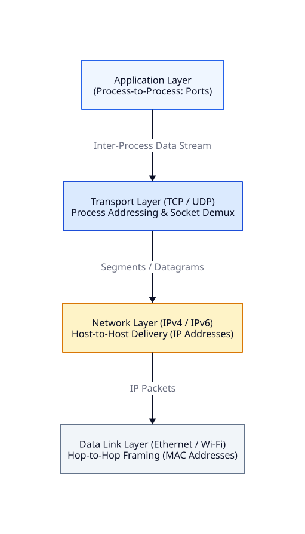

### The Delivery Hierarchy: Process-to-Process vs. Host-to-Host vs. Hop-to-Hop
To appreciate the transport layer's duty, one must contrast its delivery scope against the lower layers:
1. **Hop-to-Hop (Data Link Layer - Layer 2)**: Oversees frame delivery between two physically adjacent network nodes across a single physical cable or wireless channel. It has zero awareness of multi-hop topologies.
2. **Host-to-Host (Network Layer - Layer 3)**: Delivers packets from a source device (identified by a 32-bit IPv4 or 128-bit IPv6 address) to a destination device across dozens of intermediate routers. However, once the packet reaches the destination computer, the Network Layer's job is complete. It cannot deliver the data to a specific software program.
3. **Process-to-Process (Transport Layer - Layer 4)**: A modern computer runs hundreds of concurrent processes (web browsers, email clients, SSH sessions, streaming apps). The Transport Layer is responsible for delivering the data payload specifically to the **exact executing process** that requested it, and managing end-to-end reliability, flow rate, and congestion.

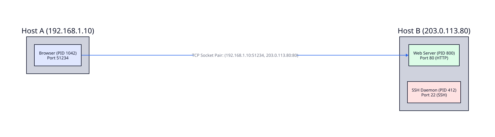

---

## 1.2 Process-to-Process Delivery & Addressing (Sockets and Ports)

### The Port Number Mechanism
To deliver data to the correct process, the Transport Layer employs a 16-bit integer identifier known as a **Port Number**, providing $2^{16} = 65,536$ unique port addresses (0 to 65535) per IP address. The Internet Assigned Numbers Authority (IANA) divides this address space into three standardized operational tiers:

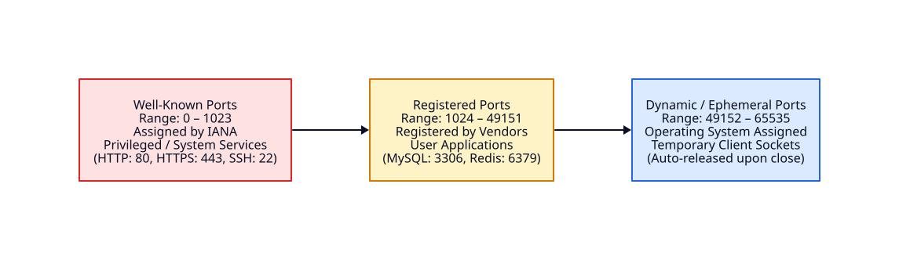

1. **Well-Known Ports (0 to 1023)**:
   - Reserved strictly for universal, standardized system-level server daemon processes.
   - Requires superuser/root administrative privileges to bind on Unix-like operating systems.
   - Examples: Port 20/21 (FTP), 22 (SSH), 23 (Telnet), 25 (SMTP), 53 (DNS), 67/68 (DHCP), 80 (HTTP), 110 (POP3), 143 (IMAP), 443 (HTTPS).
2. **Registered Ports (1024 to 49151)**:
   - Allocated by IANA upon request to third-party software vendors and standard user services to avoid port collisions.
   - Does not require administrative privileges to bind.
   - Examples: Port 1433 (MS SQL), 1521 (Oracle DB), 3306 (MySQL), 5432 (PostgreSQL), 6379 (Redis), 8080 (HTTP Alternate/Tomcat).
3. **Dynamic / Private / Ephemeral Ports (49152 to 65535)**:
   - Temporarily assigned by the host operating system's transport stack to client applications initiating an outbound connection.
   - Destroyed and recycled as soon as the communication session terminates.

### Sockets and the 5-Tuple Connection Identifier
A **Socket** represents an end-to-end communication endpoint created by binding an IP address to a Port number:
$$\text{Socket Address} = \text{IP Address} : \text{Port Number}$$
For example: `192.168.1.10:52140`.

In connection-oriented transport (TCP), an active conversation is uniquely identified globally across the Internet by a **5-Tuple**:
$$\text{Connection ID} = (\text{Protocol}, \text{Source IP}, \text{Source Port}, \text{Destination IP}, \text{Destination Port})$$
This 5-tuple design permits a single web server running on `203.0.113.50:80` to sustain tens of thousands of simultaneous, concurrent HTTP connections with distinct client sockets without cross-talk or race conditions.

---

## 1.3 Multiplexing and Demultiplexing Mechanics

Because host operating systems run many simultaneous applications over a single physical network interface card (NIC), the Transport Layer must perform bidirectional signal arbitration:

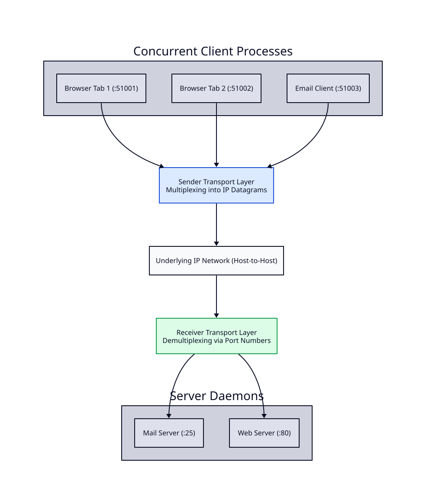

### Multiplexing (At Sender Host)
The Transport Layer gathers discrete chunks of data from multiple active application sockets, encapsulates each chunk into a transport protocol data unit (segment for TCP, datagram for UDP) by prefixing a header containing the source and destination port numbers, and passes these units down to the Network Layer for transmission.

### Demultiplexing (At Receiver Host)
When the Transport Layer receives datagrams delivered up from the Network Layer:
1. **Connectionless Demultiplexing (UDP)**: The transport stack inspects only the **Destination Port Number**. All arriving UDP datagrams bearing destination port $Y$ are routed into the exact same receive socket buffer, regardless of their source IP addresses or source port numbers.
2. **Connection-Oriented Demultiplexing (TCP)**: The transport stack inspects all four elements of the 4-tuple: $(\text{Source IP}, \text{Source Port}, \text{Destination IP}, \text{Destination Port})$. The segment is directed to the specific sub-socket thread dedicated exclusively to that connection.

---

## 1.4 Connection Management (Connection-Oriented vs. Connectionless)

The Transport Layer offers two fundamentally different paradigms of service to upper-layer applications:

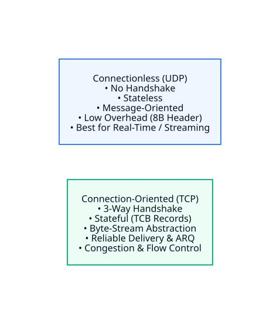

### Connection-Oriented Service
- Modeled like a telephone call.
- Executes three mandatory, sequential operational phases:
  1. **Connection Establishment**: Sender and receiver exchange control packets to synchronize initial sequence numbers ($ISN$), negotiate maximum segment sizes ($MSS$), and allocate OS memory buffers (e.g., TCP 3-Way Handshake).
  2. **Data Transfer**: Information is transmitted bidirectionally with continuous sequence tracking, cumulative acknowledgments, and window adjustments.
  3. **Connection Termination**: Both communicating parties gracefully tear down state records, release socket buffers, and close the session (e.g., TCP 4-Way Teardown).

### Connectionless Service
- Modeled like the postal mail system.
- Treats every transport data unit as an entirely independent entity (a datagram).
- Zero connection establishment delay: packets are dispatched instantly onto the network without prior notification to the receiver.
- Hosts maintain no session state, timers, or acknowledgments.

---

## 1.5 End-to-End Flow Control

### The Producer-Consumer Velocity Mismatch Problem
If a high-performance server transmits data at $10\text{ Gbps}$ over high-speed links to a resource-constrained smartphone or overloaded desktop that can only process data at $100\text{ Mbps}$, the receiver's OS buffer will immediately overflow. Arriving packets will be dropped, wasting transmission bandwidth.

### Hop-by-Hop vs. End-to-End Flow Control
- **Data Link Flow Control**: Operates hop-by-hop across an immediate physical wire between two switches or routers.
- **Transport Flow Control**: Operates **strictly end-to-end** between the ultimate source process and the destination process, completely transparent to intermediate routers.

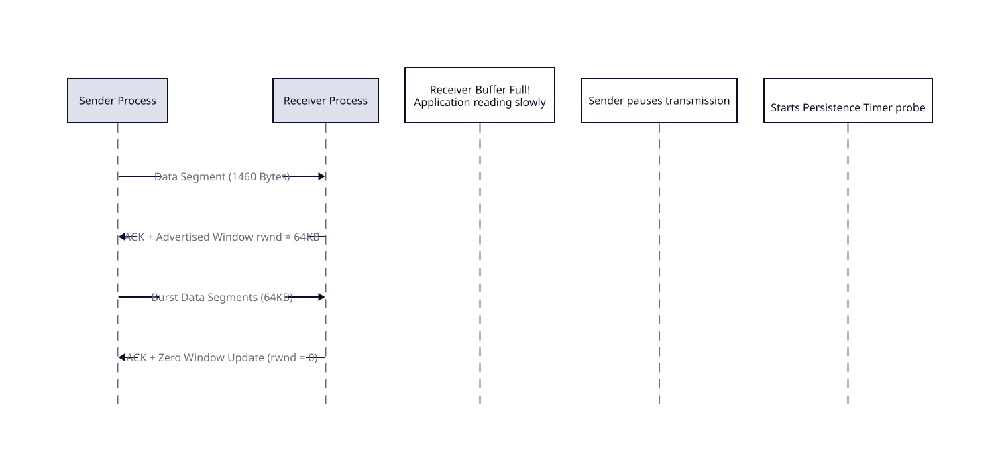

The receiver continuously informs the sender of its available buffer capacity using an **Advertised Window ($rwnd$)** field carried in transport header acknowledgments. The sender dynamically restricts its unacknowledged in-flight bytes:
$$\text{In-Flight Bytes} \le rwnd$$

---

## 1.6 End-to-End Error Control & Reliability

Because the underlying Network Layer (IP) is inherently **unreliable and best-effort** (it may silently corrupt bits, drop packets due to router queue exhaustion, or deliver packets out of order due to dynamic multipath routing), the Transport Layer provides **end-to-end reliability** to applications that require it.

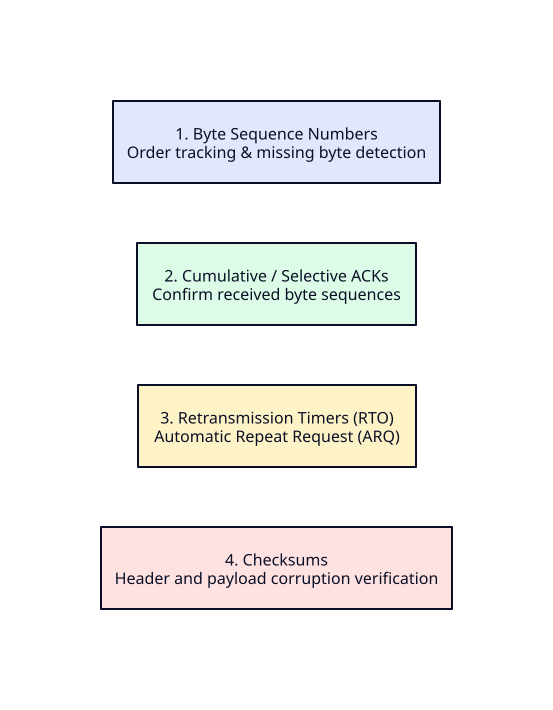

1. **Error Detection**: Employs mathematical checksum algorithms (such as the Internet Checksum or CRC-32c) covering the transport header, transport payload, and a pseudo-header from the network layer. Corrupted packets are silently discarded.
2. **Sequence Numbering**: Assigns unique sequence numbers to every byte or packet. Allows the destination stack to reconstruct the original linear byte stream regardless of path variations.
3. **Acknowledgments (ACKs)**: Informs the sender which bytes/packets arrived intact.
4. **Automatic Repeat reQuest (ARQ)**: If an acknowledgment fails to arrive before a dynamic **Retransmission Timeout (RTO)** expires, or if multiple duplicate ACKs signal a missing segment, the transport layer retransmits the missing data.
5. **Duplicate Discarding**: Network routing anomalies can clone packets. The receiver inspects sequence numbers; if an arriving packet has already been accepted, it is discarded while re-issuing an ACK to prevent sender deadlock.

---

## 1.7 Congestion Control & Network Core Protection

While Flow Control prevents the sender from overwhelming the **receiver**, **Congestion Control** prevents all competing senders collectively from overwhelming the **intermediate network infrastructure (routers, switches, and transmission links)**.

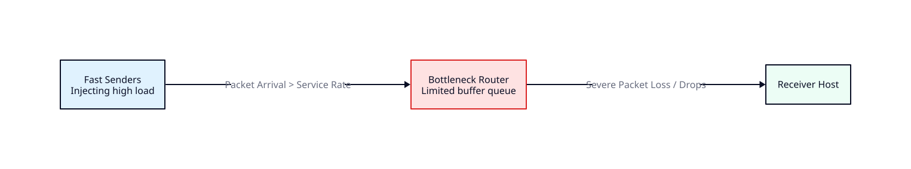

When aggregate traffic exceeds link capacities, router buffers fill up, queuing delay escalates toward infinity, and routers drop packets. If senders blindly retransmit dropped packets, the network enters **Congestion Collapse**.

The Transport Layer detects congestion through implicit signals (packet loss indicated by timeouts or duplicate ACKs; RTT increases) or explicit notifications (such as Explicit Congestion Notification - ECN bits in IP headers). It throttles transmission using a dynamic **Congestion Window ($cwnd$)**:
$$\text{Max Allowed Unacknowledged Data} = \min(rwnd, cwnd)$$

---

## 1.8 Quality of Service (QoS) & Application Support

The Transport Layer tailors its operational characteristics to meet the divergent quality demands of diverse applications:
1. **Delay-Sensitive vs. Loss-Tolerant (VoIP, Video Conferencing, Cloud Gaming)**: Prioritizes low latency over reliability. Prefers UDP; late retransmissions are useless for real-time playout.
2. **Loss-Intolerant vs. Delay-Tolerant (Financial Transfers, Software Downloads, Web Documents)**: Demands zero bit errors and guaranteed delivery. Prefers TCP; delay caused by retransmissions is acceptable.
3. **Timer Management Services**:
   - Dynamic Retransmission Timers (RTO) calculated using statistical round-trip smoothing.
   - Persistence Timers to prevent deadlocks caused by lost window updates.
   - Keepalive Timers to verify peer reachability during prolonged quiet periods.
   - Connection Teardown Timers (`TIME_WAIT`) to flush lingering network packets.

---

## 1.9 Master Summary Matrix: Transport Layer vs. Network Layer vs. Data Link Layer

| Evaluation Parameter | Data Link Layer (Layer 2) | Network Layer (Layer 3) | Transport Layer (Layer 4) |
| :--- | :--- | :--- | :--- |
| **Primary Scope of Delivery** | Hop-to-Hop / Node-to-Node | Host-to-Host | Process-to-Process |
| **Addressing Mechanism** | 48-bit Physical MAC Address | 32-bit (IPv4) / 128-bit (IPv6) Logical Address | 16-bit Port Number + Socket Address |
| **Protocol Data Unit (PDU)** | Frame | Packet / Datagram | Segment (TCP) / Datagram (UDP) / Packet (SCTP) |
| **Operating Hardware / Boundary**| Network Interface Cards, Bridges, Layer-2 Switches | Routers, Layer-3 Switches | End-host Operating System Kernel / User Space |
| **Flow Control Scope** | Node-to-Node across a single physical medium | None (or Hop-by-Hop Backpressure / Choke) | End-to-End between communicating endpoints |
| **Error Control Responsibility**| Bit detection/correction across a single link | Header integrity only (IPv4 checksum; none in IPv6) | Full end-to-end payload & header data integrity |
| **Multiplexing Entity** | Multiplexes network layer protocols (EtherType) | Multiplexes transport layer protocols (Protocol field) | Multiplexes multiple application processes (Ports) |
| **Awareness of End Applications**| Zero | Zero | Complete (Sockets bound to processes) |
| **Network Core Visibility** | Processed by every physical switch on the link | Processed and routed by every router in path | End-to-end only; invisible to pure IP transit routers |
| **Connection State Maintenance** | Per-link framing state (e.g., HDLC, PPP) | Stateless (in standard IP packet switching) | Stateful (TCP/SCTP) or Stateless (UDP) |

---

# Question 2: User Datagram Protocol (UDP)

## 2.1 Foundational Introduction & RFC 768 Design Philosophy

The **User Datagram Protocol (UDP)**, formally specified by David P. Reed in **IETF RFC 768 (1980)**, is the simplest, most minimalist transport layer protocol defined for the Internet Protocol suite. UDP was intentionally engineered as an ultra-thin architectural abstraction layer placed directly atop the Network Layer (IP).

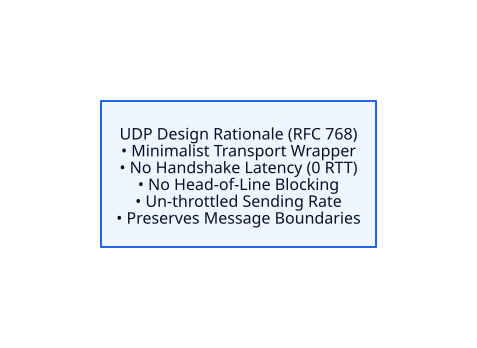

### The Rationale for an Unreliable Transport Protocol
At first glance, providing an "unreliable" transport service seems counter-intuitive. However, UDP exists because many modern distributed applications prioritize **minimal transmission latency, predictable packet dispatch timing, and simplicity** over guaranteed delivery:
- If a voice packet in a Voice-over-IP (VoIP) call is delayed by 300 ms because a reliable protocol stopped to retransmit it, the packet arrives too late to be played. It is useless garbage. Dropping the packet produces an imperceptible audio click, which human ears tolerate far better than conversation freezes.
- For lightweight transaction protocols like DNS, establishing a 3-way TCP handshake (1 RTT overhead) just to resolve a single domain name doubles lookup latency and overwhelms recursive DNS servers with connection state memory overhead.

---

## 2.2 Architectural Characteristics & Operating Principles

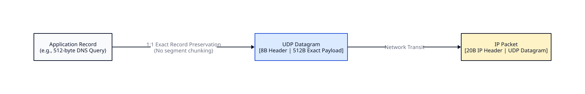

1. **Connectionless Paradigm**: UDP does not establish a connection before transmitting, nor does it tear one down when done. A UDP sender simply attaches the destination address and port, and dispatches the datagram into the network immediately.
2. **Stateless Communication**: A server running UDP maintains no connection state parameters: no sequence numbers, no acknowledgment numbers, no receive window sizes, and no retransmission timers. Consequently, a single UDP server can effortlessly serve orders of magnitude more concurrent clients than a TCP server with equivalent RAM.
3. **Unregulated Sending Rate**: UDP lacks congestion control and flow control mechanisms. The UDP transport stack never delays, splits, or throttles outgoing data. The application layer can push packets onto the network as fast as the local physical hardware interface allows.
4. **Message-Oriented Framing (Preservation of Boundaries)**:
   - TCP is a byte-stream protocol: if an application writes 100 bytes four times consecutively, TCP may merge them into a single 400-byte segment or split them into irregular chunks.
   - UDP is strictly **message-oriented**: if an application writes four separate datagrams of 100 bytes each, the receiving application will read exactly four separate messages of 100 bytes each. Datagram boundaries are preserved.

---

## 2.3 Bit-Level UDP Datagram Header Structure

The UDP header is renowned for its elegance and brevity. It consists of exactly **8 octets (64 bits)** structured into four 16-bit fields:

```
 0                   1                   2                   3
 0 1 2 3 4 5 6 7 8 9 0 1 2 3 4 5 6 7 8 9 0 1 2 3 4 5 6 7 8 9 0 1
+-+-+-+-+-+-+-+-+-+-+-+-+-+-+-+-+-+-+-+-+-+-+-+-+-+-+-+-+-+-+-+-+
|          Source Port          |       Destination Port        |
+-+-+-+-+-+-+-+-+-+-+-+-+-+-+-+-+-+-+-+-+-+-+-+-+-+-+-+-+-+-+-+-+
|            Length             |           Checksum            |
+-+-+-+-+-+-+-+-+-+-+-+-+-+-+-+-+-+-+-+-+-+-+-+-+-+-+-+-+-+-+-+-+
|                                                               |
|                  Data Payload (if any)                        |
|                                                               |
+-+-+-+-+-+-+-+-+-+-+-+-+-+-+-+-+-+-+-+-+-+-+-+-+-+-+-+-+-+-+-+-+
```

### Field-by-Field Breakdown

#### 1. Source Port (16 Bits / 2 Octets)
- **Range**: `0` to `65535` (`0x0000` to `0xFFFF`).
- **Function**: Identifies the sending application process on the source host.
- **Operational Rule**: If the sender is a client expecting a reply from the server, this field contains the client's ephemeral port number. If the communication is strictly unidirectional and no reply is expected or possible, this field may be set to all zeros (`0x0000`).

#### 2. Destination Port (16 Bits / 2 Octets)
- **Range**: `0` to `65535`.
- **Function**: Identifies the destination application process on the receiving host.
- **Operational Rule**: Mandatory field. Used by the receiver's transport stack to demultiplex the payload to the correct application socket.

#### 3. Length (16 Bits / 2 Octets)
- **Range**: `8` to `65535` bytes.
- **Function**: Specifies the total length of the UDP datagram in bytes, including **both the 8-byte header and the variable-length data payload**.
- **Theoretical Minimum**: $8\text{ bytes}$ (when data payload length is zero).
- **Theoretical Maximum**: The theoretical maximum is $65,535\text{ bytes}$ (constrained by the 16-bit field). In practice, an IPv4 packet's Total Length field is also 16 bits ($65,535\text{ bytes}$). Subtracting the standard 20-byte IPv4 header and the 8-byte UDP header, the maximum practical UDP payload over IPv4 is:
$$\text{Max Payload}_{\text{IPv4}} = 65535 - 20 - 8 = 65,507\text{ bytes}$$

#### 4. Checksum (16 Bits / 2 Octets)
- **Function**: Provides end-to-end error detection covering the UDP header, the UDP payload, and a 12-byte IPv4 (or 40-byte IPv6) **Pseudo-Header**.
- **Operational Rule in IPv4**: **Optional**. If the sender chooses not to compute the checksum, it transmits all zeros (`0x0000`). If the computed checksum evaluates to `0x0000`, the sender transmits `0xFFFF` (its 1's complement equivalent) to distinguish it from a disabled checksum.
- **Operational Rule in IPv6**: **Strictly Mandatory** (RFC 8200), because the IPv6 network header eliminated the IPv4 header checksum to optimize router forwarding performance.

---

## 2.4 UDP Pseudo-Header & Internet Checksum Computation

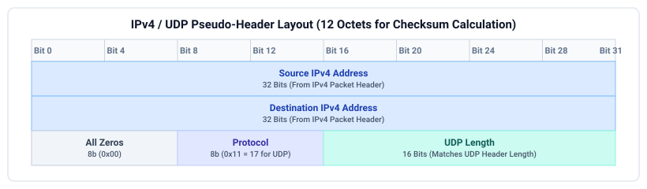

### Rationale for the Pseudo-Header
A common question in network engineering is: *Why does a Layer 4 protocol inspect Layer 3 IP addresses during its checksum calculation?*

If an intermediate router experiences memory corruption and alters a packet's destination IP address, the packet will be delivered to the wrong physical host. If that wrong host happens to run an application listening on the same destination port, that application would silently process foreign, corrupted data. To prevent this, UDP constructs a temporary **Pseudo-Header** containing critical Network Layer addressing fields during checksum calculation.

```
 0                   1                   2                   3
 0 1 2 3 4 5 6 7 8 9 0 1 2 3 4 5 6 7 8 9 0 1 2 3 4 5 6 7 8 9 0 1
+-+-+-+-+-+-+-+-+-+-+-+-+-+-+-+-+-+-+-+-+-+-+-+-+-+-+-+-+-+-+-+-+
|                       Source IP Address                       |
+-+-+-+-+-+-+-+-+-+-+-+-+-+-+-+-+-+-+-+-+-+-+-+-+-+-+-+-+-+-+-+-+
|                    Destination IP Address                     |
+-+-+-+-+-+-+-+-+-+-+-+-+-+-+-+-+-+-+-+-+-+-+-+-+-+-+-+-+-+-+-+-+
|     Zeros     |    Protocol   |          UDP Length           |
|    (8 bits)   |  (8 bits = 17)|           (16 bits)           |
+-+-+-+-+-+-+-+-+-+-+-+-+-+-+-+-+-+-+-+-+-+-+-+-+-+-+-+-+-+-+-+-+
```

### The Checksum Algorithm
1. Prepend the 12-byte Pseudo-Header to the 8-byte UDP header and data payload.
2. If the data payload contains an odd number of octets, append a single padding byte of zeros (`0x00`) to the end (padding is used solely for checksum computation and is discarded prior to transmission).
3. Initialize the Checksum field in the UDP header to `0x0000`.
4. Divide the entire composite block into consecutive 16-bit words.
5. Sum all 16-bit words using **1's complement arithmetic** (any carry-out beyond bit 15 is wrapped around and added to the least significant bit).
6. Take the 1's complement (bitwise NOT) of the final sum. This inverted result is placed into the Checksum field.

---

### Step-by-Step Numerical Example: UDP Checksum Calculation

Consider a UDP datagram sent with the following parameters:
- **Source IP**: `192.168.1.1` $\to$ Hex: `C0A8 0101`
- **Destination IP**: `192.168.1.2` $\to$ Hex: `C0A8 0102`
- **Protocol**: `17` (UDP) $\to$ Hex: `0011` (combined with 8 zero bits: `0011`)
- **Source Port**: `1024` $\to$ Hex: `0400`
- **Destination Port**: `53` (DNS) $\to$ Hex: `0035`
- **UDP Length**: `12 bytes` (8-byte header + 4-byte payload) $\to$ Hex: `000C`
- **Data Payload**: `"TEST"` $\to$ ASCII Hex: `'T','E'` = `5445`, `'S','T'` = `5354`

#### Step 1: Lay out the 16-bit words
```
Word 1 (Src IP High)  : C0A8
Word 2 (Src IP Low)   : 0101
Word 3 (Dst IP High)  : C0A8
Word 4 (Dst IP Low)   : 0102
Word 5 (Zeros + Proto): 0011
Word 6 (UDP Length)   : 000C
Word 7 (Src Port)     : 0400
Word 8 (Dst Port)     : 0035
Word 9 (UDP Length)   : 000C
Word 10 (Checksum Init): 0000
Word 11 (Data "TE")   : 5445
Word 12 (Data "ST")   : 5354
```

#### Step 2: Sum the words using 1's complement addition
Let us aggregate these hexadecimal values:
$$\text{Sum} = \text{C0A8} + \text{0101} + \text{C0A8} + \text{0102} + \text{0011} + \text{000C} + \text{0400} + \text{0035} + \text{000C} + \text{0000} + \text{5445} + \text{5354}$$

- $\text{C0A8} + \text{0101} = \text{C1A9}$
- $\text{C1A9} + \text{C0A8} = \text{18251} \implies \text{8251} + 1 = \text{8252}$ (wrap carry)
- $\text{8252} + \text{0102} = \text{8354}$
- $\text{8354} + \text{0011} = \text{8365}$
- $\text{8365} + \text{000C} = \text{8371}$
- $\text{8371} + \text{0400} = \text{8771}$
- $\text{8771} + \text{0035} = \text{87A6}$
- $\text{87A6} + \text{000C} = \text{87B2}$
- $\text{87B2} + \text{5445} = \text{DBF7}$
- $\text{DBF7} + \text{5354} = \text{12F4B} \implies \text{2F4B} + 1 = \text{2F4C}$ (wrap carry)

$$\text{Final 1's Complement Sum} = \text{0x2F4C}$$

#### Step 3: Compute the 1's complement of the sum
$$\text{Checksum} = \sim(\text{0x2F4C}) = \text{0xD0B3}$$
The value `0xD0B3` is inserted into the 16-bit Checksum field.

#### Step 4: Verification at Receiver
The receiver sums all 12 words, now including Word 10 as `0xD0B3`:
$$\text{Sum}_{\text{receiver}} = \text{0x2F4C} + \text{0xD0B3} = \text{0xFFFF}$$
Because the sum yields all 1-bits (`0xFFFF`), the receiver confirms zero bit transmission errors have occurred.

---

## 2.5 Multiplexing and Demultiplexing in UDP

Unlike TCP, which uses a 4-tuple to map incoming segments to specific connection sockets, UDP performs demultiplexing using a **2-tuple**:
$$\text{UDP Demux Key} = (\text{Destination IP Address}, \text{Destination Port Number})$$

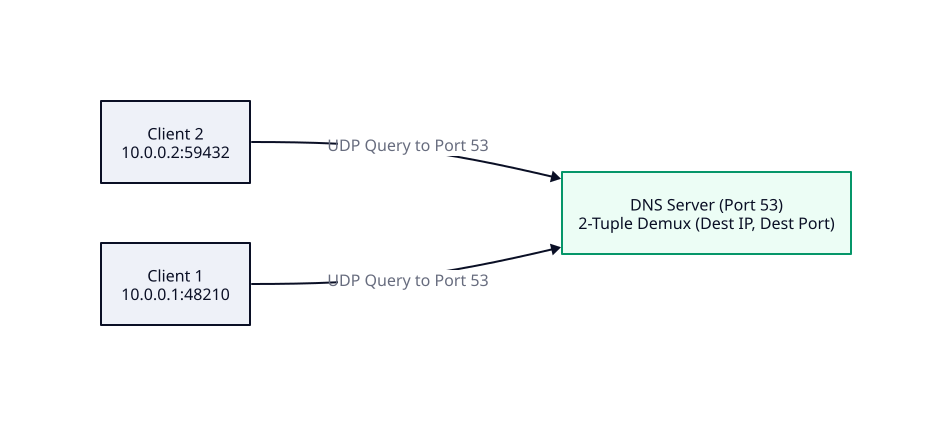

- When Host A and Host B transmit DNS queries to the server at port 53, both incoming datagrams land in the **same receiving socket queue**.
- To reply, the DNS application process inspects the `Source IP` and `Source Port` embedded inside each received datagram and directs its response to that specific client endpoint.

---

## 2.6 Well-Known UDP Port Numbers & Prominent Applications

| Port Number | Protocol | Full Name | Primary Operational Reason for Choosing UDP |
| :---: | :---: | :--- | :--- |
| **53** | **DNS** | Domain Name System | Low transaction overhead; single request/reply fits in one datagram; avoids handshake latency. |
| **67 / 68** | **DHCP** | Dynamic Host Configuration Protocol | Bootstrapping clients have no configured IP address; TCP cannot run over unconfigured, broadcast links. |
| **69** | **TFTP** | Trivial File Transfer Protocol | Embedded ROM bootloaders lack memory space to implement complex TCP state machines. |
| **123** | **NTP** | Network Time Protocol | Millisecond timing precision requires zero connection setup delay or jitter from retransmission queues. |
| **161 / 162**| **SNMP** | Simple Network Management Protocol | Network monitoring must succeed even when routers are congested or dropping TCP connections. |
| **520** | **RIP** | Routing Information Protocol | Periodic broadcast/multicast of routing tables to adjacent neighbors over local broadcast links. |
| **5004 / 5005**| **RTP** | Real-Time Transport Protocol | Audio/video streaming where packet retransmissions arrive too late to be presented. |
| **443** | **QUIC** | Quick UDP Internet Connections (HTTP/3)| Implements multiplexed reliable transport in user-space atop UDP, eliminating TCP Head-of-Line blocking. |

---

## 2.7 UDP Vulnerabilities, Failure Modes & Mitigations

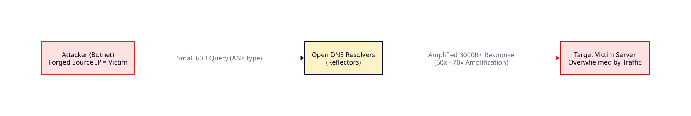

1. **UDP Spoofing & Reflection / Amplification Attacks**:
   - Because UDP is connectionless and performs no handshake verification, an attacker can trivially forge (spoof) the Source IP address in a UDP header.
   - Attackers send small queries (e.g., 60-byte DNS `ANY` requests or NTP monlist requests) with the victim's IP as the spoofed source to thousands of open internet resolvers. The servers reply with massive 3000-byte responses directly to the victim, saturating their bandwidth (50x amplification).
   - *Mitigation*: BCP 38 / RFC 2827 Ingress Filtering to block spoofed IP packets at ISP borders; Response Rate Limiting (RRL) on authoritative servers.
2. **Congestion Collapse via Unregulated UDP Flooding**:
   - Rogue or misconfigured UDP applications transmitting at full line rate ignore network congestion, starving well-behaved TCP connections that throttle back their rates.
   - *Mitigation*: Router-level Active Queue Management (AQM), such as Random Early Detection (RED) and per-flow Fair Queuing (FQ).

---

## 2.8 Master Comparison Matrix: UDP vs. TCP vs. Raw IP

| Evaluation Parameter | Raw IP (Layer 3) | UDP (Layer 4) | TCP (Layer 4) |
| :--- | :--- | :--- | :--- |
| **Standard Specification** | RFC 791 / RFC 8200 | RFC 768 | RFC 793 / RFC 9293 |
| **Delivery Model** | Host-to-Host | Process-to-Process | Process-to-Process |
| **Connection Paradigm** | Connectionless | Connectionless | Connection-Oriented |
| **Header Size** | 20–60 bytes (IPv4) / 40 bytes (IPv6)| Exactly 8 bytes | 20–60 bytes |
| **Reliability Guarantee** | Unreliable (Best-effort) | Unreliable (Best-effort) | Guaranteed Reliable |
| **Ordering Guarantee** | Packets may arrive out-of-order | Datagrams may arrive out-of-order | Strictly in-order byte stream |
| **Data Framing Nature** | Packet / Datagram | Discrete Datagram Messages | Continuous Byte Stream |
| **Handshake Latency** | None | 0 RTT (Immediate transmit) | 1 RTT (3-Way Handshake) |
| **Flow Control** | None | None | Yes (Sliding Window, $rwnd$) |
| **Congestion Control** | None | None | Yes (AIMD, Slow Start, $cwnd$) |
| **Demultiplexing Key** | Protocol Number (8 bits) | 2-Tuple `(Dst IP, Dst Port)` | 4-Tuple `(Src IP, Src Port, Dst IP, Dst Port)`|
| **Checksum Scope** | IPv4 Header only; None in IPv6 | Header + Payload + Pseudo-Header | Header + Payload + Pseudo-Header |
| **Server OS Overhead** | None | Extremely Low (Stateless) | High (State per open connection) |
| **Broadcast / Multicast** | Yes | Full Support | No (Unicast point-to-point only) |

---

# Question 3: Transmission Control Protocol (TCP)

## 3.1 Design Philosophy, RFC Standards & Virtual Circuit Abstraction

The **Transmission Control Protocol (TCP)**, originally defined by Vinton Cerf and Robert Kahn in **RFC 793 (1981)** and modernly codified in **RFC 9293 (2022)**, is the foundational workhorse protocol powering the World Wide Web, secure shell access, electronic mail, database clustering, and cloud systems.

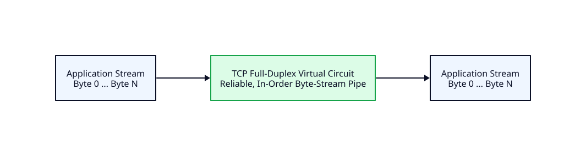

### The Virtual Circuit Abstraction
Underneath TCP lies an unreliable, packet-switched Internet core that drops, duplicates, delays, and misroutes packets across changing paths. TCP shields applications from this reality by presenting the abstraction of a **reliable, full-duplex, point-to-point virtual circuit**. An application can write a multi-gigabyte file into a TCP socket as a continuous stream of unstructured bytes, confident that TCP will reconstruct that exact byte sequence at the destination without loss, duplication, or corruption.

---

## 3.2 Exhaustive TCP Segment Header Layout (Bit-by-Bit Field Breakdown)

The TCP segment header has a minimum length of **20 octets (160 bits)** and can extend up to **60 octets** when optional parameters are included:

```
 0                   1                   2                   3
 0 1 2 3 4 5 6 7 8 9 0 1 2 3 4 5 6 7 8 9 0 1 2 3 4 5 6 7 8 9 0 1
+-+-+-+-+-+-+-+-+-+-+-+-+-+-+-+-+-+-+-+-+-+-+-+-+-+-+-+-+-+-+-+-+
|          Source Port          |       Destination Port        |
+-+-+-+-+-+-+-+-+-+-+-+-+-+-+-+-+-+-+-+-+-+-+-+-+-+-+-+-+-+-+-+-+
|                        Sequence Number                        |
+-+-+-+-+-+-+-+-+-+-+-+-+-+-+-+-+-+-+-+-+-+-+-+-+-+-+-+-+-+-+-+-+
|                    Acknowledgment Number                      |
+-+-+-+-+-+-+-+-+-+-+-+-+-+-+-+-+-+-+-+-+-+-+-+-+-+-+-+-+-+-+-+-+
|  Data |           |U|A|P|R|S|F|                               |
| Offset| Reserved  |R|C|S|S|Y|I|            Window             |
| (4b)  |  (4 bits) |G|K|H|T|N|N|                               |
+-+-+-+-+-+-+-+-+-+-+-+-+-+-+-+-+-+-+-+-+-+-+-+-+-+-+-+-+-+-+-+-+
|           Checksum            |        Urgent Pointer         |
+-+-+-+-+-+-+-+-+-+-+-+-+-+-+-+-+-+-+-+-+-+-+-+-+-+-+-+-+-+-+-+-+
|                    Options (0 to 40 bytes)                    |
+-+-+-+-+-+-+-+-+-+-+-+-+-+-+-+-+-+-+-+-+-+-+-+-+-+-+-+-+-+-+-+-+
|                    Data Payload (Variable)                    |
+-+-+-+-+-+-+-+-+-+-+-+-+-+-+-+-+-+-+-+-+-+-+-+-+-+-+-+-+-+-+-+-+
```

### Bit-by-Bit Field Analysis

#### 1. Source Port (16 Bits) & Destination Port (16 Bits)
- Define the local sending and remote receiving application processes.

#### 2. Sequence Number (32 Bits)
- **Byte-Stream Tracking**: TCP does not count packets; it **numbers every individual byte** of data transmitted.
- **Rules**:
  - In a connection setup segment (`SYN` flag set to 1), this field contains the client's or server's **Initial Sequence Number ($ISN$)**, randomly generated to prevent old duplicate segments from overlapping new connections.
  - In standard data-carrying segments, this field holds the sequence number of the **very first data byte** carried in this segment's payload:
$$\text{Seq}_{\text{Segment}} = ISN + 1 + \text{Byte Offset}$$

#### 3. Acknowledgment Number (32 Bits)
- **Valid Condition**: Only valid when the `ACK` control flag is set to 1 (which is true for virtually every segment following the initial SYN).
- **Cumulative Semantics**: Holds the sequence number of the **next byte the receiver expects to receive**. An ACK value of $K$ explicitly confirms that all bytes up to $K-1$ have been received intact.

#### 4. Data Offset / Header Length (HLEN) (4 Bits)
- Specifies the size of the TCP header measured in **32-bit (4-byte) words**.
- **Minimum Value**: $5$ ($5 \times 4 = 20\text{ bytes}$, no options present).
- **Maximum Value**: $15$ ($15 \times 4 = 60\text{ bytes}$, allowing up to 40 bytes of optional parameters).

#### 5. Reserved Field (4 Bits)
- Reserved for future standardization; must be set to all zeros. (Historically 6 bits, now 4 bits due to ECN allocation of CWR and ECE).

#### 6. Control Flags (6 to 9 Bits)
Indicate the purpose and state transitions of the segment:
- **CWR (Congestion Window Reduced)**: Sender informs peer it reduced its congestion window in response to an ECE flag.
- **ECE (ECN-Echo)**: Receiver informs sender that intermediate routers experienced congestion (ECN bits set in IP header).
- **URG (Urgent)**: When set, the 16-bit Urgent Pointer field is valid.
- **ACK (Acknowledgment)**: Confirms the Acknowledgment Number field is valid.
- **PSH (Push)**: Prompts the receiving transport stack to immediately flush buffered data to the receiving application without waiting for buffers to fill.
- **RST (Reset)**: Forcibly resets and terminates a malfunctioning or rejected connection (e.g., connection attempt to a closed port).
- **SYN (Synchronize)**: Initiates a connection and synchronizes initial sequence numbers ($ISN$).
- **FIN (Finish)**: Initiates graceful connection teardown; signals the sender has no more data to transmit.

#### 7. Window Size (16 Bits)
- Used for **Flow Control**.
- Specifies the number of bytes the receiver is willing to accept beyond the acknowledged byte ($rwnd$). Maximum native value is $2^{16}-1 = 65,535\text{ bytes}$ (expandable to $1\text{ GB}$ using the Window Scale Option).

#### 8. Checksum (16 Bits)
- Mandatory 16-bit 1's complement checksum covering the TCP header, payload, and the 12-byte IPv4 / 40-byte IPv6 pseudo-header.

#### 9. Urgent Pointer (16 Bits)
- When the `URG` flag is 1, this field contains an offset added to the Sequence Number pointing to the final byte of urgent out-of-band data (e.g., Ctrl+C interrupt in Telnet).

#### 10. Options (0 to 40 Bytes, padded to 32-bit boundary)
Crucial modern performance options:
- **Maximum Segment Size (MSS - Kind 2, 4 bytes)**: Informs peer of the largest raw TCP payload the host can receive without IP fragmentation (typically $1460\text{ bytes}$ on Ethernet: $1500\text{ MTU} - 20\text{ IP} - 20\text{ TCP}$).
- **Window Scale (Kind 3, 3 bytes - RFC 1323)**: Multiplies the 16-bit Window field by $2^S$ (up to $S=14$), supporting window sizes up to $1\text{ GB}$ on high-bandwidth networks.
- **Selective Acknowledgment Permitted (SACK - RFC 2018)**: Allows the receiver to acknowledge non-contiguous isolated blocks of received data, avoiding retransmission of already-buffered packets.
- **Timestamps (Kind 8, 10 bytes)**: Enables precise RTT measurement and Protection Against Wrapped Sequences (PAWS).

---

## 3.3 Connection Management Lifecycle (Handshake, Teardown, and FSM)

### 1. Connection Establishment: The 3-Way Handshake

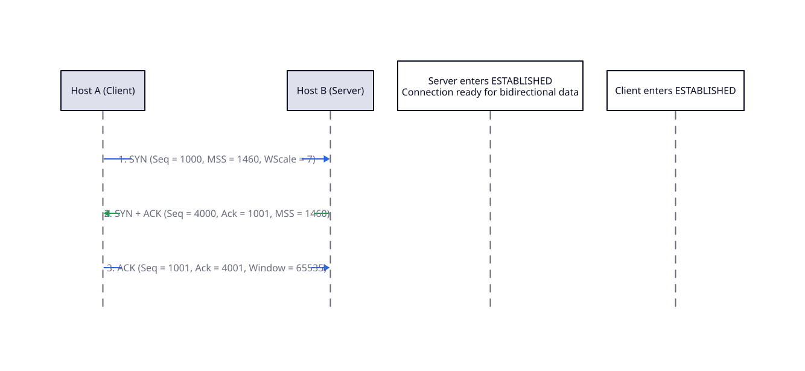

- **Step 1 (SYN)**: Client chooses a random initial sequence number $ISN_C$ and dispatches a control segment with `SYN=1`. It carries options such as MSS and Window Scale.
- **Step 2 (SYN-ACK)**: Server receives the SYN, allocates a Transmission Control Block (TCB) buffer, chooses its own random $ISN_S$, and sends `SYN=1, ACK=1` with acknowledgment number $ISN_C + 1$.
- **Step 3 (ACK)**: Client confirms server's $ISN$ by replying with `ACK=1` and acknowledgment number $ISN_S + 1$. This segment may also carry the first bytes of application data (e.g., HTTP GET).

#### SYN Flood Attack & SYN Cookie Mitigation
- **Vulnerability**: An attacker sends thousands of spoofed SYN packets without ever completing Step 3. The server allocates TCB state memory for each connection in its half-open connection backlog table until RAM is exhausted, crashing the server.
- **Mitigation (SYN Cookies)**: The server **refuses to allocate memory** upon receiving a SYN. Instead, it encodes the connection state, client MSS, and a cryptographic hash into the server's Initial Sequence Number:
$$ISN_S = \text{HMAC}(\text{SrcIP}, \text{DstIP}, \text{SrcPort}, \text{DstPort}, \text{SecretKey}, \text{Timestamp}) + \text{MSS Index}$$
When the legitimate client returns the ACK with $Ack = ISN_S + 1$, the server decrypts the cookie from the ACK, verifies the hash, and allocates the socket buffer on demand.

---

### 2. Connection Teardown: The 4-Way Handshake

Because TCP is **full-duplex**, each transmission direction must be shut down independently:

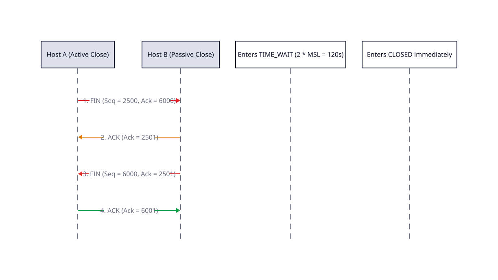

#### The TIME_WAIT State and $2 \times \text{MSL}$ Rationale
Why does the active closer wait in `TIME_WAIT` for two times the Maximum Segment Lifetime ($2 \times \text{MSL}$, typically 1 to 2 minutes) before closing?
1. **Reliable Final ACK Delivery**: If the client's final ACK (Step 4) is lost in transit, the server will time out and retransmit its FIN (Step 3). If the client had immediately closed and freed its port, it would respond to this retransmitted FIN with an error `RST`. The `TIME_WAIT` state ensures the client stays alive to re-issue the ACK.
2. **Flushing Old Duplicate Segments**: Wandering packets trapped in routing loops could arrive after the connection closes. The $2 \times \text{MSL}$ delay guarantees that all lingering duplicates have dissipated from the Internet before a new connection can reuse the same socket 5-tuple.

---

### 3. Complete TCP Finite State Machine (FSM)

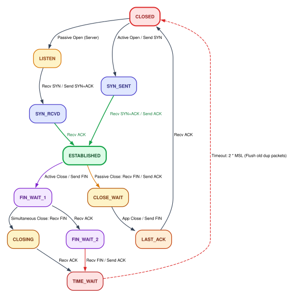

---

## 3.4 TCP Flow Control Mechanics & Silly Window Syndrome

### The Byte-Oriented Sliding Window Protocol
TCP flow control uses a byte-level sliding window driven by the receiver's available buffer:

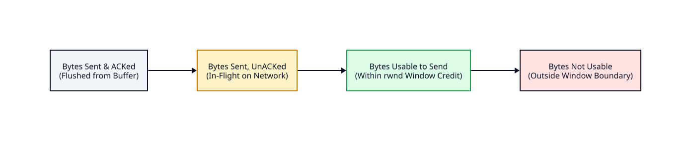

The sender's transmission limit is governed by the relation:
$$\text{Last Byte Sent} - \text{Last Byte ACKed} \le rwnd$$

### Silly Window Syndrome (SWS)
A catastrophic throughput collapse where TCP exchanges data in tiny fragments (e.g., 1 byte of payload inside a 40-byte TCP/IP header, yielding a dismal $2.4\%$ link efficiency). SWS can be triggered from either endpoint:

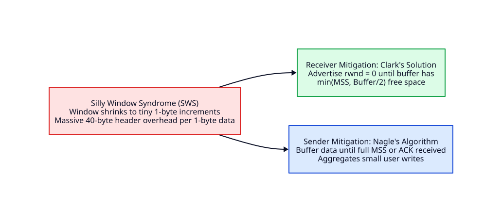

#### 1. Sender-Side SWS & Nagle's Algorithm (RFC 896)
- **Problem**: Application writes data byte-by-byte. The sender naively dispatches each single byte in an individual segment.
- **Nagle's Solution**:
  1. Send the first byte immediately.
  2. Buffer all subsequent application bytes in the send buffer until either:
     - An acknowledgment arrives for previously transmitted data, **OR**
     - Accumulated buffer data reaches the Maximum Segment Size ($MSS$).

#### 2. Receiver-Side SWS & Clark's Solution (RFC 813)
- **Problem**: When a full receive buffer clears by only 1 byte, the receiver immediately advertises $rwnd = 1$. The sender dutifully transmits a 1-byte segment.
- **Clark's Solution**: The receiver is forbidden from advertising tiny window increments. The receiver must advertise $rwnd = 0$ until available buffer space reaches:
$$\text{Advertised Space} \ge \min\left(\text{MSS}, \frac{\text{Total Receiver Buffer Capacity}}{2}\right)$$

---

## 3.5 TCP Congestion Control Architecture (Tahoe vs. Reno)

TCP maintains a **Congestion Window ($cwnd$)** representing the maximum volume of unacknowledged data the intermediate network can handle without dropping packets.

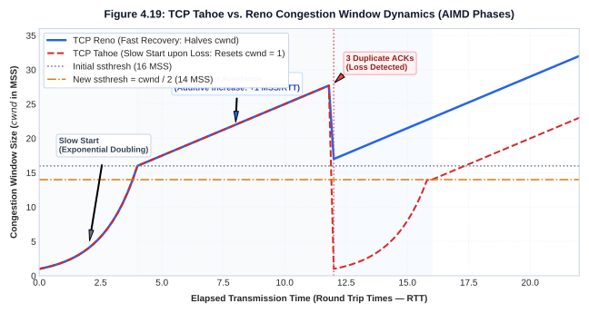

### The Four Core Phases

#### 1. Slow Start Phase
- **Initial State**: $cwnd = 1\text{ MSS}$ (or initial window of 10 MSS in modern RFC 6928).
- **Growth Rule**: For **every individual ACK** received, increment $cwnd$ by $1\text{ MSS}$:
$$cwnd \gets cwnd + 1\text{ MSS}$$
- Over one Round-Trip Time ($RTT$), the window **doubles exponentially** ($1 \to 2 \to 4 \to 8 \dots$).
- **Transition**: Continues until $cwnd$ reaches the slow-start threshold ($ssthresh$).

#### 2. Congestion Avoidance Phase (Additive Increase)
- Begins when $cwnd \ge ssthresh$.
- **Growth Rule**: For every full $RTT$ of acknowledged data, increment $cwnd$ by only $1\text{ MSS}$:
$$cwnd \gets cwnd + \frac{1}{cwnd}\text{ MSS} \quad (\text{per received ACK})$$
- Produces a cautious, predictable linear increase in transmission rate.

#### 3. Fast Retransmit
- When a single segment is lost but subsequent segments arrive, the receiver sends **duplicate ACKs** specifying the missing byte.
- Upon receiving **3 duplicate ACKs** (4 identical ACKs total), the sender concludes a segment was lost in transit without waiting for the slow Retransmission Timeout (RTO) to expire. It immediately retransmits the missing segment.

#### 4. Fast Recovery: TCP Tahoe vs. TCP Reno

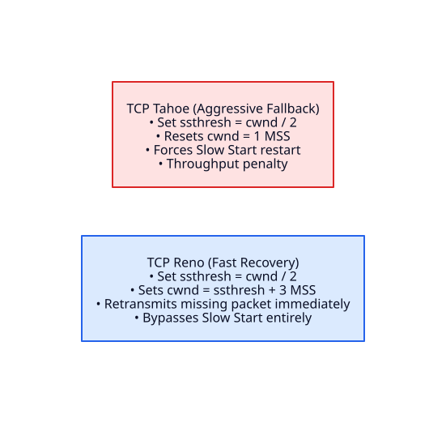

- **Timeout Event**: If loss is so severe that no ACKs return and the RTO timer expires, both Tahoe and Reno set $ssthresh = cwnd / 2$, collapse $cwnd = 1\text{ MSS}$, and reset to Slow Start.

---

## 3.6 TCP Error Control, Retransmission Timers & Dynamic RTT Estimation

### Dynamic Retransmission Timeout (Jacobson's Algorithm - RFC 6298)
Because network paths vary from sub-millisecond local LANs to 600 ms satellite links, a static timer would cause spurious retransmissions or sluggish recovery. TCP dynamically calculates the **Retransmission Timeout ($RTO$)** using smoothed statistical tracking:

1. **Measure Sample RTT ($RTT_m$)**: Time elapsed between dispatching a segment and receiving its ACK.
2. **Update Smoothed RTT ($SRTT$)**:
$$SRTT_{\text{new}} = (1 - \alpha) \cdot SRTT_{\text{old}} + \alpha \cdot RTT_m \quad (\text{Default } \alpha = 0.125)$$
3. **Update RTT Variation ($RTTVAR$)**:
$$RTTVAR_{\text{new}} = (1 - \beta) \cdot RTTVAR_{\text{old}} + \beta \cdot |SRTT_{\text{new}} - RTT_m| \quad (\text{Default } \beta = 0.25)$$
4. **Compute RTO**:
$$RTO = SRTT + 4 \cdot RTTVAR \quad (\text{Minimum bound: } 1.0\text{ second})$$

### Karn's Algorithm for Retransmissions
- **Ambiguity Dilemma**: If a segment times out and is retransmitted, and an ACK subsequently arrives, was that ACK acknowledging the original segment or the retransmitted segment?
- **Karn's Rule**:
  1. **Never update $SRTT$ or $RTTVAR$ using measurements from retransmitted segments**.
  2. For consecutive retransmissions, apply **Exponential Timer Backoff**:
$$RTO_{\text{backoff}} = 2 \cdot RTO$$

---

### Step-by-Step Numerical Example: RTO Calculation
Let current estimates be:
- $SRTT_{\text{old}} = 100\text{ ms}$
- $RTTVAR_{\text{old}} = 20\text{ ms}$
- Newly measured sample $RTT_m = 140\text{ ms}$
- Parameters: $\alpha = 0.125 = \frac{1}{8}$, $\beta = 0.25 = \frac{1}{4}$

#### Step 1: Update $SRTT$
$$SRTT_{\text{new}} = (1 - 0.125) \cdot 100 + 0.125 \cdot 140 = 87.5 + 17.5 = 105\text{ ms}$$

#### Step 2: Update $RTTVAR$
$$|SRTT_{\text{new}} - RTT_m| = |105 - 140| = 35\text{ ms}$$
$$RTTVAR_{\text{new}} = (1 - 0.25) \cdot 20 + 0.25 \cdot 35 = 15 + 8.75 = 23.75\text{ ms}$$

#### Step 3: Compute New $RTO$
$$RTO = SRTT_{\text{new}} + 4 \cdot RTTVAR_{\text{new}} = 105 + 4 \cdot (23.75) = 105 + 95 = 200\text{ ms}$$
The dynamic retransmission timer updates from $180\text{ ms}$ to $200\text{ ms}$.

---

## 3.7 Master TCP Operational Lifecycle & State Matrix

| State | Who Enters? | Triggering Event | Emitted Segment | Next State |
| :--- | :--- | :--- | :--- | :--- |
| **`LISTEN`** | Server | Application calls `listen()` | None | Waits for incoming SYN |
| **`SYN_SENT`**| Client | Application calls `connect()` | `SYN` (with $ISN_C$) | `ESTABLISHED` (upon SYN+ACK) |
| **`SYN_RCVD`**| Server | Receives `SYN` while in `LISTEN` | `SYN+ACK` (with $ISN_S$) | `ESTABLISHED` (upon ACK) |
| **`ESTABLISHED`**| Both | Handshake complete | Data / ACKs | Normal Data Transfer |
| **`FIN_WAIT_1`**| Active Closer | Application calls `close()` | `FIN` | `FIN_WAIT_2` or `CLOSING` |
| **`FIN_WAIT_2`**| Active Closer | Receives `ACK` for its `FIN` | None | `TIME_WAIT` (upon receiving peer FIN) |
| **`CLOSE_WAIT`**| Passive Closer| Receives peer's `FIN` | `ACK` | `LAST_ACK` (when local app closes) |
| **`CLOSING`** | Both | Both send `FIN` simultaneously | `ACK` | `TIME_WAIT` (upon receiving ACK) |
| **`LAST_ACK`** | Passive Closer| Application closes socket | `FIN` | `CLOSED` (upon receiving ACK) |
| **`TIME_WAIT`**| Active Closer | Receives peer's final `FIN` | `ACK` | `CLOSED` (after $2 \times \text{MSL}$) |
| **`CLOSED`** | Both | Connection freed / nonexistent | None | Ready for new allocation |

---

# Question 4: Stream Control Transmission Protocol (SCTP)

## 4.1 Evolution, Motivation & RFC 4960 Telephony Heritage

The **Stream Control Transmission Protocol (SCTP)** was developed by the IETF Signaling Transport (SIGTRAN) working group and standardized in **RFC 2960 (2000)** and refined in **RFC 4960 (2007)**.

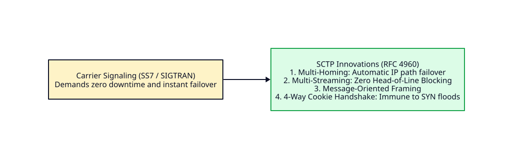

### The Architectural Problem with TCP in Carrier Networks
While TCP serves regular Internet applications well, its limitations became clear when telecommunications operators attempted to migrate mission-critical Public Switched Telephone Network (PSTN) SS7 signaling onto IP:
1. **Head-of-Line (HoL) Blocking**: If an application manages multiple logical transactions over a single TCP connection, a single lost packet blocks **all unrelated conversations** until that lost segment is retransmitted.
2. **Single IP Binding (Lack of Fault Tolerance)**: A TCP socket is locked to a single IP address pair. If a physical network interface cable breaks, the TCP connection dies immediately, violating telephony 99.999% availability standards.
3. **Byte-Stream Boundary Erasure**: Telephony signaling relies on distinct record messages. Applications running over TCP must write custom framing layers to find message boundaries.
4. **Vulnerability to Blind Denial of Service (SYN Flood)**: The TCP 3-way handshake forces servers to allocate memory state upon the very first packet.

---

## 4.2 Key Architectural Innovations: Multi-Homing & Multi-Streaming

SCTP introduced two foundational concepts to transport layer design:

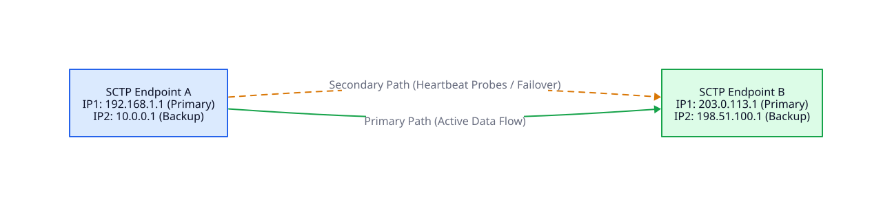

### 1. Multi-Homing (High Availability Architecture)
An SCTP connection between two endpoints is termed an **Association**. Unlike TCP, an SCTP association can bind **multiple IP addresses** to each endpoint:
- **Primary Path**: Used for all regular data chunk transmissions.
- **Alternate / Backup Paths**: SCTP continuously monitors backup paths using periodic `HEARTBEAT` control chunks. If the primary path drops packets beyond a threshold, SCTP **automatically and transparently fails over** to the alternate path without tearing down the association or interrupting application software.

### 2. Multi-Streaming (Eliminating Head-of-Line Blocking)
Within a single association, SCTP supports up to $65,536$ independent unidirectional logical streams:
- Each stream maintains its own independent **Stream Sequence Number ($SSN$)**.
- If a data chunk on Stream 1 is lost in transit, only Stream 1 pauses for reassembly. **Stream 0 and Stream 2 continue delivering packets to the application without interruption**. Head-of-line blocking is eliminated.

---

## 4.3 SCTP Packet & Chunk Architecture (Common Header & Chunks)

An SCTP transmission unit is called an **SCTP Packet**. Each packet consists of a **12-byte Common Header** followed by one or more **Chunks** (control or data):

```
 0                   1                   2                   3
 0 1 2 3 4 5 6 7 8 9 0 1 2 3 4 5 6 7 8 9 0 1 2 3 4 5 6 7 8 9 0 1
+-+-+-+-+-+-+-+-+-+-+-+-+-+-+-+-+-+-+-+-+-+-+-+-+-+-+-+-+-+-+-+-+
|          Source Port          |       Destination Port        |
+-+-+-+-+-+-+-+-+-+-+-+-+-+-+-+-+-+-+-+-+-+-+-+-+-+-+-+-+-+-+-+-+
|                        Verification Tag                       |
+-+-+-+-+-+-+-+-+-+-+-+-+-+-+-+-+-+-+-+-+-+-+-+-+-+-+-+-+-+-+-+-+
|                           Checksum                            |
+-+-+-+-+-+-+-+-+-+-+-+-+-+-+-+-+-+-+-+-+-+-+-+-+-+-+-+-+-+-+-+-+
|                          Chunk #1                             |
+-+-+-+-+-+-+-+-+-+-+-+-+-+-+-+-+-+-+-+-+-+-+-+-+-+-+-+-+-+-+-+-+
|                          Chunk #2 ...                         |
+-+-+-+-+-+-+-+-+-+-+-+-+-+-+-+-+-+-+-+-+-+-+-+-+-+-+-+-+-+-+-+-+
```

### 1. SCTP Common Header Fields (12 Bytes)
- **Source Port (16 Bits)** & **Destination Port (16 Bits)**: Standard transport port addressing.
- **Verification Tag (32 Bits)**: A randomly negotiated identifier specific to this association. Prevents blind packet injection attacks and distinguishes new associations from lingering packets of terminated sessions.
- **Checksum (32 Bits)**: 32-bit CRC-32c algorithm (RFC 3309). Replaced the original Adler-32 algorithm to provide superior error detection for short packet lengths.

---

### 2. General Chunk Format
Every chunk has a standardized 4-byte header:

```
 0                   1                   2                   3
 0 1 2 3 4 5 6 7 8 9 0 1 2 3 4 5 6 7 8 9 0 1 2 3 4 5 6 7 8 9 0 1
+-+-+-+-+-+-+-+-+-+-+-+-+-+-+-+-+-+-+-+-+-+-+-+-+-+-+-+-+-+-+-+-+
|   Chunk Type  |  Chunk Flags  |          Chunk Length         |
+-+-+-+-+-+-+-+-+-+-+-+-+-+-+-+-+-+-+-+-+-+-+-+-+-+-+-+-+-+-+-+-+
|                                                               |
|                    Chunk Value (Variable)                     |
|                                                               |
+-+-+-+-+-+-+-+-+-+-+-+-+-+-+-+-+-+-+-+-+-+-+-+-+-+-+-+-+-+-+-+-+
```

- **Chunk Type (8 Bits)**: Defines chunk function:
  - `0x00`: `DATA` (Payload transfer)
  - `0x01`: `INIT` (Initiate association)
  - `0x02`: `INIT_ACK` (Acknowledge initiation with cookie)
  - `0x03`: `SACK` (Selective acknowledgment)
  - `0x04`: `HEARTBEAT` (Path liveness probe)
  - `0x05`: `HEARTBEAT_ACK` (Liveness confirmation)
  - `0x06`: `ABORT` (Unconditional forced termination)
  - `0x07`: `SHUTDOWN` (Graceful close initiation)
  - `0x08`: `SHUTDOWN_ACK` (Acknowledge shutdown)
  - `0x09`: `ERROR` (Operational error report)
  - `0x0A`: `COOKIE_ECHO` (Client returns signed cookie)
  - `0x0B`: `COOKIE_ACK` (Server confirms cookie validation)
  - `0x0E`: `SHUTDOWN_COMPLETE` (Final association release)
- **Chunk Flags (8 Bits)**: Control bits customized per chunk type (e.g., U, B, E flags in DATA chunks).
- **Chunk Length (16 Bits)**: Length of the chunk in bytes including the 4-byte chunk header. Chunks are padded to a 4-byte boundary.

---

### 3. Detailed Anatomy of a DATA Chunk

```
 0                   1                   2                   3
 0 1 2 3 4 5 6 7 8 9 0 1 2 3 4 5 6 7 8 9 0 1 2 3 4 5 6 7 8 9 0 1
+-+-+-+-+-+-+-+-+-+-+-+-+-+-+-+-+-+-+-+-+-+-+-+-+-+-+-+-+-+-+-+-+
|   Type = 0    |Reserved|U|B|E|          Length                |
+-+-+-+-+-+-+-+-+-+-+-+-+-+-+-+-+-+-+-+-+-+-+-+-+-+-+-+-+-+-+-+-+
|             Transmission Sequence Number (TSN)                |
+-+-+-+-+-+-+-+-+-+-+-+-+-+-+-+-+-+-+-+-+-+-+-+-+-+-+-+-+-+-+-+-+
|      Stream Identifier S      |   Stream Sequence Number n    |
+-+-+-+-+-+-+-+-+-+-+-+-+-+-+-+-+-+-+-+-+-+-+-+-+-+-+-+-+-+-+-+-+
|                  Payload Protocol Identifier                  |
+-+-+-+-+-+-+-+-+-+-+-+-+-+-+-+-+-+-+-+-+-+-+-+-+-+-+-+-+-+-+-+-+
|                                                               |
|                        User Data Payload                      |
|                                                               |
+-+-+-+-+-+-+-+-+-+-+-+-+-+-+-+-+-+-+-+-+-+-+-+-+-+-+-+-+-+-+-+-+
```

- **U (Unordered bit)**: When set to 1, indicates unordered delivery. The receiver bypasses stream sequence ordering and delivers the payload to the application immediately.
- **B (Beginning fragment)** & **E (Ending fragment)**: Used for packet fragmentation. $B=1, E=0$ indicates first fragment; $B=0, E=0$ middle; $B=0, E=1$ final; $B=1, E=1$ unfragmented message.
- **Transmission Sequence Number (TSN - 32 Bits)**: Global association-wide sequence number used for acknowledgments, error detection, and congestion control.
- **Stream Identifier (16 Bits)**: Specifies the target logical stream.
- **Stream Sequence Number (SSN - 16 Bits)**: Sequence number of this message within its specific stream.
- **Payload Protocol Identifier (PPID - 32 Bits)**: Identifies the upper-layer protocol format (e.g., SIP, Diameter, WebRTC data channel) to the receiving application.

---

## 4.4 Association Management Lifecycle (4-Way Handshake with State Cookie)

### Association Establishment: Immunity to SYN Flood Attacks

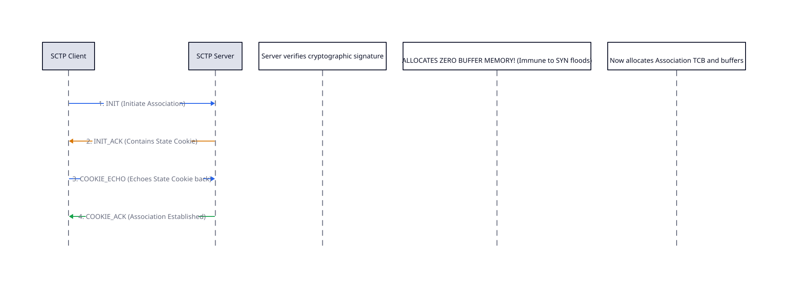

1. **Step 1 (`INIT`)**: Client sends its initiation tag, advertised window, supported stream counts, and list of bound IPv4/IPv6 addresses.
2. **Step 2 (`INIT_ACK`)**: The server **allocates zero state memory in RAM**. Instead, it packages all association parameters, a timestamp, and a cryptographic MAC (Message Authentication Code) generated using a private server secret into a **State Cookie**, returning it in the `INIT_ACK`.
3. **Step 3 (`COOKIE_ECHO`)**: Client sends the cookie back unmodified.
4. **Step 4 (`COOKIE_ACK`)**: Server recalculates the MAC over the returned cookie. If valid, the server confirms this is a legitimate client that completed a round-trip exchange. **Only now does the server allocate memory buffers**. This completely eliminates SYN flood vulnerabilities.

---

### Association Teardown: 3-Way Graceful Shutdown
Unlike TCP's half-close state (where one direction can remain open indefinitely), SCTP does not support half-open associations. Teardown shuts down both directions completely:

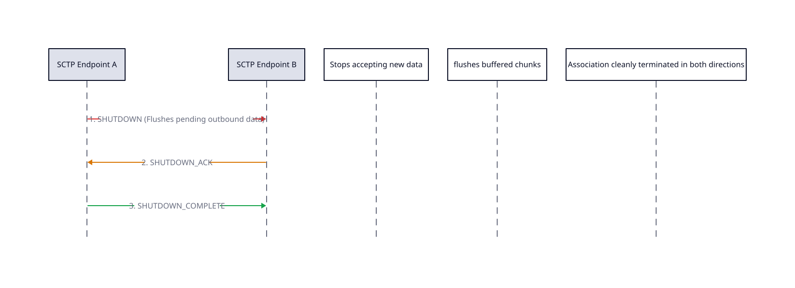

---

## 4.5 Error Control, Flow Control & Path Liveness Verification

1. **Selective Acknowledgment (`SACK`)**: SCTP mandates SACK chunks for all acknowledgments. A SACK reports the cumulative TSN point and explicit Gap Ack Blocks detailing non-contiguous received data chunks, preventing unnecessary retransmissions.
2. **Flow & Congestion Control**: Uses sliding windows similar to TCP, tracking an Advertised Receiver Window ($a\_rwnd$) and Congestion Window ($cwnd$). Crucially, **congestion windows are maintained separately for each destination IP path** in a multi-homed configuration.
3. **Path Verification (`HEARTBEAT`)**: To verify alternate paths remain operational, SCTP sends periodic `HEARTBEAT` chunks containing sender timestamps. The peer immediately returns a `HEARTBEAT_ACK`. If heartbeats time out beyond a configurable error counter, SCTP marks the path as inactive.

---

## 4.6 Master Comparison Matrix: TCP vs. UDP vs. SCTP

| Evaluation Feature | UDP (RFC 768) | TCP (RFC 793/9293) | SCTP (RFC 4960) |
| :--- | :--- | :--- | :--- |
| **Connection Model** | Connectionless | Connection-Oriented | Association-Oriented |
| **Transmission Framing** | Message-Oriented | Continuous Byte Stream | Message-Oriented (Chunks) |
| **Head-of-Line Blocking** | None (Unordered) | Severe (Strict byte order) | **Eliminated** (Multi-Streaming) |
| **Multi-Homing Support** | No (Application handled)| No (Single IP pair) | **Native Multi-Homing** |
| **Setup Handshake** | None (0 RTT) | 3-Way Handshake | 4-Way Handshake with State Cookie |
| **SYN Flood Resilience** | Immune (Stateless) | Vulnerable (without cookies) | **Inherently Immune by Design** |
| **Teardown Model** | None | 4-Way Handshake (Half-close) | 3-Way Graceful Shutdown |
| **Checksum Mechanism** | 16-bit Internet Checksum | 16-bit Internet Checksum | **32-bit CRC-32c** |
| **Ordered Delivery** | No | Strictly Ordered | Configurable (Ordered or Unordered)|
| **Flow & Congestion Control**| None | Yes (Single path) | Yes (**Maintained per IP path**) |
| **Heartbeat Path Monitoring**| No | No (Only optional Keepalive) | Native `HEARTBEAT` verification |
| **Primary Use Cases** | DNS, VoIP, Video, Gaming | Web (HTTP/1,2), Mail, SSH | Telephony (SS7/SIGTRAN), WebRTC |

---

# Question 5: TCP Services & Core Mechanics (Covers Q5–Q11)

> [!NOTE]
> This master question synthesizes the core operational mechanics of TCP specified in **Questions 5 through 11** of the Unit 4 question bank:
> - **Q5**: TCP Services Architecture (Section 5.1)
> - **Q6 & Q7**: Sending and Receiving Buffers & Bytes and Segments (Section 5.3)
> - **Q8**: Full-Duplex Communication & Piggybacking (Section 5.4)
> - **Q9**: Connection-Oriented Service & Session State Tracking (Section 5.6; also see Section 3.3)
> - **Q10**: Flow Control & Window Management (Section 5.8; also see Section 3.4)
> - **Q11**: Error Control & Reliable Delivery (Section 5.7; also see Section 3.6)

## 5.1 Comprehensive System Architecture of TCP Services

TCP provides a rich set of transport services designed to ensure reliable, ordered, and efficient communication between network processes:

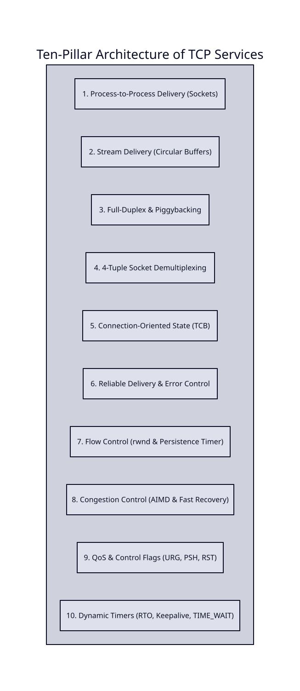

---

## 5.2 Process-to-Process Delivery Service
TCP abstracts the underlying network to deliver data directly between specific executing processes on different hosts:
- Identified by 16-bit port numbers bound to local IP addresses, forming **Sockets**.
- Operating system socket tables map inbound TCP traffic to specific process IDs (PIDs).

---

## 5.3 Stream Delivery Service & Circular Buffer Model

Unlike message-oriented protocols that handle discrete application packets, TCP provides a **Stream Delivery Service**:
- The sending application writes an unstructured stream of bytes into TCP.
- TCP buffers these bytes in a circular send buffer.
- The transport layer decides when to segment this stream into Maximum Segment Size ($MSS$) units based on network conditions and buffer occupancy.

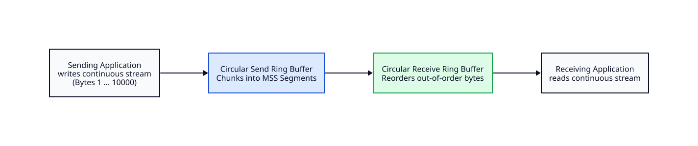

---

## 5.4 Full-Duplex Communication Service & Piggybacking

TCP connections are fundamentally **full-duplex**:
- Data flows simultaneously in both directions over two independent, concurrent byte streams.
- **Piggybacking**: When Host B needs to acknowledge data received from Host A, it does not need to send a standalone acknowledgment packet. Instead, it embeds the ACK sequence number inside the header of an outgoing data segment that Host B is already sending to Host A, reducing packet overhead on the network.

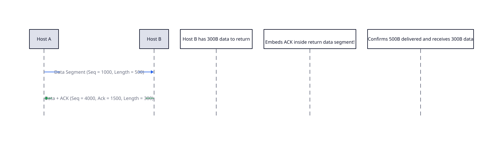

---

## 5.5 Multiplexing and Demultiplexing Service

TCP demultiplexes incoming segments using a **4-tuple**:
$$(\text{Source IP}, \text{Source Port}, \text{Destination IP}, \text{Destination Port})$$

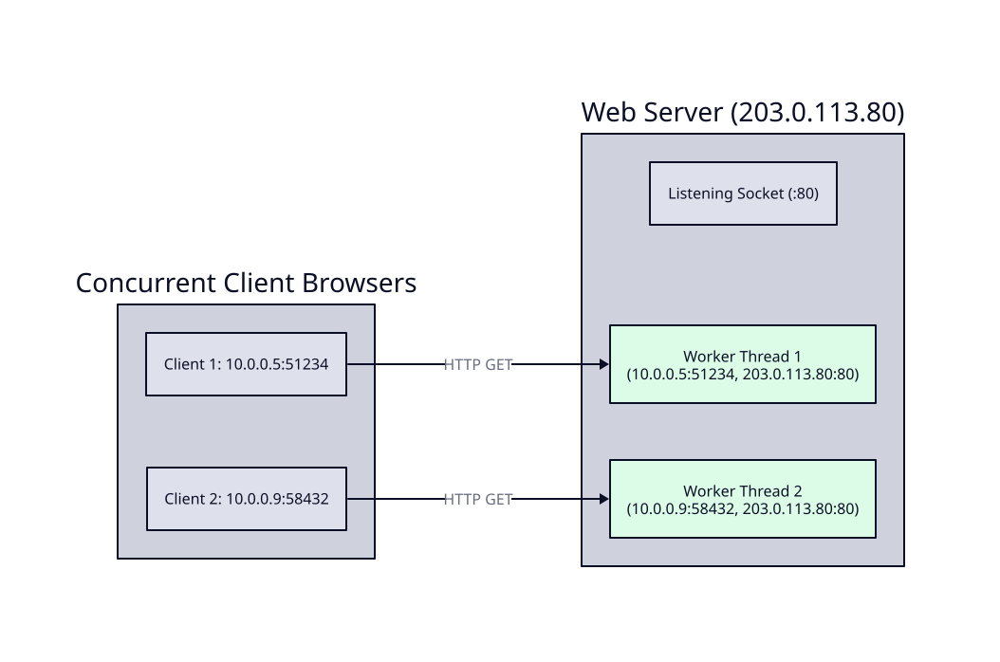

This 4-tuple addressing enables a single web server daemon listening on port 80 to establish concurrent, isolated connections with thousands of clients without cross-talk or route ambiguity.

---

## 5.6 Connection-Oriented Service & Session State Tracking

TCP guarantees session state across communication lifecycles:
1. **Pre-negotiated Parameters**: Endpoints negotiate initial sequence numbers, window scale factors, and MSS before sending data.
2. **Stateful TCB Records**: Operating systems maintain a Transmission Control Block (TCB) tracking connection states, buffer pointers, RTT estimates, and timers.
3. **Controlled Teardown**: Ensures both endpoints agree before connection resources are released.

---

## 5.7 Reliable Delivery & Error Control Services

TCP delivers reliable transport over best-effort networks through several cooperating mechanisms:
- **Byte Sequence Numbering**: Every byte is assigned a sequence number, allowing the receiver to reorder out-of-order segments and detect missing data.
- **Cumulative Acknowledgments**: ACKs confirm all contiguous bytes received up to that point.
- **Selective Acknowledgments (SACK)**: Informs the sender of non-contiguous blocks received, avoiding retransmission of already-buffered packets.
- **Checksum Verification**: Protects against corruption of headers and data payload.
- **Duplicate Suppression**: Discards duplicated segments while re-issuing ACKs to keep the sender's window open.

---

## 5.8 Flow Control Service & Receiver Window Management

TCP flow control coordinates transmission rates between senders and receivers:
- The receiver advertises its available buffer space through the **Advertised Window ($rwnd$)** header field.
- **Zero Window Probing**: When $rwnd = 0$, the sender pauses transmission and starts a **Persistence Timer**. When the timer expires, the sender dispatches a 1-byte probe segment. The receiver responds with its current window size, preventing deadlocks if a window update ACK was lost.

---

## 5.9 Congestion Control Service & Rate Adaptation

TCP dynamically adapts its sending rate to avoid overloading intermediate network links:
- **Additive Increase / Multiplicative Decrease (AIMD)**: The sender increases its rate cautiously during normal operation and slashes it aggressively upon detecting packet loss.
- **Slow Start**: Rapidly ramps up transmission rate on new connections to probe link capacity.
- **Fast Retransmit & Fast Recovery**: Recovers from isolated packet loss without falling back to slow start.

---

## 5.10 Quality of Service, Out-of-Band Data & Flag Services

TCP provides control flags for application-level signaling:
- **Urgent Data (`URG`)**: Points to urgent data bytes that the receiver should process ahead of queued buffer data.
- **Push Flag (`PSH`)**: Directs the transport stack to bypass buffer accumulation and deliver data immediately to the application.
- **Connection Reset (`RST`)**: Immediately terminates invalid or rejected connections.

---

## 5.11 Timer Management Services

TCP maintains four interdependent timers to manage connection lifecycles and recovery:

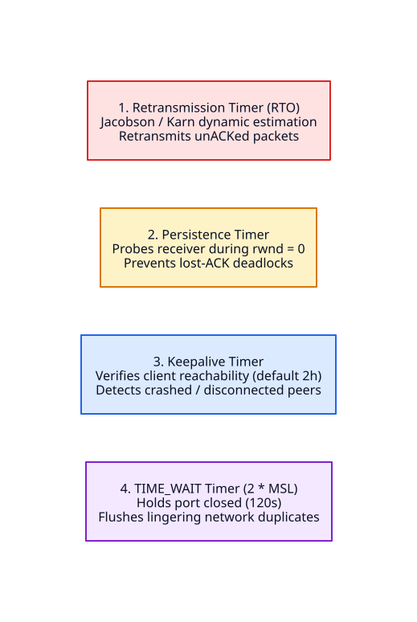

1. **Retransmission Timer (RTO)**: Tracks in-flight segments and triggers retransmission when unacknowledged.
2. **Persistence Timer**: Probes peer hosts when $rwnd = 0$ to prevent deadlocks caused by lost window-update ACKs.
3. **Keepalive Timer**: Periodically verifies client reachability during extended idle periods, releasing server resources if a client crashes.
4. **TIME_WAIT Timer ($2 \times \text{MSL}$)**: Prevents old duplicate segments from corrupting future connections reusing the same port pair.

---

## 5.12 Mathematical Formulations: BDP, Window Scale & Sliding Window Efficiency

### 1. Bandwidth-Delay Product (BDP)
The **Bandwidth-Delay Product** defines the volume of data in transit needed to fully saturate a network pipe:
$$\text{BDP (bits)} = \text{Link Bandwidth (bps)} \times \text{Round-Trip Time (RTT in seconds)}$$
$$\text{BDP (bytes)} = \frac{\text{Link Bandwidth} \times \text{RTT}}{8}$$

#### Numerical Example:
For a $1\text{ Gbps}$ cross-country optical link with an RTT of $50\text{ ms}$ ($0.05\text{ s}$):
$$\text{BDP} = \frac{10^9\text{ bps} \times 0.05\text{ s}}{8} = \frac{50,000,000}{8} = 6,250,000\text{ bytes} \approx 6.25\text{ MB}$$
- **Window Scale Rationale**: TCP's native 16-bit Window field caps the advertised window at $65,535\text{ bytes}$ ($64\text{ KB}$).
- On this $1\text{ Gbps}$ link, an unscaled TCP window can only achieve:
$$\text{Max Throughput}_{\text{Unscaled}} = \frac{65,535 \times 8\text{ bits}}{0.05\text{ s}} \approx 10.48\text{ Mbps}$$
This utilizes barely **$1\%$** of the link capacity. The **TCP Window Scale Option (RFC 1323)** scales the window up to $1\text{ GB}$, allowing TCP to fully utilize gigabit and multi-gigabit links.

---

### 2. Sliding Window Throughput & Protocol Efficiency
The theoretical efficiency $\eta$ of a sliding window protocol with window size $W$ (in frames) is given by:
$$\eta = \min\left(1, \frac{W}{1 + 2a}\right)$$
Where $a$ is the ratio of propagation delay to transmission delay:
$$a = \frac{T_{\text{prop}}}{T_{\text{tx}}}$$
- Transmission delay: $T_{\text{tx}} = \frac{L}{B}$ ($L$ = frame length in bits, $B$ = bandwidth in bps).
- Propagation delay: $T_{\text{prop}} = \frac{d}{v}$ ($d$ = distance, $v$ = signal velocity in medium).

---

## 5.13 Master Comparison Matrix: Byte-Stream Service (TCP) vs. Message-Oriented Service (UDP / SCTP)

| Operational Dimension | Byte-Stream Service (TCP) | Message-Oriented Service (UDP / SCTP) |
| :--- | :--- | :--- |
| **Data Delivery Abstraction** | Continuous, unstructured sequence of bytes | Discrete, bounded application messages |
| **Message Boundary Preservation**| **No**. Segments can be split, merged, or repacked | **Yes**. Application read calls return exact written messages |
| **Write-to-Read Call Coupling** | Completely decoupled (10 writes can equal 1 read) | Strictly coupled (1 write equals exactly 1 read call) |
| **Framing Responsibility** | Application layer must implement message delimiters | Transport layer maintains explicit record boundaries |
| **Buffer Segmentation** | TCP chunks data based on MSS and link conditions | Transport preserves message units (subject to MTU) |
| **Padding Requirements** | No padding needed | Padded to protocol boundaries (e.g., SCTP 4-byte padding) |
| **Protocol Examples** | TCP | UDP, SCTP |
| **Suited Applications** | File Transfer, Web Browsing, Remote Shell | RPC, Telephony Signaling, DNS, Sensor Telemetry |
