# Computer Networks (21CS302) — Unit 5 Long Questions & Comprehensive Answers
### Master Study Guide for 16-Mark University Examinations (Application Layer Protocols & Architectures)

---

## Table of Contents
1. [Question 1: HyperText Transfer Protocol (HTTP)](#question-1-hypertext-transfer-protocol-http)
   - 1.1 Foundational Introduction & Web Architecture
   - 1.2 HTTP Operational Model & Request/Response Lifecycle
   - 1.3 Message Formats & ASCII Header Layout (Request & Response)
   - 1.4 Evolution Across Generations: HTTP/1.0, HTTP/1.1, HTTP/2, and HTTP/3
   - 1.5 Web Caching, Conditional Requests & State Management (Cookies)
   - 1.6 Master Comparison Matrix: HTTP/1.0 vs. HTTP/1.1 vs. HTTP/2 vs. HTTP/3
2. [Question 2: Simple Mail Transfer Protocol (SMTP)](#question-2-simple-mail-transfer-protocol-smtp)
   - 2.1 Architectural Framework: MUA, MSA, MTA, MDA
   - 2.2 SMTP Protocol Operation & Three-Phase Connection Lifecycle
   - 2.3 Message Format & MIME Architecture (RFC 2045–2049)
   - 2.4 Mathematical Encoding Walkthrough: Step-by-Step Base64 Conversion
   - 2.5 Security, Relay Abuse & Mitigations (SPF, DKIM, DMARC)
   - 2.6 Master Comparison Matrix: SMTP vs. Mail Retrieval Protocols
3. [Question 3: File Transfer Protocol (FTP)](#question-3-file-transfer-protocol-ftp)
   - 3.1 Motivation & RFC 959 Dual-Connection Architecture
   - 3.2 Control Connection (:21) vs. Data Connection (:20 / Ephemeral)
   - 3.3 Active Mode (PORT) vs. Passive Mode (PASV) NAT/Firewall Mechanics
   - 3.4 Data Representation, File Structures & Transmission Modes
   - 3.5 Core Commands, Response Codes & Security Evolutions
   - 3.6 Master Comparison Matrix: Active FTP vs. Passive FTP vs. TFTP
4. [Question 4: Domain Name System (DNS)](#question-4-domain-name-system-dns)
   - 4.1 Motivation, Design Philosophy & Hierarchical Naming Tree
   - 4.2 DNS Resolution Mechanics: Recursive vs. Iterative Walkthrough
   - 4.3 Bit-Level 12-Byte DNS Message Header & Resource Record Format
   - 4.4 Comprehensive Resource Record (RR) Taxonomy
   - 4.5 Transport Protocol Dual-Stack (UDP Port 53 vs. TCP Port 53) & Security
   - 4.6 Master Comparison Matrix: Recursive vs. Iterative Resolution & RR Types
5. [Question 5: Post Office Protocol Version 3 (POP3)](#question-5-post-office-protocol-version-3-pop3)
   - 5.1 Architectural Role: Mail Access vs. Mail Transfer
   - 5.2 The Three Lifecycle Operational States: Authorization, Transaction, Update
   - 5.3 Operational Modes: Download-and-Delete vs. Download-and-Keep
   - 5.4 Protocol Commands, Status Responses (`+OK` / `-ERR`) & Session Walkthrough
   - 5.5 Architectural Limitations of POP3
   - 5.6 Master Comparison Matrix: POP3 vs. IMAP4
6. [Question 6: TELNET (Teletype Network)](#question-6-telnet-teletype-network)
   - 6.1 Historical Evolution & Remote Timesharing Foundations
   - 6.2 The Network Virtual Terminal (NVT) Abstraction
   - 6.3 In-Band Signaling & The Interpret As Command (IAC) Byte Mechanism
   - 6.4 Symmetric Option Negotiation (WILL, WONT, DO, DONT)
   - 6.5 Severe Security Vulnerabilities & Deprecation Rationale
   - 6.6 Master Comparison Matrix: TELNET Option Verbs & Command Codes
7. [Question 7: Secure Shell (SSH)](#question-7-secure-shell-ssh)
   - 7.1 Historical Rationale & RFC 4251-4254 Layered Architecture
   - 7.2 Cryptographic Handshake & Ephemeral Diffie-Hellman Key Exchange
   - 7.3 Mathematical Walkthrough of Diffie-Hellman Session Key Derivation
   - 7.4 Client Authentication Mechanisms & Host Key Verification
   - 7.5 SSH Port Forwarding / Tunneling (Local, Remote, and Dynamic SOCKS5)
   - 7.6 Master Comparison Matrix: TELNET vs. SSH
8. [Question 8: Difference between HTTP and HTTPS](#question-8-difference-between-http-and-https)
   - 8.1 Foundational Architecture & The Cryptographic Sublayer
   - 8.2 TLS Handshake Mechanics & Session Encryption
   - 8.3 Performance, Latency & Security Impact
   - 8.4 Master Comparison Matrix: HTTP vs. HTTPS

---

# Question 1: HyperText Transfer Protocol (HTTP)

## 1.1 Foundational Introduction & Web Architecture

The **HyperText Transfer Protocol (HTTP)** is the application-level backbone protocol of the World Wide Web. Conceived by Tim Berners-Lee at CERN in 1989 and standardized across multiple IETF RFC specifications (RFC 1945 for HTTP/1.0, RFC 2616 and RFC 7230–7235 for HTTP/1.1, RFC 7540 for HTTP/2, and RFC 9114 for HTTP/3), HTTP defines how web clients (browsers) request hypermedia documents from distributed origin servers.

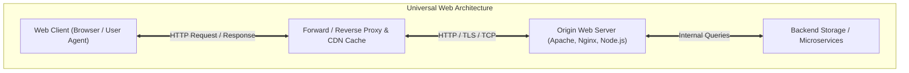

HTTP functions as a **stateless, extensible, client-server protocol**:
- **Stateless**: The server maintains no intrinsic memory of previous client transactions. Every request is evaluated in total isolation, simplifying server horizontal scalability.
- **Extensible**: Through HTTP headers, the protocol seamlessly supports content negotiation, media caching, authentication, compression, and session tracking without requiring core protocol modifications.

---

## 1.2 HTTP Operational Model & Request/Response Lifecycle

The operational lifecycle of an HTTP transaction follows a synchronous request-reply model:

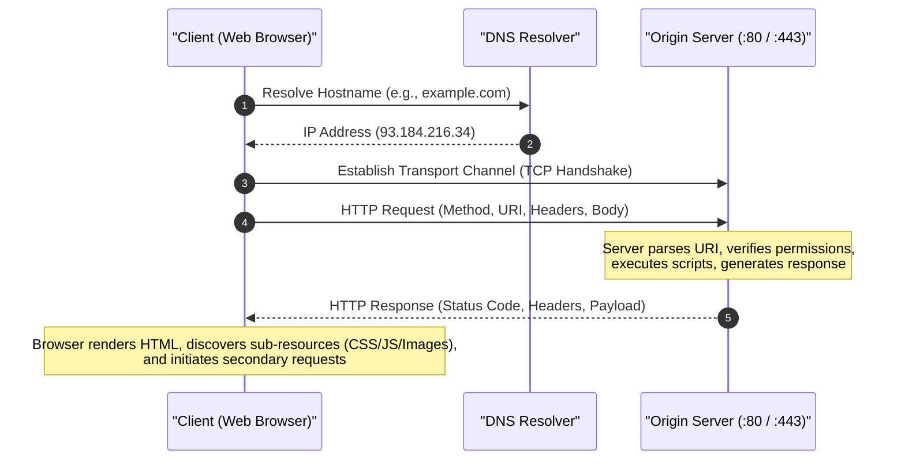

### HTTP Request Methods (Verbs)
1. **`GET`**: Requests a representation of the specified resource. Must be **safe** (produces no side effects on server state) and **idempotent** (multiple identical requests yield identical server state).
2. **`POST`**: Submits an entity to the specified resource, frequently causing a state change or side effect on the server (e.g., database insertion, form processing). Neither safe nor idempotent.
3. **`PUT`**: Replaces all current representations of the target resource with the uploaded request payload. Idempotent, but not safe.
4. **`DELETE`**: Deletes the specified resource. Idempotent.
5. **`HEAD`**: Identical to `GET`, but requests that the server return **only the headers** without the response body. Used to check resource existence, modification dates, or file size without wasting bandwidth.
6. **`OPTIONS`**: Describes the communication options and allowed HTTP methods available for the target resource. Extensively used in Cross-Origin Resource Sharing (CORS preflight).
7. **`PATCH`**: Applies partial modifications to a resource. Non-idempotent.
8. **`CONNECT`**: Establishes a bidirectional tunnel to the destination server, typically used to proxy SSL/TLS connections through HTTP forward proxies.

### HTTP Response Status Code Taxonomy
HTTP status codes are 3-digit integers categorized into five functional classes:

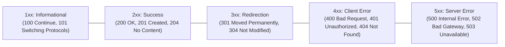

---

## 1.3 Message Formats & ASCII Header Layout (Request & Response)

HTTP/1.x messages are human-readable, plain-text streams formatted according to RFC 5322 MIME syntax. Every line is terminated by a Carriage Return and Line Feed sequence (`CRLF` = `\r\n`).

### 1. HTTP Request Message Structure

```
+-----------------------------------------------------------------+
| Method <SP> Request-URI <SP> HTTP-Version <CRLF>                | <-- Request Line
+-----------------------------------------------------------------+
| Header-Name: <SP> Header-Value <CRLF>                           |
| Header-Name: <SP> Header-Value <CRLF>                           | <-- Header Fields
| ...                                                             |
+-----------------------------------------------------------------+
| <CRLF>                                                          | <-- Empty Line Delimiter
+-----------------------------------------------------------------+
| Entity Body (Optional: Form Data, JSON Payload, Raw Binary)     | <-- Message Body
+-----------------------------------------------------------------+
```

#### Annotated Example Request:
```http
GET /index.html HTTP/1.1
Host: www.example.com
User-Agent: Mozilla/5.0 (X11; Linux x86_64) Firefox/120.0
Accept: text/html,application/xhtml+xml,application/xml;q=0.9,*/*;q=0.8
Accept-Language: en-US,en;q=0.5
Accept-Encoding: gzip, deflate, br
Connection: keep-alive
Upgrade-Insecure-Requests: 1

```

---

### 2. HTTP Response Message Structure

```
+-----------------------------------------------------------------+
| HTTP-Version <SP> Status-Code <SP> Reason-Phrase <CRLF>         | <-- Status Line
+-----------------------------------------------------------------+
| Header-Name: <SP> Header-Value <CRLF>                           |
| Header-Name: <SP> Header-Value <CRLF>                           | <-- Header Fields
| ...                                                             |
+-----------------------------------------------------------------+
| <CRLF>                                                          | <-- Empty Line Delimiter
+-----------------------------------------------------------------+
| Response Body (HTML Document, Image Data, JSON API Payload)     | <-- Message Body
+-----------------------------------------------------------------+
```

#### Annotated Example Response:
```http
HTTP/1.1 200 OK
Date: Mon, 06 Oct 2026 08:30:00 GMT
Server: Apache/2.4.52 (Ubuntu)
Last-Modified: Sat, 04 Oct 2026 12:15:00 GMT
ETag: "34aa-625-5f34a1b0"
Accept-Ranges: bytes
Content-Length: 1573
Content-Type: text/html; charset=UTF-8
Connection: keep-alive

<!DOCTYPE html>
<html>
<head><title>Example Page</title></head>
<body><h1>Hello, World!</h1></body>
</html>
```

---

## 1.4 Evolution Across Generations: HTTP/1.0, HTTP/1.1, HTTP/2, and HTTP/3

The history of HTTP reflects an ongoing effort to reduce web latency and optimize transport resource utilization:

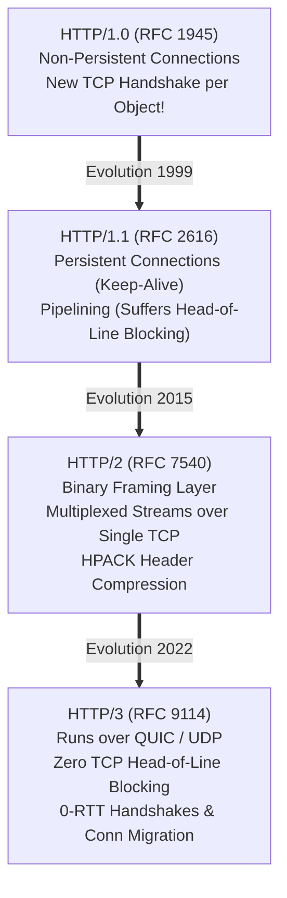

### 1. HTTP/1.0: Non-Persistent Connections
- Opened a brand-new TCP connection for every single inline web object (HTML file, CSS stylesheet, JavaScript bundle, JPEG image).
- If a web page references 30 images, the browser must execute 30 distinct TCP 3-way handshakes and 30 slow-start phases.
- **Delay per Object**:
$$\text{Total Latency} = 2 \times \text{RTT} + \frac{\text{Object Size}}{\text{Bandwidth}}$$

### 2. HTTP/1.1: Persistent Connections & Pipelining
- Introduced persistent connections by default (`Connection: keep-alive`). A single TCP connection remains open across multiple consecutive requests, amortizing connection handshake overhead.
- Introduced **Pipelining**: A client can send requests 2, 3, and 4 without waiting for response 1 to arrive.
- **Defect (Application-Level Head-of-Line Blocking)**: HTTP/1.1 strictly mandates that responses be returned in the **exact sequential order** the requests were issued. If generating response 1 requires a slow database query, fast responses 2 and 3 are blocked behind it.

### 3. HTTP/2: Binary Framing & Multiplexing
- Abandoned plain-text ASCII formatting in favor of an optimized **Binary Framing Layer**:
  - Messages are split into independent **Frames** (e.g., `HEADERS`, `DATA`, `SETTINGS`, `RST_STREAM`).
  - Frames are assigned a 31-bit **Stream Identifier**.
- **True Multiplexing**: Multiple bidirectional streams are interleaved concurrently over a single TCP connection. Fast responses can bypass slow responses, completely eliminating HTTP application-level HoL blocking.
- **HPACK Compression**: Headers are compressed using static and dynamic lookup tables plus Huffman coding, slashing header byte overhead by up to $85\%$.
- **Server Push**: Servers can proactively push dependent resources (e.g., CSS stylesheets) into client caches before the client parses the HTML and asks for them.

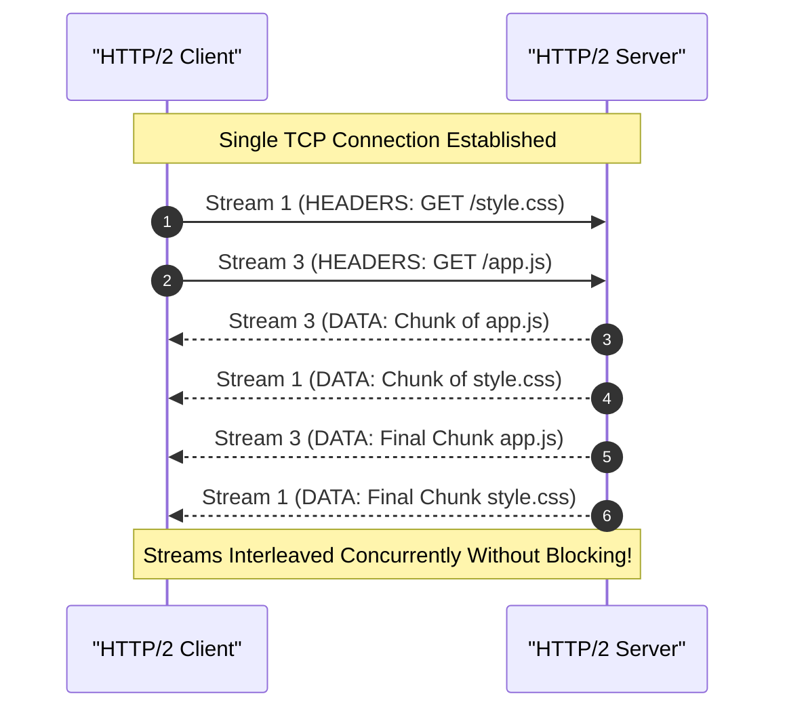

### 4. HTTP/3: QUIC over UDP
- While HTTP/2 solved application-level HoL blocking, it remained vulnerable to **Transport-Level Head-of-Line Blocking** in TCP: if a single TCP packet carrying Stream 1 is lost, TCP pauses delivery of all other streams (Stream 3, Stream 5) until the lost packet is retransmitted.
- HTTP/3 runs over **QUIC** (Quick UDP Internet Connections) atop UDP. Each stream in QUIC is tracked independently by the transport engine. A lost packet on Stream 1 has zero impact on Stream 3.
- Features **0-RTT connection resumption** and **Connection Migration** (connections stay active when shifting between Wi-Fi and mobile 5G data).

---

## 1.5 Web Caching, Conditional Requests & State Management (Cookies)

### Web Caching & Conditional GET
To minimize origin server load and transit bandwidth, web caches (proxies, CDNs, local browser caches) store copies of previous responses:
- **`Cache-Control`**: Directives such as `max-age=3600`, `public`, `private`, `no-cache`, or `no-store`.
- **Conditional GET (`304 Not Modified`)**: When a cached resource expires, the browser issues a validation request carrying validator headers:
  - `If-Modified-Since`: Matches against the server's `Last-Modified` timestamp.
  - `If-None-Match`: Matches against an opaque cryptographic checksum entity tag (`ETag`).
  - If the content has not changed, the server replies with `304 Not Modified` containing empty payload, saving substantial bandwidth.

### State Management via HTTP Cookies (RFC 6265)
Because HTTP is stateless, stateful sessions (shopping carts, user logins) rely on **Cookies**:
1. Server issues a `Set-Cookie: session_id=XYZ789; Secure; HttpOnly; SameSite=Strict` header in its HTTP response.
2. The browser persists this token and includes `Cookie: session_id=XYZ789` in all subsequent requests to that domain.

---

## 1.6 Master Comparison Matrix: HTTP/1.0 vs. HTTP/1.1 vs. HTTP/2 vs. HTTP/3

| Technical Dimension | HTTP/1.0 | HTTP/1.1 | HTTP/2 | HTTP/3 |
| :--- | :--- | :--- | :--- | :--- |
| **Standard RFC** | RFC 1945 (1996) | RFC 2616 / 7230 (1999) | RFC 7540 (2015) | RFC 9114 (2022) |
| **Transport Layer** | TCP | TCP | TCP | **QUIC (over UDP)** |
| **Connection Model**| Non-Persistent | Persistent by Default | Persistent Multiplexed| Persistent Multiplexed |
| **Message Format** | Plaintext ASCII | Plaintext ASCII | **Binary Framing** | **Binary Framing** |
| **Multiplexing** | No | No (Pipelining flawed) | **Yes (Full)** | **Yes (Full)** |
| **Transport HoL Blocking**| N/A (1 conn/obj) | Present in TCP | Present in TCP | **Completely Eliminated** |
| **Header Compression**| None | None | HPACK (Huffman+Table) | QPACK |
| **Server Push** | No | No | Supported | Supported |
| **Handshake Latency**| 1 RTT TCP per object| 1 RTT TCP shared | 1 RTT TCP + TLS | **0-RTT or 1-RTT Unified**|
| **Connection Migration**| No | No | No | Supported (Connection ID)|

---

# Question 2: Simple Mail Transfer Protocol (SMTP)

## 2.1 Architectural Framework: MUA, MSA, MTA, MDA

Electronic mail operates as a store-and-forward distributed architecture defined by **RFC 5321 (SMTP)** and **RFC 5322 (Internet Message Format)**. Unlike interactive protocols, email must navigate disconnected topologies, network partitions, and asynchronous delivery.

```mermaid
flowchart LR
    subgraph SenderDomain["Sender Domain (alice@example.com)"]
        MUA_S["Mail User Agent (MUA)<br/>(Thunderbird, Outlook)"]
        MSA["Mail Submission Agent (MSA)<br/>(Port 587 / Auth SMTP)"]
        MTA_S["Sender MTA<br/>(Postfix, Exim)"]
        MUA_S -->|"Submit"| MSA
        MSA --> MTA_S
    end

    subgraph InternetCore["Internet Transit (DNS MX Lookups)"]
        MTA_S ==>|"SMTP Relay (Port 25)"| MTA_R["Receiver MTA<br/>(Incoming Gateway)"]
    end

    subgraph ReceiverDomain["Receiver Domain (bob@destination.org)"]
        MDA["Mail Delivery Agent (MDA)<br/>(Dovecot, Maildrop)"]
        MBOX[("User Mailbox Storage<br/>(Maildir / Mbox)")]
        MUA_R["Receiver MUA<br/>(Client Device)"]

        MTA_R --> MDA
        MDA --> MBOX
        MBOX -.->|"POP3 (:110) or IMAP4 (:143)"| MUA_R
    end
```

### The Architectural Actors
1. **Mail User Agent (MUA)**: The end-user application (e.g., Thunderbird, Apple Mail) used to compose, read, and organize emails.
2. **Mail Submission Agent (MSA)**: Accepts mail from an authenticated MUA, verifies message syntax, and hands it to the local MTA (standardized on TCP Port 587).
3. **Mail Transfer Agent (MTA)**: The core routing engine (e.g., Postfix, Sendmail). Performs DNS lookups for destination domain **Mail Exchange (`MX`)** records and transfers the message hop-by-hop across intermediate MTAs using SMTP over TCP Port 25.
4. **Mail Delivery Agent (MDA)**: Receives mail from the local MTA and deposits it into the recipient's permanent physical mailbox storage (Maildir or Mbox formats).

---

## 2.2 SMTP Protocol Operation & Three-Phase Connection Lifecycle

SMTP is a **push protocol**: it moves data from sender to receiver. It communicates in 7-bit ASCII text over TCP. A complete SMTP session proceeds through three sequential phases:

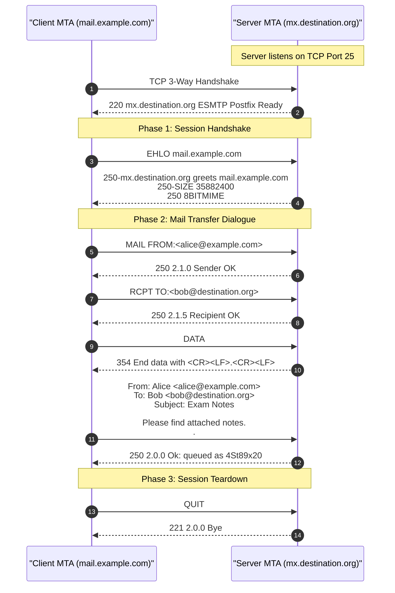

### Core SMTP Commands
- **`HELO` / `EHLO`**: Handshake command. `EHLO` (Extended HELO) requests ESMTP capabilities (authentication, TLS, large file support).
- **`MAIL FROM:`**: Specifies the reverse-path envelope sender address for bounce handling.
- **`RCPT TO:`**: Specifies a recipient. Can be repeated multiple times for multi-recipient delivery.
- **`DATA`**: Initiates transfer of the message headers and body. Concluded exclusively by an isolated single period on a line by itself (`\r\n.\r\n`).
- **`RSET`**: Resets the current mail transaction without closing the TCP connection.
- **`QUIT`**: Requests session termination.

### Common SMTP Response Codes
- `220`: Service ready.
- `250`: Requested mail action completed (OK).
- `354`: Start mail input; end with `<CRLF>.<CRLF>`.
- `451`: Requested action aborted: local error in processing (temporary failure; client should retry later).
- `550`: Requested action not taken: mailbox unavailable/not found (permanent fatal bounce).

---

## 2.3 Message Format & MIME Architecture (RFC 2045–2049)

### RFC 5322 Message Structure
An email message consists of an **Envelope** (handled in SMTP commands `MAIL FROM` and `RCPT TO`), followed by the message payload:
```
+-------------------------------------------------------+
| Header Fields: From, To, Subject, Date, Message-ID    |
+-------------------------------------------------------+
| Blank Line (\r\n)                                     |
+-------------------------------------------------------+
| Body Text (7-bit ASCII plain text)                    |
+-------------------------------------------------------+
```

### Multipurpose Internet Mail Extensions (MIME)
Original SMTP was strictly limited to **7-bit NVT ASCII** text (maximum line length 1000 characters). It could not carry non-English characters (accents, Asian scripts), audio, video, images, or executable binaries. **MIME** extended the message architecture through five dedicated headers:

1. **`MIME-Version:`**: Declares MIME compliance (typically `1.0`).
2. **`Content-Type:`**: Declares the media type and subtype (e.g., `text/html`, `image/png`, `multipart/mixed`).
3. **`Content-Transfer-Encoding:`**: Declares how arbitrary binary bytes are encoded into safe 7-bit ASCII (e.g., `base64`, `quoted-printable`).
4. **`Content-Disposition:`**: Indicates whether content should be displayed inline or as an attachment (`inline`, `attachment; filename="notes.pdf"`).
5. **`Content-Description:`**: Human-readable description of the payload.

---

## 2.4 Mathematical Encoding Walkthrough: Step-by-Step Base64 Conversion

**Base64 Encoding** transforms arbitrary 8-bit binary data into printable 6-bit ASCII characters selected from a 64-character alphabet:
`A-Z` (indices 0–25), `a-z` (indices 26–51), `0-9` (indices 52–61), `+` (index 62), and `/` (index 63).

### Step-by-Step Numerical Example:
Encode the 3-character ASCII string: **`"CAT"`**

#### Step 1: Obtain the 8-bit binary representation of each character
- `'C'` = ASCII $67$ = `01000011`
- `'A'` = ASCII $65$ = `01000001`
- `'T'` = ASCII $84$ = `01010100`

Concatenated 24-bit stream:
$$\text{Binary Stream} = \underbrace{01000011}_{\text{'C'}} \ \underbrace{01000001}_{\text{'A'}} \ \underbrace{01010100}_{\text{'T'}}$$

#### Step 2: Divide the 24-bit stream into four 6-bit groups
$$\text{Group 1: } 010000_2 \quad | \quad \text{Group 2: } 110100_2 \quad | \quad \text{Group 3: } 000101_2 \quad | \quad \text{Group 4: } 010100_2$$

#### Step 3: Convert each 6-bit group to its decimal value
- $\text{Group 1}: 010000_2 = 16$
- $\text{Group 2}: 110100_2 = 32 + 16 + 4 = 52$
- $\text{Group 3}: 000101_2 = 4 + 1 = 5$
- $\text{Group 4}: 010100_2 = 16 + 4 = 20$

#### Step 4: Map decimal values to the Base64 alphabet table
- Index $16 \to \mathbf{Q}$
- Index $52 \to \mathbf{0}$
- Index $5 \to \mathbf{F}$
- Index $20 \to \mathbf{U}$

$$\text{Result: } \text{"CAT"} \xrightarrow{\text{Base64}} \mathbf{"Q0FV"}$$

*(Note: If the input length is not a multiple of 3 bytes, padding characters `'='` are appended to pad the output to a 4-character boundary).*

---

## 2.5 Security, Relay Abuse & Mitigations (SPF, DKIM, DMARC)

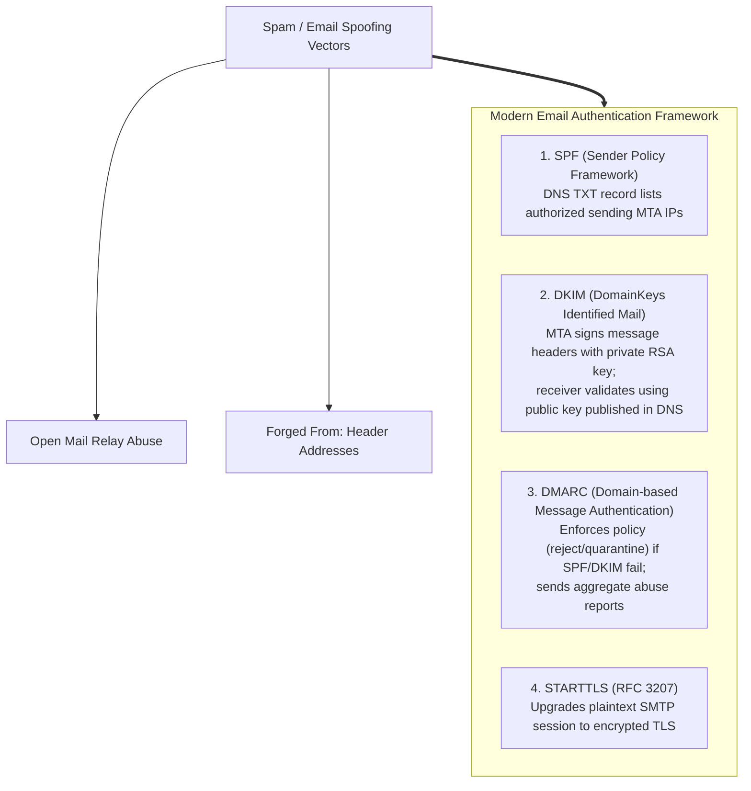

---

## 2.6 Master Comparison Matrix: SMTP vs. Mail Retrieval Protocols

| Evaluation Feature | SMTP (RFC 5321) | POP3 (RFC 1939) | IMAP4 (RFC 3501) |
| :--- | :--- | :--- | :--- |
| **Primary Functional Role** | Mail Submission & Transfer (Push)| Mail Retrieval / Access (Pull) | Mail Retrieval / Access (Pull) |
| **Delivery Direction** | Client $\to$ Server, Server $\to$ Server| Server $\to$ Client | Server $\to$ Client |
| **Default TCP Port** | Port 25 (Relay), 587 (MSA) | Port 110 (Plain), 995 (TLS) | Port 143 (Plain), 993 (TLS) |
| **Message Synchronization**| Not Applicable (Transit only) | Local storage; No multi-device sync| **Full Server-Side Sync** |
| **Folder Hierarchy** | Not Applicable | Single flat Inbox only | Hierarchical nested folders |
| **Partial Fetching** | Transfers complete message | Must download complete message | Downloads headers/parts selectively|
| **Search Execution** | None | Client-side only | **Server-side search indexing** |

---

# Question 3: File Transfer Protocol (FTP)

## 3.1 Motivation & RFC 959 Dual-Connection Architecture

Standardized by Jon Postel and Joyce Reynolds in **RFC 959 (1985)**, the **File Transfer Protocol (FTP)** is one of the earliest application protocols designed for reliable bulk file exchange across heterogeneous operating systems (Unix, VMS, MS-DOS).

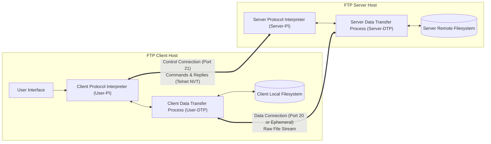

### The Architectural Breakthrough: Out-of-Band Control
Unlike protocols like HTTP or SMTP that interleave control signaling and data payloads within the same transmission stream (**In-Band Signaling**), FTP separates control and data into two distinct concurrent transport connections (**Out-of-Band Signaling**):
1. **Control Connection**: Manages the interactive session.
2. **Data Connection**: Transmits raw file contents.

---

## 3.2 Control Connection (:21) vs. Data Connection (:20 / Ephemeral)

| Technical Parameter | Control Connection | Data Connection |
| :--- | :--- | :--- |
| **Standard Server Port** | **TCP Port 21** | **TCP Port 20** (Active) or **Ephemeral Port** (Passive) |
| **Lifecycle Duration** | Stays open for the **entire duration** of user session | Created **dynamically on demand** per transfer; closed immediately |
| **Protocol Framing** | 7-bit ASCII Telnet NVT commands and numeric codes | Raw unformatted binary or ASCII stream |
| **Transmission Nature** | Two-way interactive command dialogue | Pure bulk data transfer in one direction |
| **Concurrency** | Exactly 1 connection per authenticated client | Multiple short-lived connections over the session |

---

## 3.3 Active Mode (PORT) vs. Passive Mode (PASV) NAT/Firewall Mechanics

The defining complexity in FTP operations is negotiating who initiates the data connection:

### 1. Active Mode (Default / Legacy)
1. Client connects from ephemeral port $N$ to server port 21. Client authenticates.
2. Client binds an internal listening port $N+1$.
3. Client sends the command: `PORT h1,h2,h3,h4,p1,p2` over the control connection, where the target port is $P = (p1 \times 256) + p2$.
4. When a file transfer begins (`RETR`), the **server initiates an outbound TCP connection from its Port 20 to the client's Port $P$**.

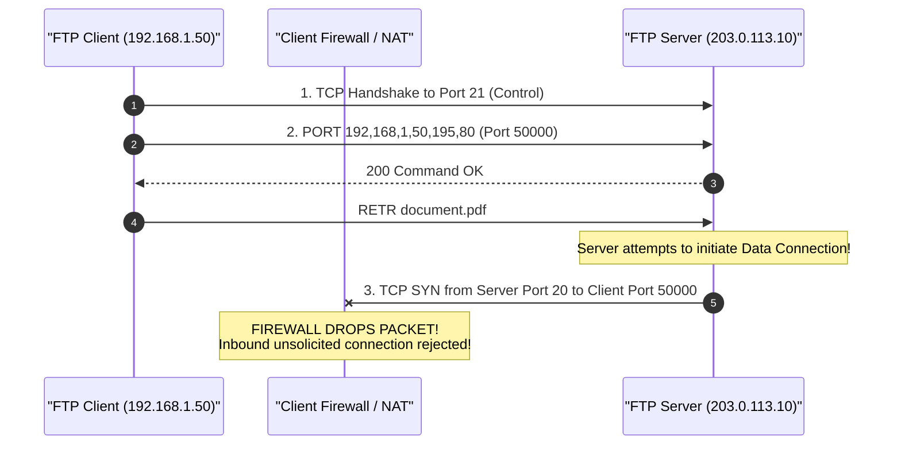

- **The NAT/Firewall Failure**: Client-side firewalls and Network Address Translation (NAT) gateways routinely block unsolicited incoming connection attempts from the public Internet. Active FTP completely fails for residential and enterprise clients behind firewalls.

---

### 2. Passive Mode (PASV - Firewall Friendly)
Standardized to solve the firewall dilemma:
1. Client establishes control connection to server port 21.
2. Client sends the command: `PASV`.
3. Server opens an **ephemeral listening port** $K$ (e.g., Port 49200) and replies with:
`227 Entering Passive Mode (203,0,113,10,192,48)` where $K = (192 \times 256) + 48 = 49200$.
4. **Client initiates the outbound data connection** from its local ephemeral port to the server's listening port $K$.

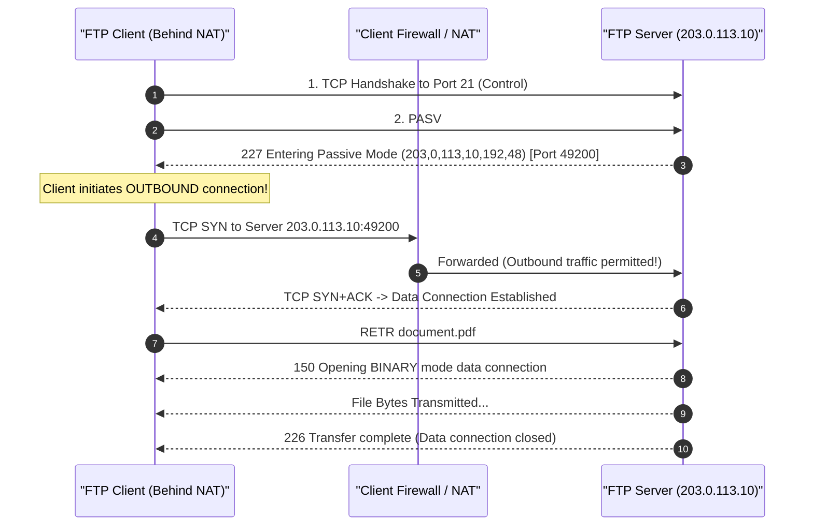

---

## 3.4 Data Representation, File Structures & Transmission Modes

RFC 959 specifies three orthogonal dimensions for data transfer:

1. **Data Types**:
   - **ASCII (Type A)**: Converts between differing end-of-line representations (Unix `\n`, Windows `\r\n`, classic Mac `\r`).
   - **Image / Binary (Type I)**: Bit-for-bit verbatim byte stream transfer without modification. Essential for executables, PDFs, archives, and media.
   - **EBCDIC (Type E)**: Transfers text between IBM mainframe architectures.
2. **File Structures**:
   - **File Structure**: Continuous unstructured sequence of bytes (default).
   - **Record Structure**: File composed of sequential individual records.
   - **Page Structure**: Independent indexed blocks for non-sequential access.
3. **Transmission Modes**:
   - **Stream Mode**: Raw stream of bytes terminated by closing the TCP data connection.
   - **Block Mode**: Data divided into formatted blocks preceded by header descriptor bytes and length counts.
   - **Compressed Mode**: Runs basic Run-Length Encoding (RLE) to compress sequences of repeated characters.

---

## 3.5 Core Commands, Response Codes & Security Evolutions

### Command Vocabulary
- `USER <name>`, `PASS <password>`: Authentication credentials.
- `CWD <dir>`, `CDUP`: Navigate directory hierarchy.
- `LIST`: Fetches directory file listing over data connection.
- `RETR <filename>`: Retrieve / download remote file.
- `STOR <filename>`: Store / upload local file to remote server.
- `QUIT`: Closes control connection.

### Security Evolutions
Traditional FTP transmits credentials and files in **unencrypted plain text**. Modern secure replacements include:
- **FTPS (FTP over SSL/TLS - RFC 4217)**: Preserves FTP's dual-connection model while encrypting both channels using TLS.
- **SFTP (SSH File Transfer Protocol)**: An entirely different protocol that runs all operations over a single encrypted SSH channel on **TCP Port 22**.

---

## 3.6 Master Comparison Matrix: Active FTP vs. Passive FTP vs. TFTP

| Parameter | Active FTP | Passive FTP | TFTP (RFC 1350) |
| :--- | :--- | :--- | :--- |
| **Transport Protocol** | TCP | TCP | **UDP** |
| **Number of Connections** | 2 (Control + Data) | 2 (Control + Data) | 1 (Connectionless) |
| **Data Connection Initiator** | **Server** initiates to client | **Client** initiates to server | Client initiates to server |
| **Client Firewall Traversal**| Severely hindered | Seamless | Seamless |
| **Data Port Number** | Server TCP 20 | Ephemeral port on server | Ephemeral port on server |
| **Authentication Support** | Username & Password | Username & Password | **None** |
| **Directory Navigation** | Yes (`CWD`, `LIST`, `MKD`) | Yes (`CWD`, `LIST`, `MKD`) | None |
| **Code Footprint** | Large complex state machine | Large complex state machine | **Tiny (Suitable for ROM bootstrap)**|

---

# Question 4: Domain Name System (DNS)

## 4.1 Motivation, Design Philosophy & Hierarchical Naming Tree

The **Domain Name System (DNS)**, standardized by Paul Mockapetris in **RFC 1034 (1987)** and **RFC 1035 (1987)**, provides the foundational name-to-address mapping service for the Internet:
- Translates human-friendly hostnames (e.g., `www.google.com`) into routable 32-bit IPv4 addresses (`142.250.190.68`) or 128-bit IPv6 addresses (`2607:f8b0:4005:808::2004`).
- **Failure of Centralized `HOSTS.TXT`**: In early ARPANET, SRI managed a single master text file (`HOSTS.TXT`) that hosts downloaded via FTP. As the network grew, this centralized architecture suffered throughput bottlenecks, single-point-of-failure vulnerabilities, and name collisions.

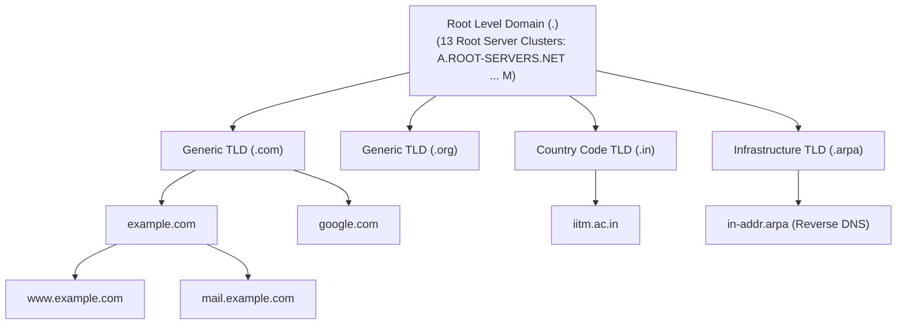

### The Hierarchical Naming Tree
1. **Root Domain (`.`)**: Represented by a null label. Administered by 13 global root server clusters (labeled `A` through `M`) operated via Anycast routing across hundreds of locations worldwide.
2. **Top-Level Domains (TLDs)**:
   - *generic TLDs (gTLDs)*: `.com`, `.edu`, `.gov`, `.org`, `.net`.
   - *country-code TLDs (ccTLDs)*: `.in` (India), `.uk` (United Kingdom), `.jp` (Japan).
   - *infrastructure TLD*: `.arpa` (used for reverse address-to-name resolution).
3. **Second-Level Domains (SLDs)**: Registered by individuals and organizations (e.g., `google.com`, `annauniv.edu`).
4. **Subdomains & Hostnames**: Internal departmental nodes (e.g., `cse.annauniv.edu`, `www.google.com`).

---

## 4.2 DNS Resolution Mechanics: Recursive vs. Iterative Walkthrough

When an application requests resolution of `www.example.com`, the lookup proceeds through recursive and iterative phases:

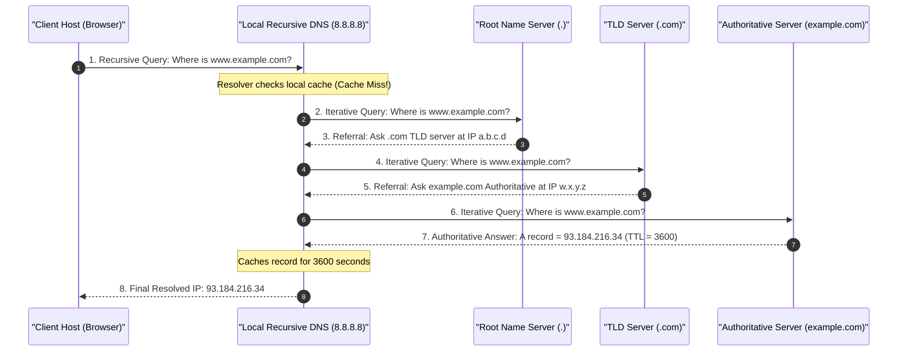

### Recursive Query (Step 1 & 8)
The client delegates the lookup burden to the Local Recursive DNS Resolver (typically provided by the ISP or an Anycast service like Google `8.8.8.8` or Cloudflare `1.1.1.1`). The resolver must return either the resolved IP or an error; it cannot return a referral.

### Iterative Query (Steps 2 through 7)
The recursive resolver interrogates authoritative servers sequentially. Each server returns the best referral it has pointing to a server lower in the hierarchy.

---

## 4.3 Bit-Level 12-Byte DNS Message Header & Resource Record Format

DNS uses a unified message format for both queries and responses. The fixed header occupies **12 octets (96 bits)**:

```
 0                   1                   2                   3
 0 1 2 3 4 5 6 7 8 9 0 1 2 3 4 5 6 7 8 9 0 1 2 3 4 5 6 7 8 9 0 1
+-+-+-+-+-+-+-+-+-+-+-+-+-+-+-+-+-+-+-+-+-+-+-+-+-+-+-+-+-+-+-+-+
|        Identification (16 bits)       |Q| Opcode|A|T|R|R|Z|A|C|
|                                       |R| (4b)  |A|C|D|A| |D|D|
|                                       | |       | | | | | | | |
|                                       | |       | | | | | | | |
+-+-+-+-+-+-+-+-+-+-+-+-+-+-+-+-+-+-+-+-+-+-+-+-+-+-+-+-+-+-+-+-+
|         QDCOUNT (16 bits)             |         ANCOUNT (16 bits)     |
+-+-+-+-+-+-+-+-+-+-+-+-+-+-+-+-+-+-+-+-+-+-+-+-+-+-+-+-+-+-+-+-+
|         NSCOUNT (16 bits)             |         ARCOUNT (16 bits)     |
+-+-+-+-+-+-+-+-+-+-+-+-+-+-+-+-+-+-+-+-+-+-+-+-+-+-+-+-+-+-+-+-+
```

### Header Fields:
- **Identification (16 Bits)**: Random transaction nonce matched by the client to correlate replies with outstanding queries.
- **Flags (16 Bits)**:
  - `QR` (1 bit): `0` = Query, `1` = Response.
  - `Opcode` (4 bits): `0` = Standard query, `1` = Inverse query, `2` = Server status request.
  - `AA` (Authoritative Answer, 1 bit): Set if the responding server is the authoritative authority for the domain.
  - `TC` (Truncation, 1 bit): Set if the message exceeded 512 bytes on UDP. Directs client to retry over TCP.
  - `RD` (Recursion Desired, 1 bit): Client requests recursive lookup.
  - `RA` (Recursion Available, 1 bit): Server announces it supports recursive queries.
  - `RCODE` (Response Code, 4 bits): `0` = No Error, `3` = Name Error / NXDOMAIN (domain does not exist).
- **QDCOUNT / ANCOUNT / NSCOUNT / ARCOUNT**: Number of questions, answer records, authority records, and additional records contained in the body.

---

## 4.4 Comprehensive Resource Record (RR) Taxonomy

A DNS database is a distributed repository of **Resource Records (RRs)**:
$$\text{RR Format} = (\text{Name}, \text{TTL}, \text{Class}, \text{Type}, \text{RDLENGTH}, \text{RDATA})$$

| Record Type | Type Code | Meaning & Typical Payload Format |
| :---: | :---: | :--- |
| **`A`** | 1 | Maps a hostname to a 32-bit IPv4 address (e.g., `93.184.216.34`). |
| **`AAAA`** | 28 | Maps a hostname to a 128-bit IPv6 address (e.g., `2606:2800:220:1:248:1893:25c8:1946`). |
| **`CNAME`** | 5 | Canonical Name: Maps an alias hostname to the true canonical hostname (`blog.example.com` $\to$ `example.com`). |
| **`MX`** | 15 | Mail Exchange: Specifies mail server and integer priority preference (`10 mail.example.com`). |
| **`NS`** | 2 | Name Server: Identifies the authoritative name server responsible for the zone. |
| **`PTR`** | 12 | Pointer: Maps an IP address to a canonical hostname for reverse DNS lookups. |
| **`SOA`** | 6 | Start of Authority: Core zone administrative parameters (Serial, Refresh, Retry, Expire, Minimum TTL). |
| **`TXT`** | 16 | Arbitrary text string: Widely used for security verification records (SPF, DKIM, DMARC). |

---

## 4.5 Transport Protocol Dual-Stack (UDP Port 53 vs. TCP Port 53) & Security

### Why DNS Uses Both UDP and TCP
- **UDP Port 53**: Used for standard lightweight queries. Because most lookups fit within a single packet ($< 512\text{ bytes}$), UDP eliminates connection setup latency.
- **TCP Port 53**: Used for:
  1. **Zone Transfers (AXFR / IXFR)** between primary and secondary name servers to ensure complete, reliable replication.
  2. Responses whose payload exceeds $512\text{ bytes}$ (indicated by the `TC=1` truncation flag).

### Security Threats: Kaminsky Cache Poisoning & DNSSEC
Because standard DNS is unauthenticated, attackers can flood resolvers with spoofed responses containing forged IP records (**DNS Cache Poisoning**). **DNSSEC (Domain Name System Security Extensions - RFC 4033)** adds cryptographic digital signatures (`RRSIG`, `DNSKEY`, `DS` records) to verify data integrity and authenticity.

---

## 4.6 Master Comparison Matrix: Recursive vs. Iterative Resolution & RR Types

| Feature | Recursive Resolution | Iterative Resolution |
| :--- | :--- | :--- |
| **Query Burden** | Placed entirely on the intermediate DNS Resolver | Placed on the querying client / resolver engine |
| **Server Response** | Returns the final resolved IP or an explicit error | Returns referral pointer to next lower name server |
| **Cache Utilization** | Centralized resolver cache benefits thousands of local users | Local caching benefits only the querying resolver |
| **Root Server Load** | Minimal (Root servers rarely handle recursive queries)| High (Root and TLD servers handle millions of iterative steps) |

---

# Question 5: Post Office Protocol Version 3 (POP3)

## 5.1 Architectural Role: Mail Access vs. Mail Transfer

Standardized in **RFC 1939 (1996)**, the **Post Office Protocol Version 3 (POP3)** is an application-layer **mail retrieval (access) protocol**.

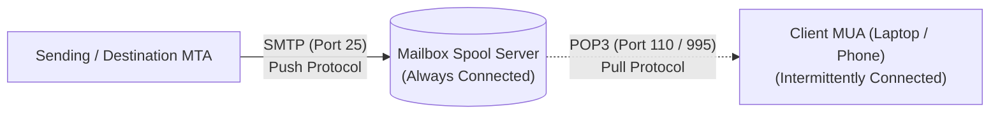

### Why SMTP Cannot Deliver Directly to End-User Computers
SMTP is a store-and-forward server-to-server daemon that requires the destination endpoint to be **permanently connected with a static IP address**. Personal client devices are frequently offline, run behind dynamic NAT configurations, or operate over cellular networks. POP3 acts as the **pull bridge**, allowing intermittently connected client MUAs to authenticate, query, and download mail spooled on a dedicated, permanently available mail server.

---

## 5.2 The Three Lifecycle Operational States: Authorization, Transaction, Update

A POP3 session transitions strictly through three sequential states:

```mermaid
stateDiagram-v2
    [*] --> Authorization: TCP Port 110 Connected (Greeting)
    Authorization --> Transaction: Valid USER & PASS (or APOP)
    Transaction --> Update: Client issues QUIT command
    Update --> [*]: Marked messages deleted; TCP connection closed
    
    Authorization --> [*]: Connection failed / Timeout
```

### 1. Authorization State
- The client establishes a TCP connection to **Port 110** (or Port 995 for POP3S over TLS).
- Server issues a greeting banner: `+OK POP3 server ready`.
- Client transmits authentication credentials:
  - `USER <username>`
  - `PASS <password>`
  - Or `APOP <name> <digest>` for MD5 challenge-response authentication.

### 2. Transaction State
- Once authenticated, the client inspects mailbox contents and downloads messages:
  - `STAT`: Returns mailbox summary: message count and aggregate byte size.
  - `LIST [msg]`: Returns size of all or a specific message.
  - `RETR <msg>`: Retrieves the full content of message number `msg`.
  - `DELE <msg>`: Marks message `msg` for deletion.
  - `NOOP`: No-operation probe to reset server inactivity timers.
  - `RSET`: Resets all deletion flags previously set in this session.

### 3. Update State
- Triggered when the client sends `QUIT`.
- The server permanently unlinks and deletes all messages flagged with `DELE`, closes mailbox access locks, and terminates the TCP session.
- *(Note: If the TCP connection terminates unexpectedly due to network failure before the client issues `QUIT`, the server discards all `DELE` flags, leaving messages in the mailbox).*

---

## 5.3 Operational Modes: Download-and-Delete vs. Download-and-Keep

1. **Download-and-Delete Mode**:
   - The MUA downloads all messages via `RETR` and immediately flags them with `DELE`.
   - All mail is permanently cleared from the server upon `QUIT`.
   - *Limitation*: Mail resides exclusively on that single local machine; it cannot be accessed from any second device.
2. **Download-and-Keep Mode**:
   - The client omits `DELE` commands after downloading.
   - Mail remains on the server.
   - *Limitation*: Multi-device synchronization anomalies: read/unread states, sent items, and deleted messages are not synchronized across devices.

---

## 5.4 Protocol Commands, Status Responses (`+OK` / `-ERR`) & Session Walkthrough

POP3 server replies begin with one of two status indicators:
- **`+OK`**: Command successfully processed, followed by optional descriptive text or data.
- **`-ERR`**: Command failed, followed by error explanation.

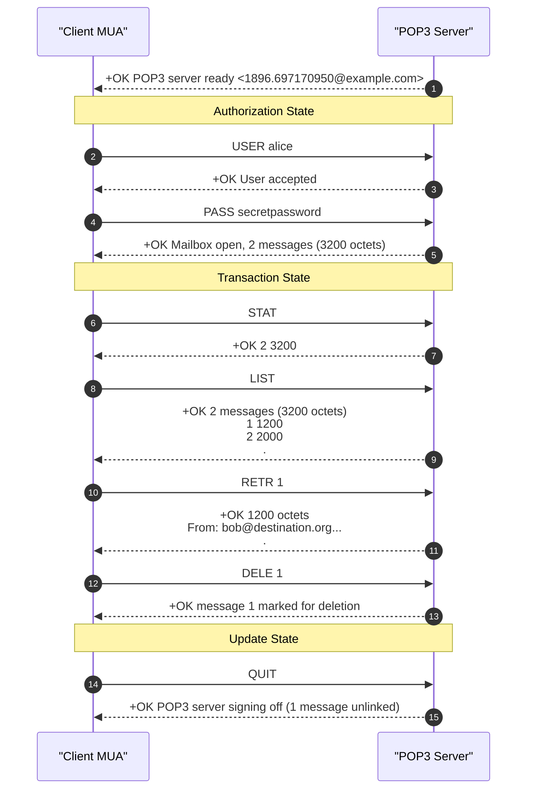

---

## 5.5 Architectural Limitations of POP3
1. **No Folder Management**: Supports only a single flat Inbox. Users cannot create or manage server-side folders.
2. **No Partial Retrieval**: Must download entire messages including attachments; cannot download text while leaving large multi-megabyte files on the server.
3. **No Multi-Device Synchronization**: Flags (read, replied, flagged) are kept on local devices only, rendering POP3 unsuitable for modern multi-device lifestyles.

---

## 5.6 Master Comparison Matrix: POP3 vs. IMAP4

| Parameter | POP3 (RFC 1939) | IMAP4 (RFC 3501) |
| :--- | :--- | :--- |
| **Default Port** | TCP 110 (Plain), 995 (POP3S) | TCP 143 (Plain), 993 (IMAPS) |
| **Mail Storage Location** | Primary storage on **Client Local Drive** | Primary storage on **Remote Mail Server** |
| **Multi-Device Synchronization**| Poor / Nonexistent | **Complete Real-Time Synchronization** |
| **Folder Architecture** | Single flat Inbox only | Hierarchical nested folders |
| **Message Downloading** | Full message download mandatory | **Partial fetch** (headers, text, MIME parts)|
| **Server-Side Searching** | Not supported | Full server-side search indexing |
| **Protocol Complexity** | Simple, lightweight | Complex state machine |
| **Server Disk Footprint** | Low (mail deleted after download) | High (users store years of mail on server) |

---

# Question 6: TELNET (Teletype Network)

## 6.1 Historical Evolution & Remote Timesharing Foundations

Standardized in **RFC 854 (1983)**, **TELNET** is one of the earliest interactive remote-login protocols developed for the ARPANET. It permits a user seated at a terminal to log into a remote host across a network and execute command-line shells as if their terminal were wired directly to the remote computer.

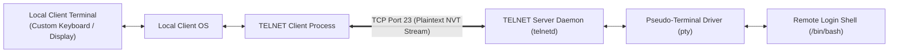

---

## 6.2 The Network Virtual Terminal (NVT) Abstraction

In the 1970s and 1980s, computer terminals varied widely in character sets, escape sequences, line breaks, and cursor controls (e.g., DEC VT100, IBM 3270, Televideo). TELNET solved this interoperability challenge through the **Network Virtual Terminal (NVT)** abstraction:
- Both client and server translate their local hardware-specific codes into universal NVT standards before sending data onto the network.
- **NVT Characters**: 7-bit US-ASCII set carried in 8-bit octets (most significant bit set to 0).
- **Line Endings**: NVT strictly defines a newline as Carriage Return followed by Line Feed (`CR LF` = `\r\n`). A standalone Carriage Return is represented as `CR NUL`.

---

## 6.3 In-Band Signaling & The Interpret As Command (IAC) Byte Mechanism

TELNET uses a single TCP connection for both user data and control commands (**In-Band Signaling**). To prevent control commands from being mistaken for typed text, TELNET reserves the byte value **`255` (`0xFF`)** as the **Interpret As Command (IAC)** escape delimiter:

```
[User Data Bytes] ... [IAC = 0xFF] [Command Byte] [Option Byte] ... [User Data Bytes]
```

- **Byte Escaping**: If a user legitimately types byte `255`, the client escapes it by sending two consecutive `IAC` bytes (`0xFF 0xFF`). The receiving engine collapses them back to a single `255` data character.

### Prominent TELNET Command Bytes
- `IAC` (`255` / `0xFF`): Interpret As Command.
- `WILL` (`251` / `0xFB`): Offer or agree to enable an option.
- `WONT` (`252` / `0xFC`): Refusal to enable or request to disable an option.
- `DO` (`253` / `0xFD`): Request or approve enabling an option.
- `DONT` (`254` / `0xFE`): Demand disabling or refusal to approve an option.
- `SB` (`250` / `0xFA`): Subnegotiation Begin.
- `SE` (`240` / `0xF0`): Subnegotiation End.
- `AYT` (`246` / `0xF6`): Are You There? (Probes if remote host is responsive).
- `IP` (`244` / `0xF4`): Interrupt Process (Equivalent to Ctrl+C).

---

## 6.4 Symmetric Option Negotiation (WILL, WONT, DO, DONT)

TELNET features a dynamic, four-verb symmetric negotiation mechanism:

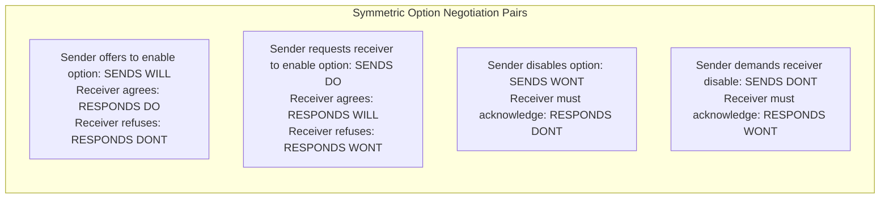

### Common Negotiated Options
1. **Echo (Option 1)**: By default, local terminals echo keystrokes locally. When connecting to Unix hosts, the server negotiates `WILL ECHO`, directing the server to echo characters back to the terminal (enabling password masking).
2. **Suppress Go Ahead (Option 3)**: Eliminates legacy half-duplex turn-taking signals.
3. **Negotiate About Window Size (NAWS - Option 31)**: Informs server of terminal window dimensions (columns and rows) so applications like `vi` or `nano` render properly.

---

## 6.5 Severe Security Vulnerabilities & Deprecation Rationale

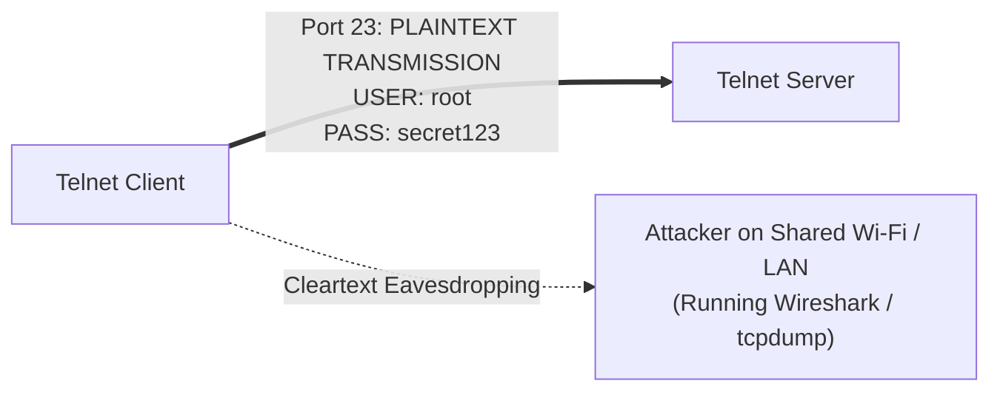

1. **Cleartext Transmission**: TELNET transmits every byte—including usernames and passwords—unencrypted across the network. Anyone with a packet capture tool on the path can read credentials directly off the wire.
2. **No Data Integrity**: Packets can be modified in transit without detection.
3. **No Server Authentication**: Vulnerable to Man-in-the-Middle (MitM) impersonation.
- **Industry Status**: **Completely deprecated and forbidden** on public networks. Replaced universally by **Secure Shell (SSH)**.

---

## 6.6 Master Comparison Matrix: TELNET Option Verbs & Command Codes

| Command Verb | Hex Code | Decimal Code | Initiator Meaning | Receiver Agreement | Receiver Refusal |
| :--- | :---: | :---: | :--- | :--- | :--- |
| **`WILL`** | `0xFB` | 251 | "I offer / wish to enable option X" | `DO X` | `DONT X` |
| **`WONT`** | `0xFC` | 252 | "I refuse / will cease enabling option X"| `DONT X` | `DONT X` (Mandatory)|
| **`DO`** | `0xFD` | 253 | "I request / demand that you enable option X"| `WILL X` | `WONT X` |
| **`DONT`** | `0xFE` | 254 | "I demand that you disable option X" | `WONT X` | `WONT X` (Mandatory)|

---

# Question 7: Secure Shell (SSH)

## 7.1 Historical Rationale & RFC 4251-4254 Layered Architecture

Designed by Tatu Ylönen in 1995 following a campus password-sniffing incident and standardized across **RFC 4251 through RFC 4254**, **Secure Shell (SSH-2)** provides secure, encrypted, and authenticated remote access over insecure networks on **TCP Port 22**.

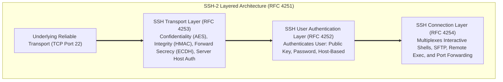

### The Three Architectural Sublayers:
1. **SSH Transport Layer**: Establishes a secure, encrypted channel over TCP. Negotiates cryptographic algorithms, performs Diffie-Hellman key exchange, authenticates the server host key, and encrypts all further traffic.
2. **SSH User Authentication Layer**: Authenticates the client user to the server over the established encrypted tunnel.
3. **SSH Connection Layer**: Multiplexes multiple logical channels over the single encrypted transport session (interactive shell terminals, SFTP file transfers, and TCP port-forwarding tunnels).

---

## 7.2 Cryptographic Handshake & Ephemeral Diffie-Hellman Key Exchange

```mermaid
sequenceDiagram
    autonumber
    participant Client as "SSH Client"
    participant Server as "SSH Server (:22)"

    Note over Client,Server: Phase 1: TCP Handshake & Version Exchange
    Client->>Server: SSH-2.0-OpenSSH_9.0
    Server-->>Client: SSH-2.0-OpenSSH_8.9p1

    Note over Client,Server: Phase 2: Algorithm Negotiation (KEXINIT)
    Client->>Server: SSH_MSG_KEXINIT (Supported Ciphers, KEX, MAC algorithms)
    Server-->>Client: SSH_MSG_KEXINIT (Supported Ciphers, KEX, MAC algorithms)

    Note over Client,Server: Phase 3: Diffie-Hellman Key Exchange & Host Verification
    Client->>Server: SSH_MSG_KEXDH_INIT (Client Ephemeral Public Value e)
    Server-->>Client: SSH_MSG_KEXDH_REPLY (Server Host Key K_S, Public Value f, Signature s)
    Note over Client: Client verifies Server Host Key against ~/.ssh/known_hosts!<br/>Verifies Signature s using K_S.<br/>Computes Shared Secret K = f^x mod p
    Note over Server: Computes Shared Secret K = e^y mod p

    Note over Client,Server: Phase 4: Encryption Activation
    Client->>Server: SSH_MSG_NEWKEYS
    Server-->>Client: SSH_MSG_NEWKEYS
    Note over Client,Server: ALL SUBSEQUENT COMMUNICATIONS ENCRYPTED & HMAC PROTECTED!
```

---

## 7.3 Mathematical Walkthrough of Diffie-Hellman Session Key Derivation

The Diffie-Hellman exchange enables two endpoints to establish a shared secret over an insecure channel without transmitting the secret itself:

### Mathematical Steps:
1. **Public Parameters**: Both parties agree on a large prime $p$ and a primitive root generator $g$.
2. **Client Private Key**: Client chooses a random private integer $x$ ($1 < x < p$) and computes its public value:
$$e = g^x \bmod p$$
Client sends $e$ to the server in `SSH_MSG_KEXDH_INIT`.
3. **Server Private Key**: Server chooses a random private integer $y$ ($1 < y < p$) and computes its public value:
$$f = g^y \bmod p$$
4. **Shared Secret Derivation**:
   - Server computes:
$$K = e^y \bmod p = (g^x)^y \bmod p = g^{xy} \bmod p$$
   - Client receives $f$ and computes:
$$K = f^x \bmod p = (g^y)^x \bmod p = g^{xy} \bmod p$$
Both parties arrive at the identical shared secret $K$. An eavesdropper observing $g, p, e, f$ cannot derive $K$ due to the computational hardness of the **Discrete Logarithm Problem**.
5. **Session Key Generation**: The shared secret $K$ and exchange hash $H$ are fed into cryptographic hash functions (e.g., SHA-256) to derive separate directional encryption keys, Initialization Vectors (IVs), and integrity MAC keys.

---

## 7.4 Client Authentication Mechanisms & Host Key Verification

Once the transport encryption is active, the User Authentication layer authenticates the client:
1. **Server Host Key Verification**: Prevents Man-in-the-Middle attacks. The client checks the server's public key fingerprint against its local cache (`~/.ssh/known_hosts`).
2. **Client Authentication Options**:
   - **Public Key Authentication (Most Secure)**: Client generates an asymmetric key pair (e.g., Ed25519 or RSA-4096). The public key is stored in the server's `~/.ssh/authorized_keys`. The server issues a challenge that can only be signed by the client's private key.
   - **Password Authentication**: Client sends password over the encrypted tunnel.
   - **Keyboard-Interactive**: Flexible multi-factor challenge-response prompting.

---

## 7.5 SSH Port Forwarding / Tunneling (Local, Remote, and Dynamic SOCKS5)

SSH can encapsulate and tunnel arbitrary TCP traffic through its encrypted connection:

```mermaid
flowchart TD
    subgraph LocalFW["1. Local Port Forwarding: ssh -L 8080:db.internal:3306 user@gateway"]
        direction LR
        AppLoc["Local App (:8080)"] --> SSHTun1["Local SSH Client"] ===>|"Encrypted SSH Tunnel"| Gate1["SSH Gateway"] --> DB1["Target Intranet DB (:3306)"]
    end

    subgraph RemoteFW["2. Remote Port Forwarding: ssh -R 9000:localhost:80 user@cloud"]
        direction LR
        ExtUser["External Internet User"] --> Cloud2["Public Cloud Host (:9000)"] ===>|"Encrypted Tunnel"| SSHTun2["Local SSH Client"] --> WebLoc["Local Web Service (:80)"]
    end

    subgraph DynamicFW["3. Dynamic Port Forwarding: ssh -D 1080 user@proxy"]
        direction LR
        Browser["Local Browser (SOCKS5 :1080)"] --> SSHClient3["Local SSH Client"] ===>|"Encrypted Tunnel"| Proxy3["SSH Remote Host"] --> TargetWeb["Target Web Destination"]
    end
```

1. **Local Forwarding (`-L`)**: Opens a local listening port; traffic sent to it is tunneled to a remote destination through the SSH server.
2. **Remote Forwarding (`-R`)**: Opens a listening port on the remote server; incoming connections there are forwarded back through the tunnel to a local resource.
3. **Dynamic Forwarding (`-D`)**: Turns the SSH connection into a local SOCKS5 proxy, routing arbitrary application traffic securely through the remote SSH server.

---

## 7.6 Master Comparison Matrix: TELNET vs. SSH

| Evaluation Parameter | TELNET (RFC 854) | SSH-2 (RFC 4251–4254) |
| :--- | :--- | :--- |
| **Standard Port** | TCP Port 23 | TCP Port 22 |
| **Data Confidentiality** | None (Cleartext) | **Strong Encryption (AES, ChaCha20)** |
| **Data Integrity** | None | **Cryptographic MAC (HMAC-SHA256, Poly1305)** |
| **Authentication Security** | Plaintext password | **Asymmetric Keys, Certificates, MFA** |
| **Server Authentication** | None (Vulnerable to MitM) | **Host Keys verified via `known_hosts`** |
| **Forward Secrecy** | None | **Supported (Diffie-Hellman / ECDH)** |
| **Port Forwarding / Tunnels** | No | **Full (Local, Remote, Dynamic SOCKS5)** |
| **File Transfer Support** | No native support | Integrated **SFTP** and **SCP** subsystems |
| **Network Overhead** | Ultra-low (1 byte commands) | Moderate (crypto handshakes & padding) |
| **Current Industry Status** | **Deprecated / Insecure** | **Universal Industry Standard** |

---

# Question 8: Difference between HTTP and HTTPS

## 8.1 Foundational Architecture & The Cryptographic Sublayer

**HTTP (HyperText Transfer Protocol)** and **HTTPS (HTTP Secure - RFC 2818)** represent the plain and encrypted implementations of web transport:

```mermaid
flowchart TD
    subgraph HTTP_Stack["Plaintext HTTP Protocol Stack"]
        A1["Application Layer: HTTP"]
        A2["Transport Layer: TCP (Port 80)"]
        A3["Network Layer: IP"]
        A1 ===> A2 ===> A3
    end

    subgraph HTTPS_Stack["Encrypted HTTPS Protocol Stack"]
        B1["Application Layer: HTTP"]
        B_TLS["Cryptographic Sublayer: TLS 1.2 / TLS 1.3"]
        B2["Transport Layer: TCP (Port 443)"]
        B3["Network Layer: IP"]
        B1 ===> B_TLS ===> B2 ===> B3
    end
```

- **HTTP**: Transmits all data (URLs, headers, form posts, cookies, session credentials) in unencrypted plain text over **TCP Port 80**. Any entity on the transmission path (Wi-Fi sniffers, rogue routers, ISPs, state actors) can eavesdrop on, alter, or inject malicious payloads into the traffic.
- **HTTPS**: Encapsulates standard HTTP traffic inside an encrypted **Transport Layer Security (TLS)** tunnel over **TCP Port 443**. The application layer continues to generate standard HTTP requests and responses, but the TLS engine transparently encrypts everything before it hits the network interface.

---

## 8.2 TLS Handshake Mechanics & Session Encryption

Before a single HTTP byte can be sent over HTTPS, client and server negotiate security parameters via the **TLS Handshake**:

```mermaid
sequenceDiagram
    autonumber
    participant Client as "Client Browser"
    participant Server as "Web Server (:443)"

    Note over Client,Server: 1. TCP 3-Way Handshake Complete
    Client->>Server: ClientHello (Supported TLS Versions, Cipher Suites, Client Nonce)
    Server-->>Client: ServerHello (Selected Cipher Suite, Server Nonce)<br/>Certificate (X.509 Public Key Certificate signed by CA)<br/>ServerKeyExchange (ECDHE Public Parameter)<br/>ServerHelloDone
    
    Note over Client: Client validates Certificate against trusted Root CAs.<br/>Computes Pre-Master Secret via ECDHE.<br/>Derives Symmetric Session Keys!
    Client->>Server: ClientKeyExchange (ECDHE Public Parameter)<br/>ChangeCipherSpec<br/>Finished (Encrypted Verification Hash)
    Server-->>Client: ChangeCipherSpec<br/>Finished (Encrypted Verification Hash)

    Note over Client,Server: TLS Tunnel Active: Encrypted HTTP Data Transfer Begins!
    Client->>Server: Encrypted HTTP Request (GET /account)
    Server-->>Client: Encrypted HTTP Response (200 OK)
```

### The Three Pillars of HTTPS Security:
1. **Confidentiality**: Protected using high-speed symmetric ciphers (e.g., AES-GCM, ChaCha20-Poly1305). Intermediate eavesdroppers see only pseudorandom bytes.
2. **Data Integrity**: Verified using cryptographic Message Authentication Codes (MACs). Packets altered in transit are detected and discarded.
3. **Authentication**: Verified through **X.509 Digital Certificates** issued by trusted Certificate Authorities (CAs). The browser confirms it is communicating with the genuine server, not an impostor.

---

## 8.3 Performance, Latency & Security Impact

1. **Connection Latency**:
   - HTTP requires only **1 RTT** for the initial TCP handshake before sending data.
   - HTTPS historically added 2 extra RTTs for TLS 1.2. Modern **TLS 1.3 (RFC 8446)** reduces this to **1 RTT** (or **0-RTT** for resumed connections), minimizing the handshake penalty.
2. **Computational Overhead**: Modern CPUs feature hardware-accelerated instructions (such as Intel/AMD **AES-NI**), making the cryptographic processing cost negligible for modern web servers.
3. **Web Ecosystem Standard**: Modern browser features (Service Workers, Geolocation APIs, WebRTC, HTTP/2, HTTP/3) **mandate HTTPS**. Browsers actively display prominent warnings ("Not Secure") on plain HTTP sites.

---

## 8.4 Master Comparison Matrix: HTTP vs. HTTPS

| Evaluation Parameter | HTTP (Plaintext Web) | HTTPS (Secure Web) |
| :--- | :--- | :--- |
| **Standard Specification** | RFC 2616 / RFC 7230 | RFC 2818 |
| **Default TCP Port** | **Port 80** | **Port 443** |
| **Cryptographic Sublayer** | None | **TLS 1.2 / TLS 1.3** |
| **Data Confidentiality** | None (Vulnerable to eavesdropping) | **Full Symmetric Encryption** |
| **Data Integrity** | None (Vulnerable to tampering) | **Cryptographic MAC Verification** |
| **Identity Authentication** | None (Vulnerable to spoofing) | **Verified via X.509 CA Certificates** |
| **Handshake Latency** | 1 RTT (TCP Handshake) | 2 RTT (TCP + TLS 1.3) or 3 RTT (TLS 1.2) |
| **CPU Resource Usage** | Minimal | Low-to-Moderate (Hardware AES-NI accelerated)|
| **Search Engine Optimization**| Lower search ranking priority | Search engines grant **SEO ranking boost** |
| **Modern Web API Support** | Blocked for sensitive APIs | Full support (HTTP/2, HTTP/3, PWA, Geolocation)|
